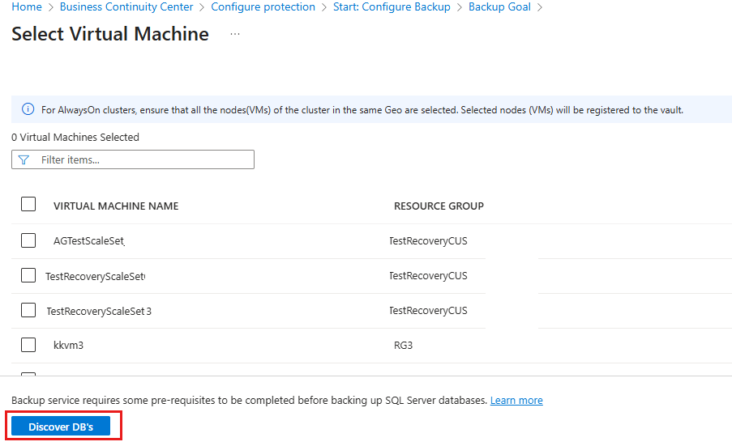

# Back up a SQL Server database in an Azure VM

This tutorial shows you how to back up a SQL Server database running on an Azure VM to an Azure Backup Recovery Services vault. In this article, you learn how to:

> [!div class="checklist"]
>
> * Create and configure a vault.
> * Discover databases, and set up backups.
> * Set up auto-protection for databases.
> * Run an on-demand backup.

## Prerequisites

Before you back up your SQL Server database, check the following conditions:

1. Identify or [create](backup-sql-server-database-azure-vms.md#create-a-recovery-services-vault) a Recovery Services vault in the same region or locale as the VM hosting the SQL Server instance.
2. [Check the VM permissions](backup-azure-sql-database.md#set-vm-permissions) needed to back up the SQL databases.
3. Verify that the  VM has [network connectivity](backup-sql-server-database-azure-vms.md#establish-network-connectivity).
4. Check that the SQL Server databases are named in accordance with [naming guidelines](#verify-database-naming-guidelines-for-azure-backup) for Azure Backup.
5. Verify that you don't have any other backup solutions enabled for the database. Disable all other SQL Server backups before you set up this scenario. You can enable Azure Backup for an Azure VM along with Azure Backup for a SQL Server database running on the VM without any conflict.

### Establish network connectivity

For all operations, the SQL Server VM virtual machine needs connectivity to Azure public IP addresses. VM operations (database discovery, configure backups, schedule backups, restore recovery points, and so on) fail without connectivity to the public IP addresses. Establish connectivity with one of these options:

* **Allow the Azure datacenter IP ranges**: Allow the [IP ranges](https://www.microsoft.com/download/details.aspx?id=41653) in the download. To access network security group (NSG), use the **Set-AzureNetworkSecurityRule** cmdlet.
* **Deploy an HTTP proxy server to route traffic**: When you back up a SQL Server database on an Azure VM, the backup extension on the VM uses the HTTPS APIs to send management commands to Azure Backup, and data to Azure Storage. The backup extension also uses Azure Active Directory (Azure AD) for authentication. Route the backup extension traffic for these three services through the HTTP proxy. The extensions are the only component that's configured for access to the public internet.

Each option has advantages and disadvantages

**Option** | **Advantages** | **Disadvantages**
--- | --- | ---
Allow IP ranges | No additional costs. | Complex to manage because the IP address ranges change over time.    Provides access to the whole of Azure, not just Azure Storage.
Use an HTTP proxy   | Granular control in the proxy over the storage URLs is allowed.    Single point of internet access to VMs.    Not subject to Azure IP address changes. | Additional costs to run a VM with the proxy software.

### Set VM permissions

Azure Backup does a number of things when you configure backup for a SQL Server database:

* Adds the **AzureBackupWindowsWorkload** extension.
* To discover databases on the virtual machine, Azure Backup creates the account **NT SERVICE\AzureWLBackupPluginSvc**. This account is used for backup and restore, and requires SQL sysadmin permissions.
* Azure Backup leverages the **NT AUTHORITY\SYSTEM** account for database discovery/inquiry, so this account need to be a public login on SQL.

If you didn't create the SQL Server VM from the Azure Marketplace, you might receive an error **UserErrorSQLNoSysadminMembership**. If this occurs [follow these instructions](backup-azure-sql-database.md#set-vm-permissions).

### Verify database naming guidelines for Azure Backup

Avoid the following for database names:

* Trailing/Leading spaces
* Trailing ‘!’
* Close square bracket ‘]’
* Databases names starting with ‘F:\’

We do have aliasing for Azure table unsupported characters, but we recommend avoiding them. [Learn more](https://docs.microsoft.com/rest/api/storageservices/Understanding-the-Table-Service-Data-Model).

[!INCLUDE [How to create a Recovery Services vault](../../includes/backup-create-rs-vault.md)]

## Discover SQL Server databases

Discover databases running on the VM.

1. In the [Azure portal](https://portal.azure.com), open the Recovery Services vault you use to back up the database.

2. On the **Recovery Services vault** dashboard, select **Backup**.

   

3. In **Backup Goal**, set **Where is your workload running** to **Azure** (the default).

4. In **What do you want to backup**, select **SQL Server in Azure VM**.

    

5. In **Backup Goal** > **Discover DBs in VMs**, select **Start Discovery** to search for unprotected VMs in the subscription. It can take a while, depending on the number of unprotected virtual machines in the subscription.

   * Unprotected VMs should appear in the list after discovery, listed by name and resource group.
   * If a VM isn't listed as you expect, check whether it's already backed up in a vault.
   * Multiple VMs can have the same name but they'll belong to different resource groups.

     

6. In the VM list, select the VM running the SQL Server database > **Discover DBs**.

7. Track database discovery in the **Notifications** area. It can take a while for the job to complete, depending on how many databases are on the VM. When the selected databases are discovered, a success message appears.

    

8. Azure Backup discovers all SQL Server databases on the VM. During discovery the following occurs in the background:

    * Azure Backup register the VM with the vault for workload backup. All databases on the registered VM can only be backed up to this vault.
    * Azure Backup installs the **AzureBackupWindowsWorkload** extension on the VM. No agent is installed on the SQL database.
    * Azure Backup creates the service account **NT Service\AzureWLBackupPluginSvc** on the VM.
      * All backup and restore operations use the service account.
      * **NT Service\AzureWLBackupPluginSvc** needs SQL sysadmin permissions. All SQL Server VMs created in the Azure Marketplace come with the **SqlIaaSExtension** installed. The **AzureBackupWindowsWorkload** extension uses the **SQLIaaSExtension** to automatically get the required permissions.
    * If you didn't create the VM from the marketplace, then the VM doesn't have the **SqlIaaSExtension** installed, and the discovery operation fails with the error message **UserErrorSQLNoSysAdminMembership**. Follow the [instructions](backup-azure-sql-database.md#set-vm-permissions) to fix this issue.

        

## Configure backup  

Configure backup as follows:

1. In **Backup Goal**, select **Configure Backup**.

   

2. Click **Configure Backup**, the **Select items to backup** blade appears. This lists all the registered availability groups and standalone SQL Servers. Expand the chevron to the left of the row to see all the unprotected databases in that instance or Always on AG.  

    

3. Select all the databases you want to protect > **OK**.

   

   To optimize backup loads, Azure Backup sets a maximum number of databases in one backup job to 50.

     * Alternatively, you can enable auto-protection on the entire instance or Always On Availability group by selecting the **ON** option in the corresponding dropdown in the **AUTOPROTECT** column. The auto-protection feature not only enables protection on all the existing databases in one go but also automatically protects any new databases that will be added to that instance or the availability group in future.  

4. Click **OK** to open the **Backup policy** blade.

    

5. In **Choose backup policy**, select a policy, then click **OK**.

   * Select the default policy: HourlyLogBackup.
   * Choose an existing backup policy previously created for SQL.
   * Define a new policy based on your RPO and retention range.

     

6. On **Backup** menu, select **Enable backup**.

    

7. Track the configuration progress in the **Notifications** area of the portal.

    

### Create a backup policy

A backup policy defines when backups are taken and how long they're retained.

* A policy is created at the vault level.
* Multiple vaults can use the same backup policy, but you must apply the backup policy to each vault.
* When you create a backup policy, a daily full backup is the default.
* You can add a differential backup, but only if you configure full backups to occur weekly.
* [Learn about](backup-architecture.md#sql-server-backup-types) different types of backup policies.

To create a backup policy:

1. In the vault, click **Backup policies** > **Add**.
2. In **Add** menu, click **SQL Server in Azure VM** to define the policy type.

   

3. In **Policy name**, enter a name for the new policy.
4. In **Full Backup policy**, select a **Backup Frequency**, choose **Daily** or **Weekly**.

   * For **Daily**, select the hour and time zone when the backup job begins.
   * You must run a full backup as you can't turn off the **Full Backup** option.
   * Click **Full Backup** to view the policy.
   * You can't create differential backups for daily full backups.
   * For **Weekly**, select the day of the week, hour, and time zone when the backup job begins.

       

5. For **Retention Range**, by default all options are selected. Clear any undesired retention range limits you don't want to use, and set the intervals to use.

    * Minimum retention period  for any type of backup (full/differential/log) is seven days.
    * Recovery points are tagged for retention based on their retention range. For example, if you select a daily full backup, only one full backup is triggered each day.
    * The backup for a specific day is tagged and retained based on the weekly retention range and your weekly retention setting.
    * The monthly and yearly retention ranges behave in a similar way.

   

6. In the **Full Backup policy** menu, select **OK** to accept the settings.
7. To add a differential backup policy, select **Differential Backup**.

   
   

8. In **Differential Backup policy**, select **Enable** to open the frequency and retention controls.

    * At most, you can trigger one differential backup per day.
    * Differential backups can be retained for a maximum of 180 days. If you need longer retention, you must use full backups.

9. Select **OK** to save the policy and return to the main **Backup policy** menu.

10. To add a transactional log backup policy, select **Log Backup**.
11. In **Log Backup**, select **Enable**, and then set the frequency and retention controls. Log backups can occur as often as every 15 minutes, and can be retained for up to 35 days.
12. Select **OK** to save the policy and return to the main **Backup policy** menu.

    

13. On the **Backup policy** menu, choose whether to enable **SQL Backup Compression**.
    * Compression is disabled by default.
    * On the back end, Azure Backup uses SQL native backup compression.

14. After you complete the edits to the backup policy, select **OK**.

## Run an on-demand backup

1. In your Recovery Services vault, choose Backup items.
2. Click on "SQL in Azure VM".
3. Right click on a database, and choose "Backup now".
4. Choose the Backup Type (Full/Differential/Log/Copy Only Full) and Compression (Enable/Disable)
5. Select OK to begin the backup.
6. Monitor the backup job by going to your Recovery Services vault and choosing "Backup Jobs".

## Next steps

In this tutorial, you used the Azure portal to:

> [!div class="checklist"]
>
> * Create and configure a vault.
> * Discover databases, and set up backups.
> * Set up auto-protection for databases.
> * Run an on-demand backup.

Continue to the next tutorial to restore an Azure virtual machine from disk.

> [!div class="nextstepaction"]
> [Restore SQL Server databases on Azure VMs](./restore-sql-database-azure-vm.md)
