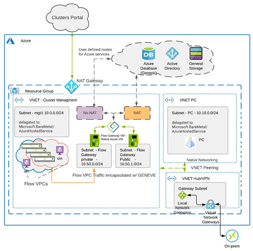

# Architecture of BareMetal Infrastructure for Nutanix

In this article, we'll look at the architectural options for BareMetal Infrastructure for Nutanix and the features each supports.

## Deployment

## Next steps

Learn about provisioning your BareMetal instances for Nutanix workloads.

> [!div class="nextstepaction"]
> [Provision BareMetal Infrastructure for Nutanix](nutanix-baremetal-provision.md)

