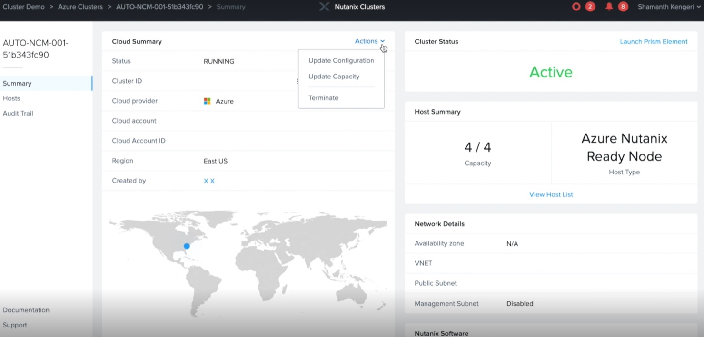

# Update the Cluster Capacity

You can expand the cluster by adding more nodes to the cluster and you can also remove nodes from the cluster.

Ensure the following before you expand the cluster.

  - Your cluster is at least a three-node cluster.
  - Your cluster is in an active state.

You can add nodes of the same bare metal type to your cluster.

> [!NOTE]
> You must update the cluster capacity by using the Nutanix Clusters console only.  
Support is not available to update the cluster capacity by using the Prism Element web console.

Perform the following to update the capacity in your cluster.

1. Log on to Nutanix Clusters from the My Nutanix dashboard.
1. In the drop-down list in the center of the screen, select Clusters.
1. In the Clusters page, click the name of the cluster.
1. Click Capacity in the navigation pane.
1. In the Capacity Details page, do the following in the indicated fields:
    - Host type. Select the type of bare metal instance you want your new node to run 
on, or if you are removing a node, select the bare metal instance type on which 
the node is running.
    - Number of nodes. Click + or - depending on whether you want to add or remove 
nodes from the cluster.
    - Redundancy Factor. Update the redundancy factors (RF) of your cluster based 
on the number of nodes in the cluster.
        - Number of copies of data replicated across the cluster is 1. Number of 
nodes for RF1 must be 1.
        - Number of copies of data replicated across the cluster is 2. Minimum 
number of nodes for RF2 must be 3.
       - Number of copies of data replicated across the cluster is 3. Minimum number of nodes for RF3 must be 5.
1. In the Status column, you can track the progress of the update capacity operation. After 
the operation is complete, the status changes to Cluster Ready.
The expansion operation is completed in approximately 25-30 minutes.

## Next steps

Learn more about Nutanix:

> [!div class="nextstepaction"]
> [About the Public Preview](about-the-public-preview.md)
