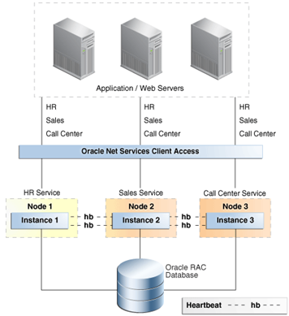

# High availability features for Oracle on Azure BareMetal

In this article, we'll look at the key high availability and disaster recovery features of Oracle.

Oracle offers many features to build a resilient platform for running Oracle databases. While no single feature provides coverage for every type of failure, combining technologies in a layered fashion creates a highly available system. Not every feature is required to maintain availability. But combining strategies gives you the best protection from the assortment of failures that occurs. 

## Flashback Database

The [Flashback Database](https://docs.oracle.com/en/database/oracle/oracle-database/21/rcmrf/FLASHBACK-DATABASE.html#GUID-584AC79A-40C5-45CA-8C63-DED3BE3A4511) feature comes in Oracle Database Enterprise Edition. Flashback Database rewinds the database to a specific point in time. This feature differs from a [Recovery Manager (RMAN)](https://docs.oracle.com/en/cloud/paas/db-backup-cloud/csdbb/performing-general-restore-and-recovery-operations.html) point-in-time recovery in that it rewinds from the current time, rather than forward-winds after a restore. The result is that Flashback Database gives much faster completion times.
 
You can use this feature alongside [Oracle Data Guard](https://docs.oracle.com/en/database/oracle/oracle-database/19/sbydb/preface.html#GUID-B6209E95-9DA8-4D37-9BAD-3F000C7E3590). Flashback Database allows a database administrator to reinstantiate a failed database back into a Data Guard configuration without a full RMAN restore and recovery. This feature allows you to restore disaster recovery capability (and any offloaded reporting and backup benefits with Active Data Guard) much faster.
 
You can use this feature instead of a time-delayed redo on the standby database. A standby database can be flashed back to a point before the problem arose.
 
The Oracle Database keeps flashback logs in the fast recovery area (FRA). These logs are separate from the redo logs and require more space within the FRA. By default, 24 hours of flashback logs are kept, but you can change this setting per your requirements.

## Oracle Real Application Clusters

[Oracle Real Application Clusters (RAC)](https://docs.oracle.com/en/database/oracle/oracle-database/19/racad/introduction-to-oracle-rac.html#GUID-5A1B02A2-A327-42DD-A1AD-20610B2A9D92) allows multiple interconnected servers to appear as one database service to end users and applications. This feature removes many points of failure and is a recognized high availability active/active solution for Oracle databases.

As shown in the following figure from Oracle's [High Availability Overview and Best Practices](https://docs.oracle.com/en/database/oracle/oracle-database/19/haovw/ha-features.html), a single RAC database is presented to the application layer. The applications connect to the SCAN listener, which directs traffic to a specific database instance. RAC controls access from multiple instances to maintain data consistency across separate compute nodes.

If one instance fails, the service continues on all other remaining instances. Each database deployed on the solution will be in a RAC configuration of n+1, where n is the minimum processing power required to support the service.

Oracle Database services are used to allow connections to fail over between nodes when an instance fails transparently. Such failures may be planned or unplanned. Working with the application (fast application notification events), when an instance is made unavailable, the service is moved to a surviving node. The service moves to a node specified in the service configuration as either preferred or available.

Another key feature of Oracle Database services is only starting a service depending on its role. This feature is used when there is a Data Guard failover. All patterns deployed using Data Guard are required to link a database service to a Data Guard role.

For example, two services could be created, MY\_DB\_APP and MY\_DB\_AS. The MY\_DB\_APP service is started only when the database instance is started with the Data Guard role of PRIMARY. MY\_DB\_AS is only started when the Data Guard role is PHYSICAL\_STANDBY. This configuration allows for applications to point to the \_APP service, while also reporting, which can be offloaded to Active Standby and pointed to the \_AS service.

## Oracle Data Guard

With Data Guard, you can maintain an identical copy of a database on separate physical hardware. Ideally, that hardware should be geographically removed from the primary database. Data Guard places no limit on the distance, although distance has a bearing on modes of protection. Increased distance adds latency between sites, which can cause some options (such as synchronous replication) to no longer be viable.

Data Guard offers advantages over storage-level replication:

- As the replication is database-aware, only relevant traffic is replicated.
- Certain workloads can generate high input/output on temporary tablespaces, which aren't required on standby and so aren't replicated.
- Validation on the replicated blocks occurs at the standby database, so physical corruptions on the primary database aren't replicated to the standby database.
- Prevents logical intra-block corruptions and lost-write corruptions. It also eliminates the risk of mistakes made by storage administrators from replicating to the standby.
Redo can be delayed for a pre-determined period, so user errors aren't immediately replicated to the standby.

## Azure NetApp Files snapshots

The NetApp Files storage solution used in BareMetal allows you to create snapshots of volumes. Snapshots allow you to revert a file system to a specific point in time quickly. Snapshot technologies allow recovery time objective (RTO) times that are a fraction of the time needed to restore a database backup.

Snapshot functionality for Oracle databases is available through Azure NetApp SnapCenter. SnapCenter enables snapshots for backup, SnapVault gives you offline vaulting, and Snap Clone enables self-service restore and other operations.

## Recovery Manager

Recovery Manager (RMAN) is the preferred utility for taking physical database backups. RMAN interacts with the database control file (or a centralized recovery catalog) to protect the various core components of the database, including:

- Database datafiles
- Archived redo logs
- Database control files
- Database initialization files (spfile)

RMAN allows you to take hot or cold database backups. You can use these backups to create standby databases or to duplicate databases to clone environments. RMAN also has a restore validation function. This function reads a backup set and determines whether you can use it to recover the database to a specific point in time.

Because RMAN is an Oracle-provided utility, it reads the internal structure of database files. This allows you to run physical and logical corruption checks during backup and restore operations. You can also recover database datafiles, and restore individual datafiles and tablespaces to a specific point in time. These are advantages RMAN offers over storage snapshots. RMAN backups provide a last line of defense against full data loss when you can't use snapshots.

## Next steps

Learn about options and recommendations to optimize protection and performance running Oracle on BareMetal Infrastructure:

> [!div class="nextstepaction"]
> [Options for Oracle BareMetal Infrastructure servers](options-considerations-high-availability.md)
