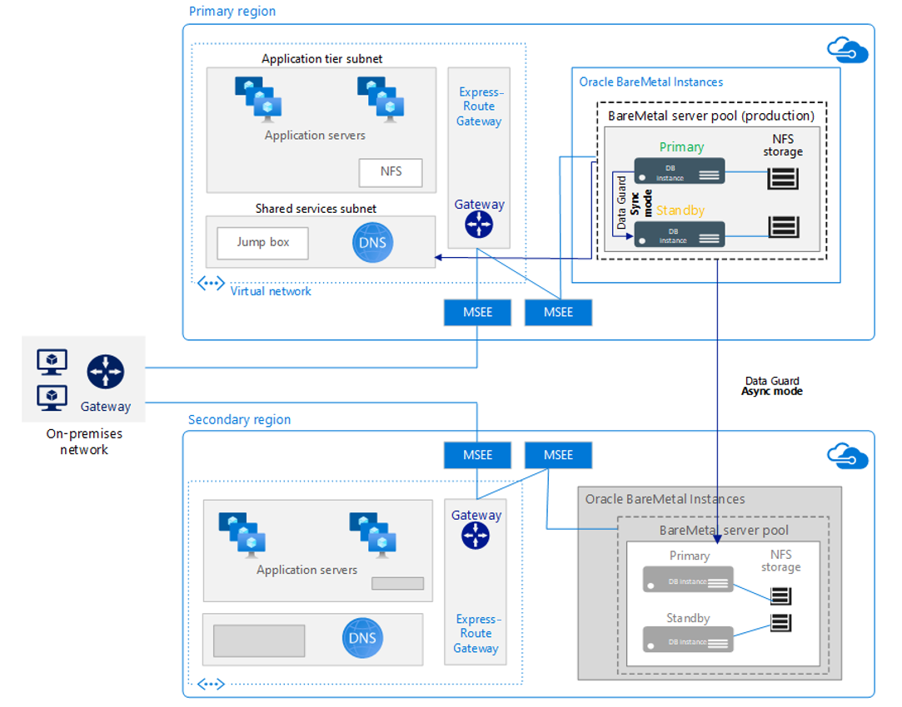

# Architecture of BareMetal Infrastructure for Oracle

In this article, we'll look at the architectural options for BareMetal Infrastructure for Oracle and the features each supports.

## Single instance

This topology supports a single instance of Oracle Database with Oracle Data Guard for migrating to the BareMetal Infrastructure. It supports using standby node for high availability and maintenance work.

## Oracle Real Application Clusters (RAC) One Node

This topology supports a RAC configuration with shared storage and GRID cluster. Database instances run only on one node (active-passive configuration).

Features include:

- Active-passive with Oracle RAC One Node

    - Automatic fail-over

    - Fast restart on second node

- Real-time fail-over and scalability with Oracle RAC

- Zero downtime rolling maintenance

## RAC

This topology supports an Oracle RAC configuration with shared storage and Grid cluster while multiple instances per database run concurrently (active-active configuration).

- Performance is easy to scale through online provisioning of added servers. 
-  Users are active on all servers, and all servers share access to the same Oracle Database. 
-  All types of database maintenance can be performed either online or in rolling fashion for minimal or zero downtime. 
- Oracle Active Data Guard (ADG) standby systems can easily serve a dual-purpose as test systems. 

This configuration allows you to test all changes on an exact copy of the production database before they're applied to the production environment.

> [!NOTE]
> If you intend to use Active Data Guard Far Sync (synchronous mode), you'll need to consider the regional zones where this feature is supported. For geographical distributed regions only, we recommend using Data Guard with asynchronous mode.

## Next steps

Learn about provisioning your BareMetal instances for Oracle workloads.

> [!div class="nextstepaction"]
> [Provision BareMetal Infrastructure for Oracle](oracle-baremetal-provision.md)

