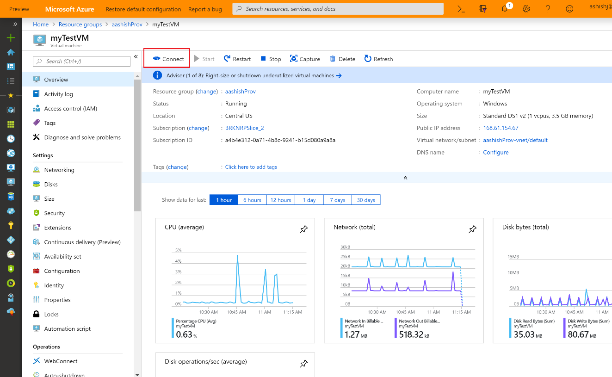
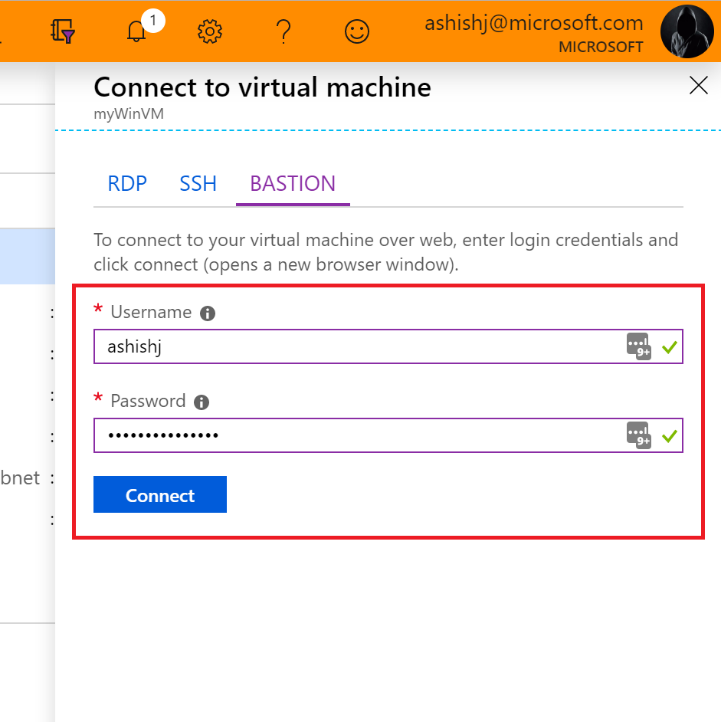

# Connect to a virtual machine by using Azure Bastion (preview)

This article shows you how to securely and seamlessly RDP & SSH to your VMs in Azure virtual network without the need of public IPs on the VMs You can connect directly from the Azure portal and VMs do not require an client, agent, or additional software. For more information about Azure Bastion, see the [Overview](bastion-overview.md).

> [!IMPORTANT]
> This public preview is provided without a service level agreement and should not be used for production workloads. Certain features may not be supported, may have constrained capabilities, or may not be available in all Azure locations. See the [Supplemental Terms of Use for Microsoft Azure Previews](https://azure.microsoft.com/support/legal/preview-supplemental-terms/) for details.
>

## Before you begin

Verify that you have set up your Azure Bastion host for the virtual network in which the VM resides. For more information, see [Create an Azure Bastion host](bastion-create-host-portal.md).

## Connect using RDP

Once Bastion service is provisioned/deployed in your virtual network, you can use it to seamlessly connect to any VM in this virtual network.  For the same, please navigate to the Bastion preview [Azure portal](http://aka.ms/BastionHost).

1. Navigate to your Virtual Machine that you wish to connect to using RDP and select the Connect button – please note that this VM should be a Windows VM.  For now, Bastion assumes that you are using RDP to connect to a Windows VM and SSH to connect to your Linux VMs.

    

1. Once you click the Connect button, a side bar will appear that will have three tabs – RDP (legacy), SSH (legacy) and Bastion (new). If you have Bastion provisioned for this Virtual Network, then Bastion tab will be active by default.

    

1. Enter the username and password for RDP to your virtual machine and select the Connect button (or hit enter).  Once you hit Connect, RDP to this virtual machine should directly open in the Azure portal (over HTML5) using port 443 on the Bastion service.

    
 
## Connect using SSH

## Next steps

Read the [Bastion FAQ](bastion-faq.md)