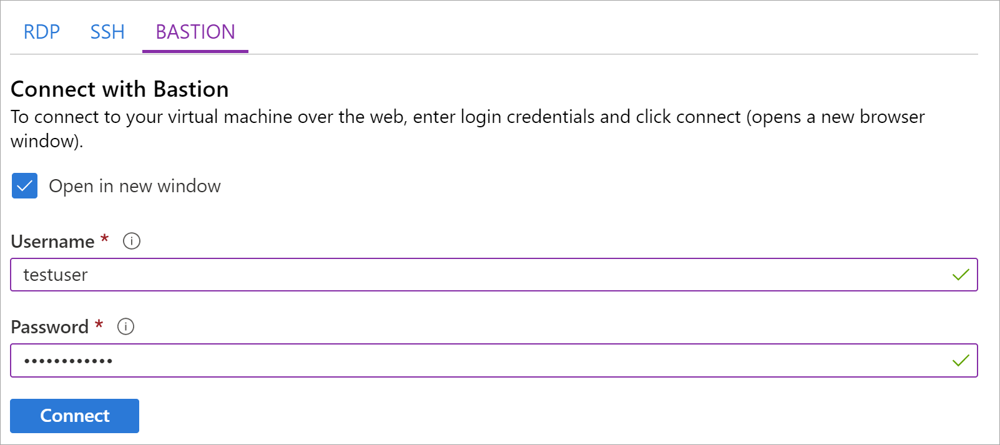
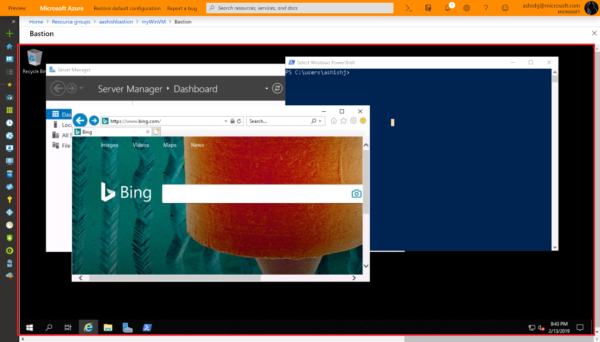

# Connect to a Windows virtual machine using Azure Bastion

Using Azure Bastion, you can securely and seamlessly connect to your virtual machines over SSL directly in the Azure portal. When you use Azure Bastion, your VMs don't require a client, agent, or additional software. This article shows you how to connect to your Windows VMs. For information about connecting to a Linux VM, see [Connect to a VM using Azure Bastion - Linux](bastion-connect-vm-ssh.md).

Azure Bastion provides secure connectivity to all of the VMs in the virtual network in which it is provisioned. Using Azure Bastion protects your virtual machines from exposing RDP/SSH ports to the outside world, while still providing secure access using RDP/SSH. For more information, see the [Overview](bastion-overview.md).

## Before you begin

Make sure that you have set up an Azure Bastion host for the virtual network in which the VM is located. Once the Bastion service is provisioned and deployed in your virtual network, you can use it to connect to any VM in the virtual network. To set up an Azure Bastion host, see [Create an Azure Bastion host](bastion-create-host-portal.md).

### Required roles

To make a connection, the following roles are required:

* Reader role on the virtual machine
* Reader role on the NIC with private IP of the virtual machine
* Reader role on the Azure Bastion resource

### Ports

To connect to the Windows VM, you must have the following ports open on your Windows VM:

* Inbound ports: RDP (3389)

## Connect

1. Open the [Azure portal](https://portal.azure.com). Navigate to the virtual machine that you want to connect to, then click **Connect** and select **Bastion** from the dropdown.

   
1. After you click Bastion, a side bar appears that has three tabs – RDP, SSH, and Bastion. If Bastion was provisioned for the virtual network, the Bastion tab is active by default. If you didn't provision Bastion for the virtual network, you can click the link to configure Bastion. For configuration instructions, see [Configure Bastion](bastion-create-host-portal.md).

   
1. On the Bastion tab, input the username and password for your virtual machine, then click **Connect**. The RDP connection to this virtual machine via Bastion will open directly in the Azure portal (over HTML5) using port 443 and the Bastion service.

   
 
## Next steps

Read the [Bastion FAQ](bastion-faq.md)
