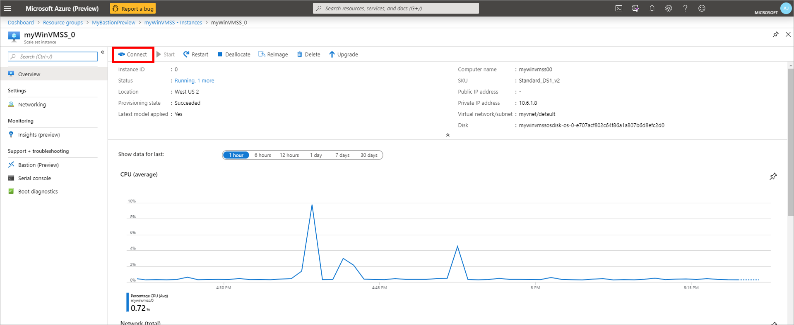
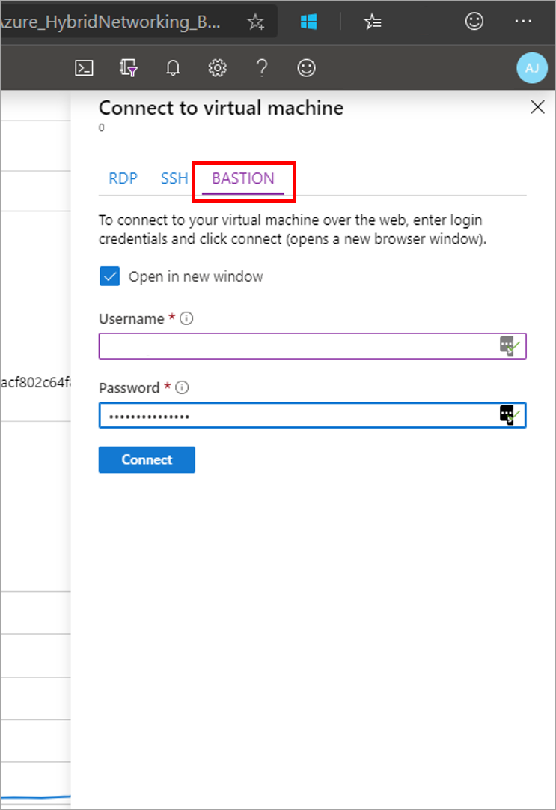
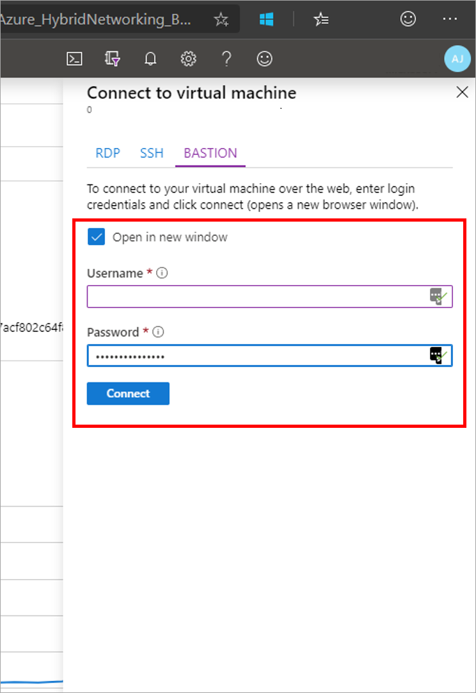

# Connect to a virtual machine scale set using Azure Bastion

This article shows you how to securely and seamlessly RDP to your Windows virtual machine scale set instance in an Azure virtual network using Azure Bastion. You can connect to a virtual machine scale set instance directly from the Azure portal. When using Azure Bastion, VMs don't require a client, agent, or additional software. For more information about Azure Bastion, see the [Overview](bastion-overview.md).

## Before you begin

Make sure that you have set up an Azure Bastion host for the virtual network in which the virtual machine scale set resides. For more information, see [Create an Azure Bastion host](bastion-create-host-portal.md). Once the Bastion service is provisioned and deployed in your virtual network, you can use it to connect to a virtual machine scale set instance in this virtual network. Bastion assumes that you are using RDP to connect to a Windows virtual machine scale set, and SSH to connect to your Linux virtual machine scale set. For information about connection to a Linux VM, see [Connect to a VM - Linux](bastion-connect-vm-ssh.md).

## Connect using RDP

1. Open the [Azure portal](https://portal.azure.com). Navigate to the virtual machine scale set that you want to connect to.

   
2. Navigate to the virtual machine scale set instance that you want to connect to, then select **Connect**. When using an RDP connection, the virtual machine scale set should be a Windows virtual machine scale set.

   
3. After you select **Connect**, a side bar appears that has three tabs – RDP, SSH, and Bastion. Select the **Bastion** tab from the side bar. If you didn't provision Bastion for the virtual network, you can select the link to configure Bastion. For configuration instructions, see [Configure Bastion](bastion-create-host-portal.md).

   
4. On the Bastion tab, enter the username and password for your virtual machine scale set, then select **Connect**.

   
5. The RDP connection to this virtual machine via Bastion will open directly in the Azure portal (over HTML5) using port 443 and the Bastion service.

## Next steps

Read the [Bastion FAQ](bastion-faq.md).