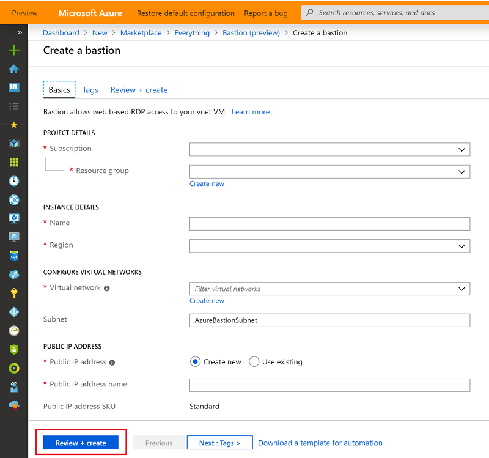

# Create an Azure Bastion host using the portal

This article shows you how to create an Azure Bastion host using the Azure portal. Once you provision the Azure Bastion service in your virtual network, the seamless RDP/SSH experience is available to all of the VMs in the same virtual network. Azure Bastion deployment is per virtual network, not per subscription/account or virtual machine.

You can create a new bastion host resource in the portal either by specifying all of the settings manually, or by using the settings that correspond to an existing VM. To create a bastion host by using VM settings, see the [quickstart](quickstart-host-portal.md) article. Optionally, you can use [Azure PowerShell](bastion-create-host-powershell.md) to create an Azure Bastion host.

## Before you begin

Bastion is available in the following Azure public regions:

[!INCLUDE [available regions](../../includes/bastion-regions-include.md)]

## Create a bastion host

This section helps you create a new Azure Bastion resource from the Azure portal.

1. On the [Azure portal](https://portal.azure.com) menu or from the **Home** page, select **Create a resource**.

1. On the **New** page, in the *Search the Marketplace* field, type **Bastion**, then click **Enter** to get to the search results.

1. From the results, click **Bastion**. Make sure the publisher is *Microsoft* and the category is *Networking*.

1. On the **Bastion** page, click **Create** to open the **Create a bastion** page.

1. On the **Create a bastion** page, configure a new Bastion resource. Specify the configuration settings for your Bastion resource.

    

    * **Subscription**: The Azure subscription you want to use to create a new Bastion resource.
    * **Resource Group**: The Azure resource group in which the new Bastion resource will be created in. If you don't have an existing resource group, you can create a new one.
    * **Name**: The name of the new Bastion resource
    * **Region**: The Azure public region that the resource will be created in.
    * **Virtual network**: The virtual network in which the Bastion resource will be created in. You can create a new virtual network in the portal during this process, or use an existing virtual network. If you are using an existing virtual network, make sure the existing virtual network has enough free address space to accommodate the Bastion subnet requirements.
    * **Subnet**: The subnet in your virtual network where the new Bastion host will be deployed. The subnet will be dedicated to the Bastion host and must be named as **AzureBastionSubnet**. This subnet must be at least /27 or larger.
    
       **AzureBastionSubnet** doesn't support [User Defined Routes](../virtual-network/virtual-networks-udr-overview.md#custom-routes), but does support [Network Security Groups](bastion-nsg.md).
    * **Public IP address**: The public IP of the Bastion resource on which RDP/SSH will be accessed (over port 443). Create a new public IP, or use an existing one. The public IP address must be in the same region as the Bastion resource you are creating.
    * **Public IP address name**: The name of the public IP address resource.
    * **Public IP address SKU**: This setting is prepopulated by default to **Standard**. Azure Bastion uses/supports only the Standard Public IP SKU.
    * **Assignment**: This setting is prepopulated by default to **Static**.

1. When you have finished specifying the settings, click **Review + Create**. This validates the values. Once validation passes, you can begin the creation process.
1. On the **Create a bastion** page, click **Create**.
1. You will see a message letting you know that your deployment is underway. Status will display on this page as the resources are created. It takes about 5 minutes for the Bastion resource to be created and deployed.

## Next steps

* Read the [Bastion FAQ](bastion-faq.md) for additional information.

* To use Network Security Groups with the Azure Bastion subnet, see [Work with NSGs](bastion-nsg.md).
