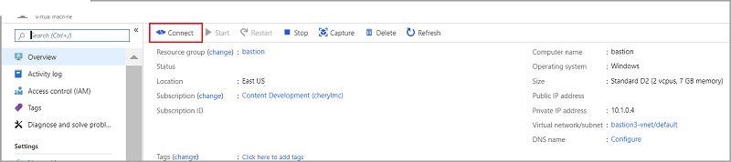
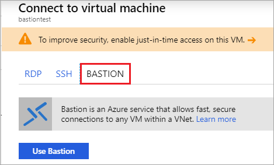
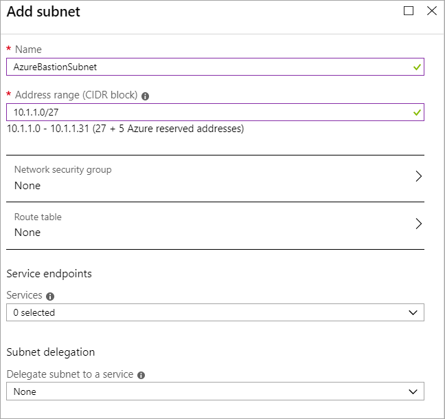

# Create an Azure Bastion host (Preview)

This article shows you how to create an Azure Bastion host. Once you provision the Azure Bastion service in your virtual network, the seamless RDP/SSH experience is available to all your VMs in the same virtual network. This deployment is per virtual network, not per subscription/account or virtual machine.

There are two ways that you can create a Bastion host resource:

* Create a Bastion resource using the Azure portal.
* Create a Bastion resource in the Azure portal by using existing VM settings.

> [!IMPORTANT]
> This public preview is provided without a service level agreement and should not be used for production workloads. Certain features may not be supported, may have constrained capabilities, or may not be available in all Azure locations. See the [Supplemental Terms of Use for Microsoft Azure Previews](https://azure.microsoft.com/support/legal/preview-supplemental-terms/) for details.
>

## Before you begin

The public preview is limited to the following Azure public regions:

[!INCLUDE [available regions](../../includes/bastion-regions-include.md)]

## Create a bastion host

This section helps you create a new Azure Bastion resource from the Azure portal.

1. From the home page in the [Azure portal - Bastion Preview](https://aka.ms/BastionHost), click **+ Create a resource**. Make sure you use the link provided to access the portal for this preview, not the regular Azure portal.

1. On the **New** page, in the *Search the Marketplace* field, type **Bastion**, then click **Enter** to get to the search results.

1. From the results, click **Bastion (preview)**. Make sure the publisher is *Microsoft* and the category is *Networking*.

1. On the **Bastion (preview)** page, click **Create** to open the **Create a bastion** page.

1. On the **Create a bastion** page, configure a new Bastion resource. Specify the configuration settings for your Bastion resource.

    

    * **Subscription**: The Azure subscription you want to use to create a new Bastion resource.
    * **Resource Group**: The Azure resource group in which the new Bastion resource will be created in. If you don’t have an existing resource group, you can create a new one.
    * **Name**: The name of the new Bastion resource
    * **Region**: The Azure public region that the resource will be created in.
    * **Virtual network**: The virtual network in which the Bastion resource will be created in. You can create a new virtual network in the portal during this process, in case you don’t have or don’t want to use an existing virtual network. If you are using an existing virtual network, make sure the existing virtual network has enough free address space to accommodate the Bastion subnet requirements.
    * **Subnet**: The subnet in your virtual network to which the new Bastion host resource will be deployed. You must create a subnet using the name value **AzureBastionSubnet**. This value lets Azure know which subnet to deploy the Bastion resources to. This is different than a Gateway subnet. We highly recommend that you use at least a /27 or larger subnet (/27, /26, and so on). Create the **AzureBastionSubnet** without any Network Security Groups, route tables, or delegations.
    * **Public IP address**: The public IP of the Bastion resource on which RDP/SSH will be accessed (over port 443). Create a new public IP, or use an existing one. The public IP address must be in the same region as the Bastion resource you are creating.
    * **Public IP address name**: The name of the public IP address resource.
    * **Public IP address SKU**: Prepopulated by default to **Standard**. Azure Bastion uses/supports only the Standard Public IP SKU.
    * **Assignment**: Prepopulated by default to **Static**.

1. When you have finished specifying the settings, click **Review + Create**. This validates the values. Once validation passes, you can begin the creation process.
1. On the Create a bastion page, click **Create**.
1. You will see a message letting you know that your deployment is underway. Status will display on this page as the resources are created. It takes about 5 mins for the Bastion resource to be created and deployed.

## Create a bastion host using VM settings

If you create a bastion host in the portal by using an existing VM, various settings will automatically default corresponding to your virtual machine and/or virtual network.

1. In the [Azure portal - Bastion Preview](https://aka.ms/BastionHost), navigate to your virtual machine, then click **Connect**.

    

1. On the right sidebar, click **Bastion**, then **Use Bastion**.

    

1. On the Bastion page, fill out the following settings fields:

    * **Name**: The name of the bastion host you want to create.
    * **Subnet**: The subnet inside your virtual network to which Bastion resource will be deployed. The subnet must be created with the name **AzureBastionSubnet**. This lets Azure know which subnet to deploy the Bastion resource to. This is different than a Gateway subnet. Click **Manage subnet configuration** to create the Azure Bastion Subnet. We highly recommend that you use at least a /27 or larger subnet (/27, /26, etc.). Create the **AzureBastionSubnet** without any Network Security Groups, route tables, or delegations. Click **Create** to create the subnet, then proceed with the next settings.

      
      
    * **Public IP address**: The public IP of the Bastion resource on which RDP/SSH will be accessed (over port 443). Create a new public IP, or use an existing one. The public IP address must be in the same region as the Bastion resource you are creating.
    * **Public IP address name**: The name of the public IP address resource.
1. On the validation screen, click **Create**. Wait for about 5 mins for the Bastion resource to be created and deployed.

## Next steps

Read the [Bastion FAQ](bastion-faq.md)
