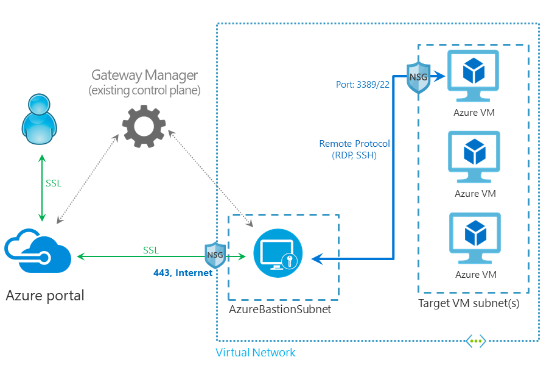

# Working with NSG access and Azure Bastion (Preview)

When working with Azure Bastion, you can use network security groups (NSGs). For more information, see [Security Groups](../virtual-network/security-overview.md). 

> [!IMPORTANT]
> This public preview is provided without a service level agreement and should not be used for production workloads. Certain features may not be supported, may have constrained capabilities, or may not be available in all Azure locations. See the [Supplemental Terms of Use for Microsoft Azure Previews](https://azure.microsoft.com/support/legal/preview-supplemental-terms/) for details.
>

In this diagram:

* The Bastion host is deployed in the virtual network.
* The user connects to the Azure portal using any HTML5 browser.
* The user selects the virtual machine to connect to.
* With a single click, the RDP/SSH session opens in the browser.
* No public IP is required on the Azure VM.

## Network security groups

* **AzureBastionSubnet:** Azure Bastion is deployed in the specific AzureBastionSubnet.  
    * **Ingress Traffic from public internet:** The Azure Bastion will create a public IP that needs port 443 enabled on the public IP for ingress traffic. Port 3389/22 are NOT required to be opened on the AzureBastionSubnet.
    * **Egress Traffic to Target VMs:** Azure Bastion will reach the target VMs over private IP. The NSGs need to allow egress traffic to other target VM subnets.
* **Target VM Subnet:** This is the subnet that contains the target virtual machine that you want to RDP/SSH to.
    * **Ingress Traffic from Azure Bastion:** Azure Bastion will reach to the target VM over private IP. RDP/SSH ports (ports 3389 and 22, respectively) need to be opened on the target VM side over private IP.

## Apply NSGs to AzureBastionSubnet

If you apply NSGs to the **AzureBastionSubnet**, allow the following two service tags for Azure Control plane and Infrastructure:

* **GatewayManager (Resource Manager only)**: This tag denotes the address prefixes of the Azure Gateway Manager service. If you specify GatewayManager for the value, traffic is allowed or denied to GatewayManager.  If you are creating NSGs on the AzureBastionSubnet, enable the GatewayManager tag for inbound traffic.

* **AzureCloud (Resource Manager only)**: This tag denotes the IP address space for Azure including all datacenter public IP addresses. If you specify AzureCloud for the value, traffic is allowed or denied to Azure public IP addresses. If you want to allow access only to AzureCloud in a specific region, you can specify the region. For example, if you want to allow access only to Azure AzureCloud in the East US region, you could specify AzureCloud.EastUS as a service tag. If you are creating NSGs on the AzureBastionSubnet, enable the AzureCloud tag for outbound traffic.

## Next steps

For more information about Azure Bastion, see the [FAQ](bastion-faq.md)
