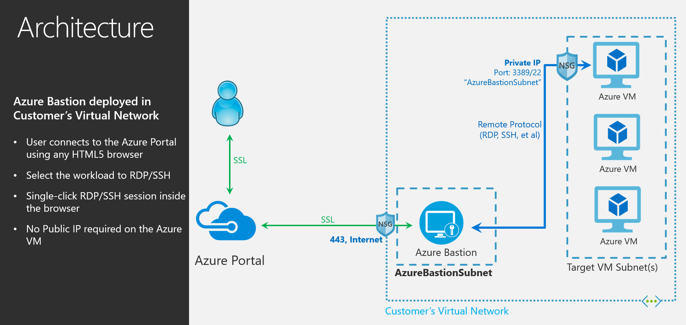

# What is Azure Bastion? (Preview)

The Azure Bastion service is a new fully platform-managed PaaS service that you provision inside your virtual network. It provides secure and seamless RDP/SSH connectivity to your virtual machines directly in the Azure portal over SSL. When you connect via Azure Bastion, your virtual machines do not need a public IP address.

 Bastion provides secure RDP and SSH connectivity to all VMs in the virtual network in which it is provisioned. Using Azure Bastion protects your virtual machines from exposing RDP/SSH ports to outside world while still providing secure access using RDP/SSH. With Azure Bastion, you connect to the virtual machine directly from the Azure portal. You don't need an additional client, agent, or piece of software.

> [!IMPORTANT]
> This public preview is provided without a service level agreement and should not be used for production workloads. Certain features may not be supported, may have constrained capabilities, or may not be available in all Azure locations. See the [Supplemental Terms of Use for Microsoft Azure Previews](https://azure.microsoft.com/support/legal/preview-supplemental-terms/) for details.
>

## Architecture

Azure Bastion is deployed in your virtual network and, once deployed, it provides the secure RDP/SSH experience for all the virtual machines in your virtual network. Once you provision an Azure Bastion service in your virtual network, the RDP/SSH experience is available to all your VMs in the same virtual network. The deployment is per virtual network, not per subscription/account or virtual machine.

RDP and SSH are some of the fundamental means through which you can connect to your workloads running in Azure. Exposing RDP/SSH ports over the Internet isn't desired and is seen as a significant threat surface. This is often due to protocol vulnerabilities. To contain this threat surface, you can deploy bastion hosts (also known as jump-servers) at the public side of your perimeter network. Bastion host servers are designed and configured to withstand attacks. Bastion servers also provide RDP and SSH connectivity to the workloads sitting behind the bastion, as well as further inside the network.

This figure shows the architecture of an Azure Bastion deployment. In this diagram:

* The Bastion host is deployed in the virtual network.
* The user connects to the Azure portal using any HTML5 browser.
* The user selects the virtual machine to connect to.
* With a single click, the RDP/SSH session opens in the browser.
* No public IP is required on the Azure VM.

## Key features

The following features are available to try during public preview:

* **RDP and SSH directly in Azure portal:** You can directly get to the RDP and SSH session directly in the Azure portal using a single click seamless experience.
* **Remote Session over SSL and firewall traversal for RDP/SSH:** Azure Bastion uses an HTML5 based web client that is automatically streamed to your local device, so that you get your RDP/SSH session over SSL on port 443 enabling you to traverse corporate firewalls securely.
* **No Public IP required on the Azure VM:** Azure Bastion opens the RDP/SSH connection to your Azure virtual machine using private IP on your VM. You don't need a public IP on your virtual machine.
* **No hassle of managing NSGs:** Azure Bastion is a fully managed platform PaaS service from Azure that is hardened internally to provide you secure RDP/SSH connectivity. You don't need to apply any NSGs on Azure Bastion subnet. Because Azure Bastion connects to your virtual machines over private IP, you can configure your NSGs to allow RDP/SSH from Azure Bastion only. This removes the hassle of managing NSGs each time you need to securely connect to your virtual machines.
* **Protection against port scanning:** Because you do not need to expose your virtual machines to public Internet, your VMs are protected against port scanning by rogue and malicious users located outside your virtual network.
* **Protect against zero-day exploits. Hardening in one place only:** Azure Bastion is a fully platform-managed PaaS service. Because it sits at the perimeter of your virtual network, you don’t need to worry about hardening each of the virtual machines in your virtual network. The Azure platform protects against zero-day exploits by keeping the Azure Bastion hardened and always up-to-date for you.

## FAQ

[!INCLUDE [Bastion FAQ](../../includes/bastion-faq-include.md)]

## Next steps

* [Create an Azure Bastion host resource](bastion-create-host-portal.md).
* Learn about some of the other key [networking capabilities](../networking/networking-overview.md) of Azure.
