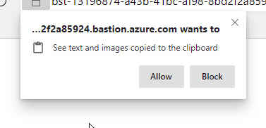
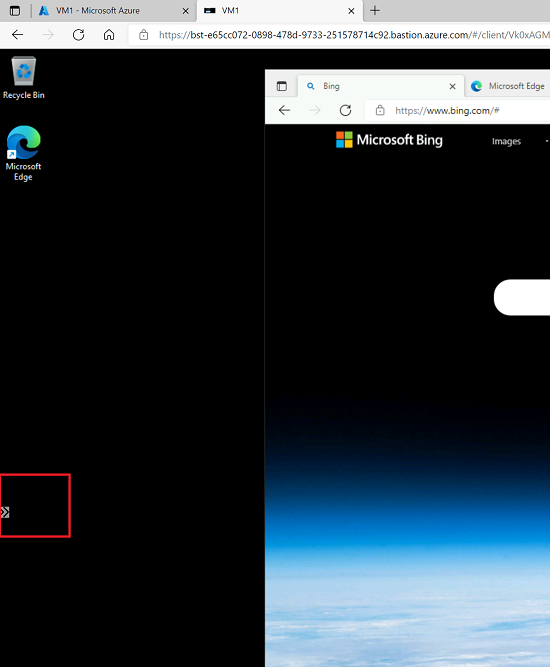
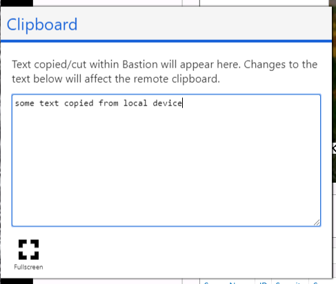
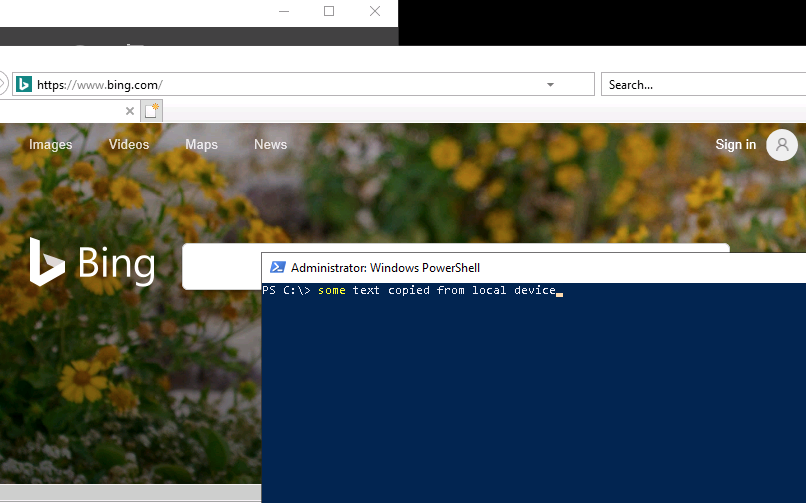
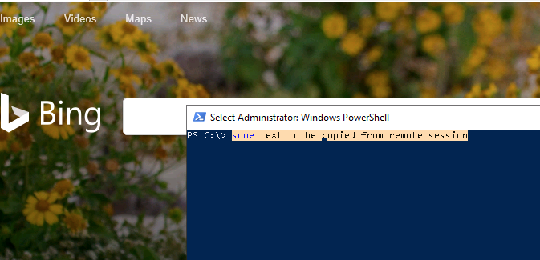
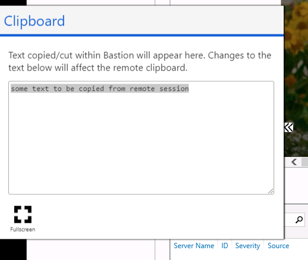
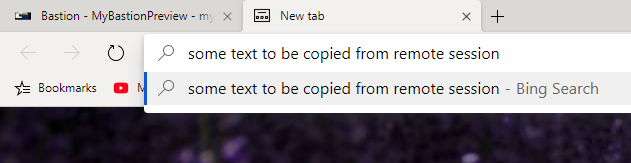

#  Copy and paste VM text using Azure Bastion(preview)

This article shows you how copy and paste text across local devices and remote sessions using Azure Bastion. You can connect to a VM directly from the Azure portal. When using Azure Bastion, VMs don't require a client, agent, or additional software. For more information about Azure Bastion, see the [Overview](bastion-overview.md).

> [!IMPORTANT]
> This public preview is provided without a service level agreement and should not be used for production workloads. Certain features may not be supported, may have constrained capabilities, or may not be available in all Azure locations. See the [Supplemental Terms of Use for Microsoft Azure Previews](https://azure.microsoft.com/support/legal/preview-supplemental-terms/) for details.
>

For browsers that support the advanced Clipboard API access (for example; Google Chrome, Microsoft Edge, Edge Chromium Preview), you can copy and paste text between your local device and the remote session in the same way you copy and paste between applications on your local device. For other browsers, you can use the Bastion clipboard access tool palette.

Only text copy/paste is supported. For direct copy and paste, your browser may prompt you for clipboard access when the Bastion session is being initialized. **Allow** the web page to access the clipboard.

## Before you begin

Make sure that you have set up an Azure Bastion host for the virtual network in which the VM resides. For more information, see [Create an Azure Bastion host](bastion-create-host-portal.md). Once the Bastion service is provisioned and deployed in your virtual network, you can use it to connect to any VM in this virtual network.

## To a remote session

1. Copy the text/content from the local device into local clipboard.
1. During the remote session, launch the Bastion clipboard access tool palette by selecting the two arrows. The arrows are located on the left center of the session.

    

    

1. Typically, the copied text automatically shows on the Bastion copy paste palette. If your text is not there, then paste the text in the text area on the palette.
1. Once the text is in the text area, you can paste it to the remote session.

    

## From a remote session

1. Copy the text/content from the remote session into remote clipboard (using Ctrl-C).

    

1. During the remote session, launch the Bastion clipboard access tool palette by selecting the two arrows. The arrows are located on the left center of the session.

    

1. Typically, the copied text automatically shows on the Bastion copy paste palette. If your text is not there, then paste the text in the text area on the palette.
1. Once the text is in the text area, you can paste it to the local device.

    
 
## Next steps

Read the [Bastion FAQ](bastion-faq.md).