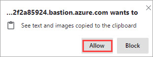
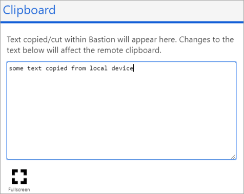
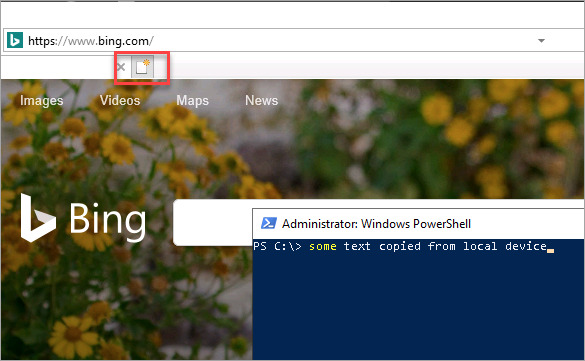
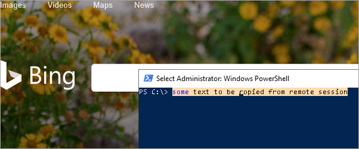
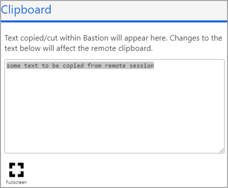
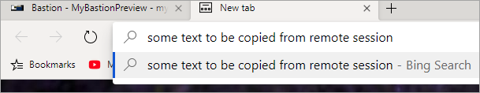

# Copy and paste to a virtual machine: Azure Bastion

This article helps you copy and paste text to and from virtual machines when using Azure Bastion. Before you work with a VM, make sure you have followed the steps to [Create a Bastion host](bastion-create-host-portal.md). Then, connect to the VM that you want to work with using either [RDP](bastion-connect-vm-rdp.md) or [SSH](bastion-connect-vm-ssh.md).

For browsers that support the advanced Clipboard API access, you can copy and paste text between your local device and the remote session in the same way you copy and paste between applications on your local device. For other browsers, you can use the Bastion clipboard access tool palette.

>[!NOTE]
>Only text copy/paste is currently supported.
>

   

Only text copy/paste is supported. For direct copy and paste, your browser may prompt you for clipboard access when the Bastion session is being initialized. **Allow** the web page to access the clipboard.

## Copy to a remote session

After you connect to the virtual machine using the [Azure portal ](https://portal.azure.com), complete the following steps:

1. Copy the text/content from the local device into local clipboard.
1. During the remote session, launch the Bastion clipboard access tool palette by selecting the two arrows. The arrows are located on the left center of the session.

   

   
1. Typically, the copied text automatically shows on the Bastion copy paste palette. If your text is not there, then paste the text in the text area on the palette.
1. Once the text is in the text area, you can paste it to the remote session.

   

## Copy from a remote session

After you connect to the virtual machine using the [Azure portal ](https://portal.azure.com), complete the following steps:

1. Copy the text/content from the remote session into remote clipboard (using Ctrl-C).

   
1. During the remote session, launch the Bastion clipboard access tool palette by selecting the two arrows. The arrows are located on the left center of the session.

   
1. Typically, the copied text automatically shows on the Bastion copy paste palette. If your text is not there, then paste the text in the text area on the palette.
1. Once the text is in the text area, you can paste it to the local device.

   
 
## Next steps

Read the [Bastion FAQ](bastion-faq.md).
