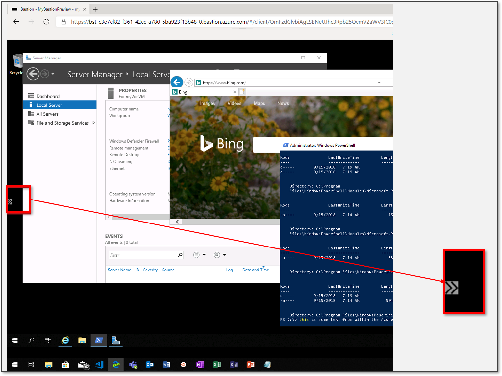
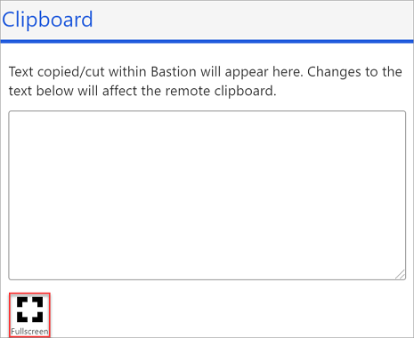

# Change to full screen view for a vm session: Azure Bastion

This article helps you change the virtual machine view to full screen and back in your browser. Before you work with a VM, make sure you have followed the steps to [Create a Bastion host](bastion-create-host-portal.md). Then, connect to the VM that you want to work with using either [RDP](bastion-connect-vm-rdp.md) or [SSH](bastion-connect-vm-ssh.md).

## Launch the clipboard tool

During the remote session, launch the Bastion clipboard access tool palette by selecting the two arrows that located on the left center of the session.

## Select full screen

Select the **Fullscreen** button to switch the session to a full screen experience. Once you switch, the session will reinitialize to full screen.

 
## Next steps

Read the [Bastion FAQ](bastion-faq.md).
Learn how to [Copy and paste](bastion-vm-copy-paste.md) to and from an Azure VM.
