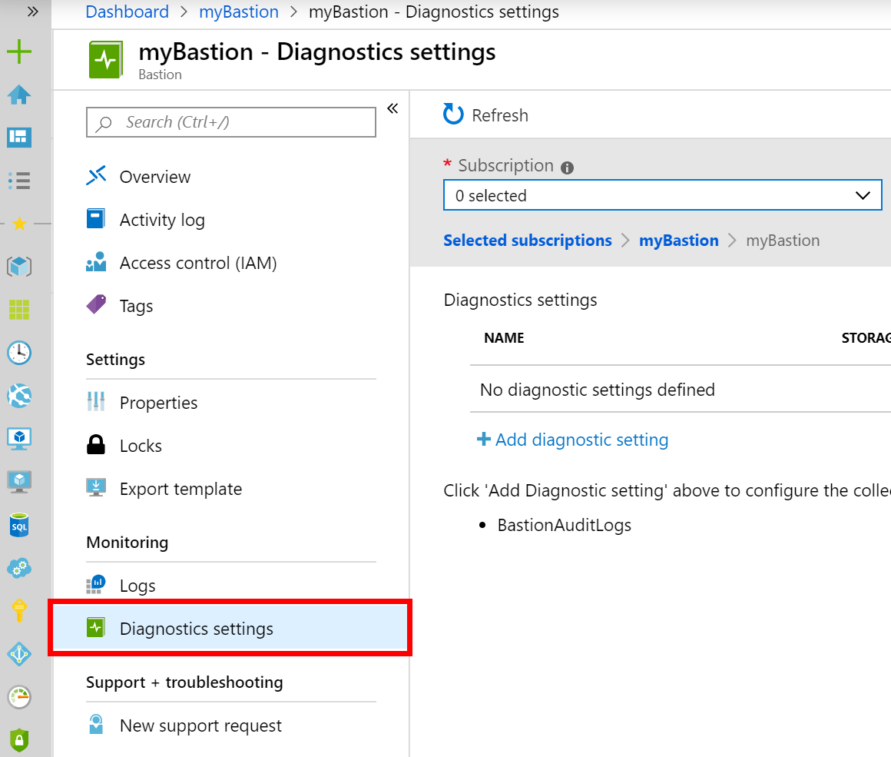
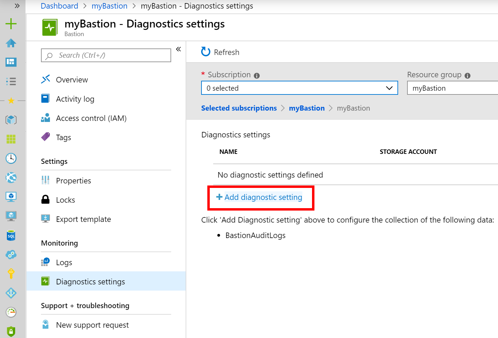
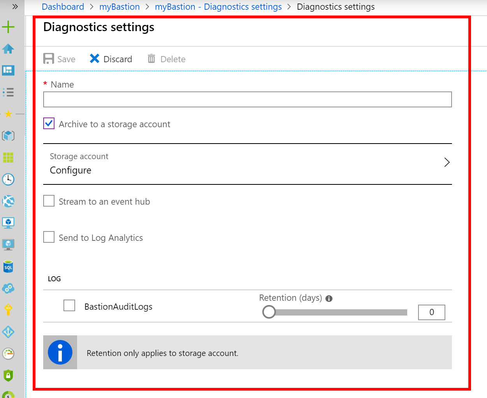
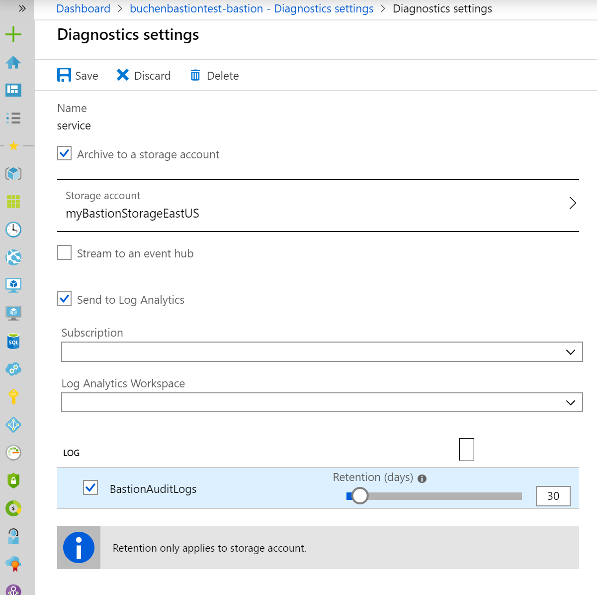
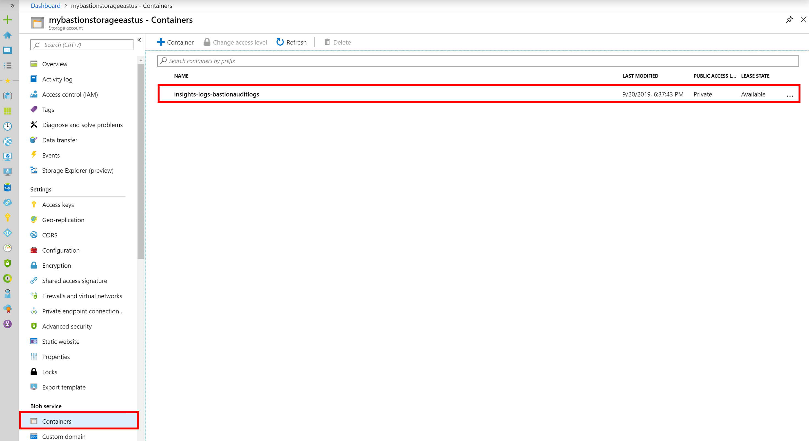
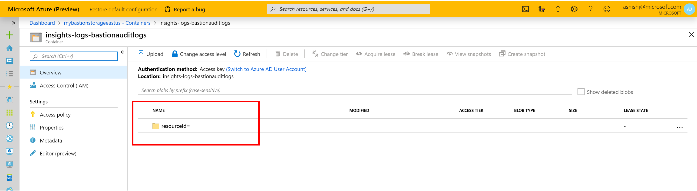
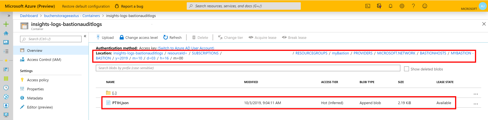

# Enable and work with Bastion resource logs

As users connect to workloads using Azure Bastion, Bastion can log diagnostics of the remote sessions. You can then use the diagnostics to view which users connected to which workloads, at what time, from where, and other such relevant logging information. In order to use the diagnostics, you must enable diagnostics logs on Azure Bastion. This article helps you enable diagnostics logs, and then view the logs.

>[!NOTE]
>To view all resource logs available for Bastion, select each of the resource logs. If you exclude the 'All Logs' setting, you will not see all the available resource logs.

## <a name="enable"></a>Enable the resource log

1. In the [Azure portal](https://portal.azure.com), go to your Azure Bastion resource and select **Diagnostics settings** from the Azure Bastion page.

   
2. Select **Diagnostics settings**, then select **+Add diagnostic setting** to add a destination for the logs.

   
3. On the **Diagnostics settings** page, select the type of storage account to be used for storing diagnostics logs.

   
4. When you complete the settings, it will look similar to this example:

   

## <a name="view"></a>View diagnostics log

To access your diagnostics logs, you can directly use the storage account that you specified while enabling the diagnostics settings.

1. Navigate to your storage account resource, then to **Containers**. You see the **insights-logs-bastionauditlogs** blob created in your storage account blob container.

   
2. As you go inside the container, you see various folders in your blob. These folders indicate the resource hierarchy for your Azure Bastion resource.

   
3. Navigate to the full hierarchy of your Azure Bastion resource whose diagnostics logs you wish to access/view. The 'y=', 'm=', 'd=', 'h=' and 'm=' indicate the year, month, day, hour, and minute respectively for the resource logs.

   
4. Locate the json file created by Azure Bastion that contains the diagnostics log data for the time-period navigated to.

5. Download the json file from your storage blob container. An example entry of successful login from the json file is shown below for reference:

   ```json
   { 
   "time":"2019-10-03T16:03:34.776Z",
   "resourceId":"/SUBSCRIPTIONS/<subscripionID>/RESOURCEGROUPS/MYBASTION/PROVIDERS/MICROSOFT.NETWORK/BASTIONHOSTS/MYBASTION-BASTION",
   "operationName":"Microsoft.Network/BastionHost/connect",
   "category":"BastionAuditLogs",
   "level":"Informational",
   "location":"eastus",
   "properties":{ 
      "userName":"<username>",
      "userAgent":"Mozilla/5.0 (Windows NT 10.0; Win64; x64) AppleWebKit/537.36 (KHTML, like Gecko) Chrome/77.0.3865.90 Safari/537.36",
      "clientIpAddress":"131.107.159.86",
      "clientPort":24039,
      "protocol":"ssh",
      "targetResourceId":"/SUBSCRIPTIONS/<subscripionID>/RESOURCEGROUPS/MYBASTION/PROVIDERS/MICROSOFT.COMPUTE/VIRTUALMACHINES/LINUX-KEY",
      "subscriptionId":"<subscripionID>",
      "message":"Successfully Connected.",
      "resourceType":"VM",
      "targetVMIPAddress":"172.16.1.5",
      "userEmail":"<userAzureAccountEmailAddress>",
      "tunnelId":"<tunnelID>"
   },
   "FluentdIngestTimestamp":"2019-10-03T16:03:34.0000000Z",
   "Region":"eastus",
   "CustomerSubscriptionId":"<subscripionID>"
   }
   ```
   
   Below is an example entry of unsuccessful login (e.g. due to incorrect username/password) from the json file:
   
   ```json
   { 
   "time":"2019-10-03T16:03:34.776Z",
   "resourceId":"/SUBSCRIPTIONS/<subscripionID>/RESOURCEGROUPS/MYBASTION/PROVIDERS/MICROSOFT.NETWORK/BASTIONHOSTS/MYBASTION-BASTION",
   "operationName":"Microsoft.Network/BastionHost/connect",
   "category":"BastionAuditLogs",
   "level":"Informational",
   "location":"eastus",
   "properties":{ 
      "userName":"<username>",
      "userAgent":"Mozilla/5.0 (Windows NT 10.0; Win64; x64) AppleWebKit/537.36 (KHTML, like Gecko) Chrome/77.0.3865.90 Safari/537.36",
      "clientIpAddress":"131.107.159.86",
      "clientPort":24039,
      "protocol":"ssh",
      "targetResourceId":"/SUBSCRIPTIONS/<subscripionID>/RESOURCEGROUPS/MYBASTION/PROVIDERS/MICROSOFT.COMPUTE/VIRTUALMACHINES/LINUX-KEY",
      "subscriptionId":"<subscripionID>",
      "message":"Login Failed",
      "resourceType":"VM",
      "targetVMIPAddress":"172.16.1.5",
      "userEmail":"<userAzureAccountEmailAddress>",
      "tunnelId":"<tunnelID>"
   },
   "FluentdIngestTimestamp":"2019-10-03T16:03:34.0000000Z",
   "Region":"eastus",
   "CustomerSubscriptionId":"<subscripionID>"
   }
   ```
   
## Next steps

Read the [Bastion FAQ](bastion-faq.md).
