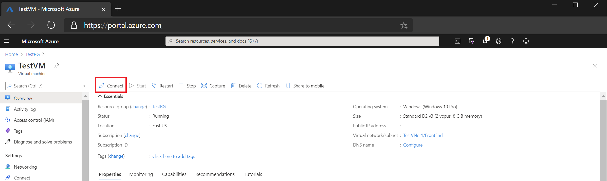
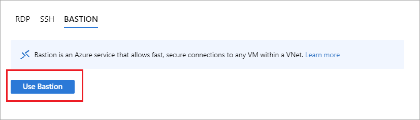
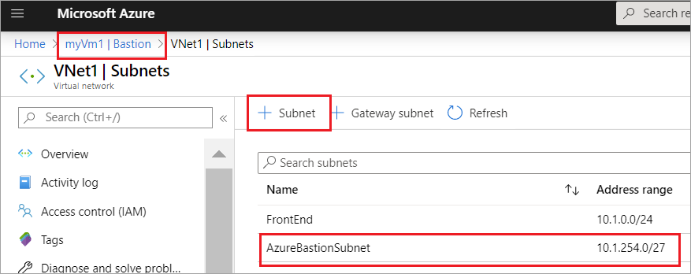
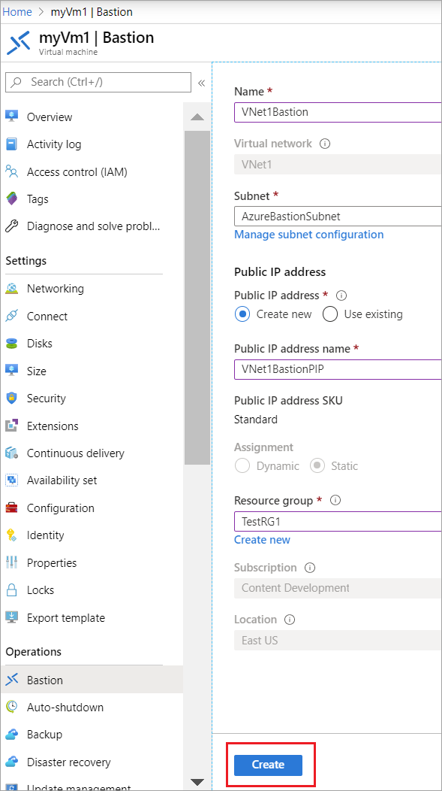
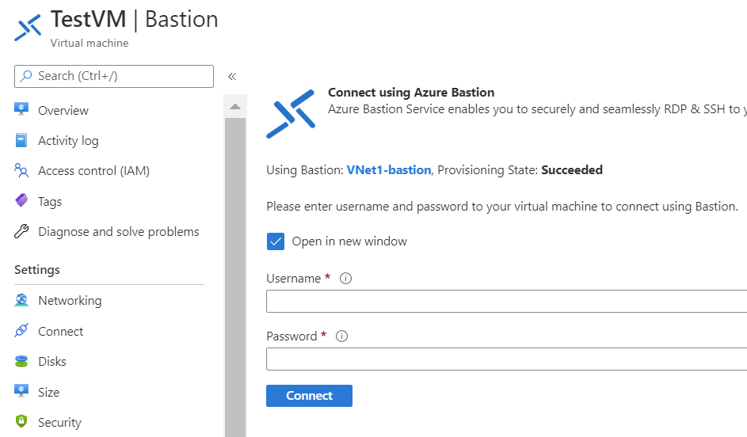
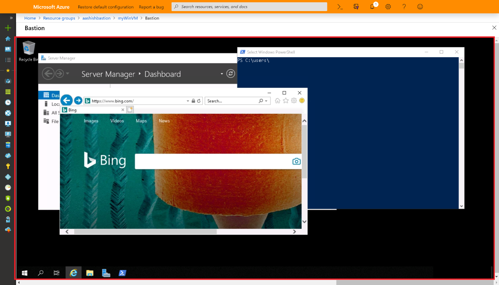

# Quickstart: Connect to a virtual machine using a private IP address and Azure Bastion

This quickstart article shows you how to connect to a virtual machine  using a private IP address. When you connect via Bastion, your virtual machines don't need a public IP address. The steps in this article help you deploy Bastion to your virtual network via your virtual machine in the portal. Once the service is provisioned, the RDP/SSH experience is available to all of the virtual machines in the same virtual network.

## Prerequisites

* An Azure virtual network.
* An Azure virtual machine located in the virtual network with port 3389 open.

### Example values

|**Name** | **Value** |
| --- | --- |
| Name |  VNet1Bastion |
| Region | eastus |
| Virtual network |  VNet1 |
| + Subnet Name | AzureBastionSubnet |
| AzureBastionSubnet addresses |  10.1.254.0/27 |
| Public IP address |  Create new |
| Public IP address name | VNet1BastionPIP  |
| Public IP address SKU |  Standard  |
| Assignment  | Static |

## Create a bastion host

When you create a bastion host in the portal by using an existing virtual machine, various settings will automatically default to correspond to your virtual machine and/or virtual network.

1. Open the [Azure portal](https://portal.azure.com). Go to your virtual machine, then click **Connect**.

   
1. From the dropdown, select **Bastion**.
1. On the Connect page, select **Use Bastion**.

   

1. On the Bastion page, fill out the following settings fields:

   * **Name**: Name the bastion host
   * **Subnet**: The subnet inside your virtual network to which Bastion resource will be deployed. The subnet must be created with the name **AzureBastionSubnet**. The name lets Azure know which subnet to deploy the Bastion resource to. This is different than a Gateway subnet. Use a subnet of at least /27 or larger (/27, /26, /25, and so on).
   
      * Select **Manage subnet configuration**, then select **+ Subnet**.
      * On the Add subnet page, type **AzureBastionSubnet**.
      * Specify the address range in CIDR notation. For example, 10.1.254.0/27.
      * Select **OK** to create the subnet. At the top of the page, navigate back to Bastion to complete the rest of the settings.

         
   * **Public IP address**: This is the public IP of the Bastion resource on which RDP/SSH will be accessed (over port 443). Create a new public IP, or use an existing one. The public IP address must be in the same region as the Bastion resource you are creating.
   * **Public IP address name**: The name of the public IP address resource.
1. On the validation screen, click **Create**. Wait for about 5 minutes for the Bastion resource create and deploy.

   

## Connect

After Bastion has been deployed to the virtual network, the screen changes to the connect page.

1. Type the username and password for your virtual machine. Then, select **Connect**.

   
1. The RDP connection to this virtual machine via Bastion will open directly in the Azure portal (over HTML5) using port 443 and the Bastion service.

   

## Clean up resources

When you're done using the virtual network and the virtual machines, delete the resource group and all of the resources it contains:

1. Enter *TestRG1* in the **Search** box at the top of the portal and select **TestRG1** from the search results.

2. Select **Delete resource group**.

3. Enter *TestRG1* for **TYPE THE RESOURCE GROUP NAME** and select **Delete**.

## Next steps

In this quickstart, you created a Bastion host for your virtual network, and then connected to a virtual machine securely via the Bastion host.

* To learn more about Azure Bastion, read  the [Bastion Overview](bastion-overview.md) and the [Bastion FAQ](bastion-faq.md).
* To use Network Security Groups with the Azure Bastion subnet, see [Work with NSGs](bastion-nsg.md).
* For instructions that contain explanations of Azure Bastion host settings, see the [Tutorial](bastion-create-host-portal.md).
* To connect to a virtual machine scale set, see [Connect to a virtual machine scale set using Azure Bastion](bastion-connect-vm-scale-set.md).