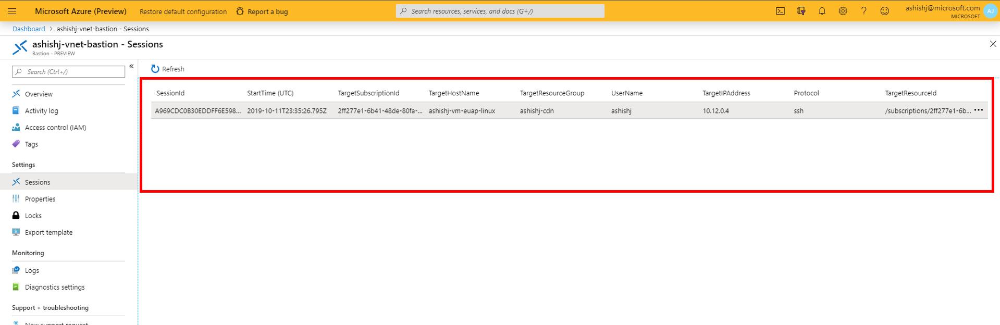
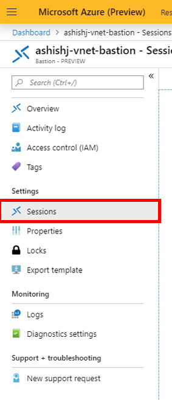
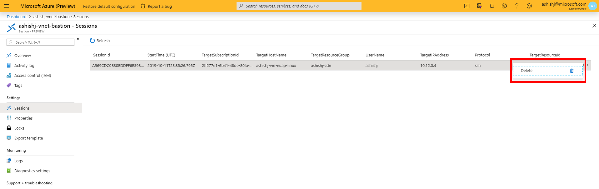

# Session monitoring and management for Azure Bastion

Once the Bastion service is provisioned/deployed in your virtual network, you can use it to seamlessly connect to any VM in this virtual network. As users connect to workloads, Azure Bastion can be used to monitor the remote sessions and take quick management actions. Azure Bastion session monitoring lets you view which users are connected to which VMs from what IPs and since when, apart from other details. The session management experience lets you select an ongoing session and force-disconnect or delete a session to disconnect a user from that ongoing session.

## Monitor remote sessions

1. In the [Azure portal](https://portal.azure.com), navigate to your Azure Bastion resource and select **Sessions** from the Azure Bastion page.

   
2. On the **Sessions** page, you can see the on-going remote sessions on the right side.

   
3. Select **Refresh** to see the updated list of remote sessions. Clicking Refresh will fetch the latest monitoring information from Azure Bastion and refresh it on the portal.

   

## Delete or Force Disconnect an on-going remote session

Once you see a list of on-going remote session in Azure Bastion monitoring experience, you can select a set of session(s) and force disconnect them.  Below are the steps using which you can delete remote sessions from Azure Bastion:

1. Navigate to your Azure Bastion resource and select “Sessions” from the Azure Bastion blade.

   
2. As you select Sessions, you will see a list of remote sessions in Portal for your Azure Bastion deployment.

   
3. Select a specific remote session and select the three ellipses on the right-side end of the session row in the UI and select Delete.

   
4. As you select Delete, the remote session will be disconnected, and the user will be shown a “You have been disconnected” message in the remote session.

## Next steps

Read the [Bastion FAQ](bastion-faq.md).