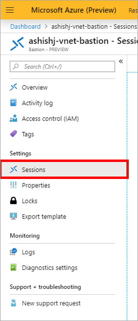
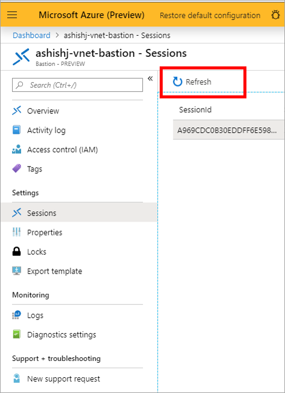
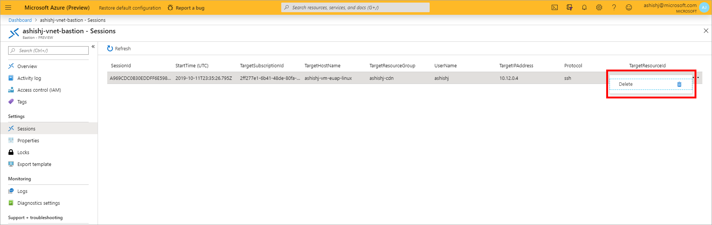
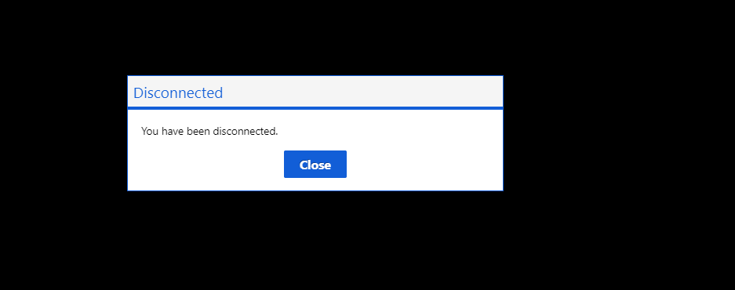

# Session monitoring and management for Azure Bastion

Once the Bastion service is provisioned and deployed in your virtual network, you can use it to seamlessly connect to any VM in this virtual network. As users connect to workloads, Azure Bastion can be used to monitor the remote sessions and take quick management actions. Azure Bastion session monitoring lets you view which users are connected to which VMs. It shows the IP that the user connected from, how long they have been connected, and when they connected. The session management experience lets you select an ongoing session and force-disconnect or delete a session in order to disconnect the user from the ongoing session.

## Monitor remote sessions

1. In the [Azure portal](https://portal.azure.com), navigate to your Azure Bastion resource and select **Sessions** from the Azure Bastion page.

   
2. On the **Sessions** page, you can see the ongoing remote sessions on the right side.

   
3. Select **Refresh** to see the updated list of remote sessions. When you select Refresh, Azure Bastion will fetch the latest monitoring information and refresh it in the portal.

   

## Delete or force-disconnect an ongoing remote session

You can select a set of session(s) and force-disconnect them. The following steps show you how to delete remote sessions:

1. Navigate to your Azure Bastion resource and select **Sessions** from the Azure Bastion page.

   
2. After you select Sessions, you see a list of remote sessions.

   
3. Select a specific remote session, then select the three ellipses on the right-side end of the session row, and then select **Delete**.

   
4. When you select Delete, the remote session will be disconnected and the user will be shown a "You have been disconnected" message in the remote session.

   

## Next steps

Read the [Bastion FAQ](bastion-faq.md).
