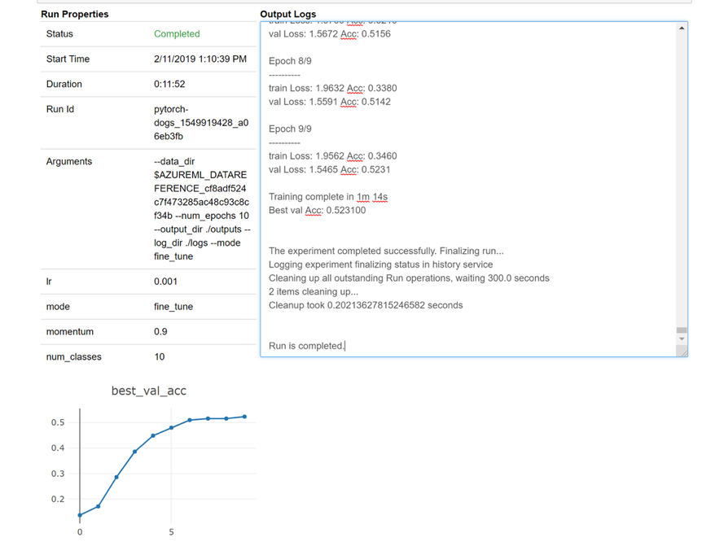

# Migrating from Batch AI to Azure Machine Learning service

**The Azure Batch AI service is retiring in March.** The at-scale training and scoring capabilities of Batch AI are now available in [Azure Machine Learning service](../machine-learning/service/overview-what-is-azure-ml.md), which became generally available on December 4, 2018.

Along with many other machine learning capabilities, the Azure Machine Learning service includes a cloud-based managed compute target for training, deploying, and scoring machine learning models. This compute target is called [Azure Machine Learning Compute](../machine-learning/service/how-to-set-up-training-targets.md#amlcompute). Start migrating and using it today. You can interact with the Azure Machine Learning service through its [Python SDKs](../machine-learning/service/quickstart-create-workspace-with-python.md), command-line interface, and the [Azure portal](../machine-learning/service/quickstart-get-started.md).

Upgrading from the Preview Batch AI to the GA'ed Azure Machine Learning service gives you a better experience through concepts that are easier to use such as Estimators and Datastores. It also guarantees GA level Azure service SLAs and customer support.

Azure Machine Learning service also brings in new functionality such as automated machine learning, hyperparameter tuning, and ML pipelines, which are useful in most large-scale AI workloads. The ability to deploy a trained model without switching to a separate service helps complete the data science loop from data preparation (using the Data Prep SDK) all the way to operationalization and model monitoring.

## Start migrating
To avoid disruptions to your applications and to benefit from the latest features, take the following steps before March 31, 2019:

1. Create an Azure Machine Learning service workspace and get started:
    + [Python based quickstart](../machine-learning/service/quickstart-create-workspace-with-python.md)
    + [Azure portal based quickstart](../machine-learning/service/quickstart-get-started.md)

1. Install the [Azure Machine Learning SDK](https://docs.microsoft.com/python/api/overview/azure/ml/install?view=azure-ml-py) and [Data Prep SDK](https://docs.microsoft.com/python/api/overview/azure/dataprep/intro?view=azure-dataprep-py#install). 

1. Set up an [Azure Machine Learning Compute](../machine-learning/service/how-to-set-up-training-targets.md#amlcompute) for model training.

1. Update your scripts to use the Azure Machine Learning Compute. The following sections show you how common code you use for Batch AI maps to code for Azure Machine Learning. 


## Create workspaces
The concept of initializing a workspace using a configuration.json in Azure Batch AI maps similarly to using a config file in Azure Machine Learning service.

For **Batch AI**, you did it this way:

```python
sys.path.append('../../..')
import utilities as utils

cfg = utils.config.Configuration('../../configuration.json')
client = utils.config.create_batchai_client(cfg)

utils.config.create_resource_group(cfg)
_ = client.workspaces.create(cfg.resource_group, cfg.workspace, cfg.location).result()
```

**Azure Machine Learning service**, try:

```python
from azureml.core.workspace import Workspace

ws = Workspace.from_config()
print('Workspace name: ' + ws.name, 
      'Azure region: ' + ws.location, 
      'Subscription id: ' + ws.subscription_id, 
      'Resource group: ' + ws.resource_group, sep = '\n')
```

In addition, you can also create a Workspace directly by specifying the configuration parameters like

```python
from azureml.core import Workspace
# Create the workspace using the specified parameters
ws = Workspace.create(name = workspace_name,
                      subscription_id = subscription_id,
                      resource_group = resource_group, 
                      location = workspace_region,
                      create_resource_group = True,
                      exist_ok = True)
ws.get_details()

# write the details of the workspace to a configuration file to the notebook library
ws.write_config()
```

Learn more about the Azure Machine Learning Workspace class in the [SDK reference documentation](https://docs.microsoft.com/python/api/azureml-core/azureml.core.workspace.workspace?view=azure-ml-py).


## Create compute clusters
Azure Machine Learning supports multiple compute targets, some of which are managed by the service and others that can be attached to your workspace (eg. An HDInsight cluster or a remote VM. Read more about various [compute targets](../machine-learning/service/how-to-set-up-training-targets.md). The concept of creating an Azure Batch AI compute cluster maps to creating an AmlCompute cluster in Azure Machine Learning service. The Amlcompute creation takes in a compute configuration similar to how you pass parameters in Azure Batch AI. One thing to note is that autoscaling is on by default on your AmlCompute cluster whereas it is turned off by default in Azure Batch AI.

For **Batch AI**, you did it this way:

```python
nodes_count = 2
cluster_name = 'nc6'

parameters = models.ClusterCreateParameters(
    vm_size='STANDARD_NC6',
    scale_settings=models.ScaleSettings(
        manual=models.ManualScaleSettings(target_node_count=nodes_count)
    ),
    user_account_settings=models.UserAccountSettings(
        admin_user_name=cfg.admin,
        admin_user_password=cfg.admin_password or None,
        admin_user_ssh_public_key=cfg.admin_ssh_key or None,
    )
)
_ = client.clusters.create(cfg.resource_group, cfg.workspace, cluster_name, parameters).result()
```

For **Azure Machine Learning service**, try:

```python
from azureml.core.compute import ComputeTarget, AmlCompute
from azureml.core.compute_target import ComputeTargetException

# Choose a name for your CPU cluster
gpu_cluster_name = "nc6"

# Verify that cluster does not exist already
try:
    gpu_cluster = ComputeTarget(workspace=ws, name=gpu_cluster_name)
    print('Found existing cluster, use it.')
except ComputeTargetException:
    compute_config = AmlCompute.provisioning_configuration(vm_size='STANDARD_NC6',
                                                           vm_priority='lowpriority',
                                                           min_nodes=1,
                                                           max_nodes=2,
                                                           idle_seconds_before_scaledown='300',
                                                           vnet_resourcegroup_name='<my-resource-group>',
                                                           vnet_name='<my-vnet-name>',
                                                           subnet_name='<my-subnet-name>')
    gpu_cluster = ComputeTarget.create(ws, gpu_cluster_name, compute_config)

gpu_cluster.wait_for_completion(show_output=True)
```

Learn more about the AMLCompute class in the [SDK reference documentation](https://docs.microsoft.com/python/api/azureml-core/azureml.core.compute.amlcompute.amlcompute?view=azure-ml-py). Note that in the configuration above, only vm_size and max_nodes are mandatory, and the rest of the properties like VNets are for advanced cluster setup only.

## Monitor status of your cluster
This is more straightforward in Azure Machine Learning service as you will see below.

For **Batch AI**, you did it this way:

```python
cluster = client.clusters.get(cfg.resource_group, cfg.workspace, cluster_name)
utils.cluster.print_cluster_status(cluster)
```

For **Azure Machine Learning service**, try:

```python
gpu_cluster.get_status().serialize()
```

## Get reference to a Storage account
The concept of a data storage like blob, gets simplified in Azure Machine Learning service using the DataStore object. By default your Azure Machine Learning service workspace creates a storage account, but you can attach your own storage also as part of workspace creation. 

For **Batch AI**, you did it this way:

```python
azure_blob_container_name = 'batchaisample'
blob_service = BlockBlobService(cfg.storage_account_name, cfg.storage_account_key)
blob_service.create_container(azure_blob_container_name, fail_on_exist=False)
```

For **Azure Machine Learning service**, try:

```python
ds = ws.get_default_datastore()
print(ds.datastore_type, ds.account_name, ds.container_name)
```

Learn more about registering additional storage accounts, or getting a reference to another registered datastore in the [Azure Machine Learning service documentation](../machine-learning/service/how-to-access-data.md#access).


## Download and upload data 
With either service, you can upload the data into the storage account easily using the datastore reference from above. For Azure Batch AI, we also deploy the training script as part of the fileshare, although you will see how you can specify it as part of your job configuration in the case of Azure Machine Learning service.

For **Batch AI**, you did it this way:

```python
mnist_dataset_directory = 'mnist_dataset'
utils.dataset.download_and_upload_mnist_dataset_to_blob(
    blob_service, azure_blob_container_name, mnist_dataset_directory)

script_directory = 'tensorflow_samples'
script_to_deploy = 'mnist_replica.py'

blob_service.create_blob_from_path(azure_blob_container_name,
                                   script_directory + '/' + script_to_deploy, 
                                   script_to_deploy)
```


For **Azure Machine Learning service**, try:

```python
import os
import urllib
os.makedirs('./data', exist_ok=True)
download_url = 'https://s3.amazonaws.com/img-datasets/mnist.npz'
urllib.request.urlretrieve(download_url, filename='data/mnist.npz')

ds.upload(src_dir='data', target_path='mnist_dataset', overwrite=True, show_progress=True)

path_on_datastore = ' mnist_dataset/mnist.npz' ds_data = ds.path(path_on_datastore) print(ds_data)
```

## Create experiments
As mentioned above Azure Machine Learning service has a concept of an experiment similar to Azure Batch AI. Each experiment can then have individual runs, similar to how we have jobs in Azure Batch AI. Azure Machine Learning service also allows you to have hierarchy under each parent run, for individual child runs.

For **Batch AI**, you did it this way:

```python
experiment_name = 'tensorflow_experiment'
experiment = client.experiments.create(cfg.resource_group, cfg.workspace, experiment_name).result()
```

For **Azure Machine Learning service**, try:

```python
from azureml.core import Experiment

experiment_name = 'tensorflow_experiment'
experiment = Experiment(ws, name=experiment_name)
```


## Submit jobs
Once you create an experiment, you have a few different ways of submitting a run. In this example, we are trying to create a deep learning model using TensorFlow and will use an Azure Machine Learning service Estimator to do that. An [Estimator](../machine-learning/service/how-to-train-ml-models.md) is simply a wrapper function on the underlying run configuration, which makes it easier to submit runs, and is currently supported for Pytorch and TensorFlow only. Through the concept of datastores, you will also see how easy it becomes to specify the mount paths 

For **Batch AI**, you did it this way:

```python
azure_file_share = 'afs'
azure_blob = 'bfs'
args_fmt = '--job_name={0} --num_gpus=1 --train_steps 10000 --checkpoint_dir=$AZ_BATCHAI_OUTPUT_MODEL --log_dir=$AZ_BATCHAI_OUTPUT_TENSORBOARD --data_dir=$AZ_BATCHAI_INPUT_DATASET --ps_hosts=$AZ_BATCHAI_PS_HOSTS --worker_hosts=$AZ_BATCHAI_WORKER_HOSTS --task_index=$AZ_BATCHAI_TASK_INDEX'

parameters = models.JobCreateParameters(
     cluster=models.ResourceId(id=cluster.id),
     node_count=2,
     input_directories=[
        models.InputDirectory(
            id='SCRIPT',
            path='$AZ_BATCHAI_JOB_MOUNT_ROOT/{0}/{1}'.format(azure_blob, script_directory)),
        models.InputDirectory(
            id='DATASET',
            path='$AZ_BATCHAI_JOB_MOUNT_ROOT/{0}/{1}'.format(azure_blob, mnist_dataset_directory))],
     std_out_err_path_prefix='$AZ_BATCHAI_JOB_MOUNT_ROOT/{0}'.format(azure_file_share),
     output_directories=[
        models.OutputDirectory(
            id='MODEL',
            path_prefix='$AZ_BATCHAI_JOB_MOUNT_ROOT/{0}'.format(azure_file_share),
            path_suffix='Models'),
        models.OutputDirectory(
            id='TENSORBOARD',
            path_prefix='$AZ_BATCHAI_JOB_MOUNT_ROOT/{0}'.format(azure_file_share),
            path_suffix='Logs')
     ],
     mount_volumes=models.MountVolumes(
            azure_file_shares=[
                models.AzureFileShareReference(
                    account_name=cfg.storage_account_name,
                    credentials=models.AzureStorageCredentialsInfo(
                        account_key=cfg.storage_account_key),
                    azure_file_url='https://{0}.file.core.windows.net/{1}'.format(
                        cfg.storage_account_name, azure_file_share_name),
                    relative_mount_path=azure_file_share)
            ],
            azure_blob_file_systems=[
                models.AzureBlobFileSystemReference(
                    account_name=cfg.storage_account_name,
                    credentials=models.AzureStorageCredentialsInfo(
                        account_key=cfg.storage_account_key),
                    container_name=azure_blob_container_name,
                    relative_mount_path=azure_blob)
            ]
        ),
     container_settings=models.ContainerSettings(
         image_source_registry=models.ImageSourceRegistry(image='tensorflow/tensorflow:1.8.0-gpu')),
     tensor_flow_settings=models.TensorFlowSettings(
         parameter_server_count=1,
         worker_count=nodes_count,
         python_script_file_path='$AZ_BATCHAI_INPUT_SCRIPT/'+ script_to_deploy,
         master_command_line_args=args_fmt.format('worker'),
         worker_command_line_args=args_fmt.format('worker'),
         parameter_server_command_line_args=args_fmt.format('ps'),
     )
)
```

Submitting the job itself in Azure Batch AI is through the create function.

```python
job_name = datetime.utcnow().strftime('tf_%m_%d_%Y_%H%M%S')
job = client.jobs.create(cfg.resource_group, cfg.workspace, experiment_name, job_name, parameters).result()
print('Created Job {0} in Experiment {1}'.format(job.name, experiment.name))
```

The full information for this training code snippet (including the mnist_replica.py file that we had uploaded to the file share above) can be found in the [Azure Batch AI sample notebook github repo](https://github.com/Azure/BatchAI/tree/2238607d5a028a0c5e037168aefca7d7bb165d5c/recipes/TensorFlow/TensorFlow-GPU-Distributed).

For **Azure Machine Learning service**, try:

```python
from azureml.train.dnn import TensorFlow

script_params={
    '--num_gpus': 1,
    '--train_steps': 500,
    '--input_data': ds_data.as_mount()

}

estimator = TensorFlow(source_directory=project_folder,
                       compute_target=gpu_cluster,
                       script_params=script_params,
                       entry_script='tf_mnist_replica.py',
                       node_count=2,
                       worker_count=2,
                       parameter_server_count=1,   
                       distributed_backend='ps',
                       use_gpu=True)
```

The full information for this training code snippet (including the tf_mnist_replica.py file) can be found in the [Azure Machine Learning service sample notebook github repo](https://github.com/Azure/MachineLearningNotebooks/tree/master/how-to-use-azureml/training-with-deep-learning/distributed-tensorflow-with-parameter-server). The datastore itself can either be mounted on the individual nodes, or the training data can be downloaded on the node itself. More details on referencing the datastore in your estimator is in the [Azure Machine Learning service documentation](../machine-learning/service/how-to-access-data.md#access). 

Submitting a run in Azure Machine Learning service is through the submit function.

```python
run = experiment.submit(estimator)
print(run)
```

There is another way of specifying parameters for your run, using a run config – especially useful for defining a custom training environment. You can find more details in this [sample AmlCompute notebook](https://github.com/Azure/MachineLearningNotebooks/blob/master/how-to-use-azureml/training/train-on-amlcompute/train-on-amlcompute.ipynb). 

## Monitor runs
Once you submit a run, you can either wait for it to complete or monitor it in Azure Machine Learning service using neat Jupyter widgets that you can invoke directly from your code. You can also pull context of any previous run by looping through the various experiments in a workspace, and the individual runs within each experiment.

For **Batch AI**, you did it this way:

```python
utils.job.wait_for_job_completion(client, cfg.resource_group, cfg.workspace, 
                                  experiment_name, job_name, cluster_name, 'stdouterr', 'stdout-wk-0.txt')

files = client.jobs.list_output_files(cfg.resource_group, cfg.workspace, experiment_name, job_name,
                                      models.JobsListOutputFilesOptions(outputdirectoryid='stdouterr')) 
for f in list(files):
    print(f.name, f.download_url or 'directory')
```


For **Azure Machine Learning service**, try:

```python
run.wait_for_completion(show_output=True)

from azureml.widgets import RunDetails
RunDetails(run).show()
```

Here is a snapshot of how the widget would load in your notebook for looking at your logs real time:



## Edit clusters
Deleting a cluster is straightforward. In addition, Azure Machine Learning service also allows you to update a cluster from within the notebook in case you want to scale it to a higher number of nodes or increase the idle wait time before scaling down the cluster. We don’t allow you to change the VM size of the cluster itself, since it requires a new deployment effectively in the backend.

For **Batch AI**, you did it this way:
```python
_ = client.clusters.delete(cfg.resource_group, cfg.workspace, cluster_name)
```

For **Azure Machine Learning service**, try:

```python
gpu_cluster.delete()

gpu_cluster.update(min_nodes=2, max_nodes=4, idle_seconds_before_scaledown=600)
```

## Get support

Batch AI is slated to retire on March 31 and is already blocking new subscriptions from registering against the service unless it is whitelisted by raising an exception through support.  Reach out to us at [Azure Batch AI Training Preview](mailto:AzureBatchAITrainingPreview@service.microsoft.com) with any questions or if you have feedback as you migrate to Azure Machine Learning service.

Azure Machine Learning service is a generally available service. This means that it comes with a committed SLA and various support plans to choose from.

Pricing for using Azure infrastructure  either through the Azure Batch AI service or through the Azure Machine Learning service should not vary, as we only charge the price for the underlying compute in both cases. For more information, see the [pricing calculator](https://azure.microsoft.com/pricing/details/machine-learning-service/).

View the regional availability between the two services on the [Azure portal](https://azure.microsoft.com/global-infrastructure/services/?products=batch-ai,machine-learning-service&regions=all).


## Next steps

+ Read the [Azure Machine Learning service overview](../machine-learning/service/overview-what-is-azure-ml.md).

+ [Configure a compute target for model training](../machine-learning/service/how-to-set-up-training-targets.md) with Azure Machine Learning service.

+ Review the [Azure roadmap](https://azure.microsoft.com/updates/) to learn of other Azure service updates.
