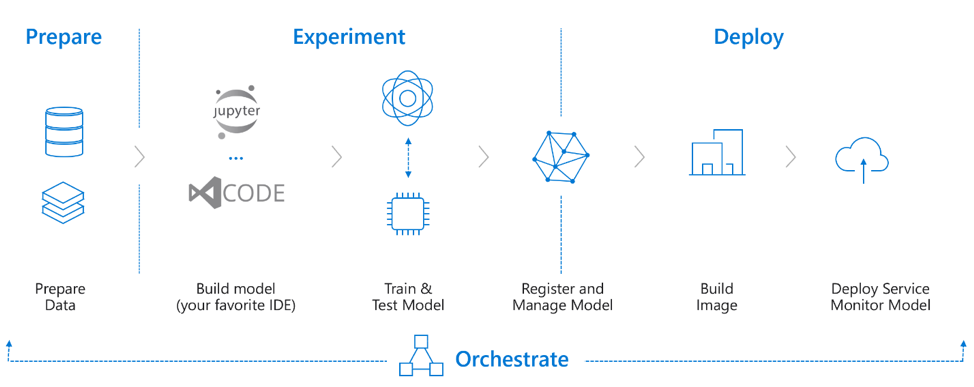
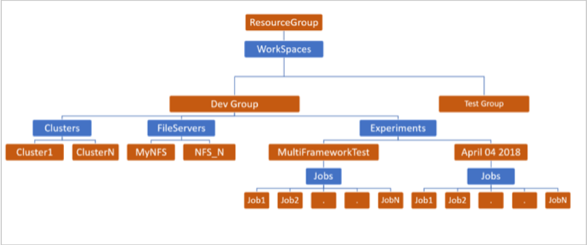
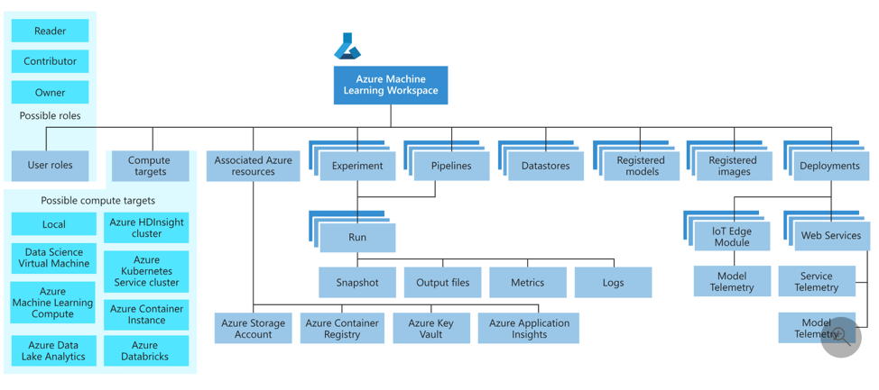

# What's happening to Azure Batch AI?

**The Azure Batch AI service is retiring in March.** The at-scale training and scoring capabilities of Batch AI are now available in [Azure Machine Learning service](../machine-learning/service/overview-what-is-azure-ml.md), which became generally available on December 4, 2018.

Along with many other machine learning capabilities, the Azure Machine Learning service includes a cloud-based managed compute target for training, deploying, and scoring machine learning models. This compute target is called [Azure Machine Learning Compute](../machine-learning/service/how-to-set-up-training-targets.md#amlcompute). [Start migrating and using it today](#migrate). You can interact with the Azure Machine Learning service through its [Python SDKs](../machine-learning/service/quickstart-create-workspace-with-python.md), command-line interface, and the [Azure portal](../machine-learning/service/quickstart-get-started.md).

## Support timeline

At this time, you can use your existing Azure Batch AI subscriptions as before. However, no **new subscriptions** are possible and no new investments are being made.

Starting March&nbsp;31&#x2c;&nbsp;2019, unused Batch AI subscriptions will no longer work.

## Compare to Azure Machine Learning
It is a cloud service that you use to train, deploy, automate, and manage machine learning models, all at the broad scale that the cloud provides. Get a high-level understanding of the [Azure Machine Learning service in this overview](../machine-learning/service/overview-what-is-azure-ml.md).
 

A typical model development lifecycle involves Data Preparation, Training & Experimentation and a Deployment phase. This end to end cycle can be orchestrated by using Machine Learning pipelines.

[Learn more about how the service works and its main concepts](../machine-learning/service/concept-azure-machine-learning-architecture.md). Many of the concepts in the model training workflow are similar to existing concepts in Batch AI. 

Specifically, here is a mapping of how you should think about them:
 
|Batch AI service|	Azure Machine Learning service|
|:--:|:---:|
|Workspace|Workspace|
|Cluster|	Compute of type `AmlCompute`|
|File servers|DataStores|
|Experiments|Experiments|
|Jobs|Runs (allows nested runs)|
 
Here is another view of the same table that will help you visualize things further:
 
### Batch AI hierarchy
 
 
### Azure Machine Learning service hierarchy
 

## Platform capabilities
Azure Machine Learning service brings a great set of new functionalities including an end to end training->deployment stack that you can use for your AI development without having to manage any Azure resources. This table compares feature support for training between the two services.

|Feature|Batch AI service|Azure Machine Learning service|
|-------|:-------:|:-------:|
|VM size choice	|CPU/GPU	|CPU/GPU. Also supports FPGA for inferencing|
|AI ready Cluster (Drivers, Docker, etc.)|	Yes	|Yes|
|Node Prep|	Yes|	No|
|OS family Choice	|Partial	|No|
|Dedicated and LowPriority VMs	|Yes	|Yes|
|Auto-Scaling	|Yes	|Yes (by default)|
|Wait time for autoscaling	|No	|Yes|
|SSH	|Yes|	Yes|
|Cluster level Mounting	|Yes (FileShares, Blobs, NFS, Custom)	|Yes (mount or download your datastore)|
|Distributed Training|	Yes	|Yes|
|Job Execution Mode|	VM or Container|	Container|
|Custom Container Image|	Yes	|Yes|
|Any Toolkit	|Yes	|Yes (Run Python Script)|
|JobPreparation|	Yes	|Not yet|
|Job level mounting	|Yes (FileShares, Blobs, NFS, Custom)	|Yes (FileShares, Blobs)|
|Job Monitoring 	|via GetJob|	via Run History (Richer information, Custom runtime to push more metrics)|
|Retrieve Job Logs and Files/Models |	via ListFiles and Storage APIs	|via Artifact service|
 |Support for Tensorboard	|No|	Yes|
|VM family level quotas	|Yes	|Yes (with your previous capacity carried forward)|
 
In addition to the preceding table, there are features in the Azure Machine Learning service that were traditionally not supported in BatchAI.

|Feature|Batch AI service|Azure Machine Learning service|
|-------|:-------:|:-------:|
|Environment Preparation	|No	|Yes (Conda Prepare and upload to ACR)|
|HyperParameter Tuning	|No|	Yes|
|Model management	|No	|Yes|
|Operationalization/Deployment|	No	|Via AKS and ACI|
|Data Preparation	|No	|Yes|
|Compute Targets	|Azure VMs	|Local, BatchAI (as AmlCompute), DataBricks, HDInsight|
|Automated Machine Learning	|No|	Yes|
|Pipelines	|No	|Yes|
|Batch Scoring	|Yes	|Yes|
|Portal/CLI support|	Yes	|Yes|

## Programming interfaces

This table presents the various programming interfaces available for each service.
	
|Feature|BatchAI service|Azure Machine Learning service|
|-------|:-------:|:-------:|
|SDK	|Java, C#, Python, Nodejs	|Python (both run config based and estimator based for common frameworks)|
|CLI	|Yes	|Not yet|
|Azure portal	|Yes	|Yes (except job submission)|
|REST API	|Yes	|Yes but distributed across microservices|

Upgrading from the Preview Batch AI to the GA'ed Azure Machine Learning service gives you a better experience through concepts that are easier to use such as Estimators and Datastores. It also guarantees GA level Azure service SLAs and customer support.

Azure Machine Learning service also brings in new functionality such as automated machine learning, hyperparameter tuning, and ML pipelines, which are useful in most large-scale AI workloads. The ability to deploy a trained model without switching to a separate service helps complete the data science loop from data preparation (using the Data Prep SDK) all the way to operationalization and model monitoring.

## Migrate

Learn how to migrate and how the code you use maps to code in Azure Machine Learning service in the [Migrate to Azure Machine Learning service](how-to-migrate.md) article.

## Get support

Batch AI is slated to retire on March 31 and is already blocking new subscriptions from registering against the service unless it is whitelisted by raising an exception through support.  Reach out to us at [Azure Batch AI Training Preview](mailto:AzureBatchAITrainingPreview@service.microsoft.com) with any questions or if you have feedback as you migrate to Azure Machine Learning service.

Azure Machine Learning service is a generally available service. This means that it comes with a committed SLA and various support plans to choose from.

Pricing for using Azure infrastructure  either through the Batch AI service or through the Azure Machine Learning service should not vary, as we only charge the price for the underlying compute in both cases. For more information, see the [pricing calculator](https://azure.microsoft.com/pricing/details/machine-learning-service/).

View the regional availability between the two services on the [Azure portal](https://azure.microsoft.com/global-infrastructure/services/?products=batch-ai,machine-learning-service&regions=all).

## Next steps

+ Learn [how to migrate](how-to-migrate.md) and how code you use now maps to code in Azure Machine Learning service.

+ Read the [Azure Machine Learning service overview](../machine-learning/service/overview-what-is-azure-ml.md).

+ [Configure a compute target for model training](../machine-learning/service/how-to-set-up-training-targets.md) with Azure Machine Learning service.

+ Review the [Azure roadmap](https://azure.microsoft.com/updates/) to learn of other Azure service updates.
