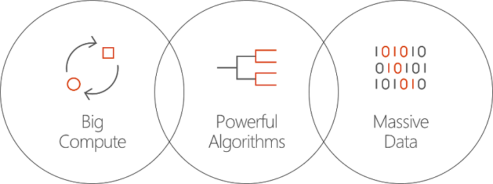

# What is Batch AI in Azure?
Batch AI is a managed service that enables data scientists and AI researchers to train AI and other machine learning models on clusters of Azure virtual machines, including VMs with GPU support. You describe the requirements of your job, where to find the inputs and store the outputs, and Batch AI handles the rest.  
 
## Why Batch AI? 
Developing powerful AI algorithms is a compute-intensive and iterative process. Data scientists and AI researchers are working with increasingly larger data sets. They are developing models with more layers, and doing this with more experimentation on network design on hyper-parameter tuning. Doing this efficiently requires multiple CPUs or GPUs per model, running experiments in parallel, and having shared storage for training data, logs, and model outputs.   
 

Data scientists and AI researchers are experts in their field, yet managing infrastructure at scale can get in the way. Developing AI at scale requires many infrastructure tasks: provisioning clusters of VMs, installing software and containers, queuing work, prioritizing and scheduling jobs, handing failures, distributing data, sharing results, scaling resources to manage costs, and integrating with tools and workflows. Batch AI handles these tasks. 
 
## What is Batch AI? 

Batch AI provides resource management and job scheduling specialized for AI training and testing. Key capabilities include: 

* Running long-running batch jobs, iterative experimentation, and interactive training 
* Automatic or manual scaling of VM clusters using GPUs or CPUs 
* Configuring SSH communication between VMs and for remote access 
* Support for any Deep Learning or machine learning framework, with optimized configuration for popular toolkits such as [Microsoft Cognitive Toolkit](https://github.com/Microsoft/CNTK) (CNTK), [TensorFlow](https://www.tensorflow.org/), and [Chainer](https://chainer.org/) 
* Priority-based job queue to share clusters and take advantage of low-priority VMs and reserved instances  
* Flexible storage options including Azure Files and a managed NFS server 
* Mounting remote file shares into the VM and optional container 
* Providing job status and restarting in case of VM failures 
* Access to output logs, stdout, stderr, and models, including streaming from Azure Storage 
* Azure [command-line interface](/cli/azure/overview) (CLI), SDKs for [Python](https://github.com/Azure/azure-sdk-for-python), [C#](https://www.nuget.org/packages/Microsoft.Azure.Management.BatchAI/1.0.0-preview), and Java, monitoring in the Azure Portal, and integration with Microsoft AI tools 

The Batch AI SDK supports writing scripts or applications to manage training pipelines and integrate with tools. The SDK currently provides Python, C#, Java, and REST APIs.  
 

Batch AI uses Azure Resource Manager for control-plane operations (create, list, get, delete). Azure Active Directory is used for authentication and role-based access control.  
 
## How to use Batch AI 

To use Batch AI, you define and manage *clusters* and *jobs*. 

 
**Clusters**  describe your compute requirements: 
* Azure region that you want to run in 
* The family and size of VM to use - for example, an NC24 VM, which contains 4 NVIDIA K80 GPUs 
* The number of VMs, or the minimum and maximum number for autoscaling 
* The VM image - for example, Ubuntu 16.04 LTS or [Microsoft Deep Learning Virtual Machine](https://azuremarketplace.microsoft.com/marketplace/apps/microsoft-ads.dsvm-deep-learning)
* Any remote file share volumes to mount - for example, from Azure Files or an NFS server managed by Batch AI 
* User name and SSH key or password to configure on the VMs to enable interactive login for debugging  
 

**Jobs** describe: 
* The cluster and region to use 
* How many VMs for the job 
* Input and output directories to be passed to the job when starting. This typically uses the shared file system mounted during cluster setup 
* An optional container to run your software or installation script 
* AI framework-specific configuration or the command line and parameters to start the job 
 

Get started using Batch AI with the [Azure CLI](/cli/azure/overview) and configuration files for clusters and jobs. Use this approach to quickly create your cluster when needed and run jobs to experiment with network design or hyper-parameters.  
 

Batch AI makes it easy to work in parallel with multiple GPUs. When jobs need to scale across multiple GPUs, Batch AI sets up secure network connectivity between the VMs. When InfiniBand is used, Batch AI configures the drivers and starts MPI across the nodes in a job.  

## Data management
Batch AI provides flexible options for your training scripts, data, and outputs:
  
* Use **local disk** for early experimentation and smaller datasets. For this scenario you might want to connect to the virtual machine over SSH to edit scripts and read logs. 

* Use **Azure Files** to share training data across multiple jobs, and store output logs and models in a single location 

* Set up an **NFS server** to support a larger scale of data and VMs for training. Batch AI can set up an NFS server for you as a special cluster type with disks backed in Azure Storage. 
 
* A **parallel file system** provides further scalability for data and parallel training. While Batch AI does not manage parallel file systems, example deployment templates are available for Lustre, Gluster, and BeeGFS.  

## Next steps

* Get started creating your first Batch AI training job using the [Azure CLI](quickstart-cli.md) or [Python](quickstart-python.md).
* Check out sample [training recipes](https://github.com/Azure/BatchAI) for different frameworks.

