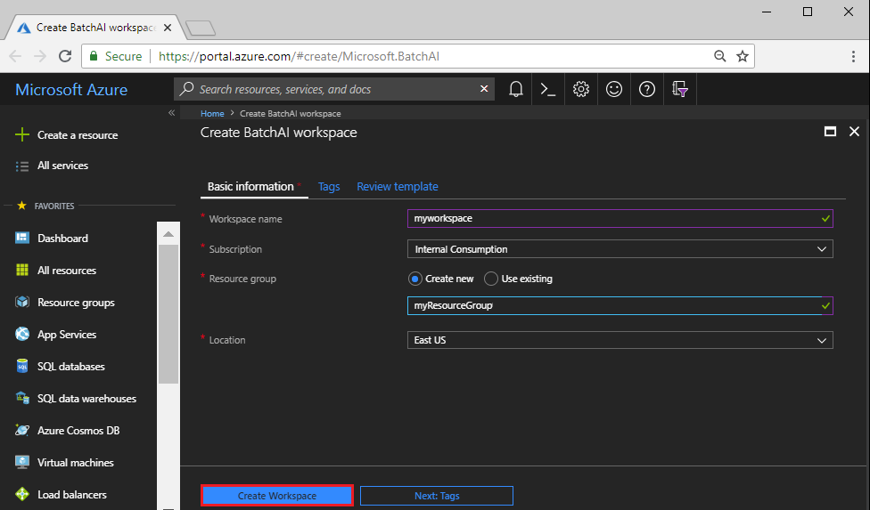

# Quickstart: Create a cluster for Batch AI training jobs using the Azure portal

This quickstart shows how to use the Azure portal to create a cluster you can use for Batch AI training jobs. The cluster initially has a single GPU node.

After completing this quickstart, you'll have a cluster you can scale up and use to train deep learning models. Submit training jobs to the cluster using Batch AI, [Azure Machine Learning](../machine-learning/service/overview-what-is-azure-ml.md) tools, or the [Visual Studio Tools for AI](https://github.com/Microsoft/vs-tools-for-ai).

[!INCLUDE [quickstarts-free-trial-note.md](../../includes/quickstarts-free-trial-note.md)]

## Create SSH key pair

You need an SSH key pair to complete this quickstart. If you have an existing SSH key pair, this step can be skipped.

To create an SSH key pair and log into Linux VMs, run the following command from a Bash shell and follow the on-screen directions. For example, you can use the [Azure Cloud Shell](../../cloud-shell/overview.md) or, on Windows, the [Windows Subsystem for Linux](/windows/wsl/install-win10). The command output includes the file name of the public key file. Copy the contents of the public key file (`cat ~/.ssh/id_rsa.pub`) to the clipboard:

```bash
ssh-keygen -t rsa -b 2048
```

For more detailed information on how to create SSH key pairs, see [Create and use an SSH public-private key pair for Linux VMs in Azure](../virtual-machines/linux/mac-create-ssh-keys.md).

## Sign in to Azure

Sign in to the Azure portal at https://portal.azure.com.

## Create a Batch AI workspace

First, create a Batch AI workspace to organize your Batch AI clusters and other resources. A workspace can contain one or more clusters.


1. Select **All services** and filter for **Batch AI**.

2. Select **Add Workspace**.

3. Enter values for **Workspace name** and **Resource group**. If you want to, select different options for the **Subscription** and **Location** for the workspace. Select **Create Workspace**.

  

When the **Deployment succeeded** message appears, go the resource you created and select the workspace. 

## Create a file server

1. In the workspace, select **File server** > **Add**.

## Create a cluster

Now that you have a workspace, create a small cluster. Although this c. The pool for this quick example consists of 2 nodes running a Windows Server 2012 R2 image from the Azure Marketplace.

The following example creates a cluster with the following properties:

* Contains a single node in the NC6 VM size, which has one NVIDIA Tesla K80 GPU. 
* Runs a default Ubuntu Server image designed to host container-based applications, which you can use for most training workloads. 
* Adds a user account named *myusername*, and generates SSH keys if they don't already exist in the default key location (*~/.ssh*) in your local environment. 
* Automatically creates (through the `--use-auto-storage` option) an associated storage account, which you can use to store files for training jobs. Batch AI mounts a file share and storage container in that account on each cluster node.  

```azurecli-interactive
az batchai cluster create \
    --name mycluster \
    --workspace myworkspace \
    --resource-group myResourceGroup \
    --vm-size Standard_NC6 \
    --use-auto-storage \
    --target 1 \
    --user-name myusername \
    --generate-ssh-keys
```

The command output shows the cluster properties. It takes a few minutes to create and start the node. To see the status of the cluster, run the [az batchai cluster show](/cli/azure/batchai/cluster#az-batchai-cluster-show) command. 

```azurecli-interactive
az batchai cluster show \
    --name mycluster \
    --workspace myworkspace \
    --resource-group myResourceGroup \
    --output table
```

Early in cluster creation, output is similar to the following, showing the cluster is in the `resizing` state:

```bash
Name       Resource Group    Workspace    VM Size       State      Idle    Running    Preparing    Leaving    Unusable
---------  ----------------  -----------  ------------  -------  ------  ---------  -----------  ---------  ----------
mycluster  myResourceGroup   myworkspace  STANDARD_NC6  resizing      0          0            0          0           0

```
The cluster is ready to use when the state is `steady` and the single node is `Idle`.

## Verify that the cluster is running

### List cluster nodes 

If you need to connect to the cluster nodes (in this case, a single node) to install applications or perform maintenance, get connection information by running the [az batchai cluster node list](/cli/azure/batchai/cluster/node#az_batchai_cluster_node_list) command:


```azurecli-interactive
az batchai cluster node list \
    --cluster mycluster \
    --workspace myworkspace \
    --resource-group myResourceGroup 
 ```

JSON output is similar to:

```JSON
[
  {
    "ipAddress": "40.68.254.143",
    "nodeId": "tvm-1816144089_1-20180626t233430z",
    "port": 50000.0
  }
]
```
Use this information to make an SSH connection to the node. For example, substitute the correct IP address of your node in the following command:

```bash
ssh myusername@40.68.254.143 -p 50000
``` 
Exit the SSH session to continue.

### Show file share information
Run the [az batchai cluster show](/cli/azure/batchai/cluster#az-batchai-cluster-show) command to query for storage settings including the Azure file share URL and account name. This information is useful when configuring the input and output files for a job.

```azurecli-interactive
az batchai cluster show \
    --name mycluster \
    --workspace myworkspace \
    --resource-group myResourceGroup \
    --query 'nodeSetup.mountVolumes.azureFileShares[0].{account:accountName, URL:azureFileUrl}'
```

Output is similar to the following. Note the name of the share set up automatically in the account: `batchaishare`.

```
{
  "URL": "https://baizxxxxxxxxxxxx.file.core.windows.net/batchaishare",
  "account": "baizxxxxxxxxxxxx"
}
```

### Resize the cluster

When you use your cluster to run a training job, you might need more compute resources. For example, to increase the size to 2 nodes for a distributed training job, run the [batch ai cluster resize](/cli/azure/batchai/cluster#az-batchai-cluster-resize) command:

```azurecli-interactive
az batchai cluster resize \
    --name mycluster \
    --workspace myworkspace \
    --resource-group myResourceGroup
    --target 2
```
It takes a few minutes for the cluster to resize.

## Clean up resources
If you want to continue with Batch AI tutorials and samples, use the Batch AI workspace, cluster, and storage account created in this quickstart. 

You're charged for the Batch AI cluster while the nodes are running, even if no jobs are scheduled. If you want to maintain the cluster configuration when you have no jobs to run, resize the cluster to 0 nodes. Later, resize it to 1 or more nodes to run your jobs. When you no longer need a cluster, delete it with the [az batchai cluster delete](/cli/azure/batchai/cluster#az_batchai_cluster_delete) command:

```azurecli-interactive
az batchai cluster delete 
    --name mycluster
    --workspace myworkspace
    --resource-group myResourceGroup
```

When no longer needed, you can use the [az group delete](/cli/azure/group#az_group_delete) command to remove the resource groups for the Batch AI and storage resources. Delete the Batch AI resources as follows:

```azurecli-interactive 
az group delete --name myResourceGroup
```

Delete the automatically generated storage resources as follows:

```azurecli-interactive
az group delete --name batchaiautostorage
```

## Next steps
In this quickstart, you learned how to create a Batch AI cluster, using the Azure CLI. To learn more about using a Batch AI cluster to train a deep learning model, see the [training recipes](https://github.com/Azure/BatchAI).
