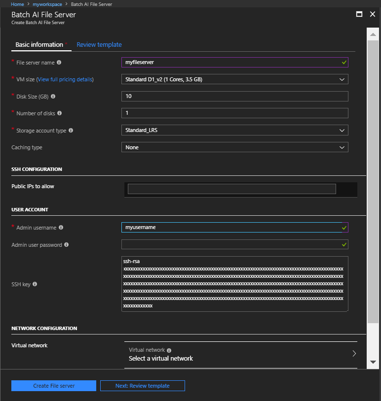
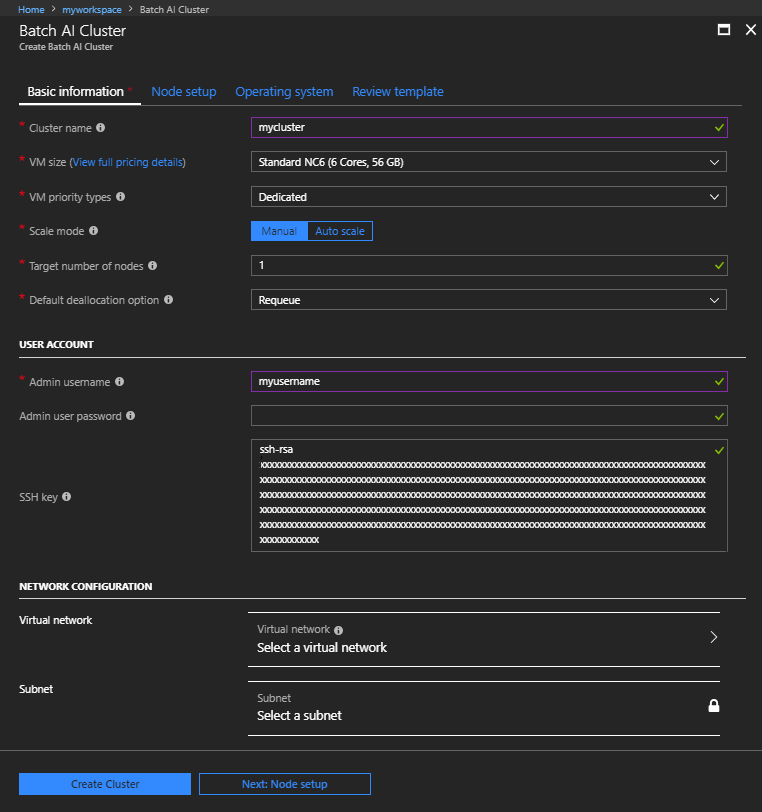
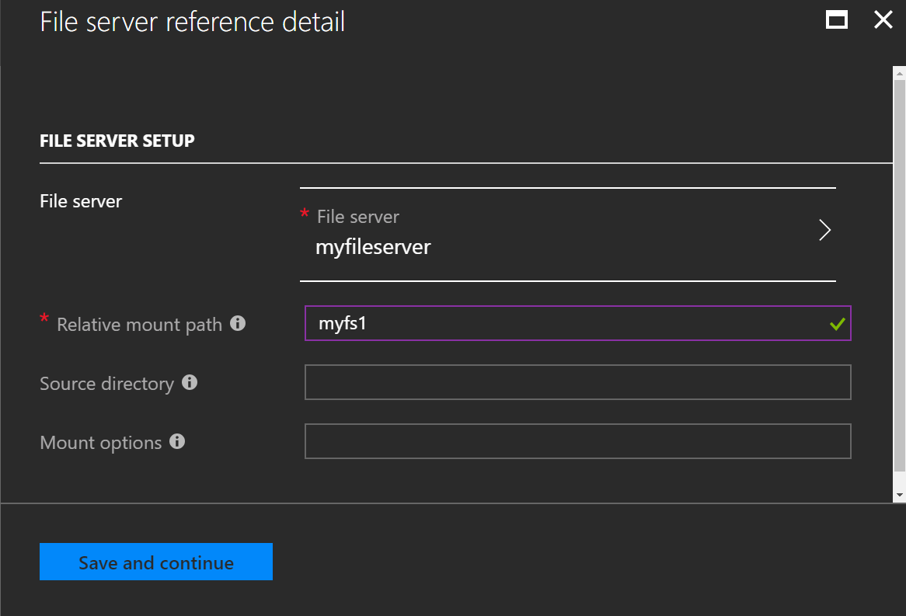
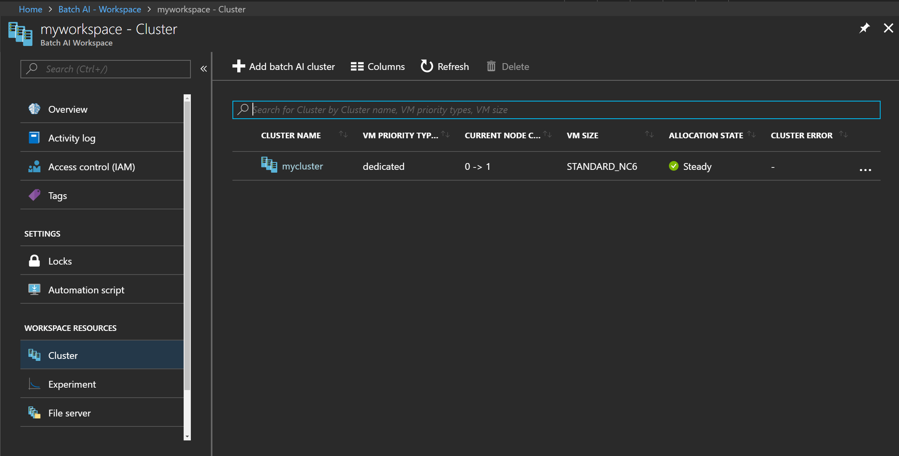
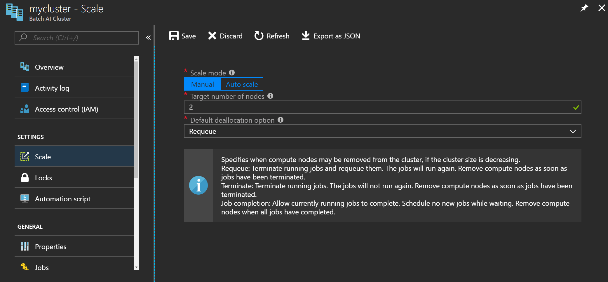

# Quickstart: Create a cluster for Batch AI training jobs using the Azure portal

This quickstart shows how to use the Azure portal to create a cluster for Batch AI training jobs. The cluster initially has a single GPU node and an attached file server.

After completing this quickstart, you'll have a cluster you can scale up and use to train deep learning models. Submit training jobs to the cluster using Batch AI, [Azure Machine Learning](../machine-learning/service/overview-what-is-azure-ml.md) tools, or the [Visual Studio Tools for AI](https://github.com/Microsoft/vs-tools-for-ai).

[!INCLUDE [quickstarts-free-trial-note.md](../../includes/quickstarts-free-trial-note.md)]

## Create SSH key pair

You need an SSH key pair to complete this quickstart. If you have an existing SSH key pair, this step can be skipped.

To create an SSH key pair, run the following command from a Bash shell and follow the on-screen directions. For example, you can use the [Azure Cloud Shell](../../cloud-shell/overview.md) or, on Windows, the [Windows Subsystem for Linux](/windows/wsl/install-win10). The command output includes the file name of the public key file. Copy the contents of the public key file (`cat ~/.ssh/id_rsa.pub`) to the clipboard or another location you can access in a later step.

```bash
ssh-keygen -t rsa -b 2048
```

For more detailed information on how to create SSH key pairs, see [Create and use an SSH public-private key pair for Linux VMs in Azure](../virtual-machines/linux/mac-create-ssh-keys.md).

## Sign in to Azure

Sign in to the Azure portal at https://portal.azure.com.

## Create a Batch AI workspace

First, create a Batch AI workspace to organize your Batch AI resources. A workspace can contain one or more clusters.

1. Select **All services** and filter for **Batch AI**.

2. Select **Add Workspace**.

3. Enter values for **Workspace name** and **Resource group**. If you want to, select different options for the **Subscription** and **Location** for the workspace. Select **Create Workspace**.

  

When the **Deployment succeeded** message appears, go the resource you created and select the workspace. 

## Create a file server

1. In the workspace, select **File server** > **Add batch ai file server**.

2. Enter values for **File server name** and **VM size**. For this quickstart, a VM size of *Standard D1_v2* is suggested. Choose a different size if you will need to store larger amounts of input or output data for training jobs.

3. Enter an **Admin username** and copy the contents of your SSH public key file to **SSH key**. Accept defaults for the remaining values and select **Create File Server**. 

  

It takes a few minutes to deploy the file server. You can go ahead to create the cluster while Batch AI deploys the file server.

## Create a cluster

The following steps create a cluster with a single GPU node. The cluster node runs a default Ubuntu Server image designed to host container-based applications, which you can use for most training workloads. The file server is mounted on the cluster node. 

1. In your Batch AI workspace, select **Cluster** > **Add batch ai cluster**.

2. Enter values for **Cluster name** and the following settings. The suggested VM size has one NVIDIA Tesla K80 GPU.
  
   |Setting  |Value  |
   |---------|---------|
   |**VM size**     |Standard NC6|
   |**Target number of nodes**     |1|

3. Enter an **Admin username** and copy the contents of your SSH public key file to **SSH key**. Accept defaults for the remaining values on this page, and select **Next: Node setup**.

   

4. Select **File server references** > **Add** and select the file server you created previously. Enter a **Relative mount path** where the server is mounted on each cluster node, and select **Save and continue**.

   

Save the node setup and select **Create Cluster**.

Batch AI creates the cluster resource immediately, but it takes a few minutes to allocate and start the node. During this time, the cluster's **Allocation state** is **Resizing**. 



After a few minutes, the state of the cluster is **Steady**, and the node starts. Select the cluster name to check the state of the node. When a node's state is **Idle**, it is ready to run training jobs.

## Resize the cluster

When you use your cluster to run a training job, you might need more compute resources. For example, to increase the size to 2 nodes for a distributed training job, select **Scale** and set the **Target number of node** to 2. Save the configuration.



It takes a few minutes for the cluster to resize.

## Clean up resources

If you want to continue with Batch AI tutorials and samples, use the Batch AI workspace, cluster, and file server created in this quickstart.

You're charged for the Batch AI cluster while the nodes are running, even if no jobs are scheduled. If you want to maintain the cluster configuration when you have no jobs to run, resize the cluster to 0 nodes. Later, resize it to 1 or more nodes to run your jobs. When no longer needed, delete the Batch AI workspace containing the cluster and file server. To do so, select the Batch AI workspace and select **Delete **.

## Next steps

In this quickstart, you learned how to create a Batch AI cluster, using the Azure portal. To learn more about using a Batch AI cluster to train a deep learning model, see the [training recipes](https://github.com/Azure/BatchAI).
