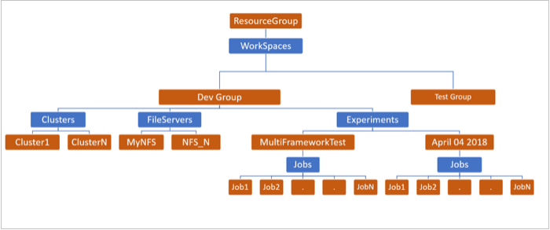

# Overview of resources in Batch AI

When you first start using the Batch AI service, you'll want to understand the available Batch AI resources. As with other Azure services, you create Batch AI resources in one or more Azure *resource groups*. Create one or more Batch AI *workspaces* in a resource group. Each workspace contains a mix of Batch AI *clusters*, *file servers*, and *experiments*. A Batch AI experiment encapsulates a group of *jobs*.

The following image shows an example resource hierarchy for Batch AI. 

The following sections go into more detail about the Batch AI resources.

## Workspace

A workspace in Batch AI is a top-level collection of the rest of the Batch AI resources. Workspaces help to separate work belonging to different groups or projects. For example, you might create a development and a test workspace.

## Cluster

A cluster in Batch AI contains the compute resources for running jobs. All nodes in a cluster have same VM size and OS image. Batch AI offers many options for creating clusters that are customized to different needs. Typically, you set up a different cluster for each category of processing power needed to complete a project. Scale the Batch AI clusters up and down based on demand and budget. For more information, see [Work with Batch AI clusters](clusters.md).

## File server

Optionally create a file server in Batch AI to store data, training scripts, and output logs. A Batch AI file server is a managed single-node NFS, which can be automatically mounted on cluster nodes to provide an easy and centrally accessible storage location for jobs. For most cases, only one file server is needed in a workspace, and you can separate data for your training jobs into different directories. If NFS isn't appropriate for your workloads, Batch AI supports other storage options including [Azure Storage](use-azure-storage.md) or custom solutions such as a Gluster or Lustre file system.

## Experiment

An experiment groups a collection of related jobs that you query and manage together. Each workspace might have multiple experiments, where each experiment attempts to solve one specific problem.

## Job

A job is a single task or script that needs to be executed, for example to train a deep learning model. Each job executes a specific script on one cluster in the workspace. (The script might be stored on a Batch AI file server or other storage solution.) Each Batch AI job has a framework type associated with it: TensorFlow, Horovod, CNTK, Caffe, Caffe2, pyTorch, Chainer, custom MPI, or custom. For each framework, the Batch AI service sets up the required infrastructure and manages the job processes. Each experiment can have multiple jobs that are similar, apart from a few changes to different parameters.

## Next steps

* Run your first [Batch AI training job](quickstart-tensorflow-training-cli.md).

* Check out sample [training recipes](https://github.com/Azure/BatchAI/tree/master/recipes) for different frameworks.