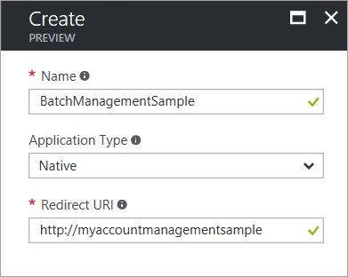
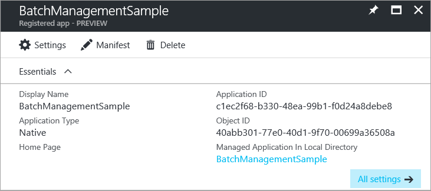
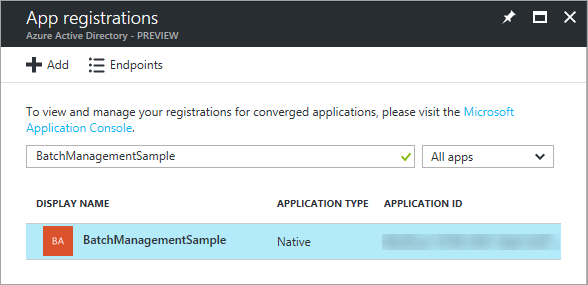
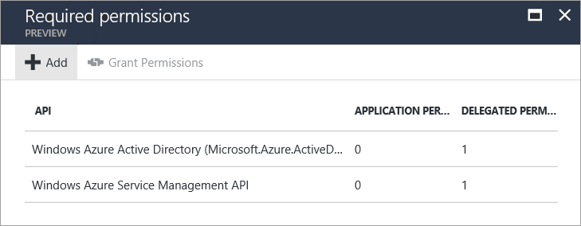

# Authenticate Batch Management solutions with Active Directory

Applications that call the Azure Batch Management service authenticate with [Azure Active Directory][aad_about] (Azure AD). Azure AD is Microsoft’s multi-tenant cloud based directory and identity management service. Azure itself uses Azure AD for the authentication of its customers, service administrators, and organizational users.

The Batch Management .NET library exposes types for working with Batch accounts, account keys, applications, and application packages. The Batch Management .NET library is an Azure resource provider client, and is used together with [Azure Resource Manager][resman_overview] to manage these resources programmatically. Azure AD is required to authenticate requests made through any Azure resource provider client, including the Batch Management .NET library, and through [Azure Resource Manager][resman_overview].

In this article, we explore using Azure AD to authenticate from applications that use the Batch Management .NET library. We show how to use Azure AD to authenticate a subscription administrator or co-administrator, using integrated authentication. We use the [AccountManagment][acct_mgmt_sample] sample project, available on GitHub, to walk through using Azure AD with the Batch Management .NET library.

To learn more about using the Batch Management .NET library and the AccountManagement sample, see [Manage Batch accounts and quotas with the Batch Management client library for .NET](batch-management-dotnet.md).

## Register your application with Azure AD

The Azure [Active Directory Authentication Library][aad_adal] (ADAL) provides a programmatic interface to Azure AD for use within your applications. To call ADAL from your application, you must register your application in an Azure AD tenant. When you register your application, you supply Azure AD with information about your application, including a name for it within the Azure AD tenant. Azure AD then provides an application ID that you use to associate your application with Azure AD at runtime. To learn more about the application ID, see [Application and service principal objects in Azure Active Directory](../active-directory/develop/app-objects-and-service-principals.md).

To register the AccountManagement sample application, follow the steps in the [Adding an Application](../active-directory/develop/quickstart-v1-add-azure-ad-app.md) section in [Integrating applications with Azure Active Directory][aad_integrate]. Specify **Native Client Application** for the type of application. The industry standard OAuth 2.0 URI for the **Redirect URI** is `urn:ietf:wg:oauth:2.0:oob`. However, you can specify any valid URI (such as `http://myaccountmanagementsample`) for the **Redirect URI**, as it does not need to be a real endpoint:



Once you complete the registration process, you'll see the application ID and the object (service principal) ID listed for your application.  



## Grant the Azure Resource Manager API access to your application

Next, you'll need to delegate access to your application to the Azure Resource Manager API. The Azure AD identifier for the Resource Manager API is **Windows Azure Service Management API**.

Follow these steps in the Azure portal:

1. In the left-hand navigation pane of the Azure portal, choose **All services**, click **App Registrations**, and click **Add**.
2. Search for the name of your application in the list of app registrations:

    

3. Display the **Settings** blade. In the **API Access** section, select **Required permissions**.
4. Click **Add** to add a new required permission. 
5. In step 1, enter **Windows Azure Service Management API**, select that API from the list of results, and click the **Select** button.
6. In step 2, select the check box next to **Access Azure classic deployment model as organization users**, and click the **Select** button.
7. Click the **Done** button.

The **Required Permissions** blade now shows that permissions to your application are granted to both the ADAL and Resource Manager APIs. Permissions are granted to ADAL by default when you first register your app with Azure AD.



## Azure AD endpoints

To authenticate your Batch Management solutions with Azure AD, you'll need two well-known endpoints.

- The **Azure AD common endpoint** provides a generic credential gathering interface when a specific tenant is not provided, as in the case of integrated authentication:

    `https://login.microsoftonline.com/common`

- The **Azure Resource Manager endpoint** is used to acquire a token for authenticating requests to the Batch management service:

    `https://management.core.windows.net/`

The AccountManagement sample application defines constants for these endpoints. Leave these constants unchanged:

```csharp
// Azure Active Directory "common" endpoint.
private const string AuthorityUri = "https://login.microsoftonline.com/common";
// Azure Resource Manager endpoint 
private const string ResourceUri = "https://management.core.windows.net/";
```

## Reference your application ID 

Your client application uses the application ID (also referred to as the client ID) to access Azure AD at runtime. Once you've registered your application in the Azure portal, update your code to use the application ID provided by Azure AD for your registered application. In the AccountManagement sample application, copy your application ID from the Azure portal to the appropriate constant:

```csharp
// Specify the unique identifier (the "Client ID") for your application. This is required so that your
// native client application (i.e. this sample) can access the Microsoft Azure AD Graph API. For information
// about registering an application in Azure Active Directory, please see "Adding an Application" here:
// https://azure.microsoft.com/documentation/articles/active-directory-integrating-applications/
private const string ClientId = "<application-id>";
```
Also copy the redirect URI that you specified during the registration process. The redirect URI specified in your code must match the redirect URI that you provided when you registered the application.

```csharp
// The URI to which Azure AD will redirect in response to an OAuth 2.0 request. This value is
// specified by you when you register an application with AAD (see ClientId comment). It does not
// need to be a real endpoint, but must be a valid URI (e.g. https://accountmgmtsampleapp).
private const string RedirectUri = "http://myaccountmanagementsample";
```

## Acquire an Azure AD authentication token

After you register the AccountManagement sample in the Azure AD tenant and update the sample source code with your values, the sample is ready to authenticate using Azure AD. When you run the sample, the ADAL attempts to acquire an authentication token. At this step, it prompts you for your Microsoft credentials: 

```csharp
// Obtain an access token using the "common" AAD resource. This allows the application
// to query AAD for information that lies outside the application's tenant (such as for
// querying subscription information in your Azure account).
AuthenticationContext authContext = new AuthenticationContext(AuthorityUri);
AuthenticationResult authResult = authContext.AcquireToken(ResourceUri,
                                                        ClientId,
                                                        new Uri(RedirectUri),
                                                        PromptBehavior.Auto);
```

After you provide your credentials, the sample application can proceed to issue authenticated requests to the Batch management service. 

## Next steps

For more information on running the [AccountManagement sample application][acct_mgmt_sample], see [Manage Batch accounts and quotas with the Batch Management client library for .NET](batch-management-dotnet.md).

To learn more about Azure AD, see the [Azure Active Directory Documentation](https://docs.microsoft.com/azure/active-directory/). In-depth examples showing how to use ADAL are available in the [Azure Code Samples](https://azure.microsoft.com/resources/samples/?service=active-directory) library.

To authenticate Batch service applications using Azure AD, see [Authenticate Batch service solutions with Active Directory](batch-aad-auth.md). 


[aad_about]:../active-directory/fundamentals/active-directory-whatis.md "What is Azure Active Directory?"
[aad_adal]: ../active-directory/active-directory-authentication-libraries.md
[aad_auth_scenarios]:../active-directory/develop/authentication-scenarios.md "Authentication Scenarios for Azure AD"
[aad_integrate]: ../active-directory/active-directory-integrating-applications.md "Integrating Applications with Azure Active Directory"
[acct_mgmt_sample]: https://github.com/Azure/azure-batch-samples/tree/master/CSharp/AccountManagement
[azure_portal]: http://portal.azure.com
[resman_overview]: ../azure-resource-manager/resource-group-overview.md
