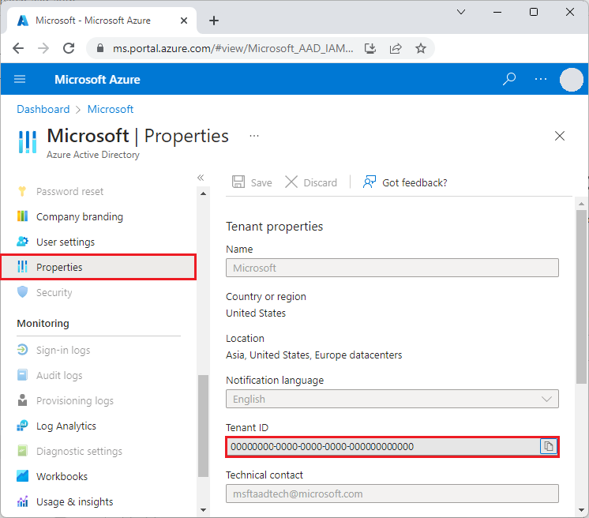
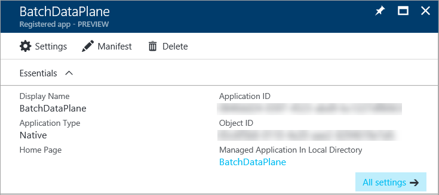

# Authenticate Azure Batch services with Azure Active Directory

Azure Batch supports authentication with [Azure Active Directory](/azure/active-directory/fundamentals/active-directory-whatis) (Azure AD), Microsoft's multi-tenant cloud based directory and identity management service. Azure uses Azure AD to authenticate its own customers, service administrators, and organizational users.

This article describes two ways to use Azure AD authentication with Azure Batch:

- **Integrated authentication** authenticates a user who's interacting with an application. The application gathers a user's credentials and uses those credentials to authorize access to Batch resources.

- A **service principal** authenticates an unattended application. The service principal defines the policy and permissions for the application and represents the application to access Batch resources at runtime.

For more information about Azure AD, see the [Azure AD documentation](/azure/active-directory/index).

## Gather endpoints for authentication

To authenticate Batch applications with Azure AD, you need to include the Azure AD endpoint and Batch resource endpoint in your code.

### Azure AD endpoint

The base Azure AD authority endpoint is `https://login.microsoftonline.com/`. To authenticate with Azure AD, use this endpoint with the *tenant ID* that identifies the Azure AD tenant to use for authentication:

`https://login.microsoftonline.com/<tenant-id>`

You can get your tenant ID from the main Azure AD page in the Azure portal. You can also select **Properties** in the left navigation and see the **Tenant ID** on the **Properties** page.



>[!IMPORTANT]
>- The tenant-specific Azure AD endpoint is required when you authenticate by using a service principal.
>
>- When you authenticate by using integrated authentication, the tenant-specific endpoint is recommended, but optional. You can also use the Azure AD common endpoint to provide a generic credential gathering interface when a specific tenant isn't provided. The common endpoint is `https://login.microsoftonline.com/common`.
>
>For more information about Azure AD endpoints, see [Authentication vs. authorization](/azure/active-directory/develop/authentication-vs-authorization).

### Batch resource endpoint

Use the Batch resource endpoint `https://batch.core.windows.net/` to acquire a token for authenticating requests to the Batch service.

## Register your application with a tenant

The first step in using Azure AD authentication is to register your application in an Azure AD tenant. Once you register your application, you can call the [Microsoft Authentication Library](/azure/active-directory/develop/msal-overview) (MSAL) from your code. The MSAL provides an API for authenticating with Azure AD from your application. Registering your application is required whether you use integrated authentication or a service principal.

When you register your application, you supply information about your application to Azure AD. Azure AD then provides an *application ID*, also called a *client ID*, that you use to associate your application with Azure AD at runtime. For more information about the application ID, see [Application and service principal objects in Azure Active Directory](/azure/active-directory/develop/app-objects-and-service-principals).

To register your Batch application, follow the steps at [Register an application](/azure/active-directory/develop/quickstart-register-app#register-an-application).

After you register your application, you can see the **Application (client) ID** on the application's **Overview** page.



## Configure integrated authentication

To authenticate with integrated authentication, you need to grant your application permission to connect to the Batch service API. This step enables your application to use Azure AD to authenticate calls to the Batch service API.

After you register your application, follow these steps to grant the application access to the Batch service:

1. In the Azure portal, search for and select **app registrations**.
1. On the **App registrations** page, select your application.
1. On your application's page, select **API permissions** from the left navigation.
1. On the **API permissions** page, select **Add a permission**.
1. On the **Request API permissions** page, select **Azure Batch**.
1. On the **Azure Batch** page, under **Select permissions**, select the checkbox next to **user_impersonation**, and then select **Add permissions**.

The **API permissions** page now shows that your Azure AD application has access to both **Microsoft Graph** and **Azure Batch**. Permissions are granted to Microsoft Graph automatically when you register an app with Azure AD.

## Configure a service principal

To authenticate an application that runs unattended, you use a service principal. When your application authenticates by using a service principal, it sends both the application ID and a secret key to Azure AD.

After you register your application, follow these steps in the Azure portal to configure a service principal:

1. Request a secret for your application.
1. Assign Azure role-based access control (Azure RBAC) to your application.

### Request a secret for your application

Follow these steps to create and copy the secret key to use in your code:

1. In the Azure portal, search for and select **app registrations**.
1. On the **App registrations** page, select your application.
1. On your application's page, select **Certificates & secrets** from the left navigation.
1. On the **Certificates & secrets** page, select **New client secret**.
1. On the **Add a client secret** page, enter a description and select an expiration period for the secret.
1. Select **Add** to create the secret and display it on the **Certificates & secrets** page.
1. Copy the secret **Value** to a safe place, because you won't be able to access it again after you leave this page. If you lose access to your key, you can generate a new one.

### Assign Azure RBAC to your application

Follow these steps to assign an Azure RBAC role to your application. For detailed steps, see [Assign Azure roles by using the Azure portal](/azure/role-based-access-control/role-assignments-portal).

1. In the Azure portal, navigate to the Batch account your application uses.
1. Select **Access control (IAM)** from the left navigation.
1. On the **Access control (IAM)** page, select **Add role assignment**.
1. On the **Add role assignment** page, select the **Role** tab, and then select either the [Contributor](/azure/role-based-access-control/built-in-roles#contributor) or [Reader](/azure/role-based-access-control/built-in-roles#reader) role for your app.
1. Select the **Members** tab, and select **Select members** under **Members**.
1. On the **Select members** screen, search for and select your application, and then select **Select**.
1. Select **Review + assign** on the **Add role assignment** page.

Your application should now appear on the **Role assignments** tab of the Batch account's **Access control (IAM)** page.

### Assign a custom role

A custom role grants granular permission to a user for submitting jobs, tasks, and more. You can use custom roles to prevent users from performing operations that affect cost, such as creating pools or modifying nodes.

You can use a custom role to grant or deny permissions to an Azure AD user, group, or service principal for the following Azure Batch RBAC operations:

- Microsoft.Batch/batchAccounts/pools/write
- Microsoft.Batch/batchAccounts/pools/delete
- Microsoft.Batch/batchAccounts/pools/read
- Microsoft.Batch/batchAccounts/jobSchedules/write
- Microsoft.Batch/batchAccounts/jobSchedules/delete
- Microsoft.Batch/batchAccounts/jobSchedules/read
- Microsoft.Batch/batchAccounts/jobs/write
- Microsoft.Batch/batchAccounts/jobs/delete
- Microsoft.Batch/batchAccounts/jobs/read
- Microsoft.Batch/batchAccounts/certificates/write
- Microsoft.Batch/batchAccounts/certificates/delete
- Microsoft.Batch/batchAccounts/certificates/read
- Microsoft.Batch/batchAccounts/read, for any read operation
- Microsoft.Batch/batchAccounts/listKeys/action, for any operation

Custom roles are for users authenticated by Azure AD, not for the Batch shared key account credentials. The Batch account credentials give full permission to the Batch account. Jobs that use [autopool](nodes-and-pools.md#autopools) require pool-level permissions.

> [!NOTE]
> Certain role assignments need to be specified in the `actions` field, whereas others need to be specified in the `dataActions` field. For more information, see [Azure resource provider operations](/azure/role-based-access-control/resource-provider-operations#microsoftbatch).

The following example shows an Azure Batch custom role definition:

```json
{
 "properties":{
    "roleName":"Azure Batch Custom Job Submitter",
    "type":"CustomRole",
    "description":"Allows a user to submit jobs to Azure Batch but not manage pools",
    "assignableScopes":[
      "/subscriptions/88888888-8888-8888-8888-888888888888"
    ],
    "permissions":[
      {
        "actions":[
          "Microsoft.Batch/*/read",
          "Microsoft.Authorization/*/read",
          "Microsoft.Resources/subscriptions/resourceGroups/read",
          "Microsoft.Support/*",
          "Microsoft.Insights/alertRules/*"
        ],
        "notActions":[

        ],
        "dataActions":[
          "Microsoft.Batch/batchAccounts/jobs/*",
          "Microsoft.Batch/batchAccounts/jobSchedules/*"
        ],
        "notDataActions":[

        ]
      }
    ]
  }
}
```

For more information on creating a custom role, see [Azure custom roles](../role-based-access-control/custom-roles.md).

## Code examples

The code examples in this section show how to authenticate with Azure AD by using integrated authentication or with a service principal. The code examples use .NET and Python, but the concepts are similar for other languages.

> [!NOTE]
> An Azure AD authentication token expires after one hour. When you use a long-lived **BatchClient** object, it's best to get a token from MSAL on every request to ensure that you always have a valid token.
>
> To do this in .NET, write a method that retrieves the token from Azure AD, and pass that method to a **BatchTokenCredentials** object as a delegate. Every request to the Batch service calls the delegate method to ensure that a valid token is provided. By default MSAL caches tokens, so a new token is retrieved from Azure AD only when necessary. For more information about tokens in Azure AD, see [Security tokens](/azure/active-directory/develop/security-tokens).

### Code example: Use Azure AD integrated authentication with Batch .NET

To authenticate with integrated authentication from Batch .NET:

1. Install the [Azure Batch .NET](https://www.nuget.org/packages/Microsoft.Azure.Batch/) and the [MSAL](https://www.nuget.org/packages/Microsoft.Identity.Client/) NuGet packages.

1. Declare the following `using` statements in your code:

   ```csharp
   using Microsoft.Azure.Batch;
   using Microsoft.Azure.Batch.Auth;
   using Microsoft.Identity.Client;
   ```

1. Reference the Azure AD endpoint, including the tenant ID. You can get your tenant ID from the Azure AD **Overview** page in the Azure portal.

   ```csharp
   private const string AuthorityUri = "https://login.microsoftonline.com/<tenant-id>";
   ```

1. Reference the Batch service resource endpoint:

   ```csharp
   private const string BatchResourceUri = "https://batch.core.windows.net/";
   ```

1. Reference your Batch account:

   ```csharp
   private const string BatchAccountUrl = "https://<myaccount>.<mylocation>.batch.azure.com";
   ```

1. Specify the application (client) ID for your application. You can get the application ID from your application's **Overview** page in the Azure portal.

   ```csharp
   private const string ClientId = "<application-id>";
   ```

1. Specify the redirect URI that you provided when you registered the application.

   ```csharp
   private const string RedirectUri = "https://<redirect-uri>";
   ```

1. Write a callback method to acquire the authentication token from Azure AD. The following example calls MSAL to authenticate a user who's interacting with the application. The MSAL [IConfidentialClientApplication.AcquireTokenByAuthorizationCode](/dotnet/api/microsoft.identity.client.iconfidentialclientapplication.acquiretokenbyauthorizationcode) method prompts the user for their credentials. The application proceeds once the user provides credentials.

   The *authorizationCode* parameter is the authorization code obtained from the authorization server after the user authenticates. `WithRedirectUri` specifies the redirect URI that the authorization server redirects the user to after authentication.

   ```csharp
   public static async Task<string> GetTokenUsingAuthorizationCode(string authorizationCode, string redirectUri, string[] scopes)
   {
       var app = ConfidentialClientApplicationBuilder.Create(ClientId)
                   .WithAuthority(AuthorityUri)
                   .WithRedirectUri(RedirectUri)
                   .Build();
   
       var authResult = await app.AcquireTokenByAuthorizationCode(scopes, authorizationCode).ExecuteAsync();
       return authResult.AccessToken;
   }
   ```

1. Call this method with the following code, replacing `<authorization-code>` with the authorization code obtained from the authorization server. The `.default` scope ensures that the user has permission to access all the scopes for the resource.

   ```csharp
   
   var token = await GetTokenUsingAuthorizationCode("<authorization-code>", "RedirectUri", new string[] { "BatchResourceUri/.default" });
   ```

1. Construct a **BatchTokenCredentials** object that takes the delegate as a parameter. Use those credentials to open a **BatchClient** object. Then use the **BatchClient** object for subsequent operations against the Batch service:

   ```csharp
   public static void PerformBatchOperations()
   {
       Func<Task<string>> tokenProvider = () => GetTokenUsingAuthorizationCode();
   
       using (var client = BatchClient.Open(new BatchTokenCredentials(BatchAccountUrl, tokenProvider)))
       {
           client.JobOperations.ListJobs();
       }
   }
   ```

### Code example: Use an Azure AD service principal with Batch .NET

To authenticate with a service principal from Batch .NET:

1. Install the [Azure Batch .NET](https://www.nuget.org/packages/Azure.Batch/) and the [MSAL](https://www.nuget.org/packages/Microsoft.Identity.Client/) NuGet packages.

1. Declare the following `using` statements in your code:

   ```csharp
   using Microsoft.Azure.Batch;
   using Microsoft.Azure.Batch.Auth;
   using Microsoft.Identity.Client;
   ```

1. Reference the Azure AD endpoint, including the tenant ID. When you use a service principal, you must provide a tenant-specific endpoint. You can get your tenant ID from the Azure AD **Overview** page in the Azure portal.

   ```csharp
   private const string AuthorityUri = "https://login.microsoftonline.com/<tenant-id>";
   ```

1. Reference the Batch service resource endpoint:

   ```csharp
   private const string BatchResourceUri = "https://batch.core.windows.net/";
   ```

1. Reference your Batch account:

   ```csharp
   private const string BatchAccountUrl = "https://<myaccount>.<mylocation>.batch.azure.com";
   ```

1. Specify the application (client) ID for your application. You can get the application ID from your application's **Overview** page in the Azure portal.

   ```csharp
   private const string ClientId = "<application-id>";
   ```

1. Specify the secret key that you copied from the Azure portal.

   ```csharp
   private const string ClientKey = "<secret-key>";
   ```

1. Write a callback method to acquire the authentication token from Azure AD. The following [ConfidentialClientApplicationBuilder.Create](/dotnet/api/microsoft.identity.client.confidentialclientapplicationbuilder.create) method calls MSAL for unattended authentication.

   ```csharp
   public static async Task<string> GetAccessToken(string[] scopes)
   {
       var app = ConfidentialClientApplicationBuilder.Create(clientId)
                   .WithClientSecret(ClientKey)
                   .WithAuthority(new Uri(AuthorityUri))
                   .Build();
   
       var result = await app.AcquireTokenForClient(scopes).ExecuteAsync();
       return result.AccessToken;
   }
   ```
1. Call this method by using the following code. The `.default` scope ensures that the application has permission to access all the scopes for the resource.

   ```csharp
      var token = await GetAccessToken(new string[] { "BatchResourceId/.default" });
   ```

1. Construct a **BatchTokenCredentials** object that takes the delegate as a parameter. Use those credentials to open a **BatchClient** object. Then use the **BatchClient** object for subsequent operations against the Batch service:

   ```csharp
   public static void PerformBatchOperations()
   {
       Func<Task<string>> tokenProvider = () => GetAccessToken();
   
       using (var client = BatchClient.Open(new BatchTokenCredentials(BatchAccountUrl, tokenProvider)))
       {
           client.JobOperations.ListJobs();
       }
   }
   ```

### Code example: Use an Azure AD service principal with Batch Python

To authenticate with a service principal from Batch Python:

1. Install the [azure-batch](https://pypi.org/project/azure-batch/) and [azure-common](https://pypi.org/project/azure-common/) Python modules.

1. Reference the modules:

   ```python
   from azure.batch import BatchServiceClient
   from azure.common.credentials import ServicePrincipalCredentials
   ```

1. To use a service principal, provide a tenant-specific endpoint. You can get your tenant ID from the Azure AD **Overview** page or **Properties** page in the Azure portal.

   ```python
   TENANT_ID = "<tenant-id>"
   ```

1. Reference the Batch service resource endpoint:

   ```python
   RESOURCE = "https://batch.core.windows.net/"
   ```

1. Reference your Batch account:

   ```python
   BATCH_ACCOUNT_URL = "https://<myaccount>.<mylocation>.batch.azure.com"
   ```

1. Specify the application (client) ID for your application. You can get the application ID from your application's **Overview** page in the Azure portal.

   ```python
   CLIENT_ID = "<application-id>"
   ```

1. Specify the secret key that you copied from the Azure portal:

   ```python
   SECRET = "<secret-key>"
   ```

1. Create a **ServicePrincipalCredentials** object:

   ```python
   credentials = ServicePrincipalCredentials(
       client_id=CLIENT_ID,
       secret=SECRET,
       tenant=TENANT_ID,
       resource=RESOURCE
   )
   ```

1. Use the service principal credentials to open a **BatchServiceClient** object. Then use the **BatchServiceClient** object for subsequent operations against the Batch service.

   ```python
       batch_client = BatchServiceClient(
       credentials,
       batch_url=BATCH_ACCOUNT_URL
   )
   ```

For a Python example of how to create a Batch client authenticated by using an Azure AD token, see the [Deploying Azure Batch Custom Image with a Python Script sample](https://github.com/azurebigcompute/recipes/blob/master/Azure%20Batch/CustomImages/CustomImagePython.md).

## Next steps

- [Authenticate Batch Management solutions with Active Directory](batch-aad-auth-management.md)
- [Client credential flows in MSAL.NET](/entra/msal/dotnet/acquiring-tokens/web-apps-apis/client-credential-flows)
- [Using MSAL.NET to get tokens by authorization code (for web sites)](/entra/msal/dotnet/acquiring-tokens/web-apps-apis/authorization-codes)
- [Application and service principal objects in Azure Active Directory](/azure/active-directory/develop/app-objects-and-service-principals)
- [How to create an Azure AD application and service principal that can access resources](/azure/active-directory/develop/howto-create-service-principal-portal)
- [Microsoft identity platform code samples](/azure/active-directory/develop/sample-v2-code)
