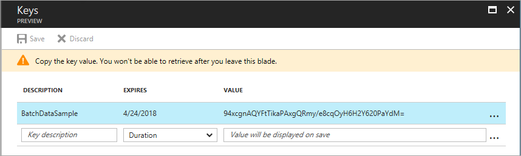
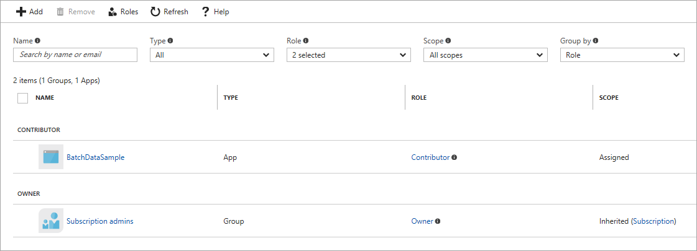

# Authenticate Batch service solutions with Active Directory

Azure Batch supports authentication with [Azure Active Directory][aad_about] (Azure AD) for the Batch service. Azure AD is Microsoft’s multi-tenant cloud based directory and identity management service. Azure itself uses Azure AD for the authentication of its customers, service administrators, and organizational users.

When using Azure AD authentication with Azure Batch, you can authenticate in one of two ways:

- By using **integrated authentication** to authenticate a user that is interacting with the application. An application using integrated authentication gathers a user's credentials and uses those credentials to acquire an authentication token for use with the Batch service.
- By using a **service principal** to authenticate an unattended application. A service principal defines the policy and permissions for an application in order to represent the application when accessing resources at run-time.

In this article, we explore using Azure AD to authenticate from applications that use the Batch .NET library using either integrated authentication or a service principal.

## Azure AD and pool allocation mode

When you create a new Batch account, you can specify whether pools will be allocated in the default Batch service subscription, or in a subscription that you choose. Your choice affects how you authenticate requests made to resources in that account.

- **Batch service subscription**. By default, Batch pools are allocated in a Batch service subscription. If you choose this option, you can authenticate requests to resources in that account either with [Shared Key](https://docs.microsoft.com/rest/api/batchservice/authenticate-requests-to-the-azure-batch-service) or with Azure AD.
- **User subscription.** You can choose to allocate Batch pools in a user subscription that you specify. If you choose this option, you must authenticate with Azure AD.

## Configure your application for Azure AD authentication

Whether you are authenticating with integrated authentication or with a service principal, you need to configure your application to connect to Azure AD. Follow these steps in the Azure portal to set up access to Azure AD:

1. Register your application in an Azure AD tenant.
2. Grant the Batch service API access to your application.

### Register your application with an Azure AD tenant

Whether you are authenticating with integrated authentication or with a service principal, you first need to register your application in an Azure AD tenant. Registering your application enables you to call the Azure [Active Directory Authentication Library][aad_adal] (ADAL) from your code. The ADAL provides an interface for authenticating with Azure AD and obtaining access tokens for securing API calls to Azure services, including the Batch service.

When you register your application, you supply Azure AD with information about your application, including a name for the application within the Azure AD tenant. Azure AD then provides an application ID that you use to associate your application with Azure AD at runtime. To learn more about the application ID, see [Application and service principal objects in Azure Active Directory](../active-directory/develop/active-directory-application-objects.md).

To register your Batch application, follow the steps in the [Adding an Application](../active-directory/develop/active-directory-integrating-applications.md#adding-an-application) section in [Integrating applications with Azure Active Directory][aad_integrate]. If you register your application as a Native Application, you can specify any valid URI for the **Redirect URI**. It does not need to be a real endpoint.

After you've registered your application, you'll see the application ID:


For additional information about registering an application with Azure AD, see [Basics of Registering an Application in Azure AD](../active-directory/develop/active-directory-authentication-scenarios#basics-of-registering-an-application-in-azure-ad).

### Grant the Batch service API access to your application

Whether you are authenticating with integrated authentication or with a service principal, you need to delegate access to your application to the Batch service API in the Azure AD tenant. Delegating access to the Batch service API enables your application to authenticate calls to the Batch service with Azure AD. 

Follow these steps in the Azure portal:

1. In the left-hand navigation pane of the Azure portal, choose **More Services**, click **App Registrations**.
2. Search for the name of your application in the list of app registrations:

    

3. Display the **Settings** blade. In the **API Access** section, select **Required permissions**.
4. In the **Required permissions** blade, click the **Add** button.
5. In step 1, search for **MicrosoftAzureBatch**, select **Microsoft Azure Batch (MicrosoftAzureBatch)**, and click the **Select** button.
6. In step 2, select the check box next to **Access Azure Batch Service** and click the **Select** button.
7. Click the **Done** button.

The **Required Permissions** blade now shows that your Azure AD application grants access to both the Azure AD and Azure Batch APIs. 


## Additional steps for using a service principal 

For an application that runs unattended, you'll need to authenticate with a service principal. Some additional steps are necessary for using a service principal, beyond those outlined in the previous sections. Follow these steps in the Azure portal to set up a service principal:

1. Request a secret key for your application
2. Assign a role to your application in Azure AD access control
3. Get the tenant ID

### Request a secret key for your application

When your application authenticates with a service principal, it sends both the application ID and a secret key to Azure AD. You'll need to create and copy the secret key to use from your code.

Follow these steps in the Azure portal:

1. In the left-hand navigation pane of the Azure portal, choose **More Services**, click **App Registrations**.
2. Search for the name of your application in the list of app registrations.
3. Display the **Settings** blade. In the **API Access** section, select **Keys**.
4. To create a new key, enter a description for the key. Then select a duration for the key of either one or two years. 
5. Click the **Save** button to create and display the key. Copy the key value to a safe place, as you won't be able to access it again after you leave the blade. 



### Assign a role to your application in Azure AD access control

To authenticate with a service principal, you need to assign a role to your application in your Azure AD tenant. Follow these steps:

1. In the Azure portal, select **Subscriptions** to view your subscriptions.
2. Select the subscription that includes the Batch account used for your unattended application.
3. In the **Settings** blade for that subscription, select **Access Control (IAM)**.
4. Click the **Add** button. 
5. From the **Role** drop-down, choose either the _Contributor_ or _Reader_ role for your application. For more information on these roles, see [Get started with Role-Based Access Control in the Azure portal](../active-directory/role-based-access-control-what-is.md).  
6. In the **Select** field, enter the name of your application. Select your application from the list, and click **Save**.

Your application should now appear in your access control settings with an RBAC role assigned. 



### Get the tenant ID for your Azure Active Directory

The tenant ID identifies the Azure AD tenant that provides authentication services to your application. To get the tenant ID, follow these steps:

1. In the Azure portal, select your Active Directory.
2. Click **Properties**.
3. Copy the GUID value provided for the directory ID. This value is also called the tenant ID.


## Endpoints for authentication with Azure AD

To authenticate your Batch Management solutions with Azure AD, you need to include some well-known endpoints in your code.

### Azure AD endpoint

If you are using integrated authentication, use the **Azure AD common endpoint**. The common endpoint provides a generic credential gathering interface when a specific tenant is not provided:

`https://login.microsoftonline.com/common`

If you are using a service principal, the Azure AD endpoint must include the tenant ID (directory ID). The tenant ID identifies the Azure AD tenant to use for authentication:

`https://login.microsoftonline.com/<tenant-id>`

### Batch resource endpoint

The **Azure Batch resource endpoint** is used to acquire a token for authenticating requests to the Batch service:

`https://batch.core.windows.net/`

## Code examples

The code examples in this section show how to authenticate with Azure AD using both integrated authentication and a service principal. These code examples use .NET, but the concepts are similar for other languages.

> [!NOTE]
>An Azure AD authentication token expires after one hour. When using a long-lived **BatchClient** object, we recommend that you retrieve a token from ADAL on every request to ensure you always have a valid token. 
>
>To achieve this in .NET, write a method that retrieves the token from Azure AD and pass that method to a **BatchTokenCredentials** object as a delegate. The delegate method is called on every request to the Batch service to ensure that a valid token is provided. By default ADAL caches tokens, so a new token is retrieved from Azure AD only when necessary. For an example, see [Code example: Using Azure AD with Batch .NET](#code-example-using-azure-ad-with-batch-net) in the next section. For more information about tokens in Azure AD, see [Authentication Scenarios for Azure AD][aad_auth_scenarios].
>
>

### Code example: Using Azure AD integrated authentication with Batch .NET

To authenticate with integrated authentication from Batch .NET, reference the [Azure Batch .NET](https://www.nuget.org/packages/Azure.Batch/) package and the [ADAL](https://www.nuget.org/packages/Microsoft.IdentityModel.Clients.ActiveDirectory/) package.

Include the following `using` statements in your code:

```csharp
using Microsoft.Azure.Batch;
using Microsoft.Azure.Batch.Auth;
using Microsoft.IdentityModel.Clients.ActiveDirectory;
```

Reference the Azure AD common endpoint and the Azure AD endpoint for the Batch service in your code:  

```csharp
private const string AuthorityUri = "https://login.microsoftonline.com/common";
private const string BatchResourceUri = "https://batch.core.windows.net/";
```

Reference your Batch account:

```csharp
private const string BatchAccountUrl = "https://myaccount.westcentralus.batch.azure.com";
```

Specify the application ID (client ID) for your application. The application ID is available from your app registration in the Azure portal; see the section titled [Grant the Batch service API access to your application](#grant-the-batch-service-api-access-to-your-application) to retrieve it. 

```csharp
private const string ClientId = "<application-id>";
```

Also specify a redirect URI, which can be any valid URI.

```csharp
private const string RedirectUri = "http://mybatchdatasample";
```

Write a callback method to acquire the authentication token from Azure AD. The **AcquireTokenAsync** method prompts the user for their credentials and uses those credentials to acquire a new token.

```csharp
public static async Task<string> GetAuthenticationTokenAsync()
{
    var authContext = new AuthenticationContext(AuthorityUri);

    // Acquire the authentication token from Azure AD.
    var authResult = await authContext.AcquireTokenAsync(BatchResourceUri, 
                                                        ClientId, 
                                                        new Uri(RedirectUri), 
                                                        new PlatformParameters(PromptBehavior.Auto));

    return authResult.AccessToken;
}
```

Construct a **BatchTokenCredentials** object that takes the delegate as a parameter. Use those credentials to open a **BatchClient** object. You can then use that **BatchClient** object for subsequent operations against the Batch service.

```csharp
public static async Task PerformBatchOperations()
{
    Func<Task<string>> tokenProvider = () => GetAuthenticationTokenAsync();

    using (var client = await BatchClient.OpenAsync(new BatchTokenCredentials(BatchAccountUrl, tokenProvider)))
    {
        await client.JobOperations.ListJobs().ToListAsync();
    }
}
```

The **GetAuthenticationTokenAsync** callback method shown above uses Azure AD for integrated authentication of a user who is interacting with the application. The call to the **AcquireTokenAsync** method prompts the user for their credentials, and the application proceeds once the user provides them.


### Code example: Using an Azure AD service principal with Batch .NET

To authenticate with a service principal from Batch .NET, reference the [Azure Batch .NET](https://www.nuget.org/packages/Azure.Batch/) package and the [ADAL](https://www.nuget.org/packages/Microsoft.IdentityModel.Clients.ActiveDirectory/) package.

Include the following `using` statements in your code:

```csharp
using Microsoft.Azure.Batch;
using Microsoft.Azure.Batch.Auth;
using Microsoft.IdentityModel.Clients.ActiveDirectory;
```

Reference the Batch service resource endpoint in your code:  

```csharp
private const string BatchResourceUri = "https://batch.core.windows.net/";
```

Reference your Batch account:

```csharp
private const string BatchAccountUrl = "https://myaccount.westcentralus.batch.azure.com";
```

Specify the application ID (client ID) for your application. The application ID is available from your app registration in the Azure portal; see the section [Grant the Batch service API access to your application](#grant-the-batch-service-api-access-to-your-application) to retrieve it:

```csharp
private const string ClientId = "<application-id>";
```

Specify the secret key that you copied from the Azure portal in [Request a secret key for your application](#request-a-secret-key-for-your-application):

```csharp
private const string ClientKey = "<secret-key>";
```

Specify the tenant ID for your Azure AD tenant. To retrieve the tenant ID, follow the steps outlined in [Get the tenant ID for your Azure Active Directory](#get-the-tenant-id-for-your-azure-active-directory):

```csharp
private const string TenantId = "<tenant-id>";
```

Write a callback method to acquire the authentication token from Azure AD. The **AcquireTokenAsync** method constructs the Azure AD endpoint for the tenant, using the base Azure AD URI and the tenant ID. That endpoint is then used to acquire the authentication token:

```csharp
public static async Task<string> GetAuthenticationTokenAsync()
{
    AuthenticationContext authContext = new AuthenticationContext(String.Format("https://login.microsoftonline.com/{0}", TenantId));
    AuthenticationResult authResult = await authContext.AcquireTokenAsync(BatchResourceUri, new ClientCredential(ClientId, ClientKey));

    return authResult.AccessToken;
}
```

Construct a **BatchTokenCredentials** object that takes the delegate as a parameter. Use those credentials to open a **BatchClient** object. You can then use that **BatchClient** object for subsequent operations against the Batch service:

```csharp
public static async Task PerformBatchOperations()
{
    Func<Task<string>> tokenProvider = () => GetAuthenticationTokenAsync();

    using (var client = await BatchClient.OpenAsync(new BatchTokenCredentials(BatchAccountUrl, tokenProvider)))
    {
        await client.JobOperations.ListJobs().ToListAsync();
    }
}
```

## Next steps

For more information on running the [AccountManagement sample application][acct_mgmt_sample], see [Manage Batch accounts and quotas with the Batch Management client library for .NET](batch-management-dotnet.md).

To learn more about Azure AD, see the [Azure Active Directory Documentation](https://docs.microsoft.com/azure/active-directory/). In-depth examples showing how to use ADAL are available in the [Azure Code Samples](https://azure.microsoft.com/resources/samples/?service=active-directory) library.

To learn more about service principals, see [Application and service principal objects in Azure Active Directory](../active-directory/develop/active-directory-application-objects.md). To create a service principal using the Azure portal, see [Use portal to create Active Directory application and service principal that can access resources](../resource-group-create-service-principal-portal.md). You can also create a service principal with PowerShell or Azure CLI. 


[aad_about]: ../active-directory/active-directory-whatis.md "What is Azure Active Directory?"
[aad_adal]: ../active-directory/active-directory-authentication-libraries.md
[aad_auth_scenarios]: ../active-directory/active-directory-authentication-scenarios.md "Authentication Scenarios for Azure AD"
[aad_integrate]: ../active-directory/active-directory-integrating-applications.md "Integrating Applications with Azure Active Directory"
[acct_mgmt_sample]: https://github.com/Azure/azure-batch-samples/tree/master/CSharp/AccountManagement
[azure_portal]: http://portal.azure.com
[resman_overview]: ../azure-resource-manager/resource-group-overview.md
