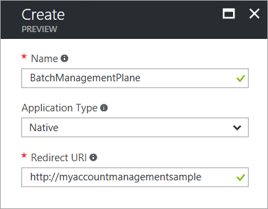
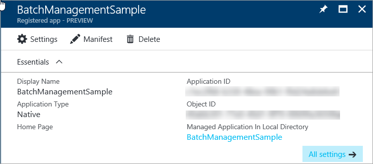
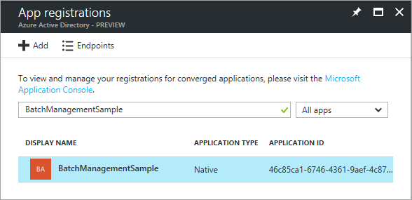
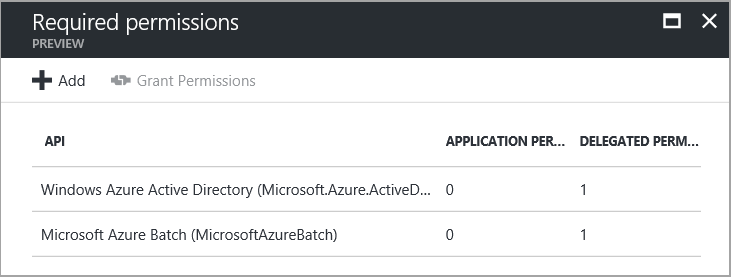

# Authenticate from Batch solutions with Active Directory

Azure Batch supports authentication with [Azure Active Directory][aad_about] (Azure AD) for the Batch service and the Batch management service. Azure AD is Microsoft’s multi-tenant cloud based directory and identity management service. Azure itself uses Azure AD for the authentication of its customers, service administrators, and organizational users.

In this article, we explore using Azure AD to authenticate from applications that use the Batch Management .NET library or the Batch .NET library. In the context of the Batch .NET APIs, we show how to use Azure AD to authenticate a subscription administrator or co-administrator, using integrated authentication. The authenticated user can then issue requests to Azure Batch.

It's also possible to use Azure AD to authenticate access to an application running unattended. Here we focus on using Azure AD integrated authentication, and refer you to other resources to learn about authenticating unattended applications.

## Use Azure AD with Batch management solutions

The Batch Management .NET library exposes types for working with Batch accounts, account keys, applications, and application packages. The Batch Management .NET library is an Azure resource provider client, and is used together with [Azure Resource Manager][resman_overview] to manage these resources programmatically. 

Azure AD is required to authenticate requests made through any Azure resource provider client, including the Batch Management .NET library, and through [Azure Resource Manager][resman_overview].

In this section, we use the [AccountManagment][acct_mgmt_sample] sample project, available on GitHub, to walk through using Azure AD with the Batch Management .NET library. The AccountManagement sample is a console application that accesses a subscription programmatically, creates a resource group and a new Batch account, and performs some operations on the account. 

To learn more about using the Batch Management .NET library and the AccountManagement sample, see [Manage Batch accounts and quotas with the Batch Management client library for .NET](batch-management-dotnet.md).

### Register your application with Azure AD

The Azure [Active Directory Authentication Library][aad_adal] (ADAL) provides a programmatic interface to Azure AD for use within your applications. To call ADAL from your application, you must register your application in an Azure AD tenant. When you register your application, you supply Azure AD with information about your application, including a name for it within the Azure AD tenant. Azure AD then provides an application ID that you use to associate your application with Azure AD at runtime. To learn more about the application ID, see [Application and service principal objects in Azure Active Directory](../active-directory/develop/active-directory-application-objects.md).

To register the AccountManagement sample application, follow the steps in the [Adding an Application](../active-directory/develop/active-directory-integrating-applications.md#adding-an-application) section in [Integrating applications with Azure Active Directory][aad_integrate]. Specify **Native Client Application** for the type of application. For the **Redirect URI**, you can specify any valid URI (such as `http://myaccountmanagementsample`), as it does not need to be a real endpoint:



Once you complete the registration process, you'll see the application ID and the object (service principal) ID listed for your application.  



### Update your code to reference your application ID 

Your client application uses the application ID (also referred to as the client ID) to access Azure AD at runtime. Once you've registered your application in the Azure portal, update your code to use the application ID provided by Azure AD for your registered application. In the AccountManagement sample application, copy your application ID from the Azure portal to the appropriate constant:

```csharp
// Specify the unique identifier (the "Client ID") for your application. This is required so that your
// native client application (i.e. this sample) can access the Microsoft Azure AD Graph API. For information
// about registering an application in Azure Active Directory, please see "Adding an Application" here:
// https://azure.microsoft.com/documentation/articles/active-directory-integrating-applications/
private const string ClientId = "<application-id>";
```
Also copy the redirect URI that you specified during the registration process.

```csharp
// The URI to which Azure AD will redirect in response to an OAuth 2.0 request. This value is
// specified by you when you register an application with AAD (see ClientId comment). It does not
// need to be a real endpoint, but must be a valid URI (e.g. https://accountmgmtsampleapp).
private const string RedirectUri = "http://myaccountmanagementsample";
```

### Grant the Azure Resource Manager API access to your application

Next, you'll need to delegate access to your application to the Azure Resource Manager API. The Azure AD identifier for the Resource Manager API is **Windows Azure Service Management API**.

Follow these steps in the Azure portal:

1. In the left-hand navigation pane of the Azure portal, choose **More Services**, click **App Registrations**, and click **Add**.
2. Search for the name of your application in the list of app registrations:

    

3. Display the **Settings** blade. In the **API Access** section, select **Required permissions**.
4. Click **Add** to add a new required permission. 
5. In step 1, enter **Windows Azure Service Management API**, select that API from the list of results, and click the **Select** button.
6. In step 2, select the check box next to **Access Azure classic deployment model as organization users**, and click the **Select** button.
7. Click the **Done** button.

The **Required Permissions** blade now shows that permissions to your application are granted to both the ADAL and Resource Manager APIs. Permissions are granted to ADAL by default when you first register your app with Azure AD.


### Acquire an Azure AD authentication token

The AccountManagement sample application defines constants that provide the endpoint for Azure AD and for Azure Resource Manager. The sample application uses these constants to query Azure AD for subscription information. Leave these constants unchanged:

```csharp
// Azure Active Directory "common" endpoint.
private const string AuthorityUri = "https://login.microsoftonline.com/common";
// Azure service management resource 
private const string ResourceUri = "https://management.core.windows.net/";
```

After you register the AccountManagement sample in the Azure AD tenant and provide the necessary values within the sample source code, the sample is ready to authenticate using Azure AD. When you run the sample, the ADAL attempts to acquire an authentication token. At this step, it prompts you for your Microsoft credentials: 

```csharp
// Obtain an access token using the "common" AAD resource. This allows the application
// to query AAD for information that lies outside the application's tenant (such as for
// querying subscription information in your Azure account).
AuthenticationContext authContext = new AuthenticationContext(AuthorityUri);
AuthenticationResult authResult = authContext.AcquireToken(ResourceUri,
                                                        ClientId,
                                                        new Uri(RedirectUri),
                                                        PromptBehavior.Auto);
```

After you provide your credentials, the sample application can proceed to issue authenticated requests to the Batch management service. 

## Use Azure AD with Batch service solutions

The Batch .NET library provides types for building parallel processing workflows with the Batch service. The Batch service supports both [Shared Key](https://docs.microsoft.com/rest/api/batchservice/authenticate-requests-to-the-azure-batch-service) authentication and authentication through Azure AD. In this section, we discuss authentication via Azure AD.

>[!NOTE]
>When you create a Batch account, you can specify whether pools are to be allocated in a subscription managed by Batch, or in a user subscription. If your account allocates pools in a user subscription, then you must use Azure AD to authenticate requests to resources in that account.
>
>

Authenticating Batch .NET applications via Azure AD is similar to authenticating Batch Management .NET applications. There are a few differences, described in this section.

### Batch service endpoints

The Batch service endpoints differ from those that you use with Batch Management .NET.

The Azure AD endpoint for the Batch service is:

`https://login.microsoftonline.com/common`

The resource endpoint for the Batch service is:

`https://batch.core.windows.net/`

### Grant the Batch service API access to your application

Before you can authenticate via Azure AD from your Batch application, you need to register your application with Azure AD and grant access to the Batch service API. The Azure AD identifier for the Batch service API is **Microsoft Azure Batch (MicrosoftAzureBatch)**.

1. To register your Batch application, follow the steps in the [Adding an Application](../active-directory/develop/active-directory-integrating-applications.md#adding-an-application) section in [Integrating applications with Azure Active Directory][aad_integrate]. For the **Redirect URI**, you can specify any valid URI. It does not need to be a real endpoint.

    After you've registered your application, you'll see the application ID and object ID:

    

2. Next, display the **Settings** blade. In the **API Access** section, select **Required permissions**.
3. In the **Required permissions** blade, click the **Add** button.
4. In step 1, search for **MicrosoftAzureBatch**, select **Microsoft Azure Batch (MicrosoftAzureBatch)**, and click the **Select** button.
5. In step 2, select the check box next to **Access Azure Batch Service** and click the **Select** button.
6. Click the **Done** button.

The **Required Permissions** blade now shows that your Azure AD application grants access to both the Azure AD and Azure Batch APIs. 



### Authentication for Batch accounts in a user subscription

When you create a new Batch account, you can choose the subscription in which pools are allocated. Your choice affects how you authenticate requests made to resources in that account

By default, Batch pools are allocated in a Batch service subscription. If you choose this option, you can authenticate requests to resources in that account with either Shared Key or with Azure AD.

You can also specify that Batch pools are allocated in a specified user subscription. If you choose this option, you must authenticate with Azure AD.

### Best practices for using Azure AD with Batch

An Azure AD authentication token expires after one hour. When using a long-lived **BatchClient** object, we recommend that you retrieve a token from ADAL on every request to ensure you always have a valid token. 

To achieve this in .NET, write a method that retrieves the token from Azure AD and pass that method to a **BatchTokenCredentials** object as a delegate. The delegate method is called on every request to the Batch service to ensure that a valid token is provided. By default ADAL caches tokens, so a new token is retrieved from Azure AD only when necessary. For an example, see [Code example: Using Azure AD with Batch .NET](#code-example-using-azure-ad-with-batch-net) in the next section. For more information about tokens in Azure AD, see [Authentication Scenarios for Azure AD][aad_auth_scenarios].

### Code example: Using Azure AD with Batch .NET

To write Batch .NET code that authenticates with Azure AD, reference the [Azure Batch .NET](https://www.nuget.org/packages/Azure.Batch/) package and the [ADAL](https://www.nuget.org/packages/Microsoft.IdentityModel.Clients.ActiveDirectory/) package.

Include the following `using` statements in your code:

```csharp
using Microsoft.Azure.Batch;
using Microsoft.Azure.Batch.Auth;
using Microsoft.IdentityModel.Clients.ActiveDirectory;
```

Reference the Azure AD common endpoint and the Azure AD endpoint for the Batch service in your code:  

```csharp
private const string AuthorityUri = "https://login.microsoftonline.com/common";
private const string BatchResourceUri = "https://batch.core.windows.net/";
```

Reference your Batch account endpoint:

```csharp
private const string BatchAccountEndpoint = "https://myaccount.westcentralus.batch.azure.com";
```

Specify the application ID (client ID) for your application. The application ID is available from your app registration in the Azure portal; see the section titled [Grant the Batch service API access to your application](#grant-the-batch-service-api-access-to-your-application) to retrieve it. 

```csharp
private const string ClientId = "<application-id>";
```

Also specify a redirect URI, which can be any valid URI.

```csharp
private const string RedirectUri = "http://mybatchdatasample";
```

Write a callback method to acquire the authentication token from Azure AD. The **AcquireTokenAsync** method prompts the user for their credentials and uses those credentials to acquire a new token.

```csharp
public static async Task<string> GetAuthenticationTokenAsync()
{
    var authContext = new AuthenticationContext(AuthorityUri);

    // Acquire the authentication token from Azure AD.
    var authResult = await authContext.AcquireTokenAsync(BatchResourceUri, 
                                                        ClientId, 
                                                        new Uri(RedirectUri), 
                                                        new PlatformParameters(PromptBehavior.Auto));

    return authResult.AccessToken;
}
```

Construct a **BatchTokenCredentials** object that takes the delegate as a parameter. Use those credentials to open a **BatchClient** object. You can then use that **BatchClient** object for subsequent operations against the Batch service.

```csharp
public static async Task PerformBatchOperations()
{
    Func<Task<string>> tokenProvider = () => GetAuthenticationTokenAsync();

    using (var client = await BatchClient.OpenAsync(new BatchTokenCredentials(BatchAccountEndpoint, tokenProvider)))
    {
        await client.JobOperations.ListJobs().ToListAsync();
    }
}
```

The **GetAuthenticationTokenAsync** callback method shown above uses Azure AD for integrated authentication of a user who is interacting with the application. The call to the **AcquireTokenAsync** method prompts the user for their credentials, and the application proceeds once the user provides them. You can also use Azure AD to authenticate an unattended application by using an Azure AD service principal. For more information, see [Application and service principal objects in Azure Active Directory](../active-directory/develop/active-directory-application-objects.md) and [Use portal to create Active Directory application and service principal that can access resources](../resource-group-create-service-principal-portal.md).  
 

## Next steps

For more information on running the [AccountManagement sample application][acct_mgmt_sample], see [Manage Batch accounts and quotas with the Batch Management client library for .NET](batch-management-dotnet.md).

To learn more about Azure AD, see the [Azure Active Directory Documentation](https://docs.microsoft.com/azure/active-directory/). In-depth examples showing how to use ADAL are available in the [Azure Code Samples](https://azure.microsoft.com/resources/samples/?service=active-directory) library.


[aad_about]: ../active-directory/active-directory-whatis.md "What is Azure Active Directory?"
[aad_adal]: ../active-directory/active-directory-authentication-libraries.md
[aad_auth_scenarios]: ../active-directory/active-directory-authentication-scenarios.md "Authentication Scenarios for Azure AD"
[aad_integrate]: ../active-directory/active-directory-integrating-applications.md "Integrating Applications with Azure Active Directory"
[acct_mgmt_sample]: https://github.com/Azure/azure-batch-samples/tree/master/CSharp/AccountManagement
[azure_portal]: http://portal.azure.com
[resman_overview]: ../azure-resource-manager/resource-group-overview.md
