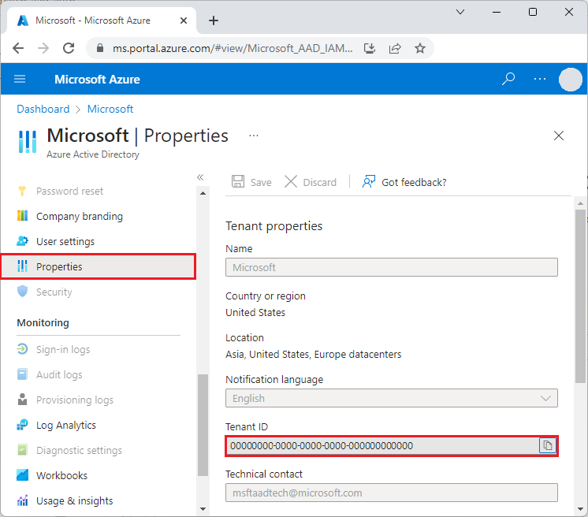
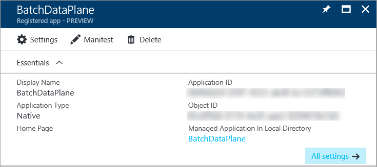

# Authenticate Azure Batch services with Microsoft Entra ID

Azure Batch supports authentication with [Microsoft Entra ID](/azure/active-directory/fundamentals/active-directory-whatis), Microsoft's multitenant cloud based directory and identity management service. Azure uses Microsoft Entra ID to authenticate its own customers, service administrators, and organizational users.

The recommended way to authenticate Azure Batch apps is to use the [Azure Identity client library](/dotnet/api/overview/azure/identity-readme), which provides token-based authentication classes (such as `DefaultAzureCredential`, `ManagedIdentityCredential`, `ClientSecretCredential`, and `InteractiveBrowserCredential`) that work consistently whether your app runs locally, on Azure, or on-premises. For an overview of recommended authentication strategies, see:

- [Authenticate .NET apps to Azure services using the Azure Identity library](/dotnet/azure/sdk/authentication/)
- [Authenticate Python apps to Azure services using the Azure Identity library](/azure/developer/python/sdk/authentication/overview)

This article describes two common scenarios for authenticating to Azure Batch with Microsoft Entra ID:

- **Integrated (interactive) authentication** authenticates a user who's interacting with an application. Use a credential such as `InteractiveBrowserCredential` or `DefaultAzureCredential` (which can chain through developer tool sign-ins like Azure CLI, Visual Studio, and Visual Studio Code).

- **Service principal or managed identity authentication** authenticates an unattended application. Use a credential such as `ManagedIdentityCredential` for apps hosted on Azure, or `ClientSecretCredential` / `ClientCertificateCredential` for apps that authenticate with a registered application's secret or certificate.

For more information about Microsoft Entra ID, see the [Microsoft Entra documentation](/azure/active-directory/index).

## Gather endpoints for authentication

To authenticate Batch applications with Microsoft Entra ID, you need to include the Microsoft Entra endpoint and Batch resource endpoint in your code.

<a name='azure-ad-endpoint'></a>

### Microsoft Entra endpoint

The base Microsoft Entra authority endpoint is `https://login.microsoftonline.com/`. To authenticate with Microsoft Entra ID, use this endpoint with the *tenant ID* that identifies the Microsoft Entra tenant to use for authentication:

`https://login.microsoftonline.com/<tenant-id>`

You can get your tenant ID from the main Microsoft Entra ID page in the Azure portal. You can also select **Properties** in the left navigation and see the **Tenant ID** on the **Properties** page.



>[!IMPORTANT]
>- The tenant-specific Microsoft Entra endpoint is required when you authenticate by using a service principal.
>
>- When you authenticate by using integrated authentication, the tenant-specific endpoint is recommended, but optional. You can also use the Microsoft Entra common endpoint to provide a generic credential gathering interface when a specific tenant isn't provided. The common endpoint is `https://login.microsoftonline.com/common`.
>
>For more information about Microsoft Entra endpoints, see [Authentication vs. authorization](/azure/active-directory/develop/authentication-vs-authorization).

### Batch resource endpoint

Use the Batch resource endpoint `https://batch.core.windows.net/` to acquire a token for authenticating requests to the Batch service.

## Register your application with a tenant

The first step in using Microsoft Entra authentication is to register your application in a Microsoft Entra tenant. After your application is registered, you can use the [Azure Identity library](/dotnet/api/overview/azure/identity-readme) credentials from your code to acquire Microsoft Entra tokens for the Batch service. Registering your application is required for confidential client (service principal) flows and for any interactive flow that needs a tenant-specific app registration.

> [!TIP]
> If your code uses `DefaultAzureCredential` and signs in through a developer tool (Azure CLI, Azure PowerShell, Visual Studio, or Visual Studio Code) or a managed identity, you don't need to register a separate application — the credential uses the identity already configured in that environment.

When you register your application, you supply information about your application to Microsoft Entra ID. Microsoft Entra ID then provides an *application ID*, also called a *client ID*, that you use to associate your application with Microsoft Entra ID at runtime. For more information about the application ID, see [Application and service principal objects in Microsoft Entra ID](/azure/active-directory/develop/app-objects-and-service-principals).

To register your Batch application, follow the steps at [Register an application](/azure/active-directory/develop/quickstart-register-app#register-an-application).

After you register your application, you can see the **Application (client) ID** on the application's **Overview** page.



## Configure integrated authentication

To authenticate with integrated authentication, you need to grant your application permission to connect to the Batch service API. This step enables your application to use Microsoft Entra ID to authenticate calls to the Batch service API.

After you register your application, follow these steps to grant the application access to the Batch service:

1. In the Azure portal, search for and select **app registrations**.
1. On the **App registrations** page, select your application.
1. On your application's page, select **API permissions** from the left navigation.
1. On the **API permissions** page, select **Add a permission**.
1. On the **Request API permissions** page, select **Azure Batch**.
1. On the **Azure Batch** page, under **Select permissions**, select the checkbox next to **user_impersonation**, and then select **Add permissions**.

The **API permissions** page now shows that your Microsoft Entra application has access to both **Microsoft Graph** and **Azure Batch**. Permissions are granted to Microsoft Graph automatically when you register an app with Microsoft Entra ID.

## Configure a service principal

To authenticate an application that runs unattended, you use a service principal. When your application authenticates by using a service principal, it sends both the application ID and a secret key to Microsoft Entra ID.

After you register your application, follow these steps in the Azure portal to configure a service principal:

1. Request a secret for your application.
1. Assign Azure role-based access control (Azure RBAC) to your application.

### Request a secret for your application

Follow these steps to create and copy the secret key to use in your code:

1. In the Azure portal, search for and select **app registrations**.
1. On the **App registrations** page, select your application.
1. On your application's page, select **Certificates & secrets** from the left navigation.
1. On the **Certificates & secrets** page, select **New client secret**.
1. On the **Add a client secret** page, enter a description and select an expiration period for the secret.
1. Select **Add** to create the secret and display it on the **Certificates & secrets** page.
1. Copy the secret **Value** to a safe place, because you won't be able to access it again after you leave this page. If you lose access to your key, you can generate a new one.

### Assign Azure RBAC to your application

Follow these steps to assign an Azure RBAC role to your application. For more information, see [Role-based access control for Azure Batch service](./batch-role-based-access-control.md).

1. In the Azure portal, navigate to the Batch account your application uses.
1. Select **Access control (IAM)** from the left navigation.
1. On the **Access control (IAM)** page, select **Add role assignment**.
1. On the **Add role assignment** page, select the **Role** tab, and then select one of [Azure Batch built-in RBAC roles](./batch-role-based-access-control.md#azure-batch-built-in-rbac-roles) the role for your app.
1. Select the **Members** tab, and select **Select members** under **Members**.
1. On the **Select members** screen, search for and select your application, and then select **Select**.
1. Select **Review + assign** on the **Add role assignment** page.

Your application should now appear on the **Role assignments** tab of the Batch account's **Access control (IAM)** page.

## Code examples

The code examples in this section show how to authenticate to Azure Batch with Microsoft Entra ID by using credentials from the Azure Identity library. The examples use .NET and Python, but the same patterns apply to other Azure SDK languages.

> [!NOTE]
> A Microsoft Entra authentication token expires after one hour. When you use a long-lived `BatchClient` object, the [Azure Identity](https://www.nuget.org/packages/Azure.Identity/) `TokenCredential` you supply transparently caches and refreshes the token, so a new token is acquired from Microsoft Entra ID only when necessary. For more information about tokens in Microsoft Entra ID, see [Security tokens](/azure/active-directory/develop/security-tokens).

> [!TIP]
> For most scenarios, use [`DefaultAzureCredential`](/dotnet/api/azure.identity.defaultazurecredential). It automatically tries multiple authentication methods (managed identity, environment variables, developer tool sign-ins, and so on), so the same code works whether your app runs locally during development, on Azure, or on-premises. See [Authenticate .NET apps](/dotnet/azure/sdk/authentication/) and [Authenticate Python apps](/azure/developer/python/sdk/authentication/overview) for guidance on choosing the right credential.

<a name='code-example-use-azure-ad-integrated-authentication-with-batch-net'></a>

### Code example: Authenticate to Azure Batch from .NET

This example uses [Azure.Compute.Batch](https://www.nuget.org/packages/Azure.Compute.Batch/) with the [Azure.Identity](https://www.nuget.org/packages/Azure.Identity/) library.

1. Install the `Azure.Compute.Batch` and `Azure.Identity` NuGet packages.

1. Declare the following `using` statements in your code:

   ```csharp
   using Azure.Compute.Batch;
   using Azure.Core;
   using Azure.Identity;
   ```

1. Reference your Batch account endpoint:

   ```csharp
   private const string BatchAccountUrl = "https://<myaccount>.<mylocation>.batch.azure.com";
   ```

1. Create a credential and pass it to the `BatchClient` constructor. Use the client for subsequent operations against the Batch service.

   **Recommended: `DefaultAzureCredential`** — works locally with developer tool sign-ins (Azure CLI, Visual Studio, Visual Studio Code) and uses managed identity automatically when the app runs on Azure:

   ```csharp
   TokenCredential credential = new DefaultAzureCredential();

   BatchClient client = new BatchClient(new Uri(BatchAccountUrl), credential);

   await foreach (BatchJob job in client.GetJobsAsync())
   {
       Console.WriteLine(job.Id);
   }
   ```

   **Interactive (integrated) sign-in** — prompts a user to sign in via the system browser. Use this when your app must authenticate a specific user interactively:

   ```csharp
   TokenCredential credential = new InteractiveBrowserCredential(
       new InteractiveBrowserCredentialOptions
       {
           TenantId = "<tenant-id>",
           ClientId = "<application-id>",      // optional; required only if you registered your own app
           RedirectUri = new Uri("http://localhost")
       });

   BatchClient client = new BatchClient(new Uri(BatchAccountUrl), credential);
   ```

   **Service principal (client secret)** — use for unattended apps that authenticate with an app registration secret:

   ```csharp
   TokenCredential credential = new ClientSecretCredential(
       tenantId: "<tenant-id>",
       clientId: "<application-id>",
       clientSecret: "<client-secret>");

   BatchClient client = new BatchClient(new Uri(BatchAccountUrl), credential);
   ```

   **Managed identity** — use when your app runs on an Azure resource (such as a VM, App Service, or Container App) that has a system-assigned or user-assigned managed identity:

   ```csharp
   // System-assigned managed identity
   TokenCredential credential = new ManagedIdentityCredential();

   // Or, user-assigned managed identity
   // TokenCredential credential = new ManagedIdentityCredential(clientId: "<user-assigned-client-id>");

   BatchClient client = new BatchClient(new Uri(BatchAccountUrl), credential);
   ```

<a name='code-example-use-an-azure-ad-service-principal-with-batch-net'></a>

<a name='code-example-use-an-azure-ad-service-principal-with-batch-python'></a>

### Code example: Authenticate to Azure Batch from Python

This example uses the [azure-batch](https://pypi.org/project/azure-batch/) client with credentials from the [azure-identity](https://pypi.org/project/azure-identity/) library. The legacy `azure.common.credentials.ServicePrincipalCredentials` class is deprecated; use `azure-identity` credentials instead.

1. Install the required packages:

   ```bash
   pip install azure-batch azure-identity
   ```

1. Reference your Batch account endpoint and the Batch resource scope:

   ```python
   BATCH_ACCOUNT_URL = "https://<myaccount>.<mylocation>.batch.azure.com"
   BATCH_SCOPE = "https://batch.core.windows.net/.default"
   ```

1. Create a credential and pass it to the `BatchServiceClient`.

   **Recommended: `DefaultAzureCredential`** — works locally with developer tool sign-ins and uses managed identity automatically when running on Azure:

   ```python
   from azure.batch import BatchServiceClient
   from azure.identity import DefaultAzureCredential

   credential = DefaultAzureCredential()

   batch_client = BatchServiceClient(
       credentials=credential,
       batch_url=BATCH_ACCOUNT_URL,
   )
   ```

   **Interactive (integrated) sign-in** — prompts a user to sign in via the system browser:

   ```python
   from azure.batch import BatchServiceClient
   from azure.identity import InteractiveBrowserCredential

   credential = InteractiveBrowserCredential(
       tenant_id="<tenant-id>",
       client_id="<application-id>",  # optional; required only if you registered your own app
   )

   batch_client = BatchServiceClient(
       credentials=credential,
       batch_url=BATCH_ACCOUNT_URL,
   )
   ```

   **Service principal (client secret)** — use for unattended apps:

   ```python
   from azure.batch import BatchServiceClient
   from azure.identity import ClientSecretCredential

   credential = ClientSecretCredential(
       tenant_id="<tenant-id>",
       client_id="<application-id>",
       client_secret="<client-secret>",
   )

   batch_client = BatchServiceClient(
       credentials=credential,
       batch_url=BATCH_ACCOUNT_URL,
   )
   ```

   **Managed identity** — use when your app runs on an Azure resource with a managed identity:

   ```python
   from azure.batch import BatchServiceClient
   from azure.identity import ManagedIdentityCredential

   # System-assigned managed identity
   credential = ManagedIdentityCredential()

   # Or, user-assigned managed identity
   # credential = ManagedIdentityCredential(client_id="<user-assigned-client-id>")

   batch_client = BatchServiceClient(
       credentials=credential,
       batch_url=BATCH_ACCOUNT_URL,
   )
   ```

## Next steps

- [Authenticate Batch Management solutions with Active Directory](batch-aad-auth-management.md)
- [Authenticate .NET apps to Azure services using the Azure Identity library](/dotnet/azure/sdk/authentication/)
- [Authenticate Python apps to Azure services using the Azure Identity library](/azure/developer/python/sdk/authentication/overview)
- [Azure Identity client library for .NET](/dotnet/api/overview/azure/identity-readme)
- [Azure Identity client library for Python](/python/api/overview/azure/identity-readme)
- [Application and service principal objects in Microsoft Entra ID](/azure/active-directory/develop/app-objects-and-service-principals)
- [How to create a Microsoft Entra application and service principal that can access resources](/azure/active-directory/develop/howto-create-service-principal-portal)
