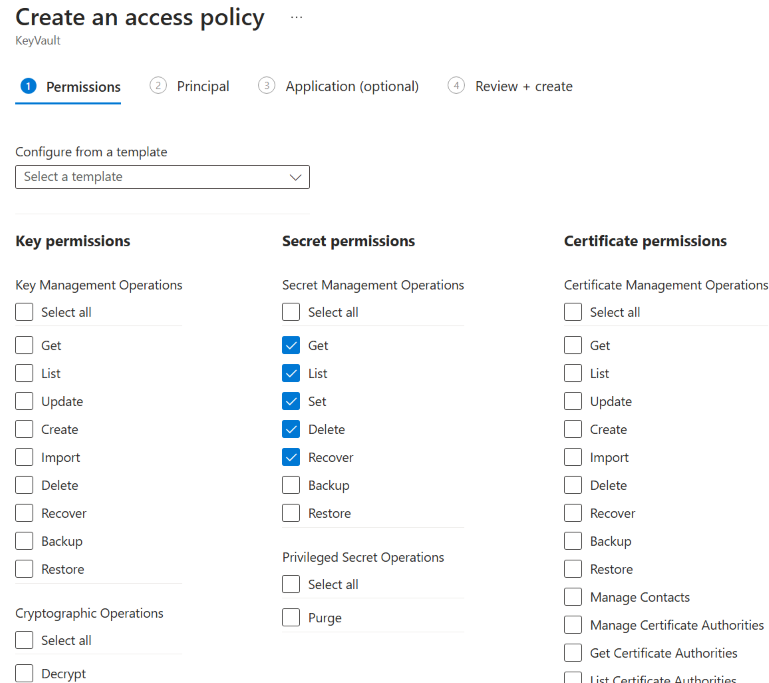

# Create a Batch account with the Azure portal

This topic shows how to create an Azure Batch account in the [Azure portal](https://portal.azure.com), choosing the account properties that fit your compute scenario. You'll also learn where to find important account properties like access keys and account URLs.

For background about Batch accounts and scenarios, see [Batch service workflow and resources](batch-service-workflow-features.md).

## Create a Batch account

[!INCLUDE [batch-account-mode-include](../../includes/batch-account-mode-include.md)]

1. Sign in to the [Azure portal](https://portal.azure.com).

1. Select **Create a resource**, then select **Compute** and **Batch Service**.

1. Enter **New Batch account** settings. See the following details.

    ![Create a Batch account][account_portal]

    a. **Subscription**: The subscription in which to create the Batch account. If you have only one subscription, it is selected by default.

    b. **Resource group**: Select an existing resource group for your new Batch account, or optionally create a new one.

    c. **Account name**: The name you choose must be unique within the Azure region where the account is created (see **Location** below). The account name can contain only lowercase characters or numbers, and must be 3-24 characters in length.

    d. **Location**: The Azure region in which to create the Batch account. Only the regions supported by your subscription and resource group are displayed as options.

    e. **Storage account**: An optional Azure Storage account that you associate with your Batch account. A general-purpose v2 storage account is recommended for the best performance. For all storage account options in Batch, see the [Batch feature overview](accounts.md#azure-storage-accounts). In the portal, select an existing storage account, or create a new one.

      ![Create a storage account][storage_account]

    f. **Pool allocation mode**: In the **Advanced** settings tab you can specify pool allocation mode as **Batch service** or **User subscription**. For most scenarios, accept the default **Batch service**.

      ![Batch pool allocation mode][pool_allocation]

1. Select **Create** to create the account.

## View Batch account properties

Once the account has been created, select the account to access its settings and properties. You can access all account settings and properties by using the left menu.

> [!NOTE]
> The name of the Batch account is its ID and can't be changed. If you need to change the name of a Batch account, you'll need to delete the account and create a new one with the intended name.

![Batch account page in Azure portal][account_blade]

* **Batch account name, URL, and keys**: When you develop an application with the [Batch APIs](batch-apis-tools.md#azure-accounts-for-batch-development), you need an account URL and key to access your Batch resources. (Batch also supports Azure Active Directory authentication.)

    To view the Batch account access information, select **Keys**.

    ![Batch account keys in Azure portal][account_keys]

* To view the name and keys of the storage account associated with your Batch account, select **Storage account**.

* To view the resource quotas that apply to the Batch account, select  **Quotas**. For details, see [Batch service quotas and limits](batch-quota-limit.md).

## Additional configuration for user subscription mode

If you choose to create a Batch account in user subscription mode, perform the following additional steps before creating the account.

### Allow Azure Batch to access the subscription (one-time operation)

When creating your first Batch account in user subscription mode, you need to register your subscription with Batch. (If you already did this, skip to the next section.)

1. Sign in to the [Azure portal](https://portal.azure.com).

1. Select **All services** > **Subscriptions**, and select the subscription you want to use for the Batch account.

1. In the **Subscription** page, select **Resource providers**, and search for **Microsoft.Batch**. Check that the **Microsoft.Batch** resource provider is registered in the subscription. If it isn't registered, select the **Register** link.

    ![Register Microsoft.Batch provider][register_provider]

1. In the **Subscription** page, select **Access control (IAM)** > **Role assignments** > **Add role assignment**.

    ![Subscription access control][subscription_access]

1. On the **Add role assignment** page, select the **Contributor** or **Owner** role, then search for the Batch API. Search for each of these strings until you find the API:
    1. **MicrosoftAzureBatch**.
    1. **Microsoft Azure Batch**. Newer Azure AD tenants may use this name.
    1. **ddbf3205-c6bd-46ae-8127-60eb93363864** is the ID for the Batch API.

1. Once you find the Batch API, select it and select **Save**.

    ![Add Batch permissions][add_permission]

### Create a Key Vault

In user subscription mode, an [Azure Key Vault](../key-vault/general/overview.md) is required. The Key Vault must be in the same subscription and region as the Batch account to be created. 

1. In the [Azure portal](https://portal.azure.com), select **New** > **Security** > **Key Vault**.

1. In the **Create Key Vault** page, enter a name for the Key Vault, and create a resource group in the region you want for your Batch account. Leave the remaining settings at default values, then select **Create**.

When creating the Batch account in user subscription mode, specify **User subscription** as the pool allocation mode, select the Key Vault, and check the box to grant Azure Batch access to the Key Vault.

If you prefer to grant access to the Key Vault manually, go to the **Access policies** section of the Key Vault, select **Add Access Policy** and search for **Microsoft Azure Batch**. Once selected, you will need to configure the **Secret permissions** using the drop-down menu. Azure Batch must be given a minimum of **Get**, **List**, **Set**, and **Delete** permissions.

> [!NOTE]
> Ensure that the **Azure Virtual Machines for deployment** and **Azure Resource Manager for template deployment** check boxes are selected under **Access policies** for the linked **Key Vault** resource.
>
> 

### Configure subscription quotas

For user subscription Batch accounts, core quotas must be set manually. Standard Batch core quotas do not apply to accounts in user subscription mode.

1. In the [Azure portal](https://portal.azure.com), select your user subscription mode Batch account to display its settings and properties.
1. From the left menu, select **Quotas** to view and configure the core quotas associated with your Batch account.

For more information about user subscription mode core quotas, see [Batch service quotas and limits](batch-quota-limit.md).

## Other Batch account management options

In addition to using the Azure portal, you can create and manage Batch accounts with tools including the following:

* [Batch PowerShell cmdlets](batch-powershell-cmdlets-get-started.md)
* [Azure CLI](batch-cli-get-started.md)
* [Batch Management .NET](batch-management-dotnet.md)

## Next steps

* Learn about the [Batch service workflow and primary resources](batch-service-workflow-features.md) such as pools, nodes, jobs, and tasks.
* Learn the basics of developing a Batch-enabled application using the [Batch .NET client library](quick-run-dotnet.md) or [Python](quick-run-python.md). These quickstarts guide you through a sample application that uses the Batch service to execute a workload on multiple compute nodes, and includes using Azure Storage for workload file staging and retrieval.

[account_blade]: ./media/batch-account-create-portal/batch_blade.png
[account_portal]: ./media/batch-account-create-portal/batch-account-portal.png
[pool_allocation]: ./media/batch-account-create-portal/batch-pool-allocation.png
[account_keys]: ./media/batch-account-create-portal/batch-account-keys.png
[storage_account]: ./media/batch-account-create-portal/storage_account.png
[subscription_access]: ./media/batch-account-create-portal/subscription_iam.png
[add_permission]: ./media/batch-account-create-portal/add_permission.png
[register_provider]: ./media/batch-account-create-portal/register_provider.png
