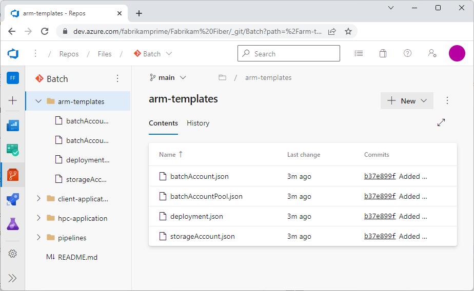
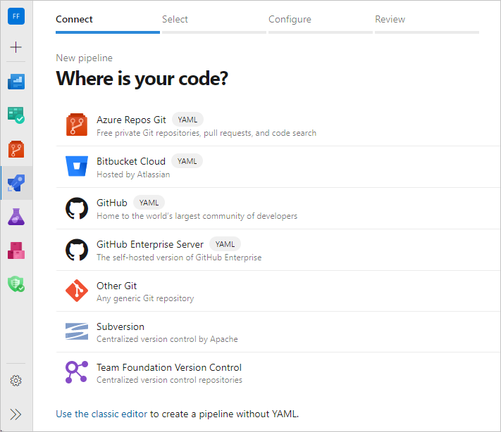
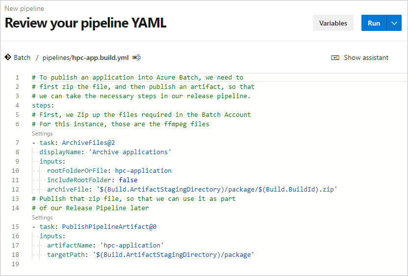
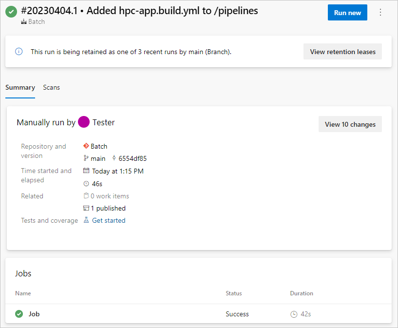
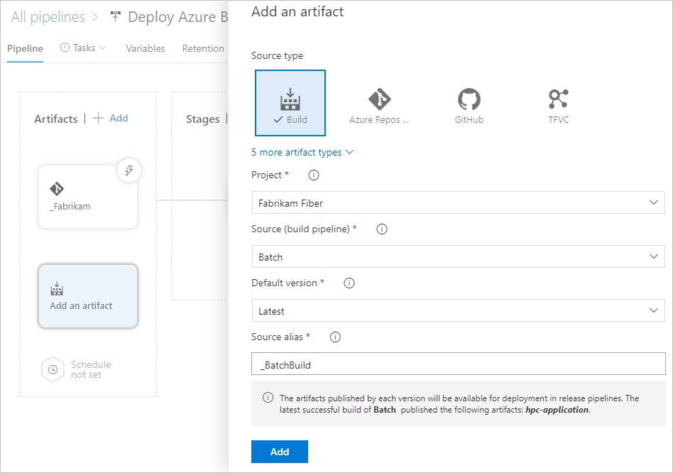
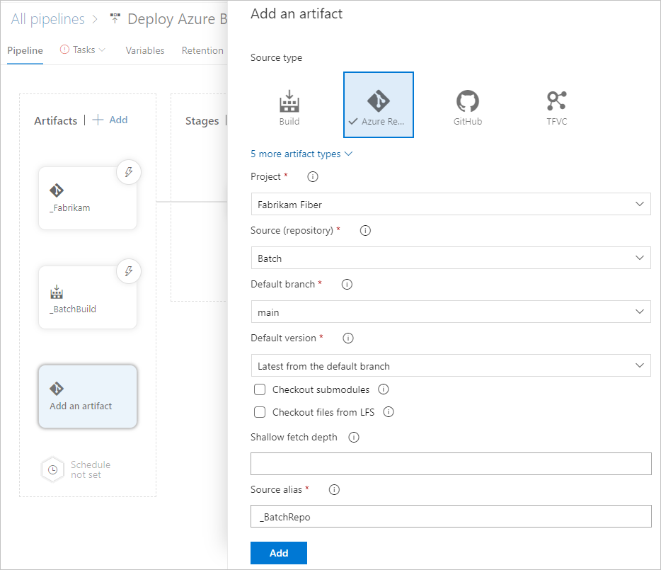
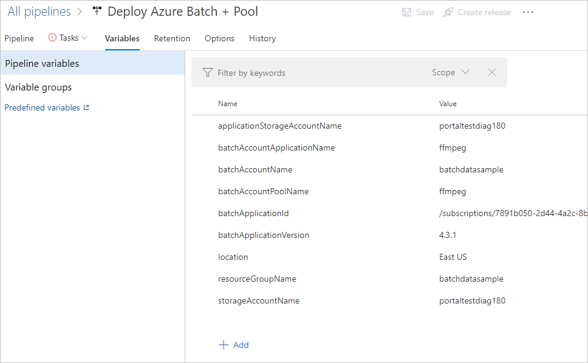
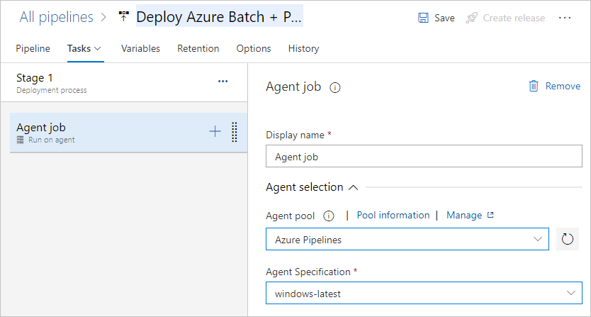
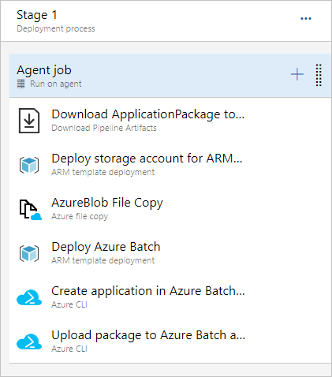
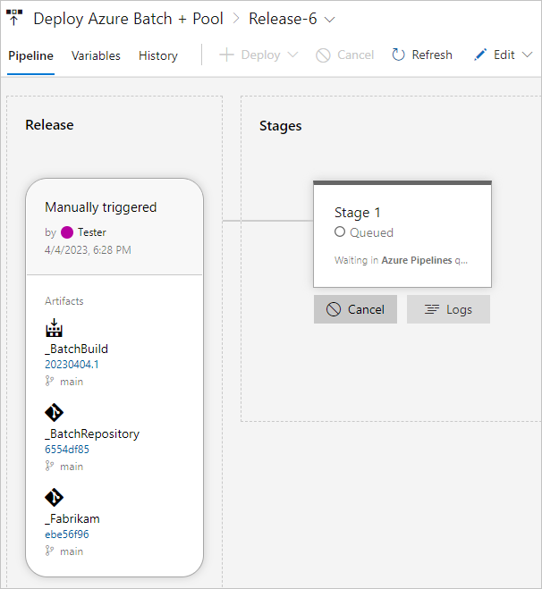

# Use Azure Pipelines to build and deploy an HPC solution

Azure DevOps tools can automate building and testing Azure Batch high performance computing (HPC) solutions. [Azure Pipelines](/azure/devops/pipelines/get-started/what-is-azure-pipelines) provides modern continuous integration (CI) and continuous deployment (CD) processes for building, deploying, testing, and monitoring software. These processes accelerate your software delivery, allowing you to focus on your code rather than support infrastructure and operations.

This article shows how to set up CI/CD processes by using [Azure Pipelines](/azure/devops/pipelines/get-started/what-is-azure-pipelines) with Azure Resource Manager templates (ARM templates) to deploy HPC solutions on Azure Batch. The example creates a build and release pipeline to deploy an Azure Batch infrastructure and release an application package. The following diagram shows the general deployment flow, assuming the code is developed locally:


## Prerequisites

To follow the steps in this article, you need:

- An [Azure DevOps organization](/azure/devops/organizations/accounts/create-organization), and an [Azure DevOps project](/azure/devops/organizations/projects/create-project) with an [Azure Repos](/azure/devops/repos/git/create-new-repo) repository created in the organization. You must have **Project Administrator**, **Build Administrator**, and **Release Administrator** roles in the Azure DevOps project.

- An active Azure subscription with **Owner** or other role that includes role assignment abilities. For more information, see [Understand Azure role assignments](/azure/role-based-access-control/role-assignments).

- A basic understanding of [source control](/azure/devops/user-guide/source-control) and [ARM template syntax](/azure/azure-resource-manager/templates/syntax).

## Prepare the solution

The example in this article uses several ARM templates and an existing open-source video processing application, [FFmpeg](https://ffmpeg.org). You can copy or download these resources and push them to your Azure Repos repository.

>[!IMPORTANT]
>This example deploys Windows software on Windows-based Batch nodes. Azure Pipelines, ARM templates, and Batch also fully support Linux software and nodes.

### Understand the ARM templates

Three capability templates, similar to units or modules, implement specific pieces of functionality. An end-to-end solution template then deploys the underlying capability templates. This [linked template structure](/azure/azure-resource-manager/templates/deployment-tutorial-linked-template) allows each capability template to be individually tested and reused across solutions.


For detailed information about the templates, see the [Resource Manager template reference guide for Microsoft.Batch resource types](/azure/templates/microsoft.batch/allversions).

#### Storage account template

Save the following code as a file named *storageAccount.json*. This template defines an Azure Storage account, which is required to deploy the application to the Batch account.

```json
{
    "$schema": "https://schema.management.azure.com/schemas/2015-01-01/deploymentTemplate.json#",
    "contentVersion": "1.0.0.0",
    "parameters": {
        "accountName": {
            "type": "string",
            "metadata": {
                 "description": "Name of the Azure Storage Account"
             }
         }
    },
    "variables": {},
    "resources": [
        {
            "type": "Microsoft.Storage/storageAccounts",
            "name": "[parameters('accountName')]",
            "sku": {
                "name": "Standard_LRS"
            },
            "apiVersion": "2018-02-01",
            "location": "[resourceGroup().location]",
            "properties": {}
        }
    ],
    "outputs": {
        "blobEndpoint": {
          "type": "string",
          "value": "[reference(resourceId('Microsoft.Storage/storageAccounts', parameters('accountName'))).primaryEndpoints.blob]"
        },
        "resourceId": {
          "type": "string",
          "value": "[resourceId('Microsoft.Storage/storageAccounts', parameters('accountName'))]"
        }
    }
}
```

#### Batch account template

Save the following code as a file named *batchAccount.json*. This template defines a [Batch account](accounts.md). The Batch account acts as a platform to run applications across node [pools](nodes-and-pools.md#pools).

```json
{
    "$schema": "https://schema.management.azure.com/schemas/2015-01-01/deploymentTemplate.json#",
    "contentVersion": "1.0.0.0",
    "parameters": {
        "batchAccountName": {
           "type": "string",
           "metadata": {
                "description": "Name of the Azure Batch Account"
            }
        },
        "storageAccountId": {
           "type": "string",
           "metadata": {
                "description": "ID of the Azure Storage Account"
            }
        }
    },
    "variables": {},
    "resources": [
        {
            "name": "[parameters('batchAccountName')]",
            "type": "Microsoft.Batch/batchAccounts",
            "apiVersion": "2017-09-01",
            "location": "[resourceGroup().location]",
            "properties": {
              "poolAllocationMode": "BatchService",
              "autoStorage": {
                  "storageAccountId": "[parameters('storageAccountId')]"
              }
            }
          }
    ],
    "outputs": {}
}
```

#### Batch pool template

Save the following code as a file named *batchAccountPool.json*. This template creates a node pool and nodes in the Batch account.

```json
{
    "$schema": "https://schema.management.azure.com/schemas/2015-01-01/deploymentTemplate.json#",
    "contentVersion": "1.0.0.0",
    "parameters": {
        "batchAccountName": {
           "type": "string",
           "metadata": {
                "description": "Name of the Azure Batch Account"
           }
        },
        "batchAccountPoolName": {
            "type": "string",
            "metadata": {
                 "description": "Name of the Azure Batch Account Pool"
             }
         }
    },
    "variables": {},
    "resources": [
        {
            "name": "[concat(parameters('batchAccountName'),'/', parameters('batchAccountPoolName'))]",
            "type": "Microsoft.Batch/batchAccounts/pools",
            "apiVersion": "2017-09-01",
            "properties": {
                "deploymentConfiguration": {
                    "virtualMachineConfiguration": {
                        "imageReference": {
                            "publisher": "MicrosoftWindowsServer",
                            "offer": "WindowsServer",
                            "sku": "2022-datacenter",
                            "version": "latest"
                        },
                        "nodeAgentSkuId": "batch.node.windows amd64"
                    }
                },
                "vmSize": "Standard_D2s_v3"
            }
          }
    ],
    "outputs": {}
}
```

#### Orchestrator template

Save the following code as a file named *deployment.json*. This final template acts as an orchestrator to deploy the three underlying capability templates.

```json
{
    "$schema": "https://schema.management.azure.com/schemas/2015-01-01/deploymentTemplate.json#",
    "contentVersion": "1.0.0.0",
    "parameters": {
        "StorageContainerUri": {
           "type": "string",
           "metadata": {
                "description": "URI of the Blob Storage Container containing the Azure Resource Manager templates"
            }
        },
        "StorageContainerSasToken": {
           "type": "string",
           "metadata": {
                "description": "The SAS token of the container containing the Azure Resource Manager templates"
            }
        },
        "applicationStorageAccountName": {
            "type": "string",
            "metadata": {
                 "description": "Name of the Azure Storage Account"
            }
         },
        "batchAccountName": {
            "type": "string",
            "metadata": {
                 "description": "Name of the Azure Batch Account"
            }
         },
         "batchAccountPoolName": {
             "type": "string",
             "metadata": {
                  "description": "Name of the Azure Batch Account Pool"
              }
          }
    },
    "variables": {},
    "resources": [
        {
            "apiVersion": "2017-05-10",
            "name": "storageAccountDeployment",
            "type": "Microsoft.Resources/deployments",
            "properties": {
                "mode": "Incremental",
                "templateLink": {
                  "uri": "[concat(parameters('StorageContainerUri'), 'arm-templates/storageAccount.json', parameters('StorageContainerSasToken'))]",
                  "contentVersion": "1.0.0.0"
                },
                "parameters": {
                    "accountName": {"value": "[parameters('applicationStorageAccountName')]"}
                }
            }
        },  
        {
            "apiVersion": "2017-05-10",
            "name": "batchAccountDeployment",
            "type": "Microsoft.Resources/deployments",
            "dependsOn": [
                "storageAccountDeployment"
            ],
            "properties": {
                "mode": "Incremental",
                "templateLink": {
                  "uri": "[concat(parameters('StorageContainerUri'), 'arm-templates/batchAccount.json', parameters('StorageContainerSasToken'))]",
                  "contentVersion": "1.0.0.0"
                },
                "parameters": {
                    "batchAccountName": {"value": "[parameters('batchAccountName')]"},
                    "storageAccountId": {"value": "[reference('storageAccountDeployment').outputs.resourceId.value]"}
                }
            }
        },
        {
            "apiVersion": "2017-05-10",
            "name": "poolDeployment",
            "type": "Microsoft.Resources/deployments",
            "dependsOn": [
                "batchAccountDeployment"
            ],
            "properties": {
                "mode": "Incremental",
                "templateLink": {
                  "uri": "[concat(parameters('StorageContainerUri'), 'arm-templates/batchAccountPool.json', parameters('StorageContainerSasToken'))]",
                  "contentVersion": "1.0.0.0"
                },
                "parameters": {
                    "batchAccountName": {"value": "[parameters('batchAccountName')]"},
                    "batchAccountPoolName": {"value": "[parameters('batchAccountPoolName')]"}
                }
            }
        }
    ],
    "outputs": {}
}
```

### Set up your repository

Upload the ARM templates, FFmpeg app, and a YAML build definition file into your Azure Repos repository.

1. Upload the four ARM templates to an *arm-templates* folder in your repository.

1. For the application package, download and extract the [Windows 64-bit version of FFmpeg 4.3.1](https://github.com/GyanD/codexffmpeg/releases/tag/4.3.1-2020-11-08), and upload it to a *hpc-application* folder in your repository.

1. For the build definition, save the following definition as a file named *hpc-app.build.yml*, and upload it to a *pipelines* folder in your repository.

   ```yml
   # To publish an application into Batch, you need to
   # first zip the file, and then publish an artifact, so
   # you can take the necessary steps in your release pipeline.
   steps:
   # First, zip up the files required in the Batch account.
   # For this instance, those are the ffmpeg files.
   - task: ArchiveFiles@2
     displayName: 'Archive applications'
     inputs:
       rootFolderOrFile: hpc-application
       includeRootFolder: false
       archiveFile: '$(Build.ArtifactStagingDirectory)/package/$(Build.BuildId).zip'
   # Publish the zip file, so you can use it as part
   # of your Release pipeline later.
   - task: PublishPipelineArtifact@0
     inputs:
       artifactName: 'hpc-application'
       targetPath: '$(Build.ArtifactStagingDirectory)/package'
   ```

When you're finished setting up your repository, the folder structure should have the following main sections:

   - An *arm-templates* folder that contains the ARM templates.
   - A *hpc-application* folder that contains ffmpeg.
   - A *pipelines* folder that contains the YAML build definition file for the Build pipeline.

   

   > [!NOTE]
   > This example codebase structure demonstrates that you can store application, infrastructure, and pipeline code in the same repository.

## Create the Azure pipeline

After you set up the source code repository, use [Azure Pipelines](/azure/devops/pipelines/get-started/) to implement a build, test, and deployment pipeline for your application. In this stage of a pipeline, you typically run tests to validate code and build pieces of the software. The number and types of tests, and any other tasks that you run, depend on your overall build and release strategy.

### Create the Build pipeline

In this section, you create a [YAML build pipeline](/azure/devops/pipelines/get-started-yaml) to work with the ffmpeg software that runs in the Batch account.

1. In your Azure DevOps project, select **Pipelines** from the left navigation, and then select **New pipeline**.

1. On the **Where is your code** screen, select **Azure Repos Git**.

   

1. On the **Select a repository** screen, select your repository.

   >[!NOTE]
   >You can also create a build pipeline by using a visual designer. On the **New pipeline** page, select **Use the classic editor**. You can use a YAML template in the visual designer. For more information, see [Define your Classic pipeline](/azure/devops/pipelines/release/define-multistage-release-process).

1. On the **Configure your pipeline** screen, select **Existing Azure Pipelines YAML file**.

1. On the **Select an existing YAML file** screen, select the *hpc-app.build.yml* file from your repository, and then select **Continue**.

1. On the **Review your pipeline YAML** screen, review the build configuration, and then select **Run**, or select the dropdown caret next to **Run** and select **Save**. This template enables continuous integration, so the build automatically triggers when a new commit to the repository meets the conditions set in the build.

   

1. You can view live build progress updates. To see build outcomes, select the appropriate run from your build definition in Azure Pipelines.

   

> [!NOTE]
> If you use a client application to run your HPC solution, you need to create a separate build definition for that application. For how-to guides, see the [Azure Pipelines](/azure/devops/pipelines/get-started/index) documentation.

### Create the Release pipeline

You use an Azure Pipelines [Release pipeline](/azure/devops/pipelines/release/releases) to deploy your application and underlying infrastructure. Release pipelines enable CD and automate your release process. There are several steps to deploy your application and underlying infrastructure.

The [linked templates](/azure/azure-resource-manager/templates/linked-templates) for this solution must be accessible from a public HTTP or HTTPS endpoint. This endpoint could be a GitHub repository, an Azure Blob Storage account, or another storage location. To ensure that the uploaded template artifacts remain secure, hold them in a private mode, but access them by using some form of shared access signature (SAS) token.

The following example demonstrates how to deploy an infrastructure and application by using templates from an Azure Storage blob.

#### Set up the pipeline

1. In your Azure DevOps project, select **Pipelines** > **Releases** in the left navigation.

1. On the next screen, select **New** > **New release pipeline**.

1. On the **Select a template** screen, select **Empty job**, and then close the **Stage** screen.

1. Select **New release pipeline** at the top of the page and rename the pipeline to something relevant for your pipeline, such as *Deploy Azure Batch + Pool*.

   

1. In the **Artifacts** section, select **Add**.

1. On the **Add an artifact** screen, select **Build** and then select your Build pipeline to get the output for the HPC application.

   > [!NOTE]
   > You can create a **Source alias** or accept the default. Take note of the **Source alias** value, as you need it to create tasks in the release definition.

   

1. Select **Add**.

1. On the pipeline page, select **Add** next to **Artifacts** to create a link to another artifact, your Azure Repos repository. This link is required to access the ARM templates in your repository. ARM templates don't need compilation, so you don't need to push them through a build pipeline.

   > [!NOTE]
   > Again note the **Source alias** value to use later.

    

1. Select the **Variables** tab. Create the following variables in your pipeline so you don't have to reenter the same information into multiple tasks.

   |Name|Value|
   |----|-----|
   |**applicationStorageAccountName**|Name for the storage account to hold the HPC application binaries.|
   |**batchAccountApplicationName**|Name for the application in the Batch account.|
   |**batchAccountName**|Name for the Batch account.|
   |**batchAccountPoolName**|Name for the pool of virtual machines (VMs) to do the processing.|
   |**batchApplicationId**|Unique ID for the Batch application, of the form:<br>`/subscriptions/<subscriptionId>/resourceGroups/<resourceGroupName>^`<br>`/providers/Microsoft.Batch/batchAccounts/<batchAccountName>^`<br>`/applications/<batchAccountApplicationName>`.<br><br>Replace the `<subscriptionId>` placeholder with your Azure subscription ID, and the other placeholders with the values you set for the other variables in this list.|
   |**batchApplicationVersion**|Semantic version of your Batch application, in this case *4.3.1*.|
   |**location**|Azure region for the resources to be deployed.|
   |**resourceGroupName**|Name for the resource group to deploy resources in.|
   |**storageAccountName**|Name for the storage account to hold the linked ARM templates.|
   |**StorageContainerSasToken**|`$(<referenceName>.StorageContainerSasToken)`. Replace the `<referenceName` placeholder with the **Reference name** value you configure in the **Output Variables** section of the following **Azure File Copy** step.
   |**StorageContainerUri**|`$(<referenceName>.StorageContainerUri)`. Replace the `<referenceName>` placeholder with the **Reference name** value you configure in the **Output Variables** section of the Azure File Copy step.

   

1. Select the **Tasks** tab, and then select **Agent job**.

1. On the **Agent job** screen, under **Agent pool**, select **Azure Pipelines**.

1. Under **Agent Specification**, select **windows-latest**.

    

#### Add tasks

Create six tasks to:

- Download the zipped ffmpeg files.
- Deploy a storage account to host the nested ARM templates.
- Copy the ARM templates to the storage account.
- Deploy the Batch account and required dependencies.
- Create an application in the Batch account.
- Upload the application package to the Batch account.

For each new task that the following steps specify:

1. Select the **+** symbol next to **Agent job** in the left pane.
1. Search for and select the specified task in the right pane.
1. Add or select the properties to configure the task.
1. Select **Add**.

   

Create the tasks as follows:

1. Select the **Download Pipeline Artifacts** task, and set the following properties:
   - **Display name**: Enter *Download ApplicationPackage to Agent*.
   - **Artifact name**: Enter *hpc-application*.
   - **Destination directory**: Enter `$(System.DefaultWorkingDirectory)`.

1. Create an Azure Storage account to store your ARM templates. You could use an existing storage account, but to support this self-contained example and isolation of content, make a dedicated storage account.

   Select the **ARM Template deployment: Resource Group scope** task, and set the following properties:
   - **Display name:** Enter *Deploy storage account for ARM templates*.
   - **Azure Resource Manager connection**: Select the appropriate Azure subscription.
   - **Subscription:** Select the appropriate Azure subscription.
   - **Action**: Select **Create or update resource group**.
   - **Resource group**: Enter `$(resourceGroupName)`.
   - **Location**: Enter `$(location)`.
   - **Template**: Enter `$(System.ArtifactsDirectory)/<AzureRepoArtifactSourceAlias>/arm-templates/storageAccount.json`. Replace the `<AzureRepoArtifactSourceAlias>` placeholder with the repository Source alias you noted previously.
   - **Override template parameters**: Enter `-accountName $(storageAccountName)`.

1. Upload the artifacts from source control into the storage account. Part of this Azure File Copy task outputs the Storage account container URI and SAS token to a variable, so they can be reused in later steps.

   Select the **Azure File Copy** task, and set the following properties:
   - **Display name:** Enter *AzureBlob File Copy*.
   - **Source:** Enter `$(System.ArtifactsDirectory)/<AzureRepoArtifactSourceAlias>/arm-templates/`. Replace the `<AzureRepoArtifactSourceAlias>` placeholder with the repository Source alias you noted previously.
   - **Azure Subscription:** Select the appropriate Azure subscription.
   - **Destination Type**: Select **Azure Blob**.
   - **RM Storage Account**: Enter `$(storageAccountName)`.
   - **Container Name**: Enter *templates*.
   - **Reference name**: Expand **Output Variables**, then enter *ffmpeg*.

   >[!NOTE]
   >If this step fails, make sure your Azure DevOps organization has **Storage Blob Contributor** role in the storage account.

1. Deploy the orchestrator ARM template to create the Batch account and pool. This template includes parameters for the Storage account container URI and SAS token. The variables required in the ARM template are held in the variables section of the release definition and were set from the AzureBlob File Copy task.

   Select the **ARM Template deployment: Resource Group scope** task, and set the following properties:
   - **Display name:** Enter *Deploy Azure Batch*.
   - **Azure Resource Manager connection:** Select the appropriate Azure subscription.
   - **Subscription:** Select the appropriate Azure subscription.
   - **Action**: Select **Create or update resource group**.
   - **Resource group**: Enter `$(resourceGroupName)`.
   - **Location**: Enter `$(location)`.
   - **Template location**: Select **URL of the file**.
   - **Template link:** Enter `$(StorageContainerUri)arm-templates/deployment.json$(StorageContainerSasToken)`.
   - **Override template parameters**: Enter `-StorageContainerUri $(StorageContainerUri) -StorageContainerSasToken $(StorageContainerSasToken) -applicationStorageAccountName $(applicationStorageAccountName) -batchAccountName $(batchAccountName) -batchAccountPoolName $(batchAccountPoolName)`.

   A common practice is to use Azure Key Vault tasks. If the service principal connected to your Azure subscription has an appropriate access policy set, it can download secrets from Key Vault and be used as a variable in your pipeline. The name of the secret is set with the associated value. For example, you could reference a secret of **sshPassword** with *$(sshPassword)* in the release definition.

1. Call Azure CLI to create an application in Azure Batch.

   Select the **Azure CLI** task, and set the following properties:
   - **Display name:** Enter *Create application in Azure Batch account*.
   - **Azure Resource Manager connection:** Select the appropriate Azure subscription.
   - **Script Type**: Select **PowerShell Core**.
   - **Script Location**: Select **Inline script**.
   - **Inline Script**: Enter `az batch application create --application-name $(batchAccountApplicationName) --name $(batchAccountName) --resource-group $(resourceGroupName)`.

1. Call Azure CLI to upload associated packages to the application, in this case the ffmpeg files.

   Select the **Azure CLI** task, and set the following properties:
   - **Display name:** Enter *Upload package to Azure Batch account*.
   - **Azure Resource Manager connection:** Select the appropriate Azure subscription.
   - **Script Type**: Select **PowerShell Core**.
   - **Script Location**: Select **Inline script**.
   - **Inline Script**: Enter `az batch application package create --application-name $(batchAccountApplicationName)  --name $(batchAccountName)  --resource-group $(resourceGroupName) --version $(batchApplicationVersion) --package-file=$(System.DefaultWorkingDirectory)/$(Release.Artifacts.<AzureBuildArtifactSourceAlias>.BuildId).zip`.  Replace the `<AzureBuildArtifactSourceAlias>` placeholder with the Build Source alias you noted previously.

   > [!NOTE]
   > The version number of the application package is set to a variable. The variable allows overwriting previous versions of the package and lets you manually control the package version pushed to Azure Batch.

#### Create and run the release

1. When you finish creating all the steps, select **Save** at the top of the pipeline page, and then select **OK**.

1. Select **Create release** at the top of the page.

1. To view live release status, select the link at the top of the page that says the release has been created.

1. To view the log output from the agent, hover over the stage and then select the **Logs** button.

   

## Test the environment

Once the environment is set up, confirm that the following tests run successfully. Replace the placeholders with your resource group and Batch account values.

#### Connect to the Batch account

Connect to the new Batch account by using Azure CLI from a command prompt.

1. Sign in to your Azure account with `az login` and follow the instructions to authenticate.
1. Authenticate the Batch account with `az batch account login -g <resourceGroup> -n <batchAccount>`.

#### List the available applications

```azurecli
az batch application list -g <resourceGroup> -n <batchAccount>
```

#### Check that the pool is valid

```azurecli
az batch pool list
```

In the command output, note the value of `currentDedicatedNodes` to adjust in the next test.

#### Resize the pool

Run the following command to resize the pool so there are compute nodes available for job and task testing. Replace the `<poolName>` placeholder with your pool name value, and the `<targetNumber>` placeholder with a number that's greater than the `currentDedicatedNodes` from the previous command output. Check status by running the `az batch pool list` command until the resizing completes and shows the target number of nodes.

```azurecli
az batch pool resize --pool-id <poolname> --target-dedicated-nodes <target number>
```

## Next steps

See these tutorials to learn how to interact with a Batch account via a simple application.

- [Run a parallel workload with Azure Batch by using the Python API](tutorial-parallel-python.md)
- [Run a parallel workload with Azure Batch by using the .NET API](tutorial-parallel-dotnet.md)
