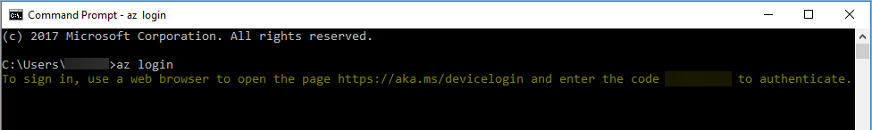

# Manage Batch resources with Azure CLI

The Azure CLI is Azure's command-line experience for managing Azure resources. It can be used on macOS, Linux, and Windows. The Azure CLI is optimized for managing and administering Azure resources from the command line. You can use the Azure CLI to manage your Azure Batch accounts and to manage resources such as pools, jobs, and tasks. With the Azure CLI, you can script many of the same tasks you carry out with the Batch APIs, Azure portal, and Batch PowerShell cmdlets.

This article provides an overview of using [Azure CLI version 2.0](/cli/azure) with Batch. See [Get started with the Azure CLI](/cli/azure/get-started-with-azure-cli) for an overview of using the CLI with Azure.

## Set up the Azure CLI

You can run the latest Azure CLI in [Azure Cloud Shell](../cloud-shell/overview.md). To install the Azure CLI locally, follow the steps outlined in [Install the Azure CLI](/cli/azure/install-azure-cli).

> [!TIP]
> We recommend that you update your Azure CLI installation frequently to take advantage of service updates and enhancements.
> 
> 

## Command help

You can display help text for every command in the Azure CLI by appending `-h` to the command. Omit any other options. For example:

* To get help for the `az` command, enter: `az -h`
* To get a list of all Batch commands in the CLI, use: `az batch -h`
* To get help on creating a Batch account, enter: `az batch account create -h`

When in doubt, use the `-h` command-line option to get help on any Azure CLI command.


Additionally, refer to the Azure CLI reference documentation for details about [Azure CLI commands for Batch](/cli/azure/batch). 

## Log in and authenticate

To use the Azure CLI with Batch, you need to log in and authenticate. There are two simple steps to follow:

1. **Log into Azure.** Logging into Azure gives you access to Azure Resource Manager commands, including [Batch Management service](batch-management-dotnet.md) commands.  
2. **Log into your Batch account.** Logging into your Batch account gives you access to Batch service commands.   

### Log in to Azure

There are a few different ways to log into Azure, described in detail in [Log in with Azure CLI](/cli/azure/authenticate-azure-cli):

1. [Log in interactively](/cli/azure/authenticate-azure-cli). Log in interactively when you are running Azure CLI commands yourself from the command line.
2. [Log in with a service principal](/cli/azure/authenticate-azure-cli). Log in with a service principal when you are running Azure CLI commands from a script or an application.

For the purposes of this article, we show how to log into Azure interactively. Type [az login](/cli/azure/reference-index#az_login) on the command line:

```azurecli
# Log in to Azure and authenticate interactively.
az login
```

The `az login` command returns a token that you can use to authenticate, as shown here. Follow the instructions provided to open a web page and submit the token to Azure:



The examples listed in the Sample shell scripts section also show how to start your Azure CLI session by logging into Azure interactively. Once you have logged in, you can call commands to work with Batch Management resources, including Batch accounts, keys, application packages, and quotas.  

### Log in to your Batch account

To use the Azure CLI to manage Batch resources, such as pools, jobs, and tasks, you need to log into your Batch account and authenticate. To log in to the Batch service, use the [az batch account login](/cli/azure/batch/account#az_batch_account_login) command. 

You have two options for authenticating against your Batch account:

- **By using Azure Active Directory (Azure AD) authentication** 

    Authenticating with Azure AD is the default when you use the Azure CLI with Batch, and recommended for most scenarios. 
    
    When you log in to Azure interactively, as described in the previous section, your credentials are cached, so the Azure CLI can log you in to your Batch account using those same credentials. If you log in to Azure using a service principal, those credentials are also used to log in to your Batch account.

    An advantage of Azure AD is that it offers Azure role-based access control (Azure RBAC). With Azure RBAC, a user's access depends on their assigned role, rather than whether or not they possess the account keys. Instead of managing account keys, you can manage Azure roles, and let Azure AD handle access and authentication.  

     To log in to your Batch account using Azure AD, call the [az batch account login](/cli/azure/batch/account#az_batch_account_login) command: 

    ```azurecli
    az batch account login -g myresource group -n mybatchaccount
    ```

- **By using Shared Key authentication**

    [Shared Key authentication](/rest/api/batchservice/authenticate-requests-to-the-azure-batch-service#authentication-via-shared-key) uses your account access keys to authenticate Azure CLI commands for the Batch service.

    If you are creating Azure CLI scripts to automate calling Batch commands, you can use either Shared Key authentication, or an Azure AD service principal. In some scenarios, using Shared Key authentication may be simpler than creating a service principal.  

    To log in using Shared Key authentication, include the `--shared-key-auth` option on the command line:

    ```azurecli
    az batch account login -g myresourcegroup -n mybatchaccount --shared-key-auth
    ```

The examples listed in the Sample shell scripts section show how to log into your Batch account with the Azure CLI using both Azure AD and Shared Key.

## Use Azure Batch CLI extension commands

By installing the Azure Batch CLI extension, you can use the Azure CLI to run Batch jobs end-to-end without writing code. Batch commands supported by the extension allow you to use JSON templates to create pools, jobs, and tasks with the Azure CLI. You can also use the extension CLI commands to upload job input files to the Azure Storage account associated with the Batch account, and download job output files from it. For more information, see [Use Azure Batch CLI templates and file transfer](batch-cli-templates.md).

## Script examples

See the [CLI script examples](./scripts/batch-cli-sample-create-account.md) for Batch to accomplish common tasks. These examples cover many of the commands available in the Azure CLI for Batch to create and manage accounts, pools, jobs, and tasks.

## JSON files for resource creation

When you create Batch resources like pools and jobs, you can specify a JSON file containing the new resource's configuration instead of passing its parameters as command-line options. For example:

```azurecli
az batch pool create my_batch_pool.json
```

While you can create most Batch resources using only command-line options, some features require that you specify a JSON-formatted file containing the resource details. For example, you must use a JSON file if you want to specify resource files for a start task.

To see the JSON syntax required to create a resource, refer to the [Batch REST API reference][rest_api] documentation. Each "Add *resource type*" topic in the REST API reference contains sample JSON scripts for creating that resource. You can use those sample JSON scripts as templates for JSON files to use with the Azure CLI. For example, to see the JSON syntax for pool creation, refer to [Add a pool to an account][rest_add_pool].

For a sample script that specifies a JSON file, see [Run a job and tasks with Batch](./scripts/batch-cli-sample-run-job.md).

> [!NOTE]
> If you specify a JSON file when you create a resource, any other parameters that you specify on the command line for that resource are ignored.
> 
> 

## Efficient queries for Batch resources

Each Batch resource type supports a `list` command that queries your Batch account and lists resources of that type. For example, you can list the pools in your account and the tasks in a job:

```azurecli
az batch pool list
az batch task list --job-id job001
```

When you query the Batch service with a `list` operation, you can specify an OData clause to limit the amount of data returned. Because all filtering occurs server-side, only the data you request crosses the wire. Use these clauses to save bandwidth (and therefore time) when you perform list operations.

The following table describes the OData clauses supported by the Batch service:

| Clause | Description |
|---|---|
| `--select-clause [select-clause]` | Returns a subset of properties for each entity. |
| `--filter-clause [filter-clause]` | Returns only entities that match the specified OData expression. |
| `--expand-clause [expand-clause]` | Obtains the entity information in a single underlying REST call. The expand clause currently supports only the `stats` property. |

For a sample script that shows how to use an OData clause, see [Run a job and tasks with Batch](./scripts/batch-cli-sample-run-job.md).

For more information on performing efficient list queries with OData clauses, see [Query the Azure Batch service efficiently](batch-efficient-list-queries.md).

## Troubleshooting tips

The following tips may help when you are troubleshooting Azure CLI issues:

* Use `-h` to get **help text** for any CLI command
* Use `-v` and `-vv` to display **verbose** command output. When the `-vv` flag is included, the Azure CLI displays the actual REST requests and responses. These switches are handy for displaying full error output.
* You can view **command output as JSON** with the `--json` option. For example, `az batch pool show pool001 --json` displays pool001's properties in JSON format. You can then copy and modify this output to use in a `--json-file` (see JSON files earlier in this article).
<!---Loc Comment: Please, check link [JSON files] since it's not redirecting to any location.--->

## Next steps

* See the [Azure CLI documentation](/cli/azure).
* Learn about the [Batch service workflow and primary resources](batch-service-workflow-features.md) such as pools, nodes, jobs, and tasks.
* Learn about using Batch templates to create pools, jobs, and tasks without writing code in [Use Azure Batch CLI templates and file transfer](batch-cli-templates.md).

[github_readme]: https://github.com/Azure/azure-xplat-cli/blob/dev/README.md
[rest_api]: /rest/api/batchservice/
[rest_add_pool]: /rest/api/batchservice/pool/add
