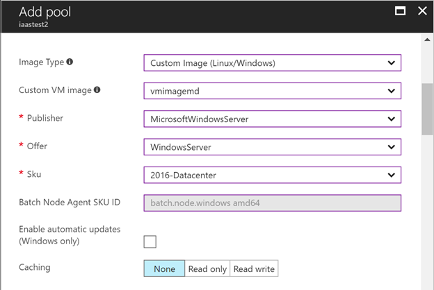

# Use a managed image to create a pool of virtual machines

To create a custom image for your Batch pool's virtual machines (VMs), you can use either the [Shared Image Gallery](batch-sig-images.md), or a *managed image* resource.

> [!TIP]
> In most cases, you should create custom images using the Shared Image Gallery. By using the Shared Image Gallery, you can provision pools faster, scale larger quantities of VMs, and have improved reliability when provisioning VMs. To learn more, see [Use the Shared Image Gallery to create a custom pool](batch-sig-images.md).

## Prerequisites

- **A managed image resource**. To create a pool of virtual machines using a custom image, you need to have or create a managed image resource in the same Azure subscription and region as the Batch account. The image should be created from snapshots of the VM's OS disk and optionally its attached data disks. For more information and steps to prepare a managed image, see the following section.
  - Use a unique custom image for each pool you create.
  - To create a pool with the image using the Batch APIs, specify the **resource ID** of the image, which is of the form `/subscriptions/xxxx-xxxxxx-xxxxx-xxxxxx/resourceGroups/myResourceGroup/providers/Microsoft.Compute/images/myImage`. To use the portal, use the **name** of the image.  
  - The managed image resource should exist for the lifetime of the pool to allow scale-up and can be removed after the pool is deleted.

- **Azure Active Directory (AAD) authentication**. The Batch client API must use AAD authentication. Azure Batch support for AAD is documented in [Authenticate Batch service solutions with Active Directory](batch-aad-auth.md).

## Prepare a custom image

In Azure, you can prepare a managed image from:

- Snapshots of an Azure VM's OS and data disks
- A generalized Azure VM with managed disks
- A generalized on-premises VHD uploaded to the cloud

To scale Batch pools reliably with a custom image, we recommend creating a managed image using *only* the first method: using snapshots of the VM's disks. See the following steps to prepare a VM, take a snapshot, and create an image from the snapshot.

### Prepare a VM

If you are creating a new VM for the image, use a first party Azure Marketplace image supported by Batch as the base image for your managed image. Only first party images can be used as a base image. To get a full list of Azure Marketplace image references supported by Azure Batch, see the [List node agent SKUs](/java/api/com.microsoft.azure.batch.protocol.accounts.listnodeagentskus) operation.

> [!NOTE]
> You can't use a third-party image that has additional license and purchase terms as your base image. For information about these Marketplace images, see the guidance for [Linux](../virtual-machines/linux/cli-ps-findimage.md#deploy-an-image-with-marketplace-terms
) or [Windows](../virtual-machines/windows/cli-ps-findimage.md#deploy-an-image-with-marketplace-terms
) VMs.

- Ensure the VM is created with a managed disk. This is the default storage setting when you create a VM.
- Do not install Azure extensions, such as the Custom Script extension, on the VM. If the image contains a pre-installed extension, Azure may encounter problems when deploying the Batch pool.
- When using attached data disks, you need to mount and format the disks from within a VM to use them.
- Ensure that the base OS image you provide uses the default temp drive. The Batch node agent currently expects the default temp drive.
- Once the VM is running, connect to it via RDP (for Windows) or SSH (for Linux). Install any necessary software or copy desired data.  

### Create a VM snapshot

A snapshot is a full, read-only copy of a VHD. To create a snapshot of a VM's OS or data disks, you can use the Azure portal or command-line tools. For steps and options to create a snapshot, see the guidance for [Linux](../virtual-machines/linux/snapshot-copy-managed-disk.md) or [Windows](../virtual-machines/windows/snapshot-copy-managed-disk.md) VMs.

### Create an image from one or more snapshots

To create a managed image from a snapshot, use Azure command-line tools such as the [az image create](/cli/azure/image) command. You can create an image by specifying an OS disk snapshot and optionally one or more data disk snapshots.

## Create a pool from a custom image in the portal

Once you have saved your custom image and you know its resource ID or name, create a Batch pool from that image. The following steps show you how to create a pool from the Azure portal.

> [!NOTE]
> If you are creating the pool using one of the Batch APIs, make sure that the identity you use for AAD authentication has permissions to the image resource. See [Authenticate Batch service solutions with Active Directory](batch-aad-auth.md).
>
> The resource for the managed image must exist for the lifetime of the pool. If the underlying resource is deleted, the pool cannot be scaled.

1. Navigate to your Batch account in the Azure portal. This account must be in the same subscription and region as the resource group containing the custom image.
2. In the **Settings** window on the left, select the **Pools** menu item.
3. In the **Pools** window, select the **Add** command.
4. On the **Add Pool** window, select **Custom Image (Linux/Windows)** from the **Image Type** dropdown. From the **Custom VM image** dropdown, select the image name (short form of the resource ID).
5. Select the correct **Publisher/Offer/Sku** for your custom image.
6. Specify the remaining required settings, including the **Node size**, **Target dedicated nodes**, and **Low-priority nodes**, as well as any desired optional settings.

    For example, for a Microsoft Windows Server Datacenter 2016 custom image, the **Add Pool** window appears as shown below:

    
  
To check whether an existing pool is based on a custom image, see the **Operating System** property in the resource summary section of the **Pool** window. If the pool was created from a custom image, it is set to **Custom VM Image**.

All custom images associated with a pool are displayed on the pool's **Properties** window.

## Considerations for large pools

If you plan to create a pool with hundreds of VMs or more using a custom image, it is important to follow the preceding guidance to use an image created from a VM snapshot.

Also note the following considerations:

- **Size limits** - Batch limits the pool size to 2500 dedicated compute nodes, or 1000 low-priority nodes, when you use a custom image.

  If you use the same image (or multiple images based on the same underlying snapshot) to create multiple pools, the total compute nodes in the pools can't exceed the preceding limits. We don't recommend using an image or its underlying snapshot for more than a single pool.

  Limits may be reduced if you configure the pool with [inbound NAT pools](pool-endpoint-configuration.md).

- **Resize timeout** - If your pool contains a fixed number of nodes (doesn't autoscale), increase the resizeTimeout property of the pool to a value such as 20-30 minutes. If your pool doesn't reach its target size within the timeout period, perform another [resize operation](/rest/api/batchservice/pool/resize).

  If you plan a pool with more than 300 compute nodes, you might need to resize the pool multiple times to reach the target size.
  
By using the [Shared Image Gallery](batch-sig-images.md), you can create larger pools with your customized images along with more Shared Image replicas. Using Shared Images, the time it takes for the pool to reach the steady state is up to 25% faster, and the VM idle latency is up to 30% shorter.

## Considerations for using Packer

Creating a managed image resource directly with Packer can only be done with user subscription mode Batch accounts. For Batch service mode accounts, you need to create a VHD first, then import the VHD to a managed image resource. Depending on your pool allocation mode (user subscription, or Batch service), your steps to create a managed image resource will vary.

Ensure that the resource used to create the managed image exists for the lifetimes of any pool referencing the custom image. Failure to do so can result in pool allocation failures and/or resize failures.

If the image or the underlying resource is removed, you may get an error similar to: `There was an error encountered while performing the last resize on the pool. Please try resizing the pool again. Code: AllocationFailed`. If you get this error, ensure that the underlying resource has not been removed.

For more information on using Packer to create a VM, see [Build a Linux image with Packer](../virtual-machines/linux/build-image-with-packer.md) or [Build a Windows image with Packer](../virtual-machines/windows/build-image-with-packer.md).

## Next steps

For an in-depth overview of Batch, see [Develop large-scale parallel compute solutions with Batch](batch-api-basics.md).
