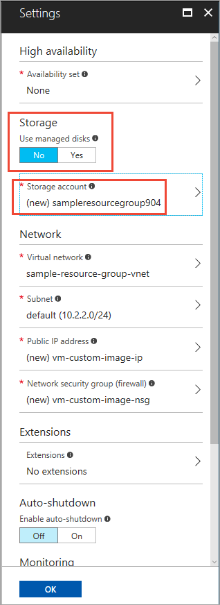
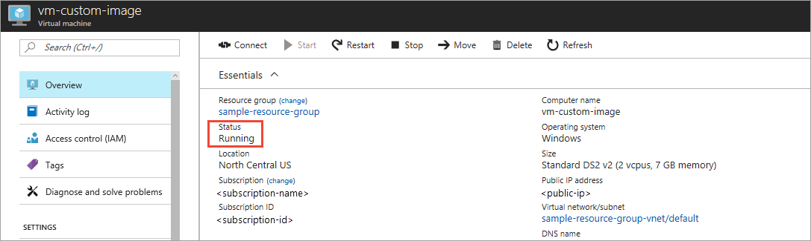
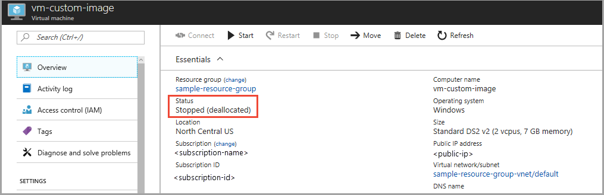
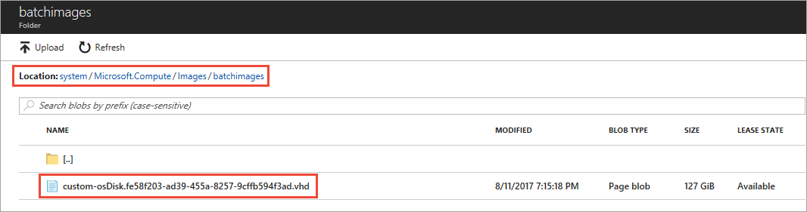

# Use a custom image to create a pool of virtual machines

When you create a pool of virtual machines in Azure Batch, you specify a virtual machine (VM) image that provides the operating system for each compute node in the pool. You can create a pool of virtual machines either by using an Azure Marketplace image, or by providing a custom VHD image that you have prepared. When you provide a custom image, you have control over how the operating system is configured at the time that each compute node is provisioned. Your custom image can also include applications and reference data that are available on the compute node as soon as it is provisioned.

Using a custom image can save you time in getting your pool's compute nodes ready to run your Batch workload. While you can always use an Azure Marketplace image and install software on each compute node after it has been provisioned, this approach may be less efficient than using a custom image. 

Some reasons to use a custom image that is configured for your scenario include needing to:

- **Configure the operating system (OS)** Any special configuration of the operating system can be performed on the custom image. 
- **Install large applications.** Installing applications on a custom image is more efficient than installing them on each compute node after it is provisioned.
- **Copy significant amounts of data.** If the data is copied to the custom image, it only needs to be copied once, rather than to each compute node, saving time and bandwidth.
- **Reboot the VM during the setup process.** Rebooting the VM can be a time-consuming process, especially if you have a number of compute nodes.

## Prerequisites

- **A Batch account created with the User Subscription pool allocation mode.** To use a custom image to provision Virtual Machine pools, create your Batch account with the User Subscription [pool allocation mode](batch-api-basics.md#pool-allocation-mode). With this mode, Batch pools are allocated into the subscription where the account resides. See the [Account](batch-api-basics.md#account) section in [Develop large-scale parallel compute solutions with Batch](batch-api-basics.md) for information on setting the pool allocation mode when you create a Batch account.

- **An Azure Storage account.** To create a pool of virtual machines using a custom image, you need a standard, general-purpose Azure Storage account in the same subscription and region. If you create a custom image from an Azure VM, then you will copy the image to the storage account where the VM's OS disk resides, and you won't need to create a separate storage account. 
    
## Prepare a custom image

To prepare a custom image for use with Batch, you must generalize an existing installation of Linux or Windows. Generalizing an operating system installation removes machine-specific information. The result is an image that can be installed on other computers or VMs.  

> [!IMPORTANT]
> Batch does not currently support using Azure managed images to provision a pool. The custom image you use to provision a pool must be stored in Azure Storage. 
>
> When preparing your custom image, keep in mind the following points:
> - Ensure that the base OS image you use to provision your Batch pools does not have any pre-installed Azure extensions, such as the Custom Script extension. If the image contains a pre-installed extension, Azure may encounter problems deploying the VM.
> - Ensure that the base OS image you provide uses the default temp drive, as the Batch node agent currently expects the default temp drive.
>
>

You can use any existing prepared Windows or Linux image as a custom image. For example, if you wish to use a local image, then upload the image to an Azure Storage account that is in the same subscription and region as your Batch account using [AzCopy](../storage/storage-use-azcopy.md) or another upload tool.

You can also prepare a custom image from a new or existing Azure VM. If you are creating a new VM, you can use an Azure Marketplace image as the base image for your custom image and then customize it. To customize the base image, create an Azure VM and add your applications or data to it. Then generalize the VM to serve as your custom image and save it to Azure Storage. 

To prepare a custom image from an Azure VM, follow these steps:

1. Create an **unmanaged** Azure VM from an Azure Marketplace image. Azure Marketplace includes images for both [Windows](../virtual-machines/windows/quick-create-portal.md) and [Linux](../virtual-machines/linux/quick-create-portal.md).
    
    On step 3 of the VM creation process, make sure that you select **No** for **Storage: Use Managed Disks** option. Also take note of the storage account name for the VM's OS disk, as this storage account is also where Azure will save your custom image:

    
 
2. Complete the process of creating your VM, and wait for it to be allocated by Azure. Here's an image that shows a VM in the Azure portal in the running state:

    

3. Once the VM is running, connect to it via RDP (for Windows) or SSH (for Linux). Install any necessary software or copy desired data, and then generalize the VM. Follow the steps described in [Generalize the VM](https://docs.microsoft.com/en-us/azure/virtual-machines/windows/sa-copy-generalized.md#generalize-the-vm). 
   
4. Follow the steps to [Log in to Azure PowerShell](../virtual-machines/windows/sa-copy-generalized.md#log-in-to-azure-powershell). To install Azure PowerShell, see [Overview of Azure PowerShell](https://docs.microsoft.com/powershell/azure/overview?view=azurermps-4.2.0). 

5. Next, follow the steps to [Deallocate the VM and set the state to generalized](https://docs.microsoft.com/en-us/azure/virtual-machines/windows/sa-copy-generalized#deallocate-the-vm-and-set-the-state-to-generalized). 

    In the Azure portal, notice that the VM is deallocated:

    

6.  Create and save the VM image to Azure Storage using the [Save-AzureRmVMImage](https://docs.microsoft.com/powershell/module/azurerm.compute/save-azurermvmimage) PowerShell cmdlet. Follow the instructions described in [Create the image](../virtual-machines/windows/sa-copy-generalized.md#create-the-image).
    
    The VM image is saved to the Azure Storage account created when the VM was created, as shown in step 1 of this procedure. the Save-AzureRmVMImage cmdlet saves the image to the **system** container in that storage account. The `-DestinationContainername` parameter names a virtual directory within the **system** container. The `-VHDNamePrefix` parameter specifies a prefix for the blob name. This prefix is prepended to the blob name with a hyphen. 

    For example, suppose you call Save-AzureRmVMImage with the following parameters:  

        Save-AzureRmVMImage -ResourceGroupName sample-resource-group -Name vm-custom-image -DestinationContainerName batchimages -VHDNamePrefix custom -Path C:\Temp\Images\vm-custom-image.json

    The resulting image is saved to the location and blob name shown here:

    

    > [!NOTE]
    > An Azure unmanaged VM creates several storage accounts for different purposes. If you did not note the name of the storage container for the OS disk when the VM was created, then find the associated storage account that contains the **system** container. Navigate through the **system** container to find the custom image using the values you specified for the **Save-AzureRmVMImage** command.

## Create a pool from a custom image in the portal

Once you have saved your custom image and you know its location, you can create a Batch pool from that image. Follow these steps to create a pool from the Azure portal:

1. Navigate to your Batch account in the Azure portal. This account must be in the same subscription and region as the storage account containing the custom image. 
2. In the **Settings** window on the left, select the **Pools** menu item.
3. In the **Pools** window, select the **Add** command.
4. On the **Add Pool** window, select **Custom Image (Linux/Windows)** from the **Image Type** dropdown. The portal displays the **Custom Image** picker. Navigate to the storage account where your custom image is located, and select the desired VHD from the container. 
5. Select the correct **Publisher/Offer/Sku** for your custom VHD.
6. Specify the remaining required settings, including the **Node size**, **Target dedicated nodes**, and **Low priority nodes**, as well as any desired optional settings.

    For example, for a Microsoft Windows Server Datacenter 2016 custom image, the **Add Pool** window appears as shown here:

    
  
To check whether an existing pool is based on a custom image, see the **Operating System** property in the resource summary section of the **Pool** window. If the pool was created from a custom image, it is set to **Custom VM Image**.

All custom VHDs associated with a pool are displayed on the pool's **Properties** window.
 
## Next steps

- For an in-depth overview of Batch, see [Develop large-scale parallel compute solutions with Batch](batch-api-basics.md).
- For information about creating a Batch account, see [Create a Batch account with the Azure portal](batch-account-create-portal.md).