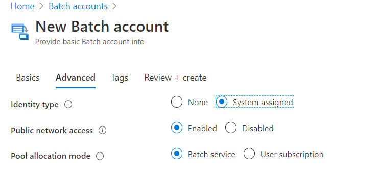
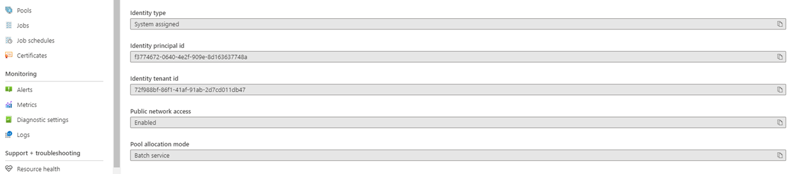
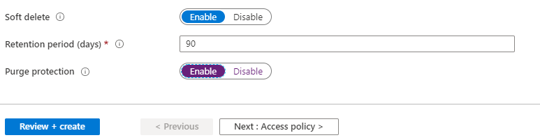
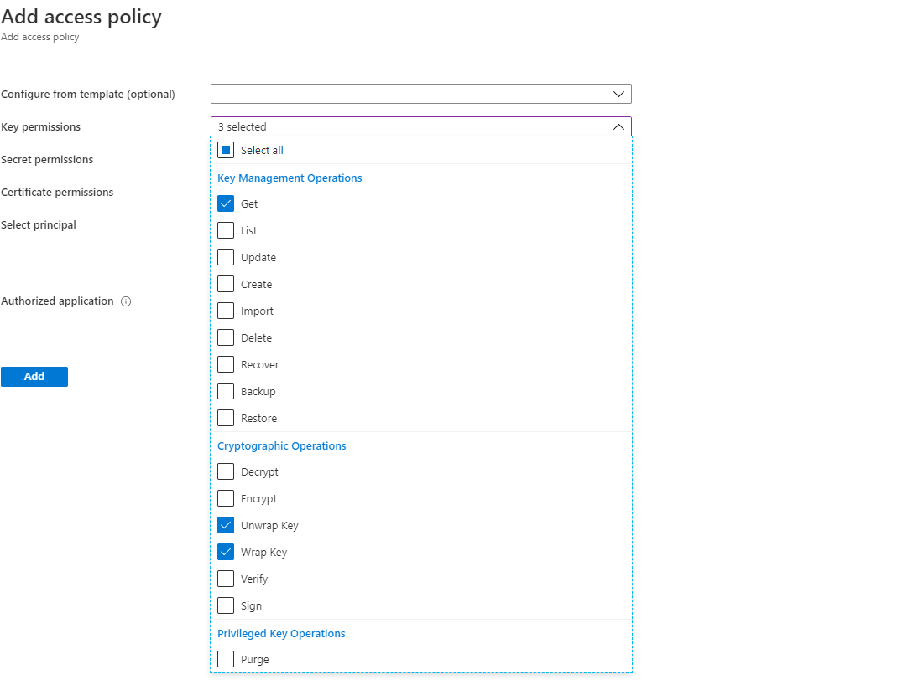
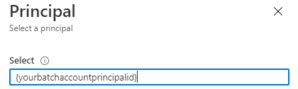
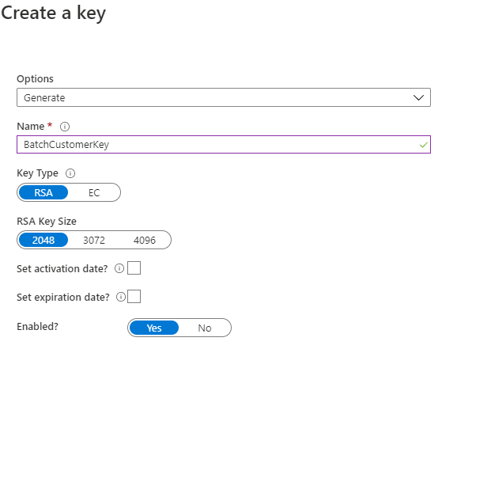
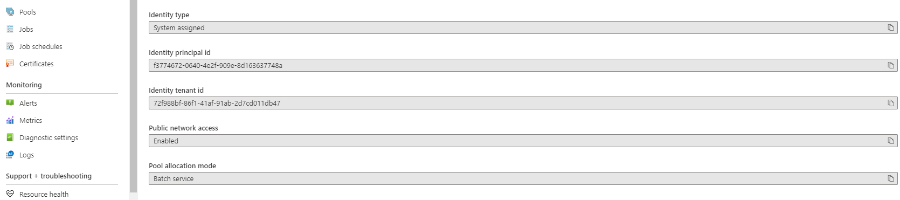

# Configure customer-managed keys for your Azure Batch account with Azure Key Vault and Managed Identity

By default Azure Batch uses platform-managed keys to encrypt all the customer data stored in the Azure Batch Service, like certificates, job/task metadata. Optionally, you can use your own keys, that is, customer-managed keys, to encrypt data stored in Azure Batch.

The keys you provide must be generated in [Azure Key Vault](../key-vault/general/basic-concepts.md), and they must be accessed with [managed identities for Azure resources](../active-directory/managed-identities-azure-resources/overview.md).

There are two types of managed identities: [*system-assigned* and *user-assigned*](../active-directory/managed-identities-azure-resources/overview.md#managed-identity-types).

You can either create your Batch account with system-assigned managed identity, or create a separate user-assigned managed identity
that has access to the customer-managed keys. Review the
[comparison table](../active-directory/managed-identities-azure-resources/overview.md#managed-identity-types) to understand the
differences and consider which option works best for your solution. For example, if you want to use the same managed identity to
access multiple Azure resources, a user-assigned managed identity is needed. If not, a system-assigned managed identity associated
with your Batch account may be sufficient. Using a user-assigned managed identity also gives you the option to enforce
customer-managed keys at Batch account creation, as shown next.

## Create a Batch account with system-assigned managed identity

If you don't need a separate user-assigned managed identity, you can enable system-assigned managed identity when you create your Batch account.

> [!IMPORTANT]
> A system-assigned managed identity created for a Batch account for customer data encryption as described in this document
> cannot be used as a [user-assigned managed identity on a Batch pool](managed-identity-pools.md). If you wish to use the
> same managed identity on both the Batch account and Batch pool, then use a common user-assigned managed identity instead.

### Azure portal

In the [Azure portal](https://portal.azure.com/), when you create Batch accounts, pick **System assigned** in the identity type under the **Advanced** tab.



After the account is created, you can find a unique GUID in the **Identity principal Id** field under the **Properties** section. The **Identity Type** will show `System assigned`.



You need this value in order to grant this Batch account access to the Key Vault.

### Azure CLI

When you create a new Batch account, specify `SystemAssigned` for the `--identity` parameter.

```azurecli-interactive
resourceGroupName='myResourceGroup'
accountName='mybatchaccount'

az batch account create \
    --name $accountName \
    --resource-group $resourceGroupName \
    --locations regionName='West US 2' \
    --identity 'SystemAssigned'
```

After the account is created, you can verify that system-assigned managed identity has been enabled on this account. Be sure to note the `PrincipalId`, as this value is needed to grant this Batch account access to the Key Vault.

```azurecli-interactive
az batch account show \
    --name $accountName \
    --resource-group $resourceGroupName \
    --query identity
```

> [!NOTE]
> The system-assigned managed identity created in a Batch account is only used for retrieving customer-managed keys from the Key Vault. This identity is not available on Batch pools. To use a user-assigned managed identity in a pool, see [Configure managed identities in Batch pools](managed-identity-pools.md).

## Create a user-assigned managed identity

If you prefer, you can [create a user-assigned managed identity](../active-directory/managed-identities-azure-resources/how-to-manage-ua-identity-portal.md#create-a-user-assigned-managed-identity) that can be used to access your customer-managed keys.

You need the **Client ID** value of this identity in order for it to access the Key Vault.

## Configure your Azure Key Vault instance

The Azure Key Vault in which your keys are generated must be created in the same tenant as your Batch account. It doesn't need to be in the same resource group or even in the same subscription.

### Create an Azure Key Vault

When [creating an Azure Key Vault instance](../key-vault/general/quick-create-portal.md) with customer-managed keys for Azure Batch, make sure that **Soft Delete** and **Purge Protection** are both enabled.



### Add an access policy to your Azure Key Vault instance

In the Azure portal, after the Key Vault is created, In the **Access Policy** under **Setting**, add the Batch account access using managed identity. Under **Key Permissions**, select **Get**, **Wrap Key** and **Unwrap Key**.



In the **Select** field under **Principal**, fill in one of the following:

- For system-assigned managed identity: Enter the `principalId` that you previously retrieved or the name of the Batch account.
- For user-assigned managed identity: Enter the **Client ID** that you previously retrieved or the name of the user-assigned managed identity.



### Generate a key in Azure Key Vault

In the Azure portal, go to the Key Vault instance in the **key** section, select **Generate/Import**. Select the **Key Type** to be `RSA` and **RSA Key Size** to be at least `2048` bits. `EC` key types are currently not supported as a customer-managed key on a Batch account.



After the key is created, click on the newly created key and the current version, copy the **Key Identifier** under **properties** section.  Be sure that under **Permitted Operations**, **Wrap Key** and **Unwrap Key** are both checked.

## Enable customer-managed keys on a Batch account

Now that the prerequisites are in place, you can enable customer-managed keys on your Batch account.

### Azure portal

In the [Azure portal](https://portal.azure.com/), go to the Batch account page. Under the **Encryption** section, enable **Customer-managed key**. You can directly use the Key Identifier, or you can select the key vault and then click **Select a key vault and key**.



### Azure CLI

After the Batch account is created with system-assigned managed identity and the access to Key Vault is granted, update the Batch account with the `{Key Identifier}` URL under `keyVaultProperties` parameter. Also set `--encryption-key-source` as `Microsoft.KeyVault`.

```azurecli-interactive
az batch account set \
    --name $accountName \
    --resource-group $resourceGroupName \
    --encryption-key-source Microsoft.KeyVault \
    --encryption-key-identifier {YourKeyIdentifier}
```

## Create a Batch account with user-assigned managed identity and customer-managed keys

As an example using the Batch management .NET client, you can create a Batch account that has a user-assigned managed identity
and customer-managed keys.

```c#
EncryptionProperties encryptionProperties = new EncryptionProperties()
{
    KeySource = KeySource.MicrosoftKeyVault,
    KeyVaultProperties = new KeyVaultProperties()
    {
        KeyIdentifier = "Your Key Azure Resource Manager Resource ID"
    }
};

BatchAccountIdentity identity = new BatchAccountIdentity()
{
    Type = ResourceIdentityType.UserAssigned,
    UserAssignedIdentities = new Dictionary<string, BatchAccountIdentityUserAssignedIdentitiesValue>
    {
            ["Your Identity Azure Resource Manager ResourceId"] = new BatchAccountIdentityUserAssignedIdentitiesValue()
    }
};
var parameters = new BatchAccountCreateParameters(TestConfiguration.ManagementRegion, encryption:encryptionProperties, identity: identity);

var account = await batchManagementClient.Account.CreateAsync("MyResourceGroup",
    "mynewaccount", parameters);
```

## Update the customer-managed key version

When you create a new version of a key, update the Batch account to use the new version. Follow these steps:

1. Navigate to your Batch account in Azure portal and display the Encryption settings.
2. Enter the URI for the new key version. Alternately, you can select the Key Vault and the key again to update the version.
3. Save your changes.

You can also use Azure CLI to update the version.

```azurecli-interactive
az batch account set \
    --name $accountName \
    --resource-group $resourceGroupName \
    --encryption-key-identifier {YourKeyIdentifierWithNewVersion}
```

> [!TIP]
> You can have your keys automatically rotate by creating a key rotation policy within Key Vault. When specifying a Key Identifier
> for the Batch account, use the versionless key identifier to enable autorotation with a valid rotation policy. For more information,
> see [how to configure key rotation](../key-vault/keys/how-to-configure-key-rotation.md) in Key Vault.

## Use a different key for Batch encryption

To change the key used for Batch encryption, follow these steps:

1. Navigate to your Batch account and display the Encryption settings.
2. Enter the URI for the new key. Alternately, you can select the Key Vault and choose a new key.
3. Save your changes.

You can also use Azure CLI to use a different key.

```azurecli-interactive
az batch account set \
    --name $accountName \
    --resource-group $resourceGroupName \
    --encryption-key-identifier {YourNewKeyIdentifier}
```

## Frequently asked questions

- **Are customer-managed keys supported for existing Batch accounts?** No. Customer-managed keys are only supported for new Batch accounts.
- **Can I select RSA key sizes larger than 2048 bits?** Yes, RSA key sizes of `3072` and `4096` bits are also supported.
- **What operations are available after a customer-managed key is revoked?** The only operation allowed is account deletion if Batch loses access to the customer-managed key.
- **How should I restore access to my Batch account if I accidentally delete the Key Vault key?** Since purge protection and soft delete are enabled, you could restore the existing keys. For more information, see [Recover an Azure Key Vault](../key-vault/general/key-vault-recovery.md).
- **Can I disable customer-managed keys?** You can set the encryption type of the Batch Account back to "Microsoft managed key" at any time. You're free to delete or change the key afterwards.
- **How can I rotate my keys?** Customer-managed keys aren't automatically rotated unless the [key is versionless with an appropriate key rotation policy set within Key Vault](../key-vault/keys/how-to-configure-key-rotation.md). To manually rotate the key, update the Key Identifier that the account is associated with.
- **After I restore access how long will it take for the Batch account to work again?** It can take up to 10 minutes for the account to be accessible again once access is restored.
- **While the Batch Account is unavailable what happens to my resources?** Any pools that are active when Batch access to the customer-managed key is lost will continue to run. However, the nodes in these pools will transition into an unavailable state, and tasks will stop running (and be requeued). Once access is restored, nodes become available again, and tasks are restarted.
- **Does this encryption mechanism apply to VM disks in a Batch pool?** No. For Cloud Services Configuration pools (which are [deprecated](https://azure.microsoft.com/updates/azure-batch-cloudserviceconfiguration-pools-will-be-retired-on-29-february-2024/)), no encryption is applied for the OS and temporary disk. For Virtual Machine Configuration pools, the OS and any specified data disks are encrypted with a Microsoft platform managed key by default. Currently, you can't specify your own key for these disks. To encrypt the temporary disk of VMs for a Batch pool with a Microsoft platform managed key, you must enable the [diskEncryptionConfiguration](/rest/api/batchservice/pool/add#diskencryptionconfiguration) property in your [Virtual Machine Configuration](/rest/api/batchservice/pool/add#virtualmachineconfiguration) Pool. For highly sensitive environments, we recommend enabling temporary disk encryption and avoiding storing sensitive data on OS and data disks. For more information, see [Create a pool with disk encryption enabled](./disk-encryption.md)
- **Is the system-assigned managed identity on the Batch account available on the compute nodes?** No. The system-assigned managed identity is currently used only for accessing the Azure Key Vault for the customer-managed key. To use a user-assigned managed identity on compute nodes, see [Configure managed identities in Batch pools](managed-identity-pools.md).

## Next steps

- Learn more about [security best practices in Azure Batch](security-best-practices.md).
- Learn more about [Azure Key Vault](../key-vault/general/basic-concepts.md).
