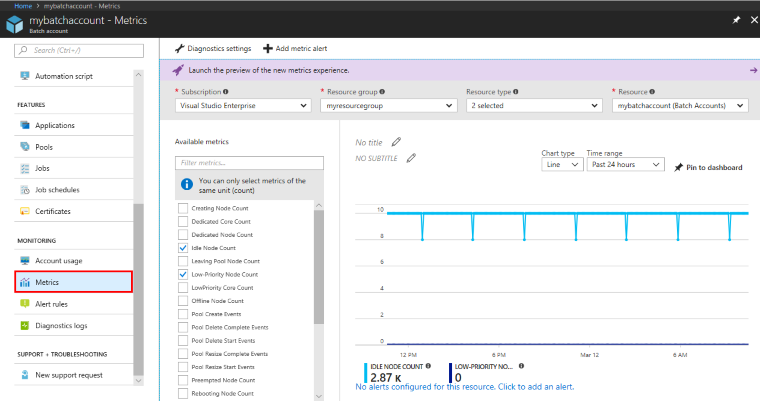
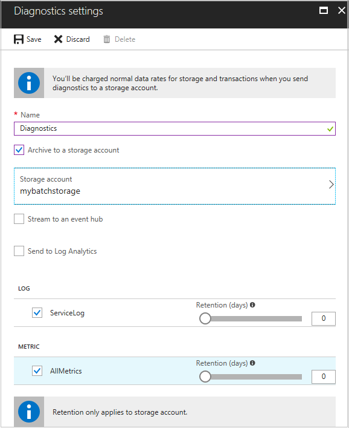

# Batch metrics, alerts, and logs for diagnostic evaluation and monitoring

 
This article explains how to monitor a Batch account using features of [Azure Monitor](../azure-monitor/overview.md). Azure Monitor collects [metrics](../azure-monitor/platform/data-platform-metrics.md) and [diagnostic logs](../azure-monitor/platform/platform-logs-overview.md) for resources in your Batch account. Collect and consume this data in a variety of ways to monitor your Batch account and diagnose issues. You can also configure [metric alerts](../azure-monitor/platform/alerts-overview.md) so you receive notifications when a metric reaches a specified value. 

## Batch metrics

Metrics are Azure telemetry data (also called performance counters) emitted by your Azure resources which are consumed by the Azure Monitor service. Example metrics in a Batch account include: Pool Create Events, Low-Priority Node Count, and Task Complete Events. 

See the [list of supported Batch metrics](../azure-monitor/platform/metrics-supported.md#microsoftbatchbatchaccounts).

Metrics are:

* Enabled by default in each Batch account without additional configuration
* Generated every 1 minute
* Not persisted automatically, but have a 30-day rolling history. You can persist activity metrics as part of diagnostic logging.

### View metrics

View metrics for your Batch account in the Azure portal. The **Overview** page for the account by default shows key node, core, and task metrics. 

To view all Batch account metrics: 

1. In the portal, click **All services** > **Batch accounts**, and then click the name of your Batch account.
2. Under **Monitoring**, click **Metrics**.
3. Select one or more of the metrics. If you want, select additional resource metrics by using the **Subscriptions**, **Resource group**, **Resource type**, and **Resource** dropdowns.
    * For count-based metrics (like "Dedicated Core Count" or "Low-Priority Node Count"), use the "Average" aggregation. For event-based metrics (like "Pool Resize Complete Events"), use the "Count" aggregation.

    

To retrieve metrics programmatically, use the Azure Monitor APIs. For example, see [Retrieve Azure Monitor metrics with .NET](https://azure.microsoft.com/resources/samples/monitor-dotnet-metrics-api/).

## Batch metric reliability

Metrics are intended to be used for trending and data analysis. Metric delivery is not guaranteed and is subject to out-of-order delivery, data loss, and/or duplication. Using single events to alert or trigger functions is not recommended. See the [Batch metric alerts](#batch-metric-alerts) section for more details on how to set thresholds for alerting.

Metrics emitted in the last 3 minutes may still be aggregating. During this time frame, the metric values may be underreported.

## Batch metric alerts

Optionally, configure near real-time *metric alerts* that trigger when the value of a specified metric crosses a threshold that you assign. The alert generates a [notification](../monitoring-and-diagnostics/insights-alerts-portal.md) you choose when the alert is "Activated" (when the threshold is crossed and the alert condition is met) as well as when it is "Resolved" (when the threshold is crossed again and the condition is no longer met). Alerting based on single data points is not recommended as metrics are subject to out-of-order delivery, data loss, and/or duplication. Alerting should make use of thresholds to account for these inconsistencies.

For example, you might want to configure a metric alert when your low priority core count falls to a certain level, so you can adjust the composition of your pools. It is recommended to set a period of 10 or more minutes where alerts trigger if the average low priority core count falls below the threshold value for the entire period. It is not recommended to alert on a 1-5 minute period as metrics may still be aggregating.

To configure a metric alert in the portal:

1. Click **All services** > **Batch accounts**, and then click the name of your Batch account.
2. Under **Monitoring**, click **Alert rules** > **Add metric alert**.
3. Select a metric, an alert condition (such as when a metric exceeds a particular value during a period), and one or more notifications.

You can also configure a near real-time alert using the [REST API](https://docs.microsoft.com/rest/api/monitor/). For more information, see [Alerts Overview](../azure-monitor/platform/alerts-overview.md)

## Batch diagnostics

Diagnostic logs contain information emitted by Azure resources that describe the operation of each resource. For Batch, you can collect the following logs:

* **Service Logs** events emitted by the Azure Batch service during the lifetime of an individual Batch resource like a pool or task. 

* **Metrics** logs at the account level. 

Settings to enable collection of diagnostic logs are not enabled by default. Explicitly enable diagnostic settings for each Batch account you want to monitor.

### Log destinations

A common scenario is to select an Azure Storage account as the log destination. To store logs in Azure Storage, create the account before enabling collection of logs. If you associated a storage account with your Batch account, you can choose that account as the log destination. 

Other optional destinations for diagnostic logs:

* Stream Batch diagnostic log events to an [Azure Event Hub](../event-hubs/event-hubs-what-is-event-hubs.md). Event Hubs can ingest millions of events per second, which you can then transform and store using any real-time analytics provider. 

* Send diagnostic logs to [Azure Monitor logs](../log-analytics/log-analytics-overview.md), where you can analyze them or export them for analysis in Power BI or Excel.

> [!NOTE]
> You may incur additional costs to store or process diagnostic log data with Azure services. 
>

### Enable collection of Batch diagnostic logs

1. In the portal, click **All services** > **Batch accounts**, and then click the name of your Batch account.
2. Under **Monitoring**, click **Diagnostic logs** > **Turn on diagnostics**.
3. In **Diagnostic settings**, enter a name for the setting, and choose a log destination (existing Storage account, Event Hub, or Azure Monitor logs). Select either or both **ServiceLog** and **AllMetrics**.

    When you select a storage account, optionally set a retention policy. If you don't specify a number of days for retention, data is retained during the life of the storage account.

4. Click **Save**.

    

Other options to enable log collection include: use Azure Monitor in the portal to configure diagnostic settings, use a [Resource Manager template](../azure-monitor/platform/diagnostic-settings-template.md), or use Azure PowerShell or the Azure CLI. see [Collect and consume log data from your Azure resources](../azure-monitor/platform/platform-logs-overview.md).


### Access diagnostics logs in storage

If you archive Batch diagnostic logs in a storage account, a storage container is created in the storage account as soon as a related event occurs. Blobs are created according to the following naming pattern:

```
insights-{log category name}/resourceId=/SUBSCRIPTIONS/{subscription ID}/
RESOURCEGROUPS/{resource group name}/PROVIDERS/MICROSOFT.BATCH/
BATCHACCOUNTS/{Batch account name}/y={four-digit numeric year}/
m={two-digit numeric month}/d={two-digit numeric day}/
h={two-digit 24-hour clock hour}/m=00/PT1H.json
```
Example:

```
insights-metrics-pt1m/resourceId=/SUBSCRIPTIONS/XXXXXXXX-XXXX-XXXX-XXXX-XXXXXXXXXXXX/
RESOURCEGROUPS/MYRESOURCEGROUP/PROVIDERS/MICROSOFT.BATCH/
BATCHACCOUNTS/MYBATCHACCOUNT/y=2018/m=03/d=05/h=22/m=00/PT1H.json
```
Each `PT1H.json` blob file contains JSON-formatted events that occurred within the hour specified in the blob URL (for example, `h=12`). During the present hour, events are appended to the `PT1H.json` file as they occur. The minute value (`m=00`) is always `00`, since diagnostic log events are broken into individual blobs per hour. (All times are in UTC.)

Below is an example of a `PoolResizeCompleteEvent` entry in a `PT1H.json` log file. It includes information about the current and target number of dedicated and low-priority nodes, as well as the start and end time of the operation:

```
{ "Tenant": "65298bc2729a4c93b11c00ad7e660501", "time": "2019-08-22T20:59:13.5698778Z", "resourceId": "/SUBSCRIPTIONS/XXXXXXXX-XXXX-XXXX-XXXX-XXXXXXXXXXXX/RESOURCEGROUPS/MYRESOURCEGROUP/PROVIDERS/MICROSOFT.BATCH/BATCHACCOUNTS/MYBATCHACCOUNT/", "category": "ServiceLog", "operationName": "PoolResizeCompleteEvent", "operationVersion": "2017-06-01", "properties": {"id":"MYPOOLID","nodeDeallocationOption":"Requeue","currentDedicatedNodes":10,"targetDedicatedNodes":100,"currentLowPriorityNodes":0,"targetLowPriorityNodes":0,"enableAutoScale":false,"isAutoPool":false,"startTime":"2019-08-22 20:50:59.522","endTime":"2019-08-22 20:59:12.489","resultCode":"Success","resultMessage":"The operation succeeded"}}
```

For more information about the schema of diagnostic logs in the storage account, see [Archive Azure Diagnostic Logs](../azure-monitor/platform/resource-logs-collect-storage.md#schema-of-platform-logs-in-storage-account). To access the logs in your storage account programmatically, use the Storage APIs. 

### Service Log events
Azure Batch Service Logs, if collected, contain events emitted by the Azure Batch service during the lifetime of an individual Batch resource like a pool or task. Each event emitted by Batch is logged in JSON format. For example, this is the body of a sample **pool create event**:

```json
{
    "poolId": "myPool1",
    "displayName": "Production Pool",
    "vmSize": "Small",
    "cloudServiceConfiguration": {
        "osFamily": "5",
        "targetOsVersion": "*"
    },
    "networkConfiguration": {
        "subnetId": " "
    },
    "resizeTimeout": "300000",
    "targetDedicatedComputeNodes": 2,
    "maxTasksPerNode": 1,
    "vmFillType": "Spread",
    "enableAutoscale": false,
    "enableInterNodeCommunication": false,
    "isAutoPool": false
}
```

The Batch service currently emits the following Service Log events. This list may not be exhaustive, since additional events may have been added since this article was last updated.

| **Service Log events** |
| --- |
| [Pool create](batch-pool-create-event.md) |
| [Pool delete start](batch-pool-delete-start-event.md) |
| [Pool delete complete](batch-pool-delete-complete-event.md) |
| [Pool resize start](batch-pool-resize-start-event.md) |
| [Pool resize complete](batch-pool-resize-complete-event.md) |
| [Task start](batch-task-start-event.md) |
| [Task complete](batch-task-complete-event.md) |
| [Task fail](batch-task-fail-event.md) |


## Next steps

* Learn about the [Batch APIs and tools](batch-apis-tools.md) available for building Batch solutions.
* Learn more about [monitoring Batch solutions](monitoring-overview.md).
