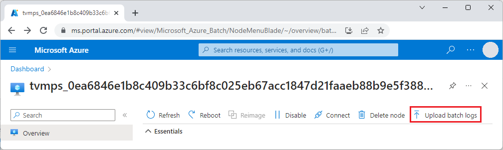
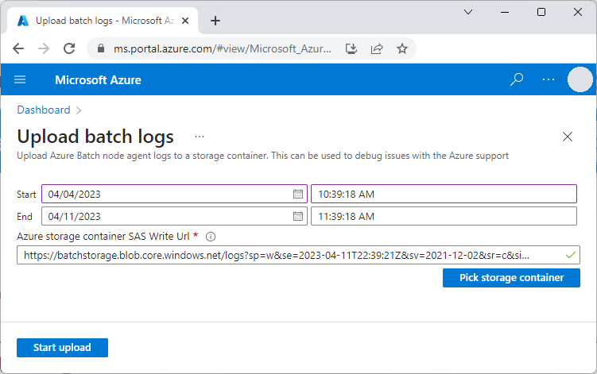
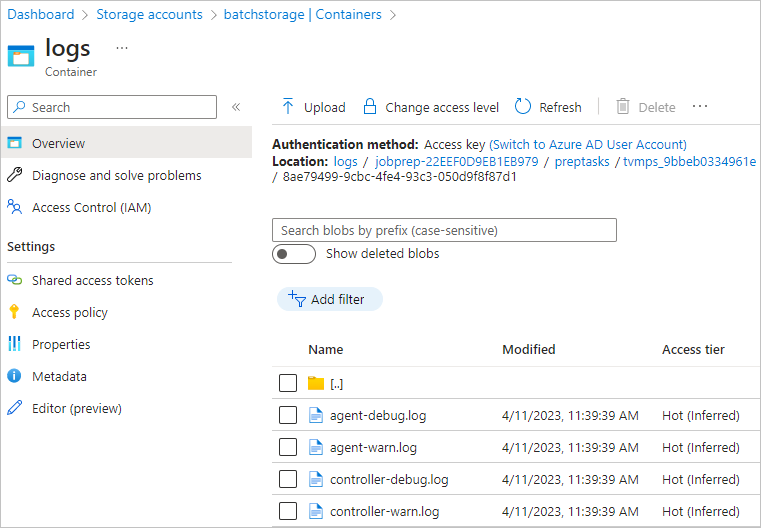

# Azure Batch job and task errors

Various errors can happen when you add, schedule, or run Azure Batch jobs and tasks. It's straightforward to detect errors that occur when you add jobs and tasks. The API, command line, or user interface usually returns any failures immediately. This article covers how to check for and handle errors that occur after jobs and tasks are submitted.

## Job failures

A job is a group of one or more tasks, which specify command lines to run. You can specify the following optional parameters when you add a job. These parameters influence how the job can fail.

- [JobConstraints](/rest/api/batchservice/job/add#jobconstraints). You can optionally use the `maxWallClockTime` property to set the maximum amount of time a job can be active or running. If the job exceeds the `maxWallClockTime`, the job terminates with the `terminateReason` property set to `MaxWallClockTimeExpiry` in the [JobExecutionInformation](/rest/api/batchservice/job/get#jobexecutioninformation).

- [JobPreparationTask](/rest/api/batchservice/job/add#jobpreparationtask). You can optionally specify a job preparation task to run on each compute node scheduled to run a job task. The node runs the job preparation task before the first time it runs a task for the job. If the job preparation task fails, the task doesn't run and the job doesn't complete.

- [JobReleaseTask](/rest/api/batchservice/job/add#jobreleasetask). You can optionally specify a job release task for jobs that have a job preparation task. When a job is being terminated, the job release task runs on each pool node that ran a job preparation task. If a job release task fails, the job still moves to a `completed` state.

In the Azure portal, you can set these parameters in the **Job manager, preparation and release tasks** and **Advanced** sections of the Batch **Add job** screen.

### Job properties

Check the following job properties in the [JobExecutionInformation](/rest/api/batchservice/job/get#jobexecutioninformation) for errors:

- The `terminateReason` property indicates `MaxWallClockTimeExpiry` if the job exceeded the `maxWallClockTime` specified in the job constraints and therefore the job terminated. This property can also be set to `taskFailed` if the job's `onTaskFailure` attribute is set to `performExitOptionsJobAction`, and a task fails with an exit condition that specifies a `jobAction` of `terminatejob`. 

- The [JobSchedulingError](/rest/api/batchservice/job/get#jobschedulingerror) property is set if there has been a scheduling error.

### Job preparation tasks

An instance of a [job preparation task](batch-job-prep-release.md#job-preparation-task) runs on each compute node the first time the node runs a task for the job. You can think of the job preparation task as a task template, with multiple instances being run, up to the number of nodes in a pool. Check the job preparation task instances to determine if there were errors.

You can use the [Job - List Preparation and Release Task Status](/rest/api/batchservice/job/listpreparationandreleasetaskstatus) API to list the execution status of all instances of job preparation and release tasks for a specified job. As with other tasks, [JobPreparationTaskExecutionInformation](/rest/api/batchservice/job/listpreparationandreleasetaskstatus#jobpreparationtaskexecutioninformation) is available with properties such as `failureInfo`, `exitCode`, and `result`.

When a job preparation task runs, the task that triggered the job preparation task moves to a [taskState](/rest/api/batchservice/task/get#taskstate) of `preparing`. If the job preparation task fails, the triggering task reverts to the `active` state and doesn't run.

If a job preparation task fails, the triggering job task doesn't run. The job doesn't complete and is stuck. If there are no other jobs with tasks that can be scheduled, the pool might not be used.

### Job release tasks

An instance of a [job release task](batch-job-prep-release.md#job-release-task) runs when the job is being terminated on each node that ran a job preparation task. Check the job release task instances to determine if there were errors.

You can use the [Job - List Preparation and Release Task Status](/rest/api/batchservice/job/listpreparationandreleasetaskstatus) API to list the execution status of all instances of job preparation and release tasks for a specified job. As with other tasks, [JobReleaseTaskExecutionInformation](/rest/api/batchservice/job/listpreparationandreleasetaskstatus#jobreleasetaskexecutioninformation) is available with properties such as `failureInfo`, `exitCode`, and `result`.

If one or more job release tasks fail, the job is still terminated and moves to a `completed` state.

## Task failures

Job tasks can fail for the following reasons:

- The task command line fails and returns with a nonzero exit code.
- One or more `resourceFiles` specified for a task don't download.
- One or more `outputFiles` specified for a task don't upload.
- The elapsed time for the task exceeds the `maxWallClockTime` property specified in the [TaskConstraints](/rest/api/batchservice/task/add#taskconstraints).

In all cases, check the following properties for errors and information about the errors:

- The [TaskExecutionInformation](/rest/api/batchservice/task/get#taskexecutioninformation) property has multiple properties that provide information about an error. The [taskExecutionResult](/rest/api/batchservice/task/get#taskexecutionresult) indicates if the task failed for any reason, and `exitCode` and `failureInfo` provide more information about the failure.

- The task always moves to the `completed` [TaskState](/rest/api/batchservice/task/get#taskstate), whether it succeeded or failed.

Consider the impact of task failures on the job and on any task dependencies. You can specify [ExitConditions](/rest/api/batchservice/task/add#exitconditions) to configure actions for dependencies and for the job.

- [DependencyAction](/rest/api/batchservice/task/add#dependencyaction) controls whether to block or run tasks that depend on the failed task.
- [JobAction](/rest/api/batchservice/task/add#jobaction) controls whether the failed task causes the job to be disabled, terminated, or unchanged.

### Task command lines

Task command lines don't run under a shell on compute nodes, so they can't natively use shell features such as environment variable expansion. To take advantage of such features, you must invoke the shell in the command line. For more information, see [Command-line expansion of environment variables](batch-compute-node-environment-variables.md#command-line-expansion-of-environment-variables).

Task command line output writes to *stderr.txt* and *stdout.txt* files. Your application might also write to application-specific log files. Make sure to implement comprehensive error checking for your application to promptly detect and diagnose issues.

### Task logs

If the pool node that ran a task still exists, you can get and view the task log files. Several APIs allow listing and getting task files, such as [File - Get From Task](/rest/api/batchservice/file/getfromtask). You can also list and view log files for a task or node by using the [Azure portal](https://portal.azure.com).

1. At the top of the **Overview** page for a node, select **Upload batch logs**.

   

1. On the **Upload Batch logs** page, select **Pick storage container**, select an Azure Storage container to upload to, and then select **Start upload**.

   

1. You can view, open, or download the logs from the storage container page.

   

### Output files

Because Batch pools and pool nodes are often ephemeral, with nodes being continuously added and deleted, it's best to save the log files when the job runs. Task output files are a convenient way to save log files to Azure Storage. For more information, see [Persist task data to Azure Storage with the Batch service API](batch-task-output-files.md).

On every file upload, Batch writes two log files to the compute node, *fileuploadout.txt* and *fileuploaderr.txt*. You can examine these log files to learn more about a specific failure. If the file upload wasn't attempted, for example because the task itself couldn't run, these log files don't exist.

## Next steps

- Learn more about [Batch jobs and tasks](jobs-and-tasks.md) and [job preparation and release tasks](batch-job-prep-release.md).
- Learn about [Batch pool and node errors](batch-pool-node-error-checking.md).