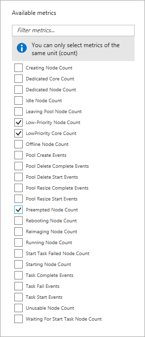

# Use low-priority VMs with Batch

Azure Batch offers low-priority virtual machines (VMs) to reduce the cost of Batch workloads. Low-priority VMs make new types of Batch workloads possible by enabling a large amount of compute power to be used for a very low cost.

Low-priority VMs take advantage of surplus capacity in Azure. When you specify low-priority VMs in your pools, Azure Batch can use this surplus, when available.

The tradeoff for using low-priority VMs is that those VMs may not be available to be allocated or may be preempted at any time, depending on available capacity. For this reason, low-priority VMs are most suitable for certain types of workloads. Use low-priority VMs for batch and asynchronous processing workloads where the job completion time is flexible and the work is distributed across many VMs.

Low-priority VMs are offered at a significantly reduced price compared with dedicated VMs. For pricing details, 
 see [Batch Pricing](https://azure.microsoft.com/pricing/details/batch/).

> [!NOTE]
> [Spot VMs](https://azure.microsoft.com/pricing/spot/) are now available for [single instance VMs](https://docs.microsoft.com/azure/virtual-machines/linux/spot-vms) and [VM scale sets](https://docs.microsoft.com/azure/virtual-machine-scale-sets/use-spot). Spot VMs are an evolution of low-priority VMs, but differ in that pricing can vary and an optional maximum price can be set when allocating Spot VMs.
>
> Azure Batch pools will start supporting Spot VMs within a few months of them being generally available, with new versions of the [Batch APIs and tools](https://docs.microsoft.com/azure/batch/batch-apis-tools). Once Spot VM support is available, low-priority VMs will be deprecated - they will continue to be supported using current APIs and tool versions for at least 12 months, to allow sufficient time for migration to Spot VMs. 
>
> Spot VMs will not be supported for [Cloud Service Configuration](https://docs.microsoft.com/rest/api/batchservice/pool/add#cloudserviceconfiguration) pools. To use Spot VMs, Cloud Service pools will need to be migrated to [Virtual Machine Configuration](https://docs.microsoft.com/rest/api/batchservice/pool/add#virtualmachineconfiguration) pools.

## Use cases for low-priority VMs

Given the characteristics of low-priority VMs, what workloads can and cannot use
them? In general, batch processing workloads are a good fit, as jobs are broken
into many parallel tasks or there are many jobs that are scaled out and
distributed across many VMs.

-   To maximize use of surplus capacity in Azure, suitable jobs
    can scale out.

-   Occasionally VMs may not be available or are preempted, which results
    in reduced capacity for jobs and may lead to task interruption and
    reruns. Jobs must therefore be flexible in the time they can take to run.

-   Jobs with longer tasks may be impacted more if interrupted. If long-running
    tasks implement checkpointing to save progress as they execute, then the
    impact of interruption is reduced. Tasks with shorter execution times
    tend to work best with low-priority VMs, because the impact of interruption is far
    less.

-   Long-running MPI jobs that utilize multiple VMs are not well suited to use
    low-priority VMs, because one preempted VM can lead to the whole job
    having to run again.

Some examples of batch processing use cases well suited to use low-priority VMs
are:

-   **Development and testing**: In particular, if large-scale solutions are
    being developed, significant savings can be realized. All types of testing
    can benefit, but large-scale load testing and regression testing are great
    uses.

-   **Supplementing on-demand capacity**: Low-priority VMs can be used to
    supplement regular dedicated VMs - when available, jobs can scale and
    therefore complete quicker for lower cost; when not available, the baseline
    of dedicated VMs remains available.

-   **Flexible job execution time**: If there is flexibility in the time jobs
    have to complete, then potential drops in capacity can be tolerated;
    however, with the addition of low-priority VMs jobs frequently run
    faster and for a lower cost.

Batch pools can be configured to use low-priority VMs in a few ways, depending
on the flexibility in job execution time:

-   Low-priority VMs can solely be used in a pool. In this case, Batch recovers
    any preempted capacity when available. This configuration is the cheapest way to execute
    jobs, as only low-priority VMs are used.

-   Low-priority VMs can be used in conjunction with a fixed baseline of
    dedicated VMs. The fixed number of dedicated VMs ensures there is always
    some capacity to keep a job progressing.

-   There can be dynamic mix of dedicated and low-priority VMs, so that the
    cheaper low-priority VMs are solely used when available, but the full-priced
    dedicated VMs are scaled up when required. This configuration keeps a minimum amount of
    capacity available to keep the jobs progressing.

## Batch support for low-priority VMs

Azure Batch provides several capabilities that make it easy to consume and
benefit from low-priority VMs:

-   Batch pools can contain both dedicated VMs and low-priority VMs. The number
    of each type of VM can be specified when a pool is created, or changed at
    any time for an existing pool, using the explicit resize operation or using
    auto-scale. Job and task submission can remain unchanged, regardless of the VM types in the pool. You can also configure a pool to completely use low-priority VMs to run jobs as cheaply as possible, but
    spin up dedicated VMs if the capacity drops below a minimum threshold, to
    keep jobs running.

-   Batch pools automatically seek the target number of low-priority VMs. If
    VMs are preempted, then Batch attempts to replace the lost capacity and
    return to the target.

-   When tasks are interrupted, Batch detects and automatically
    requeues tasks to run again.

-   Low-priority VMs have a separate vCPU quota that differs from the one for dedicated VMs. 
    The quota for low-priority VMs is higher than the quota for dedicated VMs, because 
    low-priority VMs cost less. For more information, see [Batch service quotas and limits](batch-quota-limit.md#resource-quotas).    

> [!NOTE]
> Low-priority VMs are not currently supported for Batch accounts created in [user subscription mode](accounts.md).

## Create and update pools

A Batch pool can contain both dedicated and low-priority VMs (also referred to as compute nodes). You can set the target number of compute nodes for both dedicated and low-priority VMs. The target number of nodes specifies the number of VMs you want to have in the pool.

For example, to create a pool using Azure cloud service VMs with a target of 5 dedicated VMs and
20 low-priority VMs:

```csharp
CloudPool pool = batchClient.PoolOperations.CreatePool(
    poolId: "cspool",
    targetDedicatedComputeNodes: 5,
    targetLowPriorityComputeNodes: 20,
    virtualMachineSize: "Standard_D2_v2",
    cloudServiceConfiguration: new CloudServiceConfiguration(osFamily: "5") // WS 2016
);
```

To create a pool using Azure virtual machines (in this case Linux VMs) with a target of 5 dedicated VMs and
20 low-priority VMs:

```csharp
ImageReference imageRef = new ImageReference(
    publisher: "Canonical",
    offer: "UbuntuServer",
    sku: "16.04-LTS",
    version: "latest");

// Create the pool
VirtualMachineConfiguration virtualMachineConfiguration =
    new VirtualMachineConfiguration("batch.node.ubuntu 16.04", imageRef);

pool = batchClient.PoolOperations.CreatePool(
    poolId: "vmpool",
    targetDedicatedComputeNodes: 5,
    targetLowPriorityComputeNodes: 20,
    virtualMachineSize: "Standard_D2_v2",
    virtualMachineConfiguration: virtualMachineConfiguration);
```

You can get the current number of nodes for both dedicated and low-priority VMs:

```csharp
int? numDedicated = pool1.CurrentDedicatedComputeNodes;
int? numLowPri = pool1.CurrentLowPriorityComputeNodes;
```

Pool nodes have a property to indicate if the node is a dedicated or
low-priority VM:

```csharp
bool? isNodeDedicated = poolNode.IsDedicated;
```

When one or more nodes in a pool are preempted, a list nodes operation on the
pool still returns those nodes. The current number of low-priority nodes
remains unchanged, but those nodes have their state set to the
**Preempted** state. Batch attempts to find replacement VMs and, if
successful, the nodes go through **Creating** and then **Starting** states
before becoming available for task execution, just like new nodes.

## Scale a pool containing low-priority VMs

As with pools solely consisting of dedicated VMs, it is possible to scale a
pool containing low-priority VMs by calling the Resize method or by using autoscale.

The pool resize operation takes a second optional parameter that updates the
value of **targetLowPriorityNodes**:

```csharp
pool.Resize(targetDedicatedComputeNodes: 0, targetLowPriorityComputeNodes: 25);
```

The pool autoscale formula supports low-priority VMs as follows:

-   You can get or set the value of the service-defined variable
    **$TargetLowPriorityNodes**.

-   You can get the value of the service-defined variable
    **$CurrentLowPriorityNodes**.

-   You can get the value of the service-defined variable **$PreemptedNodeCount**. 
    This variable returns the number of nodes in the preempted state and allows you to
    scale up or down the number of dedicated nodes, depending on the number of
    preempted nodes that are unavailable.

## Jobs and tasks

Jobs and tasks require little additional configuration for low-priority nodes; the only
support is as follows:

-   The JobManagerTask property of a job has a new property, **AllowLowPriorityNode**. 
    When this property is true, the job manager task can be scheduled on either a dedicated
    or low-priority node. If this property is false, the job manager task is
    scheduled to a dedicated node only.

-   An [environment
    variable](batch-compute-node-environment-variables.md)
    is available to a task application so that it can determine whether it is running on a 
    low-priority or dedicated node. The environment variable is AZ_BATCH_NODE_IS_DEDICATED.

## Handling preemption

VMs may occasionally be preempted; when preemption happens, Batch does the following:

-   The preempted VMs have their state updated to **Preempted**.
-   If tasks were running on the preempted node VMs, then those tasks are requeued and run again.
-   The VM is effectively deleted, leading to loss of any data stored locally on the VM.
-   The pool continually attempts to reach the target number
    of low-priority nodes available. When replacement capacity is found, the
    nodes keep their IDs, but are reinitialized, going through
    **Creating** and **Starting** states before they are available for task
    scheduling.
-   Preemption counts are available as a metric in the Azure portal.

## Metrics

New metrics are available in the [Azure portal](https://portal.azure.com) for low-priority nodes. These metrics are:

- Low-Priority Node Count
- Low-Priority Core Count 
- Preempted Node Count

To view metrics in the Azure portal:

1. Navigate to your Batch account in the portal, and view the settings for your Batch account.
2. Select **Metrics** from the **Monitoring** section.
3. Select the metrics you desire from the **Available Metrics** list.



## Next steps

* Learn about the [Batch service workflow and primary resources](batch-service-workflow-features.md) such as pools, nodes, jobs, and tasks.
* Learn about the [Batch APIs and tools](batch-apis-tools.md) available for building Batch solutions.
* Start to plan the move from low-priority VMs to Spot VMs. If you use low-priority VMs with **Cloud Service configuration** pools, then plan to move to **Virtual Machine configuration** pools.
