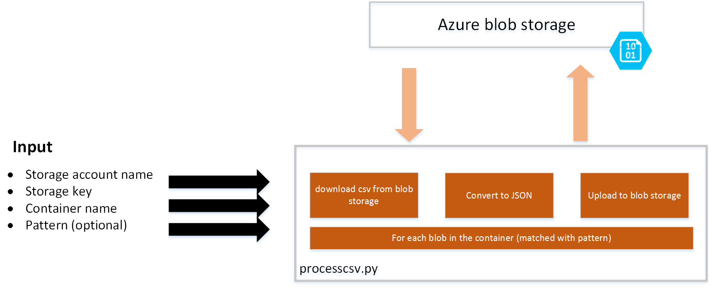
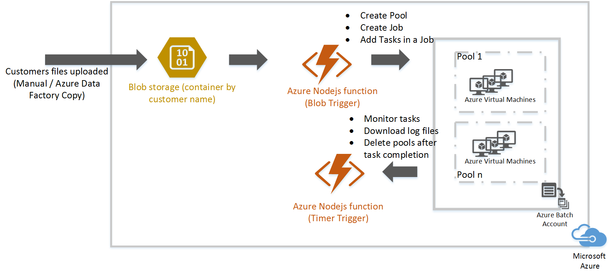
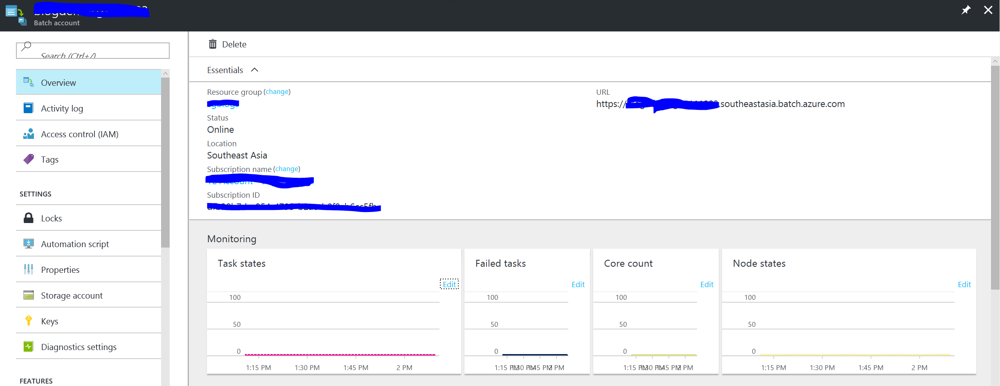

# Get started with Azure Batch Nodejs client

Through this article we will run through the steps to setting up an Azure batch job, deploy tasks and monitor them using the [Nodejs SDK](http://azure.github.io/azure-sdk-for-node/azure-batch/latest/). This article assumes that you have a base understanding of Nodejs and have Nodejs set up and installed on your dev machine.

You can install azure-batch SDK for node through npm:

`npm install azure-batch`

This installs the latest version of azure-batch node SDK.

Now, let's understand the batch scenario we want to work with in more detail and we get into mapping it into Azure batch components right after that.
## The scenario
I was working with a customer, helping them process large number of csv files into JSON. I have a csv to JSON processor Python console app that takes in the storage account details, container name and a blob pattern. It iterates through the blobs in the container that match the pattern downloads them and converts them into JSON, and re-uploads them with a /json pattern. Following figure explains the flow of the processor.

Now, I needed to scale this processor to be able to process a large number of files on a daily basis. The files would be uploaded every four hours or so.

Clearly, Azure batch was a pretty good fit.

However, I also needed a trigger that would deploy this batch job, and after completion of all tasks delete the pools.

I was thinking of using a timmer trigger function. That could deploy a batch job with the python console app and pass the relevant parameters.

## Azure Batch with Nodejs client

If you haven't gone through the overview of Azure Batch service before, I would recommend you read this [detailed overview](https://docs.microsoft.com/en-us/azure/batch/batch-technical-overview) document before proceeding further.

I also know some of you will still skip it :), so I have tried to cover the basics of Azure Batch along with the instructions to create it.

### Step 1: Create an Azure Batch Account

As a first step, let's create an Azure Batch account. You can create it from the [portal](https://docs.microsoft.com/en-us/azure/batch/batch-account-create-portal) or from commandline ([Powershell](https://docs.microsoft.com/en-us/azure/batch/batch-powershell-cmdlets-get-started) /[Azure cli](https://docs.microsoft.com/en-us/azure/batch/batch-cli-get-started)).

Following are the commands to create one through Azure CLI.

Create a Resource Group, skip this step if you already have one where you want to create the Batch Account:

`azure group create --name "<resource-group-name>" --location "<location>"`

Then create an Azure Batch account.
`azure batch account create --location "<location>"  --resource-group "<resource-group-name>" "<batch-account-name>"`

Each Batch account has its corresponding access keys, these keys are needed to create further resources in Azure batch account. A good practice for production environment is to use Azure Key Vault to store these keys, and create a Service principal for the application that can access and download the keys from vault.

`azure batch account keys list --resource-group "<resource-group-name>" "<batch-account-name>"`

Please copy and store the key for further use below.

### Azure Batch Architecture

Now that we have an Azure Batch account, next step will be to setup Batch pools, jobs and tasks. We want to do this programmatically to run every four hours.

Hence, I created an Azure function app and an timer Trigger function. Please refer to the links below on details of how to do this. We will straight jump to the code.

- [Create function app](https://docs.microsoft.com/en-us/azure/azure-functions/functions-create-first-azure-function)
- [Create timer trigger function](https://docs.microsoft.com/en-us/azure/azure-functions/functions-bindings-timer)

Also, you can go to "Kudu Console" in the Azure function's Settings tab to run the npm install commands. In this case to install Azure Batch SDK for Nodejs.

### Create Azure Batch Pool

Following code snippet shows creation of Azure Batch pool of VMs. I am creating multiple pools, each for a specific customer.

>[AZURE.NOTE] Technically, I will be creating multiple trigger functions for each customer. Each function will monitor the corresponding customer storage account container.

    var batch = require('azure-batch');
    var accountName = '<account-name>';
    var accountKey = '<account-key-downloaded>';
    var customerDetails = {
    "customerid":"customerid1",
    "numVMs":4   // Number of VM nodes to create in a pool
    "vmSize":"STANDARD_F4" // VM size nodes in a pool.
    "folders":["folder1","folder2","folder3"...],
    "storage_acc_key": "<storage-account-key>",
    "storage_acc_name": "<storage-account-name>"

    }

    // Create the credentials object using the account name and key
    var credentials = new batch.SharedKeyCredentials(accountName,accountKey);
    var accountUrl  = '<batch-account-url>'
    // Create the Azure Batch client
    var batch_client = new batch.ServiceClient(credentials,'azure batch URI');
    // Creating pool ID
    var poolid = "pool" + customerDetails.customerid;

    // Creating Image reference configuration

    var imgRef = {publisher:"Canonical","offer":"UbuntuServer",sku:"14.04.2-LTS",version:"latest"}

    // Creating the VM configuration
    var vmconfig = {imageReference:imgRef,nodeAgentSKUId:"batch.node.ubuntu 14.04"}

    var vmSize = customerDetails.vmSize
    var numVMs = customerDetails.numVMs

    // Creating the Pool configuration

    var poolConfig = {id:poolid, displayName:poolid,vmSize:vmSize,virtualMachineConfiguration:vmconfig,targetDedicated:numVms,enableAutoScale:false }

    // Creating the Pool for the specific customer

    var pool = batch_client.pool.add(poolConfig,function(error,result){
           console.log(result);
           console.log(error);

       });

We are using Linux VMs, you can get the complete list of VM image options from this [link](https://docs.microsoft.com/en-us/azure/batch/batch-linux-nodes#list-of-virtual-machine-images).

The Azure Batch URI can be found in the Overview tab of the Azure portal. It will be of the format:

https://accountname.location.batch.azure.com

Please refer to the screenshot below:

### Create Azure Batch Job

Once you get a success message, next step is to create a Job. A job is a logical grouping of similar tasks. For example, let's say I have files corresponding to a customer, uploaded once every four hours. I need to convert these files to JSON from csv. My job here would be to process csv files that runs every four hours and I could have multiple tasks in the job each corresponding to a customer.  

The idea is to maximize the node utilization in the pool and use Batch's parallelism to execute operations in parallel. This completely depends on the kind of processing one needs to do. One can use the  property to specify maximum number of tasks that can run concurrently on a single node.

>[AZURE.NOTE] Storage container is a flat structure, when we say a folder within a container we mean a pattern within a blob name.
For example, let's say I have a file on my local computer:

#### folder1\folder2\filename.txt

My blob storage, the container name will be **folder 1** and the blob name will be **folder2\filename.txt**.

In order to retrieve all files in folder2; I will use the Pattern parameter in the storage SDK. In the example above, pattern will be *folder2*

#### Preparation task

The VM nodes created will be blank Ubuntu nodes, you typically will have your own set of programs that you will need to install. I have created a shell script that installs the latest version of Python and also the Azure Storage SDK for python, along with Azure Python SDK. You can refer the files on github using the links provided at the end of the article.

Following code explains adding a preparation task to a job while creating a job. This task will run on all the VM nodes where the specific task needs to run. If you want a task to run on all nodes irrespective of the tasks that it is going to run, you can use the  property while adding a pool. It has similar properties as preparation task described below.

    // Creating a job preparation configuration object:
    // id: is a unique ID for the preparation task
    // commandLine is the command line to execute the app , in this case the shell script
    // resourceFiles: It is an array of objects which provide details of files that need to be downloaded for the task.
        //   blobSource: is the SAS URI
        //   filePath: path to save the filePath
        //   'fileMode':File mode in octal format, only applicable for
             Linux node, default value is 0770
    // waitForSuccess: Set it to true, as false would mean that the tasks can run even if the preparation tasks fails. In our case it is needed to be true.
    // runElevated: Elevated privileges are needed to run the task.

    var job_prep_task_config = {id:"storedatahbasesg",commandLine:"sudo sh startup_prereq.sh > startup.log",resourceFiles:[{'blobSource':'Blob SAS URI','filePath':'startup_prereq.sh'}],waitForSuccess:true,runElevated:true}

     // Setting up Batch pool configuration
        var pool_config = {poolId:poolid}

    // Setting up Job configuration along with preparation task
        var job_config = {id:poolid,displayName:"process csv files",jobPreparationTask:job_prep_task_config,poolInfo:pool_config}

    // Adding Azure batch job to the pool
        var job = batch_client.job.add(job_config,function(error,result){
        console.log(error);
        console.log(result);
        });       

### Creating Azure Batch Tasks for a Job

Now that my job is created along with my preparation task, I will create tasks for that job. In the example we are using, I have multiple sub-folders for a customer. I am going to create multiple task, each corresponding to a folder.

I have accordingly modified the processcsv.py file to accept parameters including the storage keys, folder name(s), year, month, day and hour etc.

>[AZURE.NOTE] It is unsafe to send storage account keys, please do use Azure key vault instead. It's a much secured way of storing and retrieving secret keys. This code is limited to a demonstration of creation of Batch jobs on Azure.

Following is the code

    var folders = customerDetails.folders;
    for(var f=0;f<folders.length;f++)
       {
           var fString = '["' + folders[f] + '"]';

           var date_param = Math.floor((new Date()).getUTCMilliseconds() / 1000)
           var exec_info_config = {startTime: date_param}

           // Setting up the task configuration
           // id: unique ID for the task
           // displayName : User friendly display name
           // commandLine: Command line to execute the task
           // resourceFiles: explained above in the job configuration

           var task_config = {id:memberid+"_"+folders[f] + 'processcsv','displayName':'process csv ' + folders[0],commandLine:'python processcsv.py  --year ' + year + ' --month ' + month +' --day ' + day + ' --hour '+ hour + ' --memberObj \'[{"id":"' + customerid +'","storage_acc_name":"'  
           + customerDetails.storage_acc_name +'","storage_acc_key": "' + customerDetails.storage_acc_key +'","root_path": "incremental","folders":' + fString +'}]\'',resourceFiles:[{'blobSource':'blob SAS URI','filePath':'processcsv.py'}]}

           // Adding task to the pool

           var task = batch_client.task.add(poolid,task_config,function(error,result){
               console.log(error);
               console.log(result);

           });            
       }        

The code above will add multiple tasks to the pool. And each of the tasks will be executed on a node in the pool of VMs created. If the number of tasks exceeds the number of VMs in a pool or the maxTasksPerNode property, the tasks will wait until a node is made available. This orchestration is handled by Azure Batch automatically.

The portal has detailed views on the tasks and job statuses. You can also use the list and get functions in the Azure Node SDK. Details are provided in the documentation [link](http://azure.github.io/azure-sdk-for-node/azure-batch/latest/Job.html). 

#### Github reference
You can find the reference files processcsv.py and the preparation shell script at:

- [processcsv.py](https://github.com/shwetams/blogs/blob/master/azure-batch/src/processcsv.py)
- [Preparation shell script](https://github.com/shwetams/blogs/blob/master/azure-batch/src/startup_prereq.sh)
