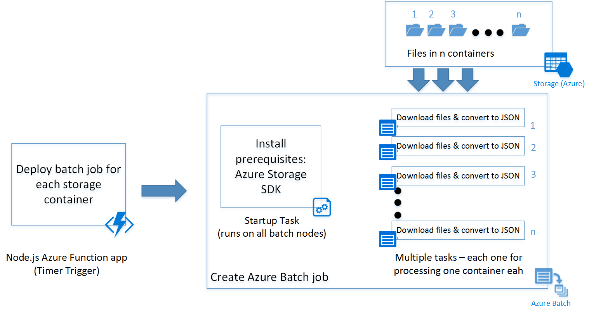

# Get started with Batch SDK for Node.js

Learn the basics of building a Batch client in Node.js using [Azure Batch Node.js SDK](/javascript/api/overview/azure/batch). We take a step by step approach of understanding a scenario for a batch application and then setting it up using a Node.js client.  

## Prerequisites
This article assumes that you have a working knowledge of Node.js and familiarity with Linux. It also assumes that you have an Azure account setup with access rights to create Batch and Storage services.

We recommend reading [Azure Batch Technical Overview](batch-technical-overview.md) before you go through the steps outlined this article.

## The tutorial scenario
Let us understand the batch workflow scenario. We have a simple script written in Python that downloads all csv files from an Azure Blob storage container and converts them to JSON. To process multiple storage account containers in parallel, we can deploy the script as an Azure Batch job.

## Azure Batch Architecture
The following diagram depicts how we can scale the Python script using Azure Batch and a Node.js client.



The node.js client deploys a batch job with a preparation task (explained in detail later) and a set of tasks depending on the number of containers in the storage account. You can download the scripts from the GitHub repository.

* [Node.js client](https://github.com/Azure/azure-batch-samples/blob/master/Node.js/GettingStarted/nodejs_batch_client_sample.js)
* [Preparation task shell scripts](https://github.com/Azure/azure-batch-samples/blob/master/Node.js/GettingStarted/startup_prereq.sh)
* [Python csv to JSON processor](https://github.com/Azure/azure-batch-samples/blob/master/Node.js/GettingStarted/processcsv.py)

> [!TIP]
> The Node.js client in the link specified does not contain specific code to be deployed as an Azure function app. You can refer to the following links for instructions to create one.
> - [Create function app](../azure-functions/functions-create-first-azure-function.md)
> - [Create timer trigger function](../azure-functions/functions-bindings-timer.md)
>
>

## Build the application

Now, let us follow the process step by step into building the Node.js client:

### Step 1: Install Azure Batch SDK

You can install Azure Batch SDK for Node.js using the npm install command.

`npm install azure-batch`

This command installs the latest version of azure-batch node SDK.

>[!Tip]
> In an Azure Function app, you can go to "Kudu Console" in the Azure function's Settings tab to run the npm install commands. In this case to install Azure Batch SDK for Node.js.
>
>

### Step 2: Create an Azure Batch account

You can create it from the [Azure portal](batch-account-create-portal.md) or from command line ([Powershell](batch-powershell-cmdlets-get-started.md) /[Azure cli](/cli/azure)).

Following are the commands to create one through Azure CLI.

Create a Resource Group, skip this step if you already have one where you want to create the Batch Account:

`az group create -n "<resource-group-name>" -l "<location>"`

Next, create an Azure Batch account.

`az batch account create -l "<location>"  -g "<resource-group-name>" -n "<batch-account-name>"`

Each Batch account has its corresponding access keys. These keys are needed to create further resources in Azure batch account. A good practice for production environment is to use Azure Key Vault to store these keys. You can then create a Service principal for the application. Using this service principal the application can create an OAuth token to access keys from the key vault.

`az batch account keys list -g "<resource-group-name>" -n "<batch-account-name>"`

Copy and store the key to be used in the subsequent steps.

### Step 3: Create an Azure Batch service client
Following code snippet first imports the azure-batch Node.js module and then creates a Batch Service client. You need to first create a SharedKeyCredentials object with the Batch account key copied from the previous step.

```nodejs
// Initializing Azure Batch variables

var batch = require('azure-batch');

var accountName = '<azure-batch-account-name>';

var accountKey = '<account-key-downloaded>';

var accountUrl = '<account-url>'

// Create Batch credentials object using account name and account key

var credentials = new batch.SharedKeyCredentials(accountName,accountKey);

// Create Batch service client

var batch_client = new batch.ServiceClient(credentials,accountUrl);

```

The Azure Batch URI can be found in the Overview tab of the Azure portal. It is of the format:

`https://accountname.location.batch.azure.com`

Refer to the screenshot:


### Step 4: Create an Azure Batch pool
An Azure Batch pool consists of multiple VMs (also known as Batch Nodes). Azure Batch service deploys the tasks on these nodes and manages them. You can define the following configuration parameters for your pool.

* Type of Virtual Machine image
* Size of Virtual Machine nodes
* Number of Virtual Machine nodes

> [!Tip]
> The size and number of Virtual Machine nodes largely depend on the number of tasks you want to run in parallel and also the task itself. We recommend testing to determine the ideal number and size.
>
>

The following code snippet creates the configuration parameter objects.

```nodejs
// Creating Image reference configuration for Ubuntu Linux VM
var imgRef = {publisher:"Canonical",offer:"UbuntuServer",sku:"14.04.2-LTS",version:"latest"}

// Creating the VM configuration object with the SKUID
var vmconfig = {imageReference:imgRef,nodeAgentSKUId:"batch.node.ubuntu 14.04"}

// Setting the VM size to Standard F4
var vmSize = "STANDARD_F4"

//Setting number of VMs in the pool to 4
var numVMs = 4
```

> [!Tip]
> For the list of Linux VM images available for Azure Batch and their SKU IDs, see [List of virtual machine images](batch-linux-nodes.md#list-of-virtual-machine-images).
>
>

Once the pool configuration is defined, you can create the Azure Batch pool. The Batch pool command creates Azure Virtual Machine nodes and prepares them to be ready to receive tasks to execute. Each pool should have a unique ID for reference in subsequent steps.

The following code snippet creates an Azure Batch pool.

```nodejs
// Create a unique Azure Batch pool ID
var poolid = "pool" + customerDetails.customerid;
var poolConfig = {id:poolid, displayName:poolid,vmSize:vmSize,virtualMachineConfiguration:vmconfig,targetDedicatedComputeNodes:numVms,enableAutoScale:false };
// Creating the Pool for the specific customer
var pool = batch_client.pool.add(poolConfig,function(error,result){
    if(error!=null){console.log(error.response)};
});
```

You can check the status of the pool created and ensure that the state is in "active" before going ahead with submission of a Job to that pool.

```nodejs
var cloudPool = batch_client.pool.get(poolid,function(error,result,request,response){
        if(error == null)
        {

            if(result.state == "active")
            {
                console.log("Pool is active");
            }
        }
        else
        {
            if(error.statusCode==404)
            {
                console.log("Pool not found yet returned 404...");    

            }
            else
            {
                console.log("Error occurred while retrieving pool data");
            }
        }
        });
```

Following is a sample result object returned by the pool.get function.

```
{ id: 'processcsv_201721152',
  displayName: 'processcsv_201721152',
  url: 'https://<batch-account-name>.centralus.batch.azure.com/pools/processcsv_201721152',
  eTag: '<eTag>',
  lastModified: 2017-03-27T10:28:02.398Z,
  creationTime: 2017-03-27T10:28:02.398Z,
  state: 'active',
  stateTransitionTime: 2017-03-27T10:28:02.398Z,
  allocationState: 'resizing',
  allocationStateTransitionTime: 2017-03-27T10:28:02.398Z,
  vmSize: 'standard_a1',
  virtualMachineConfiguration:
   { imageReference:
      { publisher: 'Canonical',
        offer: 'UbuntuServer',
        sku: '14.04.2-LTS',
        version: 'latest' },
     nodeAgentSKUId: 'batch.node.ubuntu 14.04' },
  resizeTimeout:
   { [Number: 900000]
     _milliseconds: 900000,
     _days: 0,
     _months: 0,
     _data:
      { milliseconds: 0,
        seconds: 0,
        minutes: 15,
        hours: 0,
        days: 0,
        months: 0,
        years: 0 },
     _locale:
      Locale {
        _calendar: [Object],
        _longDateFormat: [Object],
        _invalidDate: 'Invalid date',
        ordinal: [Function: ordinal],
        _ordinalParse: /\d{1,2}(th|st|nd|rd)/,
        _relativeTime: [Object],
        _months: [Object],
        _monthsShort: [Object],
        _week: [Object],
        _weekdays: [Object],
        _weekdaysMin: [Object],
        _weekdaysShort: [Object],
        _meridiemParse: /[ap]\.?m?\.?/i,
        _abbr: 'en',
        _config: [Object],
        _ordinalParseLenient: /\d{1,2}(th|st|nd|rd)|\d{1,2}/ } },
  currentDedicated: 0,
  targetDedicated: 4,
  enableAutoScale: false,
  enableInterNodeCommunication: false,
  maxTasksPerNode: 1,
  taskSchedulingPolicy: { nodeFillType: 'Spread' } }
```


### Step 4: Submit an Azure Batch job
An Azure Batch job is a logical group of similar tasks. In our scenario, it is "Process csv to JSON." Each task here could be processing csv files present in each Azure Storage container.

These tasks would run in parallel and deployed across multiple nodes, orchestrated by the Azure Batch service.

> [!Tip]
> You can use the [maxTasksPerNode](https://azure.github.io/azure-sdk-for-node/azure-batch/latest/Pool.html#add) property to specify maximum number of tasks that can run concurrently on a single node.
>
>

#### Preparation task

The VM nodes created are blank Ubuntu nodes. Often, you need to install a set of programs as prerequisites.
Typically, for Linux nodes you can have a shell script that installs the prerequisites before the actual tasks run. However it could be any programmable executable.
The [shell script](https://github.com/shwetams/azure-batchclient-sample-nodejs/blob/master/startup_prereq.sh) in this example installs Python-pip and the Azure Storage SDK for Python.

You can upload the script on an Azure Storage Account and generate a SAS URI to access the script. This process can also be automated using the Azure Storage Node.js SDK.

> [!Tip]
> A preparation task for a job runs only on the VM nodes where the specific task needs to run. If you want prerequisites to be installed on all nodes irrespective of the tasks that run on it, you can use the [startTask](https://azure.github.io/azure-sdk-for-node/azure-batch/latest/Pool.html#add) property while adding a pool. You can use the following preparation task definition for reference.
>
>

A preparation task is specified during the submission of Azure Batch job. Following are the preparation task configuration parameters:

* **ID**: A unique identifier for the preparation task
* **commandLine**: Command line to execute the task executable
* **resourceFiles**: Array of objects that provide details of files needed to be downloaded for this task to run.  Following are its options
    - blobSource: The SAS URI of the file
    - filePath: Local path to download and save the file
    - fileMode: Only applicable for Linux nodes, fileMode is in octal format with a default value of 0770
* **waitForSuccess**: If set to true, the task does not run on preparation task failures
* **runElevated**: Set it to true if elevated privileges are needed to run the task.

Following code snippet shows the preparation task script configuration sample:

```nodejs
var job_prep_task_config = {id:"installprereq",commandLine:"sudo sh startup_prereq.sh > startup.log",resourceFiles:[{'blobSource':'Blob SAS URI','filePath':'startup_prereq.sh'}],waitForSuccess:true,runElevated:true}
```

If there are no prerequisites to be installed for your tasks to run, you can skip the preparation tasks. Following code creates a job with display name "process csv files."

 ```nodejs
 // Setting up Batch pool configuration
 var pool_config = {poolId:poolid}
 // Setting up Job configuration along with preparation task
 var jobId = "processcsvjob"
 var job_config = {id:jobId,displayName:"process csv files",jobPreparationTask:job_prep_task_config,poolInfo:pool_config}
 // Adding Azure batch job to the pool
 var job = batch_client.job.add(job_config,function(error,result){
     if(error != null)
     {
         console.log("Error submitting job : " + error.response);
     }});
```


### Step 5: Submit Azure Batch tasks for a job

Now that our process csv job is created, let us create tasks for that job. Assuming we have four containers, we have to create four tasks, one for each container.

If we look at the [Python script](https://github.com/shwetams/azure-batchclient-sample-nodejs/blob/master/processcsv.py), it accepts two parameters:

* container name: The Storage container to download files from
* pattern: An optional parameter of file name pattern

Assuming we have four containers "con1", "con2", "con3","con4" following code shows submitting for tasks to the Azure batch job "process csv" we created earlier.

```nodejs
// storing container names in an array
var container_list = ["con1","con2","con3","con4"]
    container_list.forEach(function(val,index){           

           var container_name = val;
           var taskID = container_name + "_process";
           var task_config = {id:taskID,displayName:'process csv in ' + container_name,commandLine:'python processcsv.py --container ' + container_name,resourceFiles:[{'blobSource':'<blob SAS URI>','filePath':'processcsv.py'}]}
           var task = batch_client.task.add(poolid,task_config,function(error,result){
                if(error != null)
                {
                    console.log(error.response);     
                }
                else
                {
                    console.log("Task for container : " + container_name + "submitted successfully");
                }


           });

    });
```

The code adds multiple tasks to the pool. And each of the tasks is executed on a node in the pool of VMs created. If the number of tasks exceeds the number of VMs in a pool or the maxTasksPerNode property, the tasks wait until a node is made available. This orchestration is handled by Azure Batch automatically.

The portal has detailed views on the tasks and job statuses. You can also use the list and get functions in the Azure Node SDK. Details are provided in the documentation [link](https://azure.github.io/azure-sdk-for-node/azure-batch/latest/Job.html).

## Next steps

- Review the [Overview of Azure Batch features](batch-api-basics.md) article, which we recommend if you're new to the service.
- See the [Batch Node.js reference](/javascript/api/overview/azure/batch) to explore the Batch API.

