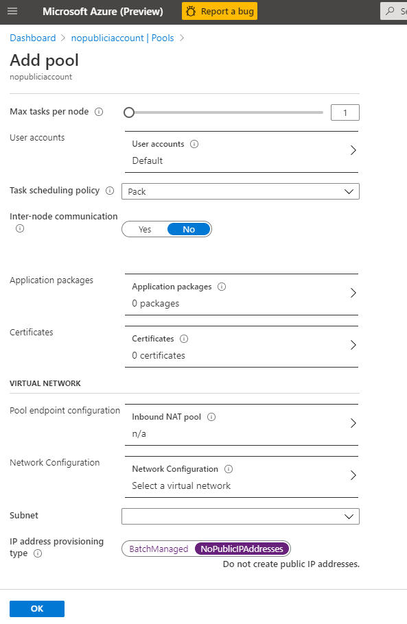

# Create a Batch pool without public IP addresses (preview)

> [!WARNING]
> This preview version will be retired on **31 March 2023**, and will be replaced by
> [Simplified node communication pool without public IP addresses](simplified-node-communication-pool-no-public-ip.md).
> For more information, see the [Retirement Migration Guide](batch-pools-without-public-ip-addresses-classic-retirement-migration-guide.md).

> [!IMPORTANT]
> - Support for pools without public IP addresses in Azure Batch is currently in public preview for the following regions: France Central, East Asia, West Central US, South Central US, West US 2, East US, North Europe, East US 2, Central US, West Europe, North Central US, West US, Australia East, Japan East, Japan West.
> - This preview version is provided without a service level agreement, and it's not recommended for production workloads. Certain features might not be supported or might have constrained capabilities.
> - For more information, see [Supplemental Terms of Use for Microsoft Azure Previews](https://azure.microsoft.com/support/legal/preview-supplemental-terms/).

When you create an Azure Batch pool, you can provision the virtual machine configuration pool without a public IP address. This article explains how to set up a Batch pool without public IP addresses.

## Why use a pool without public IP addresses?

By default, all the compute nodes in an Azure Batch virtual machine configuration pool are assigned a public IP address. This address is used by the Batch service to schedule tasks and for communication with compute nodes, including outbound access to the internet.

To restrict access to these nodes and reduce the discoverability of these nodes from the internet, you can provision the pool without public IP addresses.

## Prerequisites

- **Authentication**. To use a pool without public IP addresses inside a [virtual network](./batch-virtual-network.md), the Batch client API must use Microsoft Entra authentication. Azure Batch support for Microsoft Entra ID is documented in [Authenticate Batch service solutions with Active Directory](batch-aad-auth.md). If you aren't creating your pool within a virtual network, either Microsoft Entra authentication or key-based authentication can be used.

- **An Azure VNet**. If you're creating your pool in a [virtual network](batch-virtual-network.md), follow these  requirements and configurations. To prepare a VNet with one or more subnets in advance, you can use the Azure portal, Azure PowerShell, the Azure CLI, or other methods.

  - The VNet must be in the same subscription and region as the Batch account you use to create your pool.

  - The subnet specified for the pool must have enough unassigned IP addresses to accommodate the number of VMs targeted for the pool; that is, the sum of the `targetDedicatedNodes` and `targetLowPriorityNodes` properties of the pool. If the subnet doesn't have enough unassigned IP addresses, the pool partially allocates the compute nodes, and a resize error occurs.

  - You must disable private link service and endpoint network policies. This action can be done by using Azure CLI:

    `az network vnet subnet update --vnet-name <vnetname> -n <subnetname> --resource-group <resourcegroup> --disable-private-endpoint-network-policies --disable-private-link-service-network-policies`

> [!IMPORTANT]
> For each 100 dedicated or Spot nodes, Batch allocates one private link service and one load balancer. These resources are limited by the subscription's [resource quotas](../azure-resource-manager/management/azure-subscription-service-limits.md). For large pools, you might need to [request a quota increase](batch-quota-limit.md#increase-a-quota) for one or more of these resources. Additionally, no resource locks should be applied to any resource created by Batch, since this prevent cleanup of resources as a result of user-initiated actions such as deleting a pool or resizing to zero.

## Current limitations

1. Pools without public IP addresses must use Virtual Machine Configuration and not Cloud Services Configuration.
1. [Custom endpoint configuration](pool-endpoint-configuration.md) to Batch compute nodes doesn't work with pools without public IP addresses.
1. Because there are no public IP addresses, you can't [use your own specified public IP addresses](create-pool-public-ip.md) with this type of pool.
1. [Basic VM size](../virtual-machines/sizes-previous-gen.md#basic-a) doesn't work with pools without public IP addresses.

## Create a pool without public IP addresses in the Azure portal

1. Navigate to your Batch account in the Azure portal.
1. In the **Settings** window on the left, select **Pools**.
1. In the **Pools** window, select **Add**.
1. On the **Add Pool** window, select the option you intend to use from the **Image Type** dropdown.
1. Select the correct **Publisher/Offer/Sku** of your image.
1. Specify the remaining required settings, including the **Node size**, **Target dedicated nodes**, and **Target Spot/low-priority nodes**, and any desired optional settings.
1. Optionally select a virtual network and subnet you wish to use. This virtual network must be in the same resource group as the pool you're creating.
1. In **IP address provisioning type**, select **NoPublicIPAddresses**.



## Use the Batch REST API to create a pool without public IP addresses

The example below shows how to use the [Batch Service REST API](/rest/api/batchservice/pool/add) to create a pool that uses public IP addresses.

### REST API URI

```http
POST {batchURL}/pools?api-version=2020-03-01.11.0
client-request-id: 00000000-0000-0000-0000-000000000000
```

### Request body

```json
"pool": {
     "id": "pool2",
     "vmSize": "standard_a1",
     "virtualMachineConfiguration": {
          "imageReference": {
               "publisher": "Canonical",
               "offer": "UbuntuServer",
               "sku": "20.04-lts"
          },
          "nodeAgentSKUId": "batch.node.ubuntu 20.04"
     }
     "networkConfiguration": {
          "subnetId": "/subscriptions/<your_subscription_id>/resourceGroups/<your_resource_group>/providers/Microsoft.Network/virtualNetworks/<your_vnet_name>/subnets/<your_subnet_name>",
          "publicIPAddressConfiguration": {
               "provision": "NoPublicIPAddresses"
          }
     },
     "resizeTimeout": "PT15M",
     "targetDedicatedNodes": 5,
     "targetLowPriorityNodes": 0,
     "taskSlotsPerNode": 3,
     "taskSchedulingPolicy": {
          "nodeFillType": "spread"
     },
     "enableAutoScale": false,
     "enableInterNodeCommunication": true,
     "metadata": [
          {
               "name": "myproperty",
               "value": "myvalue"
          }
     ]
}
```

> [!Important]
> This document references a release version of Linux that is nearing or at, End of Life(EOL). Please consider updating to a more current version.

## Outbound access to the internet

In a pool without public IP addresses, your virtual machines won't be able to access the public internet unless you configure your network setup appropriately, such as by using [virtual network NAT](../virtual-network/nat-gateway/nat-overview.md). NAT only allows outbound access to the internet from the virtual machines in the virtual network. Batch-created compute nodes won't be publicly accessible, since they don't have public IP addresses associated.

Another way to provide outbound connectivity is to use a user-defined route (UDR). This method lets you route traffic to a proxy machine that has public internet access.

## Next steps

- Learn more about [creating pools in a virtual network](batch-virtual-network.md).
- Learn how to [use private endpoints with Batch accounts](private-connectivity.md).
