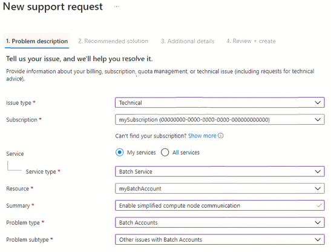
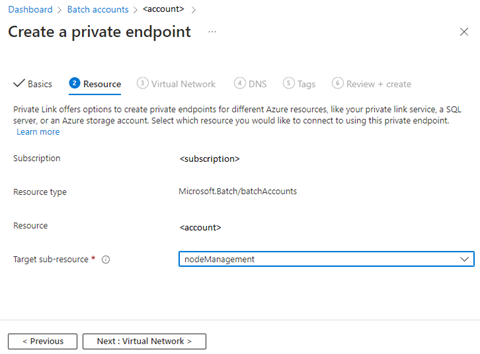
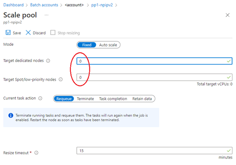
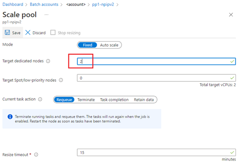

# Batch Pools without Public IP Addresses Classic Retirement Migration Guide

By default, all the compute nodes in an Azure Batch virtual machine (VM) configuration pool are assigned a public IP address. This address is used by the Batch service to schedule tasks and for communication with compute nodes, including outbound access to the internet. To restrict access to these nodes and reduce the discoverability of these nodes from the internet, we released [Batch pools without public IP addresses (classic)](./batch-pool-no-public-ip-address.md).

In late 2021, we launched a simplified compute node communication model for Azure Batch. The new communication model improves security and simplifies the user experience. Batch pools no longer require inbound Internet access and outbound access to Azure Storage, only outbound access to the Batch service. As a result, Batch pools without public IP addresses (classic) which is currently in public preview will be retired on **31 March 2023**, and will be replaced with simplified compute node communication pools without public IPs.

## Retirement alternatives

[Simplified Compute Node Communication Pools without Public IPs](./simplified-node-communication-pool-no-public-ip.md) requires using simplified compute node communication. It provides customers with enhanced security for their workload environments on network isolation and data exfiltration to Azure Batch accounts. Its key benefits include:

* Allow creating simplified node communication pool without public IP addresses.
* Support Batch private pool using a new private endpoint (sub-resource nodeManagement) for Azure Batch account.
* Simplified private link DNS zone for Batch account private endpoints: changed from **privatelink.\<region>.batch.azure.com** to **privatelink.batch.azure.com**.
* Mutable public network access for Batch accounts.
* Firewall support for Batch account public endpoints: configure IP address network rules to restrict public network access with Batch accounts.

## Migration steps

Batch pool without public IP addresses (classic) will retire on **31/2023 and will be updated to simplified compute node communication pools without public IPs. For existing pools that use the previous preview version of Batch pool without public IP addresses (classic), it's only possible to migrate pools created in a virtual network. To migrate the pool, follow the opt-in process for simplified compute node communication:

1. Opt in to [use simplified compute node communication](./simplified-compute-node-communication.md#opt-your-batch-account-in-or-out-of-simplified-compute-node-communication).

   

2. Create a private endpoint for Batch node management in the virtual network.

   

3. Scale down the pool to zero nodes.

   

4. Scale out the pool again. The pool is then automatically migrated to the new version of the preview.

   

## FAQ

* How can I migrate my Batch pool without public IP addresses (classic) to simplified compute node communication pools without public IPs?

    You can only migrate your pool to simplified compute node communication pools if it was created in a virtual network. Otherwise, you’d need to create a new simplified compute node communication pool without public IPs.

* What differences will I see in billing?

    Compared with Batch pools without public IP addresses (classic), the simplified compute node communication pools without public IPs support will reduce costs because it won’t need to create network resources the following: load balancer, network security groups, and private link service with the Batch pool deployments. However, there will be a [cost associated with  private link](https://azure.microsoft.com/pricing/details/private-link/) or other outbound network connectivity used by pools, as controlled by the user, to allow communication with the Batch service without public IP addresses.

* Will there be any performance changes?

    No known performance differences compared to Batch pools without public IP addresses (classic).

* How can I connect to my pool nodes for troubleshooting?

    Similar to Batch pools without public IP addresses (classic). As there is no public IP address for the Batch pool, users will need to connect their pool nodes from within the virtual network. You can create a jump box VM in the virtual network or use other remote connectivity solutions like [Azure Bastion](../bastion/bastion-overview.md).

* Will there be any change to how my workloads are downloaded from Azure Storage?

    Similar to Batch pools without public IP addresses (classic), users will need to provide their own internet outbound connectivity if their workloads need access to other resources like Azure Storage.

* What if I don’t migrate to simplified compute node communication pools without public IPs?

    After **31 March 2023**, we will stop supporting Batch pool without public IP addresses. The functionality of the existing pool in that configuration may break, such as scale out operations, or may be actively scaled down to zero at any point in time after that date.

## Next steps

For more information, refer to [Simplified compute node communication](./simplified-compute-node-communication.md).
