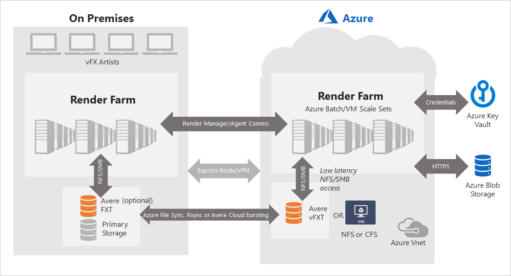
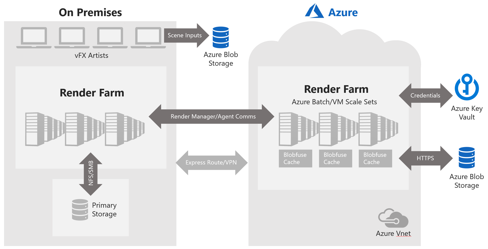
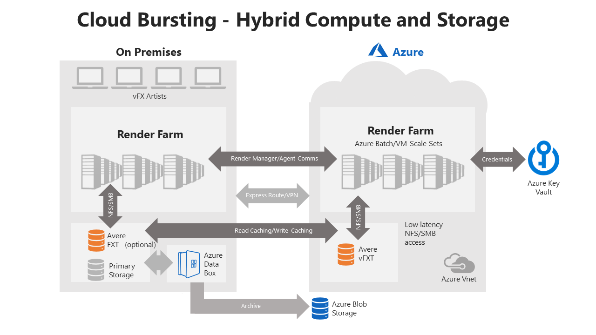

# Reference architectures for Azure rendering

This article shows high-level architecture diagrams for scenarios to extend, or "burst", an on-premises render farm to Azure. The examples show different options for Azure compute, networking, and storage services.

## Hybrid with NFS or CFS

The following diagram shows a hybrid scenario that includes the following Azure services:

* **Compute** - Azure Batch pool or Virtual Machine Scale Set.

* **Network** - On-premises: Azure ExpressRoute or VPN. Azure: Azure VNet.

* **Storage** - Input and output files: NFS or CFS using Azure VMs, synchronized with on-premises storage via Azure File Sync or RSync. Alternatively: Avere vFXT to input or output files from on-premises NAS devices using NFS.

  

## Hybrid with Blobfuse

The following diagram shows a hybrid scenario that includes the following Azure services:

* **Compute** - Azure Batch pool or Virtual Machine Scale Set.

* **Network** - On-premises: Azure ExpressRoute or VPN. Azure: Azure VNet.

* **Storage** - Input and output files: Blob storage, mounted to compute resources via Azure Blobfuse.

  

## Hybrid compute and storage

The following diagram shows a fully connected hybrid scenario for both compute and storage and includes the following Azure services:

* **Compute** - Azure Batch pool or Virtual Machine Scale Set.

* **Network** - On-premises: Azure ExpressRoute or VPN. Azure: Azure VNet.

* **Storage** - Cross-premises: Avere vFXT. Optional archiving of on-premises files via Azure Data Box to Blob storage, or on-premises Avere FXT for NAS acceleration.

  

## Next steps

* Learn more about using [Render managers](batch-rendering-render-managers.md) with Azure Batch.

* Learn more about options for [Rendering in Azure](batch-rendering-service.md).