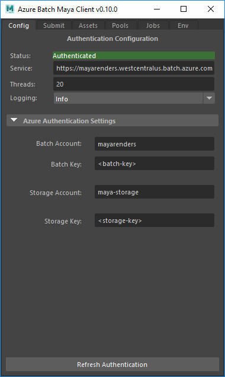
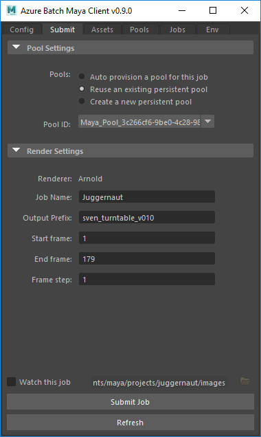
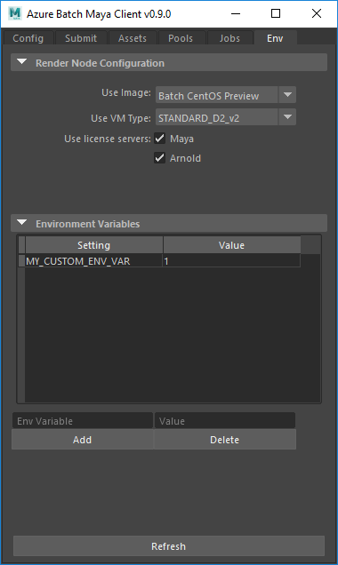
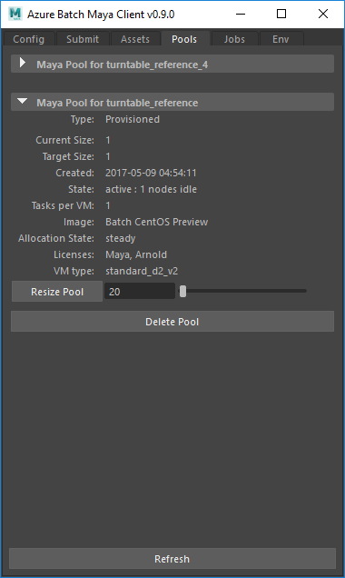
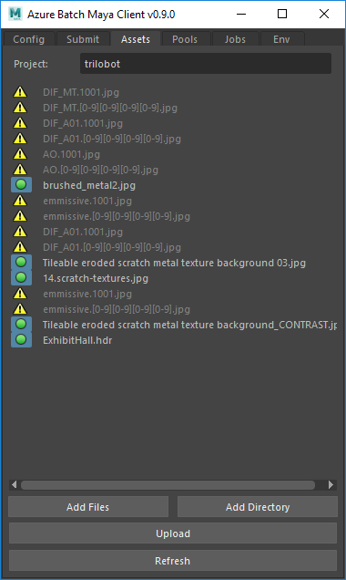
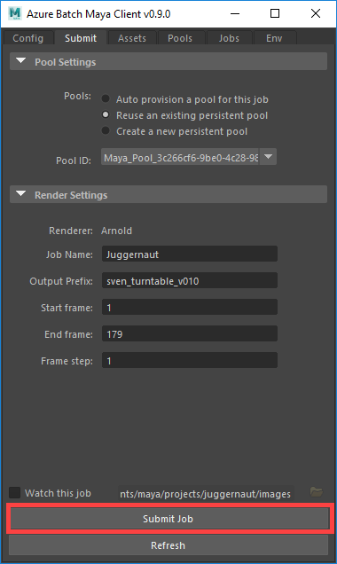
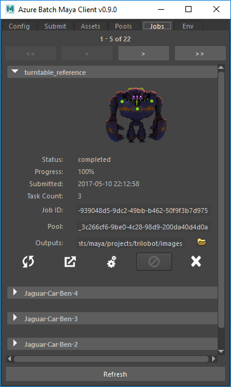

# Get started with the Batch Rendering service

The Azure Batch Rendering service offers cloud-scale rendering capabilities on a pay-per-use basis. The Batch Rendering service handles job scheduling and queueing, managing failures and retries, and auto-scaling for your render job. The Batch Rendering service supports Autodesk Maya, 3ds Max, and Arnold, with support for other applications coming soon. The Batch plug-in for Maya 2017 makes it easy to start a rendering job on Azure right from your desktop. 

## Supported applications

The Batch Rendering service currently supports the following applications:

- Autodesk Maya
- Autodesk 3ds Max
- Autodesk Arnold

## Prerequisites

To use the Batch Rendering service, you need:

- An [Azure account](https://azure.microsoft.com/free/). 
- **An Azure Batch account.** For guidance on creating a Batch account in the Azure portal, see [Create a Batch account with the Azure portal](batch-account-create-portal.md).
- **An Azure Storage account.** The assets used for your rendering job are stored in Azure Storage. You can create a storage account automatically when you set up your Batch account. You can also use an existing storage account. To learn more about Storage accounts, see [How to create, manage, or delete a storage account in the Azure portal](https://docs.microsoft.com/azure/storage/storage-create-storage-account).

To use the Batch plug-in for Maya, you need:

- **Maya 2017**
- **Arnold for Maya**

You can also use the [Azure portal](https://portal.azure.com) to create pools of virtual machines that are pre-configured with Maya, 3ds Max, and Arnold. You can use the portal to monitor jobs and diagnose failed tasks by downloading application logs and by remotely connecting to individual VMs using RDP or SSH.

## Basic Batch concepts

Before you begin using the Batch Rendering service, it's helpful to be familiar with a few Batch concepts, including compute nodes, pools, and jobs. To learn more about Azure Batch in general, see [Run intrinsically parallel workloads with Batch](batch-technical-overview.md).

### Pools

Batch is a platform service for running compute-intensive work, like rendering, on a **pool** of **compute nodes**. Each compute node in a pool is an Azure virtual machine (VM) running either Linux or Windows. 

For more information about Batch pools and compute nodes, see the [Pool](batch-api-basics.md#pool) and [Compute node](batch-api-basics.md#compute-node) sections in [Develop large-scale parallel compute solutions with Batch](batch-api-basics.md).

### Jobs

A Batch **job** is a collection of tasks that run on the compute nodes in a pool. When you submit a rendering job, Batch divides the job into tasks and distributes the tasks to the compute nodes in the pool to run.

For more information about Batch jobs, see the [Job](batch-api-basics.md#job) section in [Develop large-scale parallel compute solutions with Batch](batch-api-basics.md).

## Use the Batch plug-in for Maya to submit a render job

With the Batch plug-in for Maya, you can submit a job to the Batch Rendering service right from Maya. The following sections describe how to configure the job from the plug-in and then submit it. 

### Load the Batch plug-in in Maya

The Batch plug-in is available on [GitHub](https://github.com/Azure/azure-batch-maya/releases). Unzip the archive to a directory of your choice. You can load the plug-in directly from the *azure_batch_maya* directory.

To load the plug-in in Maya:

1. Run Maya.
2. Open **Window** > **Settings/Preferences** > **Plug-in Manager**.
3. Click **Browse**.
4. Navigate to and select *azure_batch_maya/plug-in/AzureBatch.py*.

### Authenticate access to your Batch and Storage accounts

To use the plug-in, you need to authenticate using your Azure Batch and Azure Storage account keys. To retrieve your account keys:

1. Display the plug-in in Maya, and select the **Config** tab.
2. Navigate to the [Azure portal](https://portal.azure.com).
3. Select **Batch Accounts** from the left-hand menu. If necessary, click **More Services** and filter on _Batch_.
4. Locate the desired Batch account in the list.
5. Select the **Keys** menu item to display your account name, account URL, and access keys:
    - Paste the Batch account URL into the **Service** field in the Batch plug-in.
    - Paste the account name into the **Batch Account** field.
    - Paste the primary account key into the **Batch Key** field.
7. Select Storage Accounts from the left-hand menu. If necessary, click **More Services** and filter on _Storage_.
8. Locate the desired Storage account in the list.
9. Select the **Access Keys** menu item to display the storage account name and keys.
    - Paste the Storage account name into the **Storage Account** field in the Batch plug-in.
    - Paste the primary account key into the **Storage Key** field.
10. Click **Authenticate** to ensure that the plug-in can access both accounts.

Once you have successfully authenticated, the plug-in sets the status field to **Authenticated**: 

### Configure a pool for a render job

After you have authenticated your Batch and Storage accounts, set up a pool for your rendering job. The plug-in saves your selections between sessions. Once you've set up your preferred configuration, you won't need to modify it unless it changes.

The following sections walk you through the available options, available on the **Submit** tab:

#### Specify a new or existing pool

To specify a pool on which to run the render job, select the **Submit** tab. This tab offers options for creating a pool or selecting an existing pool:

- You can **auto provision a pool for this job** (the default option). When you choose this option, Batch creates the pool exclusively for the current job, and automatically deletes the pool when the render job is complete. This option is best when you have a single render job to complete.
- You can **reuse an existing persistent pool**. If you have an existing pool that is idle, you can specify that pool for running the render job by selecting it from the dropdown. Reusing an existing persistent pool saves the time required to provision the pool.  
- You can **create a new persistent pool**. Choosing this option creates a new pool for running the job. It does not delete the pool when the job is complete, so that you can reuse it for future jobs. Select this option when you have a continuous need to run render jobs. On subsequent jobs, you can select **reuse an existing persistent pool** to use the persistent pool that you created for the first job.

For more information on how charges accrue for Azure VMs, see the [Linux Pricing FAQ](https://azure.microsoft.com/pricing/details/virtual-machines/linux/#faq) and [Windows Pricing FAQ](https://azure.microsoft.com/pricing/details/virtual-machines/windows/#faq).

#### Specify the OS image to provision

You can specify the type of OS image to use to provision compute nodes in the pool on the **Env** (Environment) tab. Batch currently supports the following image options for rendering jobs:

|Operating System  |Image  |
|---------|---------|
|Linux     |Batch CentOS Preview |
|Windows     |Batch Windows Preview |

#### Choose a VM size

You can specify the VM size on the **Env** tab. For more information about available VM sizes, see [Linux VM sizes in Azure](https://docs.microsoft.com/azure/virtual-machines/linux/sizes) and [Windows VM sizes in Azure](https://docs.microsoft.com/azure/virtual-machines/windows/sizes). 

#### Specify licensing options

You can specify the licenses you wish to use on the **Env** tab. Options include:

- **Maya**, which is enabled by default.
- **Arnold**, which is enabled if Arnold is detected as the active render engine in Maya.

 If you wish to render using your own license, you can configure your license end point by adding the appropriate environment variables to the table. Be sure to deselect the default licensing options if you do so.

> [!IMPORTANT]
> You are billed for use of the licenses while VMs are running in the pool, even if the VMs are not currently being used for rendering. To avoid extra charges, navigate to the **Pools** tab and resize the pool to 0 nodes until you are ready to run another render job. 
>
>

#### Manage persistent pools

You can manage an existing persistent pool on the **Pools** tab. Selecting a pool from the list displays the current state of the pool.

From the **Pools** tab, you can also delete the pool and resize the number of VMs in the pool. You can resize a pool to 0 nodes to avoid incurring costs in between workloads.

### Configure a render job for submission

Once you have specified the parameters for the pool that will run the render job, configure the job itself. 

#### Specify scene parameters

The Batch plug-in detects which rendering engine you're currently using in Maya, and displays the appropriate render settings on the **Submit** tab. These settings include the start frame, end frame, output prefix, and frame step. You can override the scene file render settings by specifying different settings in the plug-in. Changes you make to the plug-in settings are not persisted back to the scene file render settings, so you can make changes on a job-by-job basis without needing to reupload the scene file.

The plug-in warns you if the render engine that you selected in Maya is not supported.

If you load a new scene while the plug-in is open, click the **Refresh** button to make sure the settings are updated.

#### Resolve asset paths

When you load the plug-in, it scans the scene file for any external file references. These references are displayed in the **Assets** tab. If a referenced path cannot be resolved, the plug-in attempts to locate the file in a few default locations, including:

- The location of the scene file 
- The current project's _sourceimages_ directory
- The current working directory. 

If the asset still cannot be located, it is listed with a warning icon:

If you know the location of an unresolved file reference, you can click the warning icon to be prompted to add a search path. The plug-in then uses this search path to attempt to resolve any missing assets. You can add any number of additional search paths.

When a reference is resolved, it is listed with a green light icon:

If your scene requires other files that the plug-in has not detected, you can add additional files or directories. Use the **Add Files** and **Add Directory** buttons. If you load a new scene while the plug-in is open, be sure to click **Refresh** to update the scene's references.

#### Upload assets to an asset project

When you submit a render job, the referenced files displayed in the **Assets** tab are automatically uploaded to Azure Storage as an asset project. You can also upload the asset files independently of a render job, using the **Upload** button on the **Assets** tab. The asset project name is specified in the **Project** field and is named after the current Maya project by default. When asset files are uploaded, the local file structure is preserved. 

Once uploaded, assets can be referenced by any number of render jobs. All uploaded assets are available to any job that references the asset project, whether or not they are included in the scene. To change the asset project referenced by your next job, change the name in the **Project** field in the **Assets** tab. If there are referenced files that you wish to exclude from uploading, unselect them using the green button beside the listing.

#### Submit and monitor the render job

After you have configured the render job in the plug-in, click the **Submit Job** button on the **Submit** tab to submit the job to Batch:

You can monitor a job that is in progress from the **Jobs** tab on the plug-in. Select a job from the list to display the current state of the job. You can also use this tab to cancel and delete jobs, as well as to download the outputs and rendering logs. 

To download outputs, modify the **Outputs** field to set the desired destination directory. Click the gear icon to start a background process that watches the job and downloads outputs as it progresses: 

You can close Maya without disrupting the download process.

## Next steps

To learn more about Batch, see [Run intrinsically parallel workloads with Batch](batch-technical-overview.md).