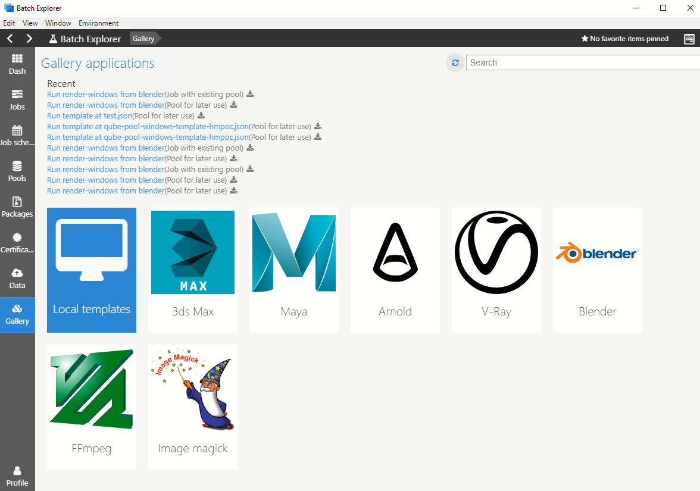

# Using Azure Batch rendering

There are several ways to use Azure Batch rendering:

* APIs:
  * Write code using any of the Batch APIs.  Developers can integrate Azure Batch capabilities into their existing applications or workflow, whether cloud or based on-premises.
* Command line tools:
  * The [Azure command line](https://docs.microsoft.com/cli/azure/) or [PowerShell](https://docs.microsoft.com/powershell/azure/overview) can be used to script Batch use.
  * In particular, the [Batch CLI template support](https://docs.microsoft.com/azure/batch/batch-cli-templates) makes it much easier to create pools and submit jobs.
* Batch Explorer UI:
  * [Batch Explorer](https://github.com/Azure/BatchLabs) is a cross-platform client tool that also allows Batch accounts to be managed and monitored.
  * For each of the rendering applications, a number of pool and job templates are provided that can be used to easily create pools and to submit jobs.  A set of templates is listed in the application UI, with the template files being accessed from GitHub.
  * Custom templates can be authored from scratch or the supplied templates from GitHub can be copied and modified.
* Client application plug-ins:
  * Plug-ins are available that allow Batch rendering to be used from directly within the client design and modeling applications.  The plug-ins mainly invoke the Batch Explorer application with contextual information about the current 3D model and includes features to help manage assets.

The best way to try Azure Batch rendering and simplest way for end-users, who are not developers and not Azure experts, is to use the Batch Explorer application, either directly or invoked from a client application plug-in.

## Using Batch Explorer

For a step-by-step tutorial for using Batch Explorer to perform rendering see the [Blender tutorial](https://docs.microsoft.com/azure/batch/tutorial-rendering-batchexplorer-blender).

### Download and Install

Batch Explorer [downloads are available](https://azure.github.io/BatchExplorer/) for Windows, OSX, and Linux.

### Using templates to create pools and run jobs

A comprehensive set of templates is available for use with Batch Explorer that makes it easy to create pools and submit jobs for the various rendering applications without having to specify all the properties required to create pools, jobs, and tasks directly with Batch.  The templates available in Batch Explorer are stored and visible in [a GitHub repository](https://github.com/Azure/BatchExplorer-data/tree/master/ncj).

Templates are provided that cater for all the applications present on the Marketplace rendering VM images.  For each application multiple templates exist, including pool templates to cater for CPU and GPU pools, Windows and Linux pools; job templates include full frame or tiled Blender rendering and V-Ray distributed rendering. The set of supplied templates will be expanded over time to cater for other Batch capabilities, such as pool auto-scaling.

It's also possible for custom templates to be produced, from scratch or by modifying the supplied templates. Custom templates can be used by selecting the ‘Local templates’ item in the ‘Gallery’ section of Batch Explorer.

### File system and data movement

The ‘Data’ section in Batch Explorer allows files to be copied between a local file system and Azure Storage accounts.

## Client application plug-ins

Plug-ins are available for some of the client applications.  The plug-ins allow pools and jobs to be created directly from the application or invoke Batch Explorer.

* [Blender](https://github.com/Azure/azure-batch-rendering/tree/master/plugins/blender)
* [Autodesk 3ds Max](https://github.com/Azure/azure-batch-rendering/tree/master/plugins/3ds-max)
* [Autodesk Maya](https://github.com/Azure/azure-batch-maya)

## Next steps

For examples of Batch rendering try out the two tutorials:

* [Rendering using the Azure CLI](https://docs.microsoft.com/azure/batch/tutorial-rendering-cli)
* [Rendering using Batch Explorer](https://docs.microsoft.com/azure/batch/tutorial-rendering-batchexplorer-blender)