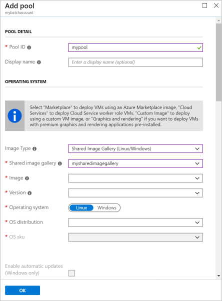

# Use the Azure Compute Gallery to create a custom image pool

When you create an Azure Batch pool using the Virtual Machine Configuration, you specify a VM image that provides the operating system for each compute node in the pool. You can create a pool of virtual machines either with a supported Azure Marketplace image or create a custom image with an [Azure Compute Gallery image](../virtual-machines/shared-image-galleries.md).

## Benefits of the Azure Compute Gallery

When you use the Azure Compute Gallery for your custom image, you have control over the operating system type and configuration, as well as the type of data disks. Your Shared Image can include applications and reference data that become available on all the Batch pool nodes as soon as they're provisioned.

You can also have multiple versions of an image as needed for your environment. When you use an image version to create a VM, the image version is used to create new disks for the VM.

Using a Shared Image saves time in preparing your pool's compute nodes to run your Batch workload. It's possible to use an Azure Marketplace image and install software on each compute node after provisioning, but using a Shared Image is typically more efficient. Additionally, you can specify multiple replicas for the Shared Image so when you create pools with many VMs (more than 600 VMs), you'll save time on pool creation.

Using a Shared Image configured for your scenario can provide several advantages:

- **Use the same images across the regions.** You can create Shared Image replicas across different regions so all your pools utilize the same image.
- **Configure the operating system (OS).** You can customize the configuration of the image's operating system disk.
- **Pre-install applications.** Pre-installing applications on the OS disk is more efficient and less error-prone than installing applications after provisioning the compute nodes with a start task.
- **Copy large amounts of data once.** Make static data part of the managed Shared Image by copying it to a managed image's data disks. This only needs to be done once and makes data available to each node of the pool.
- **Grow pools to larger sizes.** With the Azure Compute Gallery, you can create larger pools with your customized images along with more Shared Image replicas.
- **Better performance than using just a managed image as a custom image.** For a Shared Image custom image pool, the time to reach the steady state is up to 25% faster, and the VM idle latency is up to 30% shorter.
- **Image versioning and grouping for easier management.** The image grouping definition contains information about why the image was created, what OS it is for, and information about using the image. Grouping images allows for easier image management. For more information, see [Image definitions](../virtual-machines/shared-image-galleries.md#image-definitions).

## Prerequisites

- **An Azure Batch account.** To create a Batch account, see the Batch quickstarts using the [Azure portal](quick-create-portal.md) or [Azure CLI](quick-create-cli.md).

> [!NOTE]
> Authentication using Microsoft Entra ID is required. If you use Shared Key Auth, you will get an authentication error.

- **an Azure Compute Gallery image**. To create a Shared Image, you need to have or create a managed image resource. The image should be created from snapshots of the VM's OS disk and optionally its attached data disks.

> [!NOTE]
> If the Shared Image is not in the same subscription as the Batch account, you must [register the Microsoft.Batch resource provider](../azure-resource-manager/management/resource-providers-and-types.md#register-resource-provider) for that subscription. The two subscriptions must be in the same Microsoft Entra tenant.
>
> The image can be in a different region as long as it has replicas in the same region as your Batch account.

If you use a Microsoft Entra application to create a custom image pool with an Azure Compute Gallery image, that application must have been granted an [Azure built-in role](../role-based-access-control/rbac-and-directory-admin-roles.md#azure-roles) that gives it access to the Shared Image. You can grant this access in the Azure portal by navigating to the Shared Image, selecting **Access control (IAM)** and adding a role assignment for the application.

> [!NOTE]
> Reader permissions for the Azure Compute Gallery image are inadequate as they necessitate the execution of the following minimum action: Microsoft.Compute/disks/beginGetAccess/action for appropriate access.


## Prepare a Shared Image

In Azure, you can prepare a shared image from a managed image, which can be created from:

- Snapshots of an Azure VM's OS and data disks
- A generalized Azure VM with managed disks
- A generalized on-premises VHD uploaded to the cloud

> [!NOTE]
> Batch only supports generalized Shared Images; a specialized Shared Image can't be used to create a pool.

The following steps show how to prepare a VM, take a snapshot, and create an image from the snapshot.

### Prepare a VM

If you're creating a new VM for the image, use Azure Marketplace image supported by Batch as the base image for your managed image.

To get a full list of current Azure Marketplace image references supported by Azure Batch, use one of the following APIs to return a list of Windows and Linux VM images:

- PowerShell: [Azure Batch supported images](/powershell/module/az.batch/get-azbatchsupportedimage)
- Azure CLI:  [Azure Batch pool supported images](/cli/azure/batch/pool/supported-images)
- Batch service APIs: [Batch service APIs](batch-apis-tools.md#batch-service-apis) and [Azure Batch service supported images](/rest/api/batchservice/account/listsupportedimages)

Follow these guidelines when creating VMs:

- Ensure the VM is created with a managed disk. This is the default storage setting when you create a VM.
- Don't install Azure extensions, such as the Custom Script extension, on the VM. If the image contains a pre-installed extension, Azure may encounter problems when deploying the Batch pool.
- When using attached data disks, you need to mount and format the disks from within a VM to use them.
- Ensure that the base OS image you provide uses the default temp drive. The Batch node agent currently expects the default temp drive.
- Ensure that the OS disk isn't encrypted.
- Once the VM is running, connect to it via RDP (for Windows) or SSH (for Linux). Install any necessary software or copy desired data.
- For faster pool provisioning, use the [ReadWrite disk cache setting](../virtual-machines/premium-storage-performance.md#disk-caching) for the VM's OS disk.

### Create an Azure Compute Gallery
 
You need to create an Azure Compute Gallery to make your custom image available. Select this gallery when creating image in the following steps. To learn how to create an Azure Compute Gallery for your images, see [Create an Azure Compute Gallery](../virtual-machines/create-gallery.md).
 
### Create an image
 
To create an image from a VM in the portal, see [Capture an image of a VM](../virtual-machines/capture-image-portal.md).
 
To create an image using a source other than a VM, see [Create an image](../virtual-machines/image-version.md).

> [!NOTE]
> If the base image has purchase plan information, ensure that the gallery image has identical purchase plan information as the base image. For more information on creating image which has purchase plan, refer to [Supply Azure Marketplace purchase plan information when creating images](../virtual-machines/marketplace-images.md).
>
> If the base image does not have purchase plan information, avoid specifying any purchase plan information for the gallery image.
> 
> For the purchase plan information about these Marketplace images, see the guidance for [Linux](../virtual-machines/linux/cli-ps-findimage.md#check-the-purchase-plan-information) or [Windows](../virtual-machines/windows/cli-ps-findimage.md#view-purchase-plan-properties) VMs.
> 
> Use Azure PowerShell [Get-AzGalleryImageDefinition](/powershell/module/az.compute/get-azgalleryimagedefinition) or Azure CLI  [az sig image-definition show](/cli/azure/sig/image-definition#az-sig-image-definition-show) to check whether the gallery image has correct plan information.
 
 
## Create a pool from a Shared Image using the Azure CLI

To create a pool from your Shared Image using the Azure CLI, use the `az batch pool create` command. Specify the Shared Image ID in the `--image` field. Make sure the OS type and SKU matches the versions specified by `--node-agent-sku-id`

> [!IMPORTANT]
> The node agent SKU id must align with the publisher/offer/SKU in order for the node to start.

```azurecli
az batch pool create \
    --id mypool --vm-size Standard_A1_v2 \
    --target-dedicated-nodes 2 \
    --image "/subscriptions/{sub id}/resourceGroups/{resource group name}/providers/Microsoft.Compute/galleries/{gallery name}/images/{image definition name}/versions/{version id}" \
    --{node-agent-sku-id}
```

## Create a pool from a Shared Image using C#

Alternatively, you can create a pool from a Shared Image using the C# SDK.

```csharp
private static VirtualMachineConfiguration CreateVirtualMachineConfiguration(ImageReference imageReference)
{
    return new VirtualMachineConfiguration(
        imageReference: imageReference,
        nodeAgentSkuId: {});
}

private static ImageReference CreateImageReference()
{
    return new ImageReference(
        virtualMachineImageId: "/subscriptions/{sub id}/resourceGroups/{resource group name}/providers/Microsoft.Compute/galleries/{gallery name}/images/{image definition name}/versions/{version id}");
}

private static void CreateBatchPool(BatchClient batchClient, VirtualMachineConfiguration vmConfiguration)
{
    try
    {
        CloudPool pool = batchClient.PoolOperations.CreatePool(
            poolId: PoolId,
            targetDedicatedComputeNodes: PoolNodeCount,
            virtualMachineSize: PoolVMSize,
            virtualMachineConfiguration: vmConfiguration);

        pool.Commit();
    }
    ...
}
```

## Create a pool from a Shared Image using Python

You also can create a pool from a Shared Image by using the Python SDK:

```python
# Import the required modules from the
# Azure Batch Client Library for Python
import azure.batch as batch
import azure.batch.models as batchmodels
from azure.common.credentials import ServicePrincipalCredentials

# Specify Batch account and service principal account credentials
account = "{batch-account-name}"
batch_url = "{batch-account-url}"
ad_client_id = "{sp-client-id}"
ad_tenant = "{tenant-id}"
ad_secret = "{sp-secret}"

# Pool settings
pool_id = "LinuxNodesSamplePoolPython"
vm_size = "STANDARD_D2_V3"
node_count = 1

# Initialize the Batch client with Azure AD authentication
creds = ServicePrincipalCredentials(
    client_id=ad_client_id,
    secret=ad_secret,
    tenant=ad_tenant,
    resource="https://batch.core.windows.net/"
)
client = batch.BatchServiceClient(creds, batch_url)

# Configure the start task for the pool
start_task = batchmodels.StartTask(
    command_line="printenv AZ_BATCH_NODE_STARTUP_DIR"
)
start_task.run_elevated = True

# Create an ImageReference which specifies the image from
# Azure Compute Gallery to install on the nodes.
ir = batchmodels.ImageReference(
    virtual_machine_image_id="/subscriptions/{sub id}/resourceGroups/{resource group name}/providers/Microsoft.Compute/galleries/{gallery name}/images/{image definition name}/versions/{version id}"
)

# Create the VirtualMachineConfiguration, specifying
# the VM image reference and the Batch node agent to
# be installed on the node.
vmc = batchmodels.VirtualMachineConfiguration(
    image_reference=ir,
    {node_agent_sku_id}
)

# Create the unbound pool
new_pool = batchmodels.PoolAddParameter(
    id=pool_id,
    vm_size=vm_size,
    target_dedicated_nodes=node_count,
    virtual_machine_configuration=vmc,
    start_task=start_task
)

# Create pool in the Batch service
client.pool.add(new_pool)
```

## Create a pool from a Shared Image or Custom Image using the Azure portal

Use the following steps to create a pool from a Shared Image in the Azure portal.

1. Open the [Azure portal](https://portal.azure.com).
1. Go to **Batch accounts** and select your account.
1. Select **Pools** and then **Add** to create a new pool.
1. In the **Image Type** section, select **Azure Compute Gallery**.
1. Complete the remaining sections with information about your managed image.
1. Select **OK**.
1. Once the node is allocated, use **Connect** to generate user and the RDP file for Windows OR use SSH to for Linux to log in to the allocated node and verify.




## Considerations for large pools

If you plan to create a pool with hundreds or thousands of VMs or more using a Shared Image, use the following guidance.

- **Azure Compute Gallery replica numbers.**  For every pool with up to 300 instances, we recommend you keep at least one replica. For example, if you're creating a pool with 3,000 VMs, you should keep at least 10 replicas of your image. We always suggest keeping more replicas than minimum requirements for better performance.

- **Resize timeout.** If your pool contains a fixed number of nodes (if it doesn't autoscale), increase the `resizeTimeout` property of the pool depending on the pool size. For every 1,000 VMs, the recommended resize timeout is at least 15 minutes. For example, the recommended resize timeout for a pool with 2,000 VMs is at least 30 minutes.

## Next steps

- For an in-depth overview of Batch, see [Batch service workflow and resources](batch-service-workflow-features.md).
- Learn about the [Azure Compute Gallery](../virtual-machines/shared-image-galleries.md).
