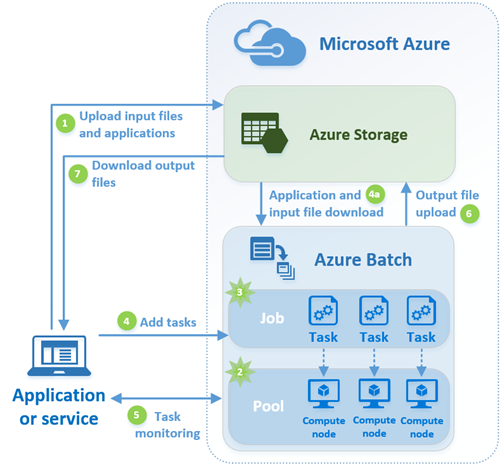

# Overview of Azure Batch

Azure Batch enables you to run large-scale parallel and high-performance computing (HPC) batch jobs efficiently in Azure. Azure Batch creates and manages a collection of virtual machines, installs the applications you want to run, and schedules jobs to run on the virtual machines.

Azure Batch builds on top of the Azure compute infrastructure to provide a platform service. There is no cluster or job scheduler software to install, manage, or scale. Instead, you use [Batch APIs and tools](batch-apis-tools.md), command-line scripts, or the Azure portal to configure, manage, and monitor your jobs. There is no additional charge for using Batch; you only pay for the underlying resources consumed, such as the virtual machines, storage, and networking.

For a comparison between Batch and other HPC solution options in Azure, see [HPC, Batch, and Big Compute solutions](../virtual-machines/linux/high-performance-computing.md).

## Supported Batch workloads
Batch works well with intrinsically parallel (also known as "embarrassingly parallel") workloads. Intrinsically parallel workloads are those where the applications can run independently, and each instance completes part of the work. When the applications are executing, they might access some common data, but they do not communicate with other instances of the application. Intrinsically parallel workloads can therefore run at a large scale, determined by the amount of compute resources available to run applications simultaneously.

Some examples of intrinsically parallel workloads:

* Financial risk modeling using Monte Carlo simulations
* VFX and 3D image rendering
* Image analysis and processing
* Media transcoding
* Genetic sequence analysis
* Optical character recognition (OCR)
* Data ingestion, processing, and ETL operations
* Software test execution

You can also use Azure Batch to [run tightly coupled workloads](batch-mpi.md); these are workloads where the applications you run need to communicate with each other, as opposed to run independently. Tightly coupled applications normally use the Message Passing Interface (MPI) API and need the high-speed, low-latency Infiniband network that is available on Azure VMs such as the [HPC VM sizes](../virtual-machines/windows/sizes-hpc.md).

Some examples of tightly coupled workloads:
* Finite element analysis
* Fluid dynamics
* Multi-node AI training

Many tightly coupled jobs can be run in parallel using Batch. For example, perform many simulations of a liquid flowing though a pipe with varying pipe widths.

## Azure Batch use scenarios
Batch is mainly used as a platform service by developers building either cloud-native SaaS offerings or client applications where large-scale application execution is required. For example, build a service with Batch to run a Monte Carlo risk simulation for a financial services company, or a service to process many images. Developers can use the batch APIs to configure and control Batch, and monitor jobs and tasks using the Azure portal. The value is that robust, designed-for-the-cloud, cloud-scale batch processing capabilities are provided. The developer does not need to provide or manage this infrastructure.

You can also run Batch jobs as part of a larger Azure workflow to transform data, managed by tools such as [Azure Data Factory](../data-factory/v1/data-factory-data-processing-using-batch.md).

Higher-level, workload-specific capabilities are also available for Azure Batch:
* Batch supports large-scale [rendering workloads](batch-rendering-service.md) with rendering tools including Autodesk Maya, 3ds Max, Arnold, and V-Ray. 
* R users can leverage the [doAzureParallel R package](https://github.com/Azure/doAzureParallel) to easily scale-out the execution of R algorithms.

## Scenario: Scale out a parallel workload
A common scenario for Batch involves scaling out intrinsically parallel work, such as the rendering of images for 3D scenes, on a pool of compute nodes. This pool of compute nodes can be your "render farm" that provides tens, hundreds, or even thousands of cores to your rendering job.

The following diagram shows steps in a common Batch workflow, with a client application or hosted service using Batch to run a parallel workload.

1. Upload the **input files** and the **application** to process those files to your Azure Storage account. The input files can be any data that your application processes, such as financial modeling data, or video files to be transcoded. The application files can be a script or application that processes the data, such as a media transcoder.
2. Create a Batch **pool** of compute nodes in your Batch account--these nodes are the virtual machines that execute your tasks. You specify properties such as the number and size of the nodes, a Windows or Linux VM image, and the location in Azure Storage of an application to install when the nodes join the pool. You can also manage the cost and size of the pool by using [low-priority VMs](batch-low-pri-vms.md) or [automatically scaling](batch-automatic-scaling.md) the number of nodes in response to the workload. 
3. Create a Batch **job** to run the workload on the pool of compute nodes. When you create a job, you associate it with a Batch pool.
4. Add **tasks** to the job. When you add tasks to a job, the Batch service automatically schedules the tasks for execution on the compute nodes in the pool. Each task uses the application that you uploaded to process the input files.

   Before a task executes, it can download the input data that it is to process to the assigned compute node. If the application isn't already installed on the pool nodes, it can be downloaded here instead. When the downloads complete, the tasks execute on their assigned nodes.

1. As the tasks run, you can query Batch to monitor the progress of the job and its tasks. Your client application or service communicates with the Batch service over HTTPS. Because you may be monitoring thousands of tasks running on thousands of compute nodes, be sure to [query the Batch service efficiently](batch-efficient-list-queries.md).
2. As the tasks complete, they can upload their result data to Azure Storage. You can also retrieve files directly from the file system on a compute node.
3. When your monitoring detects that the tasks in your job have completed, your client application or service can download the output data for further processing or evaluation.

Keep in mind this is just one way to use Batch, and this scenario describes just some of its features. For example, you can execute [multiple tasks in parallel](batch-parallel-node-tasks.md) on each compute node, or use [job preparation and completion tasks](batch-job-prep-release.md) to prepare the nodes for your jobs, then clean up afterward. 

See the [Batch feature overview for developers](batch-api-basics.md) for more detailed information about pools, nodes, jobs, and tasks, and the many API features that you can use while building your Batch application. 

## Next steps

Get started with Azure Batch with one of our quickstarts:
* [Run your first Batch job with the Azure CLI](quick-create-cli.md)
* [Run your first Batch job with the Azure portal](quick-create-portal.md)
* [Run your first Batch job using the .NET API](quick-run-dotnet.md)
* [Run your first Batch job using the Python API](quick-run-python.md)

