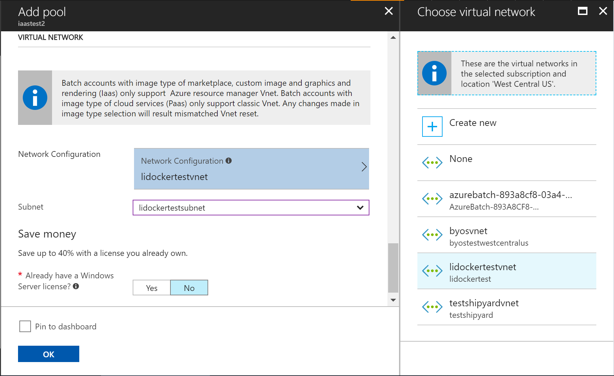
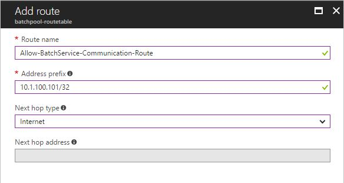

# Create an Azure Batch pool in a virtual network

When you create an Azure Batch pool, you can provision the pool in a subnet of an [Azure virtual network](../virtual-network/virtual-networks-overview.md) (VNet) that you specify. This article explains how to set up a Batch pool in a VNet. 

## Why use a VNet?

An Azure Batch pool has settings to allow compute nodes to communicate with each other - for example, to run multi-instance tasks. These settings do not require a separate VNet. However, by default, the nodes cannot communicate with virtual machines that are not part of the Batch pool, such as a license server or a file server. To allow pool compute nodes to communicate securely with other virtual machines, or with an on-premises network, you can provision the pool in a subnet of an Azure VNet. 

## Prerequisites

* **Authentication**. To use an Azure VNet, the Batch client API must use Azure Active Directory (AD) authentication. Azure Batch support for Azure AD is documented in [Authenticate Batch service solutions with Active Directory](batch-aad-auth.md). 

* **An Azure VNet**. See the following section for VNet requirements and configuration. To prepare a VNet with one or more subnets in advance, you can use the Azure portal, Azure PowerShell, the Azure Command-Line Interface (CLI), or other methods.  
  * To create an Azure Resource Manager-based VNet, see [Create a virtual network](../virtual-network/manage-virtual-network.md#create-a-virtual-network). A Resource Manager-based VNet is recommended for new deployments, and is supported only on pools in the Virtual Machine configuration.
  * To create a classic VNet, see [Create a virtual network (classic) with multiple subnets](../virtual-network/create-virtual-network-classic.md). A classic VNet is supported only on pools in the Cloud Services configuration.

## VNet requirements

[!INCLUDE [batch-virtual-network-ports](../../includes/batch-virtual-network-ports.md)]

## Create a pool with a VNet in the portal

Once you have created your VNet and assigned a subnet to it, you can create a Batch pool with that VNet. Follow these steps to create a pool from the Azure portal: 

1. Navigate to your Batch account in the Azure portal. This account must be in the same subscription and region as the resource group containing the VNet you intend to use. 
2. In the **Settings** window on the left, select the **Pools** menu item.
3. In the **Pools** window, select the **Add** command.
4. On the **Add Pool** window, select the option you intend to use from the **Image Type** dropdown. 
5. Select the correct **Publisher/Offer/Sku** for your custom image.
6. Specify the remaining required settings, including the **Node size**, **Target dedicated nodes**, and **Low priority nodes**, as well as any desired optional settings.
7. In **Virtual Network**, select the virtual network and subnet you wish to use.
  
  

## User-defined routes for forced tunneling

You might have requirements in your organization to redirect (force) Internet-bound traffic from the subnet back to your on-premises location for inspection and logging. You may have enabled forced tunneling for the subnets in your VNet. 

To ensure that your Azure Batch pool compute nodes work in a VNet that has forced tunneling enabled, you must add the following [user-defined routes](../virtual-network/virtual-networks-udr-overview.md) for that subnet:

* The Batch service needs to communicate with pool compute nodes for scheduling tasks. To enable this communication, add a user-defined route for each IP address used by the Batch service in the region where your Batch account exists. To obtain the list of IP addresses of the Batch service, please contact Azure Support.

* Ensure that outbound traffic to Azure Storage (specifically, URLs of the form `<account>.table.core.windows.net`, `<account>.queue.core.windows.net`, and `<account>.blob.core.windows.net`) is not blocked via your on-premises network appliance.

When you add a user-defined route, define the route for each related Batch IP address prefix, and set **Next hop type** to **Internet**. See the following example:

## Next steps

- For an in-depth overview of Batch, see [Develop large-scale parallel compute solutions with Batch](batch-api-basics.md).
- For more about creating a user-defined route, see [Create a user-defined route - Azure portal](../virtual-network/tutorial-create-route-table-portal.md).
