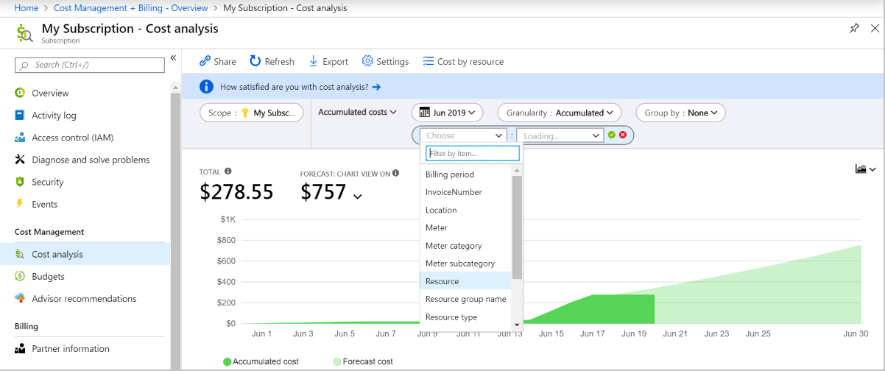
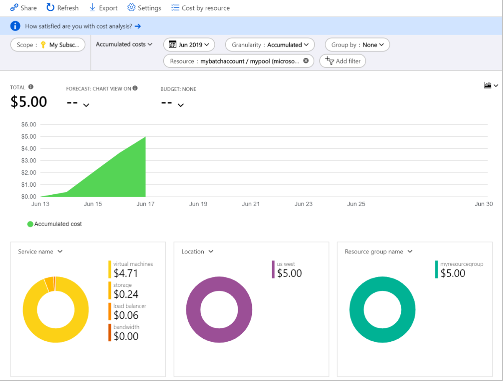

# Cost analysis and budgets for Azure Batch

There's no charge for Azure Batch itself, only the underlying compute resources and software licenses used to run Batch workloads. On a high level, costs are incurred from virtual machines (VMs) in a pool, data transfer from the VM, or any input or output data stored in the cloud. Let's take a look at some key components of Batch to understand where costs come from, how to set a budget for a pool or account, and some techniques for making your Batch workloads more cost efficient.

## Batch resources

Virtual machines are the most significant resource used for Batch processing. The cost of using VMs for Batch is calculated based on the type, quantity, and the duration of use. VM billing options include [Pay-As-You-Go](https://azure.microsoft.com/offers/ms-azr-0003p/) or [reservation](../cost-management-billing/reservations/save-compute-costs-reservations.md) (pay in advance). Both payment options have different benefits depending on your compute workload, and both payment models will affect your bill differently.

When applications are deployed to Batch nodes (VMs) using [application packages](batch-application-packages.md), you are billed for the Azure Storage resources that your application packages consume. You are also billed for the storage of any input or output files, such as resource files and other log data. In general, the cost of storage data associated with Batch is much lower than the cost of compute resources. Each VM in a pool created with **VirtualMachineConfiguration** has an associated OS disk that uses Azure-managed disks. Azure-managed disks have an additional cost, and other disk performance tiers have different costs as well.

Batch pools use networking resources. In particular, for **VirtualMachineConfiguration** pools standard load balancers are used, which require static IP addresses. The load balancers used by Batch are visible for **User Subscription** accounts, but are not visible for **Batch Service** accounts. Standard load balancers incur charges for all data passed to and from Batch pool VMs; select Batch APIs that retrieve data from pool nodes (such as Get Task/Node File), task application packages, resource/output files, and container images will incur charges.

### Additional services

Services not including VMs and storage can factor in to the cost of your Batch account.

Other services commonly used with Batch can include:

- Application Insights
- Data Factory
- Azure Monitor
- Virtual Network
- VMs with graphics applications

Depending on which services you use with your Batch solution, you may incur additional fees. Refer to the [Pricing Calculator](https://azure.microsoft.com/pricing/calculator/) to determine the cost of each additional service.

## Cost analysis and budget for a pool

Through the Azure portal, you can create budgets and spending alerts for your Batch pool(s) or Batch account. Budgets and alerts are useful for notifying stakeholders of any risks of overspending. It's possible for there to be a delay in spending alerts and to slightly exceed a budget. In this example, we'll view cost analysis of an individual Batch pool.

1. In the Azure portal, select **Cost Management + Billing** from the left navigation bar.
1. Select your subscription from the **My subscriptions** section
1. Go to **Cost analysis** under the **Cost Management** section of the left nav bar, which will show a view like this:
1. Select **Add Filter**. In the first drop-down, select **Resource**
    
1. In the second drop-down, select the Batch pool. When the pool is selected, the cost analysis will look similar to the following analysis.
    

The resulting cost analysis shows the cost of the pool as well as the resources that contribute to this cost. In this example, the VMs used in the pool are the most costly resource.

To create a budget for the pool select **Budget: none**, and then select **Create new budget >**. Now use the window to configure a budget specifically for your pool.

For more information on configuring a budget, see [Create and manage Azure budgets](../cost-management-billing/costs/tutorial-acm-create-budgets.md).

> [!NOTE]
> Azure Batch is built on Azure Cloud Services and Azure Virtual Machines technology. When you choose **Cloud Services Configuration**, you are charged based on the Cloud Services pricing structure. When you choose **Virtual Machine Configuration**, you are charged based on the Virtual Machines pricing structure. The example on this page uses the **Virtual Machine Configuration**.

## Minimize cost

Using several VMs and Azure services for extended periods of time can be costly. Fortunately, there are services available to help reduce your spending, as well as strategies for maximizing the efficiency of your workload.

### Low-priority virtual machines

Low-priority VMs reduce the cost of Batch workloads by taking advantage of surplus computing capacity in Azure. When you specify low-priority VMs in your pools, Batch uses this surplus to run your workload. There is a substantial cost saving by using low-priority VMs in place of dedicated VMs.

Learn more about how to set up low-priority VMs for your workload at [Use low-priority VMs with Batch](batch-low-pri-vms.md).

### Virtual machine OS disk type

There are multiple [VM OS disk types](../virtual-machines/windows/disks-types.md). Most VM-series have sizes that support both premium and standard storage. When an ‘s’ VM size is selected for a pool, Batch configures premium SSD OS disks. When the ‘non-s’ VM size is selected, then the cheaper, standard HDD disk type is used. For example, premium SSD OS disks are used for `Standard_D2s_v3` and standard HDD OS disks are used for `Standard_D2_v3`.

Premium SSD OS disks are more expensive, but have higher performance and VMs with premium disks can start slightly quicker than VMs with standard HDD OS disks. With Batch, the OS disk is often not used much as the applications and task files are located on the VMs temporary SSD disk. Therefore in many cases, there's no need to pay the increased cost for the premium SSD that is provisioned when a ‘s’ VM size is specified.

### Reserved virtual machine instances

If you intend to use Batch for a long period of time, you can save on the cost of VMs by using [Azure Reservations](../cost-management-billing/reservations/save-compute-costs-reservations.md) for your workloads. A reservation rate is considerably lower than a pay-as-you-go rate. Virtual machine instances used without a reservation are charged at pay-as-you-go rate. If you purchase a reservation, the reservation discount is applied and you are no longer charged at the pay-as-you-go rates.

### Automatic scaling

[Automatic scaling](batch-automatic-scaling.md) dynamically scales the number of VMs in your Batch pool based on demands of the current job. By scaling the pool based on the lifetime of a job, automatic scaling ensures that VMs scaled up and used only when there is a job to perform. When the job is complete, or there are no jobs, the VMs are automatically scaled down to save compute resources. Scaling allows you to lower the overall cost of your Batch solution by using only the resources you need.

For more information about automatic scaling, see [Automatically scale compute nodes in an Azure Batch pool](batch-automatic-scaling.md).

## Next steps

- Learn more about the [Batch APIs and tools](batch-apis-tools.md) available for building and monitoring Batch solutions.  

- Learn about [low-priority VMs with Batch](batch-low-pri-vms.md).
